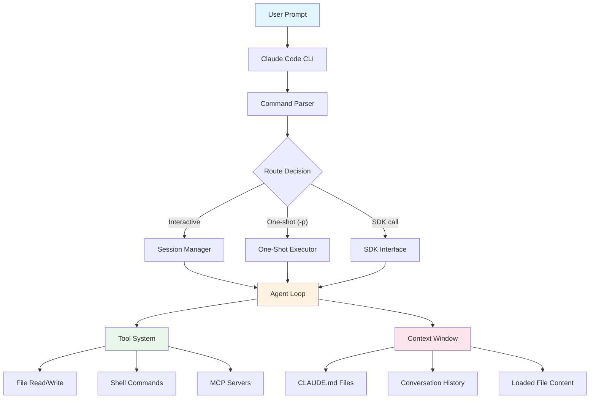
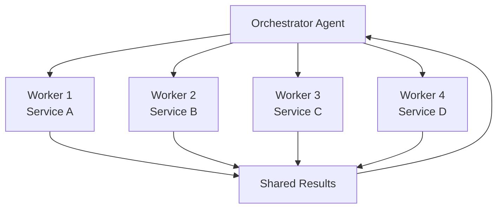
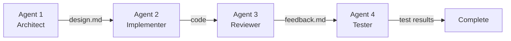
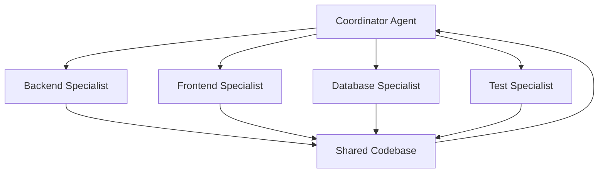

# Module 7.3: Kiến Trúc Multi-Agent

> **Thời gian học**: ~40 phút
>
> **Yêu cầu trước**: Module 7.2 (Quy Trình Full Auto)
>
> **Kết quả**: Sau module này, bạn sẽ hiểu các pattern multi-agent, biết khi nào nên dùng từng pattern, và có thể tự implement orchestration cơ bản bằng one-shot mode và bash scripting.

---

## 1. WHY — Tại Sao Cần Multi-Agent

Bạn đang build một feature lớn trải dài 10 microservices. Sau 3 giờ làm việc liên tục, single Claude Code session bắt đầu bị rối: nhầm tên service này với service kia, reference code đã xóa từ 2 tiếng trước, suggest giải pháp đã thử và failed. Restart session thì mất hết context, giữ session thì context pollution ngày càng nặng.

Giải pháp multi-agent: Thay vì một "senior dev" làm mọi thứ, bạn có một team các Claude instances — architect design, implementer cho mỗi service, tester, documenter. Mỗi agent có fresh context, chỉ làm một việc cụ thể, không bị nhiễu bởi 200 file đã đọc của các agent khác.

Cũng như team thật: task nhỏ một người làm nhanh hơn. Task lớn phức tạp thì team chuyên môn hóa hiệu quả hơn một người làm hết.

---

## 2. CONCEPT — Ý Tưởng Cốt Lõi

### Khi Nào Dùng Multi-Agent

**Single Agent** phù hợp khi:
- Task < 2 giờ làm việc
- Chỉ động vào một vùng codebase
- Context coherent (không jump lung tung giữa các domain khác nhau)

**Multi-Agent** phù hợp khi:
- Task lớn, nhiều phase rõ ràng (design → implement → test → deploy)
- Các subtask độc lập, có thể làm song song
- Cần chuyên môn hóa (backend expert + frontend expert + DevOps expert)
- Nguy cơ context degradation cao (quá nhiều file, quá nhiều quyết định cần nhớ)

**Rule of thumb**: Nếu bạn assign cho team dev thật, bạn sẽ chia việc cho nhiều người → dùng multi-agent.

### Các Thành Phần Claude Code Liên Kết Như Thế Nào

Trước khi đi vào các pattern multi-agent, hãy hiểu cách các thành phần nội bộ của Claude Code liên kết với nhau:



**Các mối quan hệ chính**:
- **Agent Loop** là engine cốt lõi — đọc context, quyết định hành động, gọi tools, và lặp lại cho đến khi hoàn thành
- **Tools** là cách agent tác động lên thế giới (đọc/ghi file, chạy lệnh shell, kết nối MCP servers)
- **Context Window** là những gì agent biết (quy tắc CLAUDE.md, lịch sử hội thoại, nội dung file đã load)
- **Multi-agent** = nhiều Agent Loop độc lập, mỗi cái có context riêng, giao tiếp qua file trên đĩa

Sơ đồ này giải thích **tại sao multi-agent hiệu quả**: mỗi agent có một Agent Loop sạch với context tập trung, tránh tình trạng ô nhiễm context khi một loop phải xử lý quá nhiều vấn đề cùng lúc.

---

### Ba Pattern Chính

#### Pattern 1: Orchestrator-Worker (Song Song)



**Khi nào dùng**: Nhiều task giống nhau, độc lập, có thể làm song song.
**Ví dụ**: Thêm logging vào 10 microservices, migrate 20 API endpoints sang TypeScript.

**Cách hoạt động**:
1. Orchestrator phân tích task, chia nhỏ, tạo work plan
2. Spawn N worker agents, mỗi agent nhận một subtask
3. Workers chạy song song (hoặc tuần tự nếu cần safety)
4. Orchestrator thu thập kết quả, verify consistency

---

#### Pattern 2: Pipeline (Tuần Tự)



**Khi nào dùng**: Các phase tuần tự, output của agent này là input của agent kế.
**Ví dụ**: Design API → Implement → Code review → Write tests → Update docs.

**Cách hoạt động**:
1. Agent 1 chạy, output file (design.md, schema.json...)
2. Agent 2 đọc output của Agent 1, chạy task tiếp, tạo output mới
3. Agent 3, 4... lần lượt chạy theo chain
4. Mỗi agent chỉ cần context từ agent trước, không cần biết toàn bộ lịch sử

---

#### Pattern 3: Specialist Team (Chuyên Môn Hóa)



**Khi nào dùng**: Full-stack feature cần expertise từ nhiều domain.
**Ví dụ**: Build payment flow hoàn chỉnh — backend API, React UI, Postgres migration, integration tests.

**Cách hoạt động**:
1. Coordinator tạo integration contract (API spec, data models, interfaces)
2. Mỗi specialist agent làm phần của mình dựa theo contract
3. Specialists không nói chuyện trực tiếp — giao tiếp qua artifacts (code, docs)
4. Coordinator verify integration, resolve conflicts

---

### Giao Tiếp Giữa Các Agent

**File-Based Handoffs** (khuyên dùng):
- Agent A viết `plan.md`, `schema.json`, `architecture.md`
- Agent B đọc file đó, làm việc, tạo output mới
- **Ưu**: Clear, auditable, dễ debug
- **Nhược**: I/O overhead (không đáng kể với modern SSD)

**Pipes** (advanced):
```bash
claude -p "analyze codebase" | claude -p "implement improvements from stdin"
```
- **Ưu**: Elegant, Unix philosophy
- **Nhược**: Khó debug, không có artifact trung gian

**JSON Output** ⚠️ Cần xác minh:
```bash
claude -p "output JSON schema" --output-format json > schema.json
```
- **Ưu**: Structured data, dễ parse
- **Nhược**: Flag `--output-format` chưa verify có tồn tại

---

### Spawning Fresh Agents

Mỗi agent là một lần gọi `claude` riêng biệt với fresh context:

```bash
claude -p "your specialized prompt here"
```

**Quan trọng**: Agents không share memory. Giao tiếp qua artifacts — files, stdout, env vars.

---

## 3. DEMO — Từng Bước

**Task**: Thêm API endpoint mới cho user preferences (theme, language, notifications) — complete với tests và docs.

---

### Agent 1: Architect (Design Phase)

**Bước 1**: Chạy architect agent để design

```bash
$ claude -p "Design một API endpoint để quản lý user preferences (theme, language, notifications). Output cần có: route structure, request/response schemas, database changes cần thiết. Viết tất cả vào file architecture.md"
```

**Kết quả**: File `architecture.md` được tạo với nội dung:

```
Reading codebase structure...
Analyzing existing API patterns...

✓ Created architecture.md with:
  - Route: PUT /api/v1/users/:id/preferences
  - Request schema: { theme, language, notifications }
  - Response: updated user object
  - DB: add preferences JSON column to users table
  - Security: require auth, validate user owns resource
```

Architect agent **không viết code**, chỉ design. Context sạch, focus 100% vào architecture.

---

### Agent 2: Implementer (Implementation Phase)

**Bước 2**: Spawn implementer agent với context từ architecture.md

```bash
$ claude -p "Đọc architecture.md. Implement preferences endpoint trong src/routes/ và src/services/. Follow existing Express patterns. Dùng Prisma cho database access."
```

**Kết quả**:

```
Reading architecture.md...
Analyzing src/routes/ structure...

✓ Created src/routes/userPreferences.ts
✓ Created src/services/preferencesService.ts
✓ Updated src/routes/index.ts to register route
✓ Created Prisma migration: add_user_preferences

Files changed:
 src/routes/userPreferences.ts     | 45 ++++++
 src/services/preferencesService.ts | 32 +++++
 src/routes/index.ts               |  2 +
 prisma/migrations/...             | 12 ++
```

Implementer **không second-guess** design — chỉ implement đúng spec. Không bị distracted bởi design decisions.

---

### Agent 3: Tester (Testing Phase)

**Bước 3**: Spawn tester agent để viết comprehensive tests

```bash
$ claude -p "Đọc architecture.md và src/routes/userPreferences.ts. Viết comprehensive tests covering happy path, validation errors, not found cases, unauthorized access. Dùng Jest và Supertest."
```

**Kết quả**:

```
Reading architecture.md...
Reading implementation...

✓ Created tests/routes/userPreferences.test.ts with:
  - Happy path: update all fields
  - Validation: invalid theme, missing fields
  - Auth: unauthorized, wrong user
  - Not found: user doesn't exist

Running tests...
 PASS  tests/routes/userPreferences.test.ts
  ✓ should update user preferences (45ms)
  ✓ should reject invalid theme (12ms)
  ✓ should require auth (8ms)
  ✓ should prevent updating other users (15ms)

Tests: 4 passed, 4 total
```

Tester agent verify implementation against spec — không cần biết chi tiết Prisma query, chỉ verify behavior.

---

### Agent 4: Documenter (Documentation Phase)

**Bước 4**: Spawn documenter để update API docs

```bash
$ claude -p "Đọc architecture.md và src/routes/userPreferences.ts. Update API.md với endpoint documentation bao gồm curl examples và response formats."
```

**Kết quả**:

```
Reading architecture.md...
Reading implementation...
Reading existing API.md format...

✓ Updated API.md with:
  - Endpoint description
  - Authentication requirements
  - Request/response examples
  - Error cases with status codes
  - curl examples for all scenarios
```

Documenter chỉ focus vào docs — không quan tâm implementation details, chỉ verify behavior từ code + spec.

---

### Tổng Kết Demo

**Kết quả**: Hoàn thành feature trong **~15 phút** với 4 agents chuyên môn hóa.

**So sánh với single agent**:
- Single agent: ~45 phút, context degradation sau design phase, có thể inconsistent giữa code và docs
- Multi-agent: Fresh context mỗi phase, consistent với architecture.md, dễ verify từng phase

**Files tạo ra**:
- `architecture.md` — single source of truth
- Implementation code
- Tests
- Documentation

Mỗi artifact có thể review độc lập. Nếu phase nào fail, re-run chỉ agent đó.

---

## 4. PRACTICE — Tự Thực Hành

### Bài 1: Build Pipeline Đầu Tiên

**Goal**: Implement 3-phase pipeline cho một feature nhỏ.

**Instructions**:
1. Chọn một feature nhỏ với các phase rõ ràng (ví dụ: thêm rate limiting — design → implement → test)
2. Viết prompts cho 3 agents theo pattern DEMO
3. Tạo bash script `pipeline.sh` chạy 3 agents tuần tự
4. Execute và quan sát cách mỗi agent đọc output của agent trước

**Kết quả mong đợi**: Ba file riêng biệt (design.md, implementation code, tests). Mỗi agent reference đúng output của agent trước, không có context pollution.

<details>
<summary>💡 Hint</summary>

Bash script structure:
```bash
#!/bin/bash
set -e  # Stop on error

echo "=== Phase 1: Agent Architect ==="
claude -p "prompt for architect"

echo "=== Phase 2: Agent Implementer ==="
claude -p "prompt for implementer, mention reading design file"

echo "=== Phase 3: Agent Tester ==="
claude -p "prompt for tester, mention reading design + code"

echo "=== Pipeline complete ==="
git diff --stat
```
</details>

<details>
<summary>✅ Solution</summary>

```bash
#!/bin/bash
set -e

echo "=== Agent 1: Architect ==="
claude -p "Design rate limiting cho API của chúng ta. Strategy: token bucket algorithm. Output implementation plan vào file rate-limit-design.md với các sections: algorithm choice, configuration (requests per window, window size), integration points (middleware location), error responses."

echo "=== Agent 2: Implementer ==="
claude -p "Đọc rate-limit-design.md. Implement rate limiting middleware trong src/middleware/rateLimit.ts. Dùng thư viện express-rate-limit nếu phù hợp, hoặc implement token bucket thuần nếu design yêu cầu custom logic. Follow existing middleware patterns trong src/middleware/."

echo "=== Agent 3: Tester ==="
claude -p "Đọc rate-limit-design.md và src/middleware/rateLimit.ts. Viết tests verify rate limiting hoạt động đúng: normal requests pass, burst requests blocked, rate resets after window, custom routes có custom limits. Dùng Jest + Supertest."

echo "=== Pipeline complete ==="
echo "Verifying changes..."
git diff --stat
npm test -- rateLimit
```

**Giải thích kết quả**:
- **Agent 1** focus hoàn toàn vào design — không bị distracted bởi implementation concerns
- **Agent 2** implement đúng spec — không second-guess design, không over-engineer
- **Agent 3** test against spec — verify behavior match design document

Mỗi agent có fresh context. Architect không bị nhiễu bởi test scenarios. Tester không cần nhớ lý do chọn token bucket — chỉ cần verify spec.

**Nếu phase 2 fail** (implementation có bug), bạn chỉ cần re-run agent 2 với fix prompt. Agent 1 và 3 không bị ảnh hưởng.
</details>

---

### Bài 2: Orchestrator-Worker Pattern

**Goal**: Dùng orchestrator-worker cho parallel tasks.

**Instructions**:
1. **Task**: Thêm error logging vào 5 service files khác nhau
2. Tạo orchestrator agent phân tích files và viết `logging-plan.md`
3. Tạo workers (dùng loop) — mỗi worker add logging vào một file
4. Chạy workers tuần tự (hoặc song song với `&` nếu advanced)

**Kết quả mong đợi**: Cả 5 files được update với logging consistent theo plan của orchestrator.

<details>
<summary>💡 Hint</summary>

Orchestrator prompt nên:
- List tất cả services cần update
- Define logging format chung (log level, message template, context fields)
- Specify error scenarios cần log

Worker prompt template:
- Read logging-plan.md
- Apply logging cho service cụ thể: `${service}.ts`
- Follow plan format exactly
</details>

<details>
<summary>✅ Solution</summary>

```bash
#!/bin/bash
set -e

echo "=== Orchestrator: Analyzing services và creating plan ==="
claude -p "Phân tích các files trong src/services/{user,order,payment,auth,notification}.ts. Tạo logging-plan.md specify:
1. Logging format chung (dùng winston logger đã có sẵn)
2. Log levels cho từng error type (validation errors: warn, DB errors: error, etc)
3. Context fields cần include (userId, requestId, timestamp, service name)
4. Specific errors trong mỗi service cần log
Output format: markdown table với columns [Service, Error Scenario, Log Level, Context Fields]"

echo ""
echo "Waiting for orchestrator to complete..."
sleep 2

echo "=== Workers: Applying logging plan ==="
for service in user order payment auth notification; do
  echo "  → Worker processing: ${service} service"
  claude -p "Đọc logging-plan.md. Thêm appropriate error logging vào src/services/${service}.ts following the plan.
  - Dùng existing winston logger instance
  - Add logging cho tất cả error scenarios specified in plan
  - Include all context fields theo spec
  - Không thay đổi business logic, chỉ add logging"

  echo "    ✓ ${service} service completed"
  echo ""
done

echo "=== All workers complete ==="
echo "Verifying consistency..."
git diff --stat

echo ""
echo "Checking if all services use same logging format..."
grep -n "logger\." src/services/*.ts | head -20
```

**Giải thích kết quả**:

**Orchestrator benefits**:
- Analyzed all 5 services cùng lúc → consistent logging strategy
- Created single source of truth (logging-plan.md)
- Defined format trước khi workers start → không có inconsistency

**Worker benefits**:
- Mỗi worker chỉ focus vào 1 file — fresh context, không bị confused
- Follow plan blindly — không cần suy nghĩ về format, levels, fields
- Workers có thể chạy song song nếu cần (thêm `&` sau mỗi claude command, thêm `wait` ở cuối)

**Parallel execution** (advanced):
```bash
for service in user order payment auth notification; do
  claude -p "..." &  # Run in background
done
wait  # Wait for all background jobs
```

⚠️ **Warning**: Parallel execution với `&` chỉ safe nếu workers touch file riêng biệt. Nếu có shared files (như `index.ts`), chạy tuần tự để tránh conflicts.

**Verification**:
```bash
# Check all services import logger
grep "import.*logger" src/services/*.ts

# Check consistent log levels usage
grep "logger\.(error|warn|info)" src/services/*.ts | wc -l

# Verify context fields present
grep "userId.*requestId" src/services/*.ts
```

**Nếu một worker fail**:
```bash
# Re-run chỉ failed worker
claude -p "Đọc logging-plan.md. Fix logging trong src/services/payment.ts..."
```

Không cần re-run orchestrator hay workers khác.
</details>

---

## 5. CHEAT SHEET

### Chọn Pattern Phù Hợp

| Tình Huống | Pattern Dùng | Lý Do |
|------------|--------------|-------|
| 10 tasks giống nhau, độc lập | **Orchestrator-Worker** | Parallel execution, same template |
| Design → Code → Test → Deploy | **Pipeline** | Sequential dependencies, clear handoffs |
| Frontend + Backend + DB + Infra | **Specialist Team** | Domain expertise per layer |
| Refactor một module < 2 giờ | **Single Agent** | Context coherent, không cần split |
| Migrate 50 API endpoints | **Orchestrator-Worker** | Same task template, scale to N workers |
| Debug complex race condition | **Single Agent** | Cần maintain mental model liên tục |

---

### Spawning Agent

| Cách Spawn | Cú Pháp | Use Case |
|------------|---------|----------|
| One-shot command | `claude -p "prompt"` | Single task, fresh context |
| Loop sequential | `for x in list; do claude -p "..."; done` | Batch processing, safe |
| Loop parallel | `for x in list; do claude -p "..." &; done; wait` | Speed, workers touch different files |
| Pipeline với pipes | `claude -p "analyze" \| claude -p "implement"` | Simple 2-stage chain |

---

### Communication Giữa Agents

| Phương Pháp | Ưu Điểm | Nhược Điểm | Khi Nào Dùng |
|-------------|---------|------------|--------------|
| **File handoffs** | Clear, auditable, dễ debug | Extra I/O (negligible) | Recommended cho mọi case |
| **Pipes** | Elegant, Unix philosophy | Khó debug, no intermediate artifact | Simple 2-agent chains |
| **Env vars** | Fast cho small data | Size limits, type unsafe | Pass config/flags |
| **JSON files** | Structured, type-safe | Cần parse logic | Complex data structures |

---

### Agent Lifecycle

| Phase | Command | Notes |
|-------|---------|-------|
| **Spawn** | `claude -p "prompt"` | Fresh context, no memory of previous agents |
| **Execute** | Agent runs, reads artifacts, does work | Can read files written by previous agents |
| **Output** | Writes files, stdout | Next agent input |
| **Terminate** | Agent exits | No persistent state |

---

### Debugging Multi-Agent

| Issue | Cách Debug |
|-------|------------|
| Agent ignored previous output | Check file actually created + readable. Print file content in prompt: "Read X.md and summarize it first" |
| Inconsistent results across workers | Orchestrator plan không đủ chi tiết. Add examples to plan file |
| Agent context pollution | Đảm bảo mỗi agent là separate `claude` invocation, không reuse session |
| Parallel workers conflict | Verify file ownership — workers touch different files, or run sequential |

---

## 6. PITFALLS — Lỗi Thường Gặp

| ❌ Sai Lầm | ✅ Đúng Cách |
|------------|-------------|
| **Dùng multi-agent cho task 10 phút** | Single agent đủ cho tasks < 2 giờ. Multi-agent overhead không đáng với task nhỏ. |
| **Agents overlap trách nhiệm** | Clear boundary — "Agent A design, Agent B implement, Agent C test". Không có "Agent A design và implement một tí". |
| **Không có shared artifact** | Luôn dùng handoff file (`design.md`, `spec.json`, `plan.md`). Agents không đọc được suy nghĩ của nhau — phải viết ra. |
| **Parallel agents edit cùng file** | Coordinate file ownership. Worker 1 → `serviceA.ts`, Worker 2 → `serviceB.ts`. Nếu cần edit shared file → chạy sequential hoặc dùng coordinator merge. |
| **Over-engineer orchestration** | Start với bash script đơn giản. Chỉ build complex orchestrator khi bash không đủ (>10 workers, complex dependencies). |
| **Quên fresh context là điểm mạnh** | Đừng pass massive context cho mỗi agent. Cho agent input focused (chỉ spec file cần thiết). Trust specialization — architect không cần đọc test code. |

---

## 7. REAL CASE — Câu Chuyện Thực Tế

**Scenario**: Startup fintech Việt Nam build payment reconciliation system — 6 microservices (transaction-processor, bank-connector, reconciliation-engine, notification-service, audit-logger, reporting-api), 3 databases (Postgres, MongoDB, Redis), 2 third-party APIs (Vietcombank API, VNPay API).

**Problem**: Team lead thử dùng single Claude Code session build toàn bộ integration. Sau 3 ngày:
- API contracts inconsistent — transaction-processor expect field `amount_vnd`, reconciliation-engine đọc `amount`
- Tests reference non-existent endpoints
- Context window degraded — Claude suggest solutions đã thử và failed 2 ngày trước
- Restart session → mất hết architectural decisions

**Solution**: Switch sang **Specialist Team pattern**:

1. **Coordinator Agent** (Opus): Tạo `integration-contract.md` defining:
   - Shared data models (Transaction, ReconciliationRecord, BankTransaction)
   - API contracts giữa 6 services
   - Database schemas
   - Third-party API integration specs

2. **6 Service Agents** (Sonnet, parallel): Mỗi agent implement một microservice từ contract:
   - Input: `integration-contract.md` + existing codebase patterns
   - Output: Service implementation + unit tests
   - Không nói chuyện với nhau — follow contract blindly

3. **Integration Agent** (Sonnet): Build orchestration layer:
   - Docker Compose setup
   - API gateway routing
   - Service mesh configuration

4. **Test Agent** (Sonnet): Add end-to-end tests:
   - Contract compliance tests (verify mỗi service follow contract)
   - Integration tests (payment flow từ đầu đến cuối)
   - Mock third-party APIs

**Execution**:
```bash
# Day 1 Morning: Coordinator
claude -p "Design integration contract cho payment reconciliation..."
# → integration-contract.md created

# Day 1 Afternoon: 6 Service agents parallel
for service in transaction-processor bank-connector reconciliation-engine \
               notification-service audit-logger reporting-api; do
  claude -p "Implement ${service} theo integration-contract.md..." &
done
wait

# Day 2 Morning: Integration agent
claude -p "Build Docker Compose và API gateway theo integration-contract.md..."

# Day 2 Afternoon: Test agent
claude -p "Write E2E tests verify contract compliance..."
```

**Result**:
- **Hoàn thành trong 2 ngày** (vs 3+ ngày với single agent chưa xong)
- **Zero API contract mismatch** — tất cả services follow `integration-contract.md`
- **Mỗi agent context sạch** — transaction-processor agent không bị distracted bởi reporting-api complexity
- **Contract document = single source of truth** — khi có conflict, check contract

**Metrics**:
- Single agent attempt: 24 giờ làm việc, 60% complete, 15+ integration bugs
- Multi-agent: 16 giờ làm việc (8 giờ coordinator + integration + test, 8 giờ parallel service work), 100% complete, 2 integration bugs (caught by contract tests)

**Lessons Learned**:
- Contract-first approach critical với multi-agent — định nghĩa interface trước khi spawn workers
- Parallel service agents safe vì mỗi service = isolated codebase folder
- Fresh context = consistent với contract — không có agent nào "creative" deviate khỏi spec

---

> **Tiếp theo**: [Module 7.4: Các Mẫu Agentic Loop](../04-agentic-loops/) →
