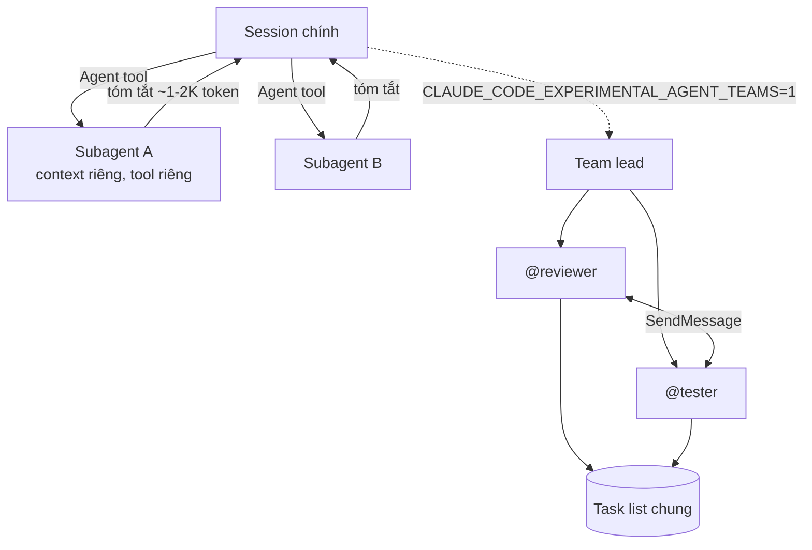

# Module 7.3: Kiến trúc Multi-Agent

> **Thời gian ước tính**: ~40 phút
>
> **Điều kiện tiên quyết**: Module 7.2 (Full Auto Workflow)
>
> **Kết quả**: Sau module này, bạn định nghĩa được một **subagent** trong
> `.claude/agents/<name>.md`, gọi nó theo tên, chạy nhiều subagent song song, và quyết định khi
> nào một **agent team** đáng giá gấp ~7 lần token.

---

## 1. WHY — Tại sao quan trọng

Giờ đầu của một feature lớn rất ổn. Đến giờ thứ ba, Claude nhắc lại quyết định bạn đã huỷ và
context đầy output test không ai đọc lại. Cách chữa không phải cửa sổ to hơn, mà là nhiều cửa sổ.

Claude Code có sẵn điều đó: **subagent** chạy trong context riêng và trả về bản tóm tắt;
**agent team** chạy như các session riêng với task list chung và messaging. Không vòng lặp
bash, không giao thức file-trên-đĩa.

---

## 2. CONCEPT — Ý tưởng cốt lõi

### Workflow và agent (S5)

Anthropic tách *workflow* (code quyết định bước tiếp theo) khỏi *agent* (model quyết định). Năm
khối xây dựng của họ ánh xạ lên ba pattern của khoá học:

| Pattern khoá học | Pattern Anthropic | Cơ chế Claude Code |
|---|---|---|
| **Orchestrator-Worker** | orchestrator-workers / parallelization | Session chính spawn subagent song song; mỗi cái trả về tóm tắt |
| **Pipeline** | prompt chaining | Subagent nối chuỗi ("use A, then use B on A's output"); ở quy mô lớn, Dynamic Workflows (Module 7.6, Wave 3) |
| **Specialist Team** | evaluator-optimizer | Agent team: teammate có tên, nhắn tin cho nhau và nhận task |


```mermaid
graph TD
    M[Session chính] -->|Agent tool| S1["Subagent A<br/>context riêng, tool riêng"]
    M -->|Agent tool| S2["Subagent B"]
    S1 -->|tóm tắt ~1-2K token| M
    S2 -->|tóm tắt| M
    M -.->|CLAUDE_CODE_EXPERIMENTAL_AGENT_TEAMS=1| T["Team lead"]
    T --> A["@reviewer"]
    T --> B["@tester"]
    A <-->|SendMessage| B
    A --> L[(Task list chung)]
    B --> L
```

Một subagent nên trả về khoảng **1.000–2.000 token** (S6), không phải cả transcript — đó là lý
do delegation bảo vệ context chính.

### Subagent

Subagent là file Markdown có YAML frontmatter; phần thân là system prompt. Vị trí:
`.claude/agents/` (project, commit vào repo), `~/.claude/agents/` (mọi project), `--agents '{…}'`
(chỉ session này). Chỉ `name` và `description` là bắt buộc:

| Field | Mục đích |
|---|---|
| `name`, `description` | Danh tính; Claude đọc `description` để quyết định khi nào delegate |
| `tools` | `Read, Grep, Bash` hoặc YAML list; bỏ trống thì kế thừa tất cả |
| `model` | `sonnet`, `opus`, `haiku`, `fable`, ID đầy đủ, hoặc `inherit` |
| `permissionMode` | Có hiệu lực khi session chính ở `default`, `dontAsk` hoặc `plan`; bị bỏ qua dưới `acceptEdits`/`auto`/`bypassPermissions` |
| `maxTurns` | Dừng subagent; output được đánh dấu partial |
| `skills`, `memory`, `isolation: worktree` | Nạp sẵn skill; memory bền (`user`/`project`/`local`); chạy trong git worktree riêng |

Built-in: **Explore** (tìm kiếm chỉ đọc), **Plan** (nghiên cứu trong plan mode),
**general-purpose** (mọi thứ). `/agents` không còn mở wizard; nó in một lời nhắc. Gọi theo tên
(*"Use the test-writer subagent to …"*) hoặc ép bằng `@"test-writer (agent)"`. Subagent bắt đầu
mới hoàn toàn: system prompt, task message, CLAUDE.md và git status — không có hội thoại của
bạn.

### Agent team

⚠️ **Thử nghiệm, tắt mặc định.** Bật bằng `CLAUDE_CODE_EXPERIMENTAL_AGENT_TEAMS=1` trong môi
trường hoặc khối `env` của `settings.json`; chỉ session tương tác. Khi nào team hơn subagent,
theo docs: *research and review*, *new modules or features*, *debugging with competing
hypotheses*, *cross-layer coordination*. Khi nào không: *"For sequential tasks, same-file edits,
or work with many dependencies, a single session or subagents are more effective."*

Chi phí quyết định. Agent team dùng *"approximately 7x more tokens than standard sessions"*
(S15); hệ thống research của Anthropic đo multi-agent ~15× một cuộc chat (S10). Bắt đầu với
3–5 teammate, mỗi teammate một bộ file riêng, xong việc thì shut down.

> `(S5)`, `(S6)`, `(S10)`, `(S15)`: `docs/references/anthropic-sources.md`.

---

## 3. DEMO — Từng bước

Chạy trong `~/cc-lab`. Ảnh chụp tương tác đã cắt gọn.

**Bước 1: Định nghĩa subagent cho project**

```bash
# docs: sub-agents#write-subagent-files
mkdir -p .claude/agents && cat > .claude/agents/test-writer.md << 'EOF'
---
name: test-writer
description: Writes node:test unit tests for a given source file. Use when asked to add or extend tests.
tools: Read, Write, Bash
model: sonnet
---
You are a test writer. Read the source file you are given, write or extend
tests in tests/ using node:test and node:assert/strict, run `npm test`, and
report only the test names and the pass/fail counts.
EOF
```

Vì sao: `tools` là hàng rào — không `Edit`, không `WebFetch`.

**Bước 2: Gọi theo tên (Orchestrator-Worker, một worker)**

```bash
# docs: sub-agents#invoke-subagents-explicitly
claude --permission-mode acceptEdits
```

Prompt: `Use the test-writer subagent to add three tests for src/math.js`

```text
# Output may vary
⏺ test-writer(Add three tests for math.js)
  ⎿  Backgrounded agent (↓ to manage · ctrl+o to expand)
⏺ The test-writer subagent is running. It's extending tests/math.test.mjs with three new tests …
✻ Waiting for 1 background agent to finish
 Bash command · from the test-writer agent
   npm test -- tests/math.test.mjs 2>&1 | tail -30
 Do you want to proceed?
 ❯ 1. Yes
   2. Yes, and don’t ask again for: npm test *
   3. Yes, and switch to auto mode · auto mode handles these prompts for you
   4. No
⏺ Agent "Add three tests for math.js" finished · 37s
```

Dòng `test-writer(…)` chứng minh có delegation. Prompt Bash hiện trong session *của bạn* kèm tên
subagent — `acceptEdits` bao `Write` của nó, không bao `npm test`. Sau đó:

```bash
git diff --stat && npm test 2>&1 | grep -E '^# (pass|fail)'
```

```text
# Output may vary
 tests/math.test.mjs | 5 ++++-
 1 file changed, 4 insertions(+), 1 deletion(-)
# pass 4
# fail 0
```

**Bước 3: `/agents` — một lời nhắc, không phải danh sách**

```text
# Output may vary
❯ /agents
  ⎿  The /agents wizard has been removed.
     Ask Claude to create or update subagents for you (e.g. "create a code-reviewer subagent that ..."),
     or edit the files directly:
       • .claude/agents/       (this project)
       • ~/.claude/agents/     (all projects)
```

`/tasks` liệt kê subagent đang chạy và mới xong.

**Bước 4: Hai subagent song song (Orchestrator-Worker)**

```bash
# docs: sub-agents#run-parallel-research
claude --permission-mode default
```

Prompt: `Use two subagents in parallel: one lists every exported function in src/, the other
lists every TODO comment in the repo. Report both lists.`

```text
# Output may vary
⏺ 2 background agents launched (↓ to manage)
   ├ List exported functions in src/
   └ List TODO comments in repo
✻ Waiting for 2 background agents to finish
⏺ Agent "List exported functions in src/" finished · 1m 1s
  The first subagent finished: src/ has two exported functions, both in src/math.js. …
```

Cả hai chạy bằng Explore built-in ở background; chỉ tóm tắt quay về.

**Bước 5: Một agent team (Specialist Team)**

Máy này có `CLAUDE_CODE_EXPERIMENTAL_AGENT_TEAMS=1` trong `~/.claude/settings.json`.

```bash
# docs: agent-teams#start-your-first-agent-team
claude --permission-mode default
```

Prompt: `Spawn two teammates named reviewer and tester. reviewer reads src/math.js and lists 3
edge cases; tester reads tests/math.test.mjs and lists 3 missing tests. Each reports back in
bullets, then ask both to shut down and summarize.`

```text
# Output may vary
⏺ 2 background agents launched (↓ to manage)
   ├ @reviewer
   └ @tester
› Message from @reviewer (ctrl+o to expand)
⏺ Teammate @reviewer finished
› Message from @tester (ctrl+o to expand)
⏺ Both reports are in. Sending shutdown requests to both.
⏺ Shutdown requests sent to both teammates. Here's the summary:
  reviewer — 3 edge cases in src/math.js
  - divide by zero — divide(1, 0) → Infinity, divide(-1, 0) → -Infinity, divide(0, 0) → NaN; …
  tester — 3 missing tests in tests/math.test.mjs
  - divide happy path — divide is exported but never imported or tested at all …
  Overlap worth acting on: both flagged divide(x, 0) … No files were modified by either teammate.
```

Teammate được gọi là `@reviewer`/`@tester`, nhắn thẳng cho lead, thoát khi nhận shutdown request.
Dọn dẹp: `rm -rf .claude/agents && git checkout -- tests`.

---

## 4. PRACTICE — Tự thực hành

### Bài 1: Reviewer chỉ đọc

**Mục tiêu**: Định nghĩa `security-reviewer` chỉ được nhìn, không được sửa.
**Hướng dẫn**: tạo `.claude/agents/security-reviewer.md` với `tools: Read, Grep, Glob` và
`model: sonnet`, rồi hỏi `Use the security-reviewer subagent to review src/`.

**Kết quả mong đợi**: danh sách phát hiện; `git status` không đổi.

<details>
<summary>✅ Lời giải</summary>

```markdown
---
name: security-reviewer
description: Read-only security review of source files. Use before merging.
tools: Read, Grep, Glob
model: sonnet
---
Review the files you are given for injection, secrets and unsafe defaults.
Report each finding as: severity, file:line, one-sentence fix. Never edit files.
```

Không có `Edit`/`Write` trong `tools`, agent không đổi được gì — hàng rào, không phải lời nhờ.
</details>

### Bài 2: Orchestrator với tóm tắt JSON

**Mục tiêu**: Ba subagent, một báo cáo gộp.
**Hướng dẫn**: prompt: `Use three subagents in parallel — exports, TODOs, test names. Each
must return a JSON object {"area": …, "items": […]} and nothing else. Merge them into one JSON
array.` Xác nhận ba object ngắn quay về, không phải ba transcript.

<details>
<summary>✅ Lời giải</summary>
*Báo cáo* của subagent là thứ đi vào context của bạn; ép khuôn dạng chặt giữ nó gần mục tiêu
1–2K token (S6).
</details>

### Bài 3: Writer / Reviewer ở hai session (S1)

**Mục tiêu**: Review với context mới, không thiên vị code nó vừa viết.
**Hướng dẫn**:
1. Session A: `claude --permission-mode acceptEdits` →
   `Implement a clamp(x, lo, hi) function in src/math.js`.
2. Session B: `claude --worktree review --permission-mode default` → `Review the clamp
   implementation in @src/math.js. Look for edge cases and consistency with existing functions.`
3. Dán phát hiện của B vào A: `Here's the review feedback: […]. Address these issues.`

<details>
<summary>✅ Lời giải</summary>
Session B chưa từng thấy lập luận của A, nên nó review code, không review ý định. `--worktree`
cho B chạy test mà không làm xáo cây của A.
</details>

---

## 5. CHEAT SHEET

| Lệnh / Tính năng | Mô tả | Ví dụ |
|---|---|---|
| `.claude/agents/<name>.md` | Subagent của project (commit vào repo) | `name`, `description`, `tools`, `model` |
| `~/.claude/agents/` | Subagent cá nhân, mọi project | — |
| `--agents '{…}'` | Subagent chỉ cho session, dạng JSON | `claude --agents '{"reviewer": {"description": …, "prompt": …}}'` |
| `Use the <name> subagent to …` | Delegation bằng ngôn ngữ tự nhiên | Claude tự quyết |
| `@"<name> (agent)"` | Ép đúng subagent đó | `@"test-writer (agent)" cover src/math.js` |
| `--agent <name>` | Cả session chạy như subagent đó | `claude --agent security-reviewer` |
| Explore / Plan / general-purpose | Built-in (chỉ đọc / nghiên cứu plan / mọi thứ) | chặn bằng `Agent(Explore)` |
| `/tasks` | Việc nền đang chạy và đã xong | — |
| `CLAUDE_CODE_EXPERIMENTAL_AGENT_TEAMS=1` | Bật team (thử nghiệm) | `env` trong settings.json |
| `Spawn N teammates …` | Khởi động team bằng ngôn ngữ tự nhiên | đặt tên để nhắn `@name` |
| `Ask the <name> teammate to shut down` | Teammate thoát êm | — |
| `--teammate-mode` | `in-process` (mặc định), `auto`, `tmux`, `iterm2` | split pane cần tmux/iTerm2 |

---

## 6. PITFALLS — Lỗi thường gặp

| ❌ Sai lầm | ✅ Cách đúng |
|---|---|
| Vòng lặp bash `claude -p` ghi file không có cờ permission | Subagent native, hoặc `-p` với `--permission-mode acceptEdits` / `--allowedTools` |
| Coi agent là hộp kín chỉ nói chuyện qua file trên đĩa | Subagent trả về tóm tắt; teammate dùng chung task list và nhắn tin cho nhau |
| Dùng team cho thay đổi tuần tự, cùng file | Một session hoặc subagent nối chuỗi; team tốn ~7× token |
| Subagent trả về nguyên transcript | Yêu cầu báo cáo ngắn, có cấu trúc (~1–2K token) |
| Mong `/agents` liệt kê agent | Nó in lời nhắc; xem `.claude/agents/` và `/tasks` |
| `permissionMode: bypassPermissions` trong subagent | Bị bỏ qua trừ khi session chính đã bypass; dùng `tools` làm hàng rào |
| Hai teammate sửa cùng một file | Mỗi teammate một bộ file riêng; ghi đè diễn ra âm thầm |

---

## 7. REAL CASE — Câu chuyện thực tế

**Bối cảnh**: Một team fintech Việt Nam xây payment reconciliation qua sáu service, ba database
và hai API bên thứ ba.

**Vấn đề**: Một session dài xuống cấp sau ba ngày: contract lệch giữa các service và test tham
chiếu endpoint không còn tồn tại.

**Giải pháp**: Lead viết `integration-contract.md` trong một session plan mode, rồi, với agent
team đã bật, spawn sáu teammate đặt tên theo service — mỗi cái là một subagent definition giới
hạn `tools`, lấy contract làm spawn prompt — cộng một `contract-tester` chỉ đọc chạy bộ E2E.
Review diễn ra trong một session `--worktree` mới (Writer/Reviewer).

**Kết quả**: Lớp reconciliation ship trong một ngày, không lệch API. Bảy file agent nằm lại
trong `.claude/agents/` và chạy như subagent thường khi một team đầy đủ không đáng token.

---

> **Tiếp theo**: [Module 7.4: Agentic Loop Patterns](../04-agentic-loops/) →
