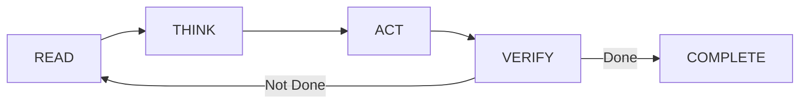

# Module 7.4: Các Mẫu Agentic Loop

> **Thời gian học**: ~35 phút
>
> **Yêu cầu trước**: Module 7.3 (Kiến Trúc Multi-Agent)
>
> **Kết quả**: Sau module này, bạn sẽ nhận ra các agentic loop pattern cơ bản trong Claude Code, biết cách prompt cho loop behavior cụ thể, và detect + break unproductive loop.

---

## 1. WHY — Tại Sao Cần Hiểu

Claude chạy 10 phút, terminal scroll liên tục, nhưng bạn không biết nó đang làm gì hay có progress không. Đôi khi nó lặp lại cùng fix thất bại 5 lần rồi vẫn cứ thử tiếp. Đôi khi nó bỏ cuộc sau 2 lần thử dù chỉ cần thêm 1 lần nữa là thành công. Cảm giác mất kiểm soát, không biết nên tin Claude hay can thiệp.

Hiểu agentic loop cho bạn visibility và control. Khi quan sát được pattern, bạn nhận ra: "À, nó đang trong self-correction loop fix test — đang progress tốt, để nó chạy tiếp." Hoặc: "Hmm, nó lặp lại cùng error message 3 lần rồi — đang stuck, cần can thiệp ngay."

Nghĩ về agentic loop như robot hút bụi. Nó tự động hút phòng, gặp tường thì đổi hướng, pin yếu về dock sạc, xong việc thì dừng. Claude Code hoạt động tương tự — nhưng bạn cần hiểu behavior pattern để biết khi nào để yên, khi nào can thiệp.

---

## 2. CONCEPT — Ý Tưởng Cốt Lõi

### Chu Trình RTAV — Foundation của Mọi Loop

Mọi agentic loop trong Claude Code đều dựa trên chu trình cơ bản RTAV:



**Giải thích từng phase:**

- **READ**: Claude đọc code hiện tại, error message, test output, hoặc context cần thiết
- **THINK**: Phân tích việc cần làm — visible rõ ràng khi bật Think Mode
- **ACT**: Thực hiện action cụ thể — sửa code, chạy command, tạo file
- **VERIFY**: Kiểm tra action có work không — test pass? error biến mất? requirement đạt?

Loop tiếp tục từ VERIFY về READ cho đến khi:
1. Verification pass (success condition)
2. Đạt max iteration limit
3. Human can thiệp (Ctrl+C hoặc command)

### Pattern 1: Self-Correction Loop

Loop phổ biến nhất — đây là cách Claude "tự debug".

**Trigger**: Test fail, linter error, build break — bất cứ khi nào có verifiable failure.

**Cycle**:
```
Analyze error → Hypothesize nguyên nhân → Fix code → Re-test → Repeat if needed
```

**Healthy sign**:
- Converge trong 2-4 iteration
- Mỗi iteration fix ít nhất 1 issue
- Error count giảm dần: 5 → 3 → 1 → 0

**Unhealthy sign**:
- Same error message lặp lại 3+ lần
- Change code nhưng test result không đổi
- Không có progress toward goal

**Prompt mẫu**:
```
Run npm test.

Nếu test nào fail:
1. Đọc failing test và code mà nó test
2. Analyze tại sao đang fail
3. Fix code (không sửa test trừ khi test sai)
4. Run npm test lại

Lặp cycle này đến khi tất cả test pass, hoặc đã thử 5 lần không progress.

Sau mỗi iteration report: còn bao nhiêu test fail, bạn đã fix gì, có progress không.
```

### Pattern 2: Iterative Refinement Loop

Loop dùng để cải tiến dần — optimize performance, improve quality, refine design.

**Trigger**: Prompt chứa "improve", "optimize", "refine", "làm tốt hơn" — signal rằng "good enough" chưa rõ ràng.

**Cycle**:
```
Evaluate current state → Identify improvement opportunity → Implement change →
Measure result → Compare with previous → Repeat if better
```

**Healthy sign**:
- Mỗi iteration có measurable improvement
- Improvement delta giảm dần (law of diminishing returns)
- Converge đến plateau rõ ràng

**Unhealthy sign**:
- Change không improvement, chỉ khác đi
- Endless tweaking không metric
- Oscillating back and forth giữa các approach

**Prompt mẫu**:
```
Optimize function calculateDiscount() để faster.

Benchmark hiện tại:
- Average: 45ms
- p95: 78ms

Quy trình:
1. Profile code identify bottleneck
2. Implement optimization
3. Run benchmark lại
4. So sánh với baseline

Dừng khi improvement < 5% hoặc đã thử 4 approach.
Report kết quả mỗi iteration với số liệu cụ thể.
```

**Điểm mấu chốt**: Loop này CẦN success metric rõ ràng. Không có metric = chạy mãi không dừng.

### Pattern 3: Exploration Loop

Loop dùng khi có uncertainty — thử nhiều approach khác nhau, so sánh, rồi chọn best.

**Trigger**: Nhiều approach có thể, prompt chứa "thử các cách", "so sánh", "tìm best approach".

**Cycle**:
```
Generate approach A → Implement & evaluate → Generate approach B → Implement & evaluate →
Compare results → Make decision
```

**Healthy sign**:
- Systematic comparison với criteria rõ ràng
- Đi đến quyết định có lý do
- Document trade-off của mỗi approach

**Unhealthy sign**:
- Endless exploration, không quyết định được
- Thiếu comparison criteria
- Try random approach không systematic

**Prompt mẫu**:
```
Implement caching cho product catalog API.

Try 3 approach:
1. Redis cache
2. In-memory cache với TTL
3. CDN edge cache

Cho mỗi approach:
- Implement prototype
- Benchmark: latency, hit rate, memory usage
- Note trade-off: complexity, cost, scalability

Recommend best approach cho usecase hiện tại với justification.
```

**Điểm mấu chốt**: Explicit về (1) bao nhiêu option, (2) evaluation criteria, (3) decision rule.

### Điều Kiện Dừng Loop — Không Thể Thiếu

Mọi loop PHẢI có điều kiện dừng rõ ràng. Không có = loop chạy đến hết token budget.

| Loại Điều Kiện | Ví dụ Cụ Thể | Khi Nào Dùng |
|---|---|---|
| **Success-based** | "Tất cả test pass", "Error count = 0" | Self-correction loop |
| **Iteration limit** | "Tối đa 5 lần", "Thử 3 approach" | Mọi loop nên có hard limit |
| **Threshold** | "Response time < 100ms", "Improvement < 5%" | Optimization loop |
| **Timeout** | "Dừng sau 10 phút", "Token budget < $2" | Long-running task |
| **Human intervention** | "Stop", Ctrl+C, "đủ rồi" | Mọi loop — always có escape hatch |

**Best practice**: Combine nhiều condition với AND logic:
```
Dừng khi (test pass) HOẶC (đã thử 5 lần) HOẶC (10 phút)
```

### Nhận Ra Stuck Loop — Red Flag Cần Watch

Loop stuck waste token và time. Nhận ra sớm = save cost.

**Red flag cần can thiệp ngay**:

1. **Same error lặp lại**: Error message giống hệt xuất hiện 3+ iteration liên tiếp
2. **Same fix lặp lại**: Claude edit cùng dòng code với similar change nhiều lần
3. **Zero progress**: Số lượng error/warning không giảm qua 3+ iteration
4. **Token spike**: `/cost` show usage tăng mà output không tương xứng
5. **Confusion signal**: Claude nói "trying again", "attempting alternative approach" nhưng approach thực ra giống cũ

**Khi spot red flag → can thiệp ngay. Đừng hy vọng Claude tự sửa — không xảy ra.**

---

## 3. DEMO — Từng Bước

**Mục tiêu**: Fix failing test suite dùng explicit self-correction loop, observe healthy convergence, nhận ra stuck loop, và practice intervention.

### Scenario: Fix API Test Suite

**Step 1: Khởi động session**

```bash
$ claude
```

Output:
```
Claude Code v1.x
Context: /Users/dev/ecommerce-api
Type /help for commands
>
```

**Step 2: Invoke self-correction loop với termination condition rõ ràng**

Prompt:
```
Run npm test.

Nếu có test nào fail:
1. Đọc failing test và implementation code mà nó test
2. Analyze tại sao đang fail — root cause, không phải symptom
3. Fix implementation (không sửa test trừ khi test code sai)
4. Run npm test lại để verify

Lặp cycle này đến khi tất cả test pass, hoặc đã thử 5 lần mà không progress.

Sau mỗi iteration, report:
- Còn bao nhiêu test đang fail
- Bạn đã fix gì
- Có đang progress không (số fail có giảm không)
```

**Step 3: Observe healthy loop — Progress tốt**

Claude output:
```
Running npm test...

FAIL src/services/userService.test.ts
  × should fetch user by ID (45ms)
      Expected: { id: 123, name: "Alice" }
      Received: undefined

  × should handle missing user (12ms)
      Expected: null
      Received: Error thrown

  × should validate email format (8ms)
      Expected: false
      Received: true

Test Suites: 1 failed, 1 total
Tests:       3 failed, 3 total

=== ITERATION 1 ===

Reading userService.test.ts và userService.ts...

Analysis:
- Test expect async function nhưng implementation đang sync
- Root cause: fetchUser() return undefined vì thiếu await với DB call

Fixing: Converting fetchUser() sang async function và add await...

Editing src/services/userService.ts...
Changed:
  function fetchUser(id) {
-   return db.query('SELECT * FROM users WHERE id = ?', [id])
+   return await db.query('SELECT * FROM users WHERE id = ?', [id])
  }

Running npm test...

FAIL 2 tests failed
  × should handle missing user (11ms)
  × should validate email format (9ms)

Progress: ✅ 3 failures → 2 failures. Đang tiến triển.

=== ITERATION 2 ===

Reading remaining failures...

Analysis:
- "handle missing user" fail vì throw error thay vì return null
- Root cause: Thiếu null check khi query không có kết quả

Fixing: Adding null check trong fetchUser()...

Changed:
  async function fetchUser(id) {
    const result = await db.query('SELECT * FROM users WHERE id = ?', [id])
+   if (!result || result.length === 0) return null
    return result[0]
  }

Running npm test...

FAIL 1 test failed
  × should validate email format (8ms)

Progress: ✅ 2 failures → 1 failure. Continue.

=== ITERATION 3 ===

Analysis:
- validateEmail() đang accept invalid format "test@" (missing domain)
- Root cause: Regex pattern quá loose

Fixing: Updating email validation regex...

Changed:
- const emailPattern = /.+@.+/
+ const emailPattern = /^[^\s@]+@[^\s@]+\.[^\s@]+$/

Running npm test...

PASS All tests passed ✓

Test Suites: 1 passed, 1 total
Tests:       3 passed, 3 total
Time:        2.14s

Loop kết thúc: success condition đạt.
```

**Quan sát — Đây là healthy loop**:
- Iteration 1: 3 fail → 2 fail (progress!)
- Iteration 2: 2 fail → 1 fail (progress!)
- Iteration 3: 1 fail → 0 fail (success!)
- Tổng: 3 iteration, consistent progress, clear convergence

**Step 4: Simulate unhealthy stuck loop**

Giờ thử scenario khác — loop bị stuck:

Prompt:
```
Fix linter error trong paymentService.ts.
Run eslint sau mỗi fix.
Lặp đến khi clean.
```

Claude output (unhealthy):
```
Running eslint src/paymentService.ts...

Error: 'usr' is not defined (no-undef)
  Line 45: const name = usr.name

=== ITERATION 1 ===
Fixing typo: "usr" → "user"...

Editing src/paymentService.ts line 45...

Running eslint...

Error: 'usr' is not defined (no-undef)
  Line 45: const name = usr.name

=== ITERATION 2 ===
Attempting to fix undefined variable...
Changing "usr" to "user"...

Running eslint...

Error: 'usr' is not defined (no-undef)
  Line 45: const name = usr.name

=== ITERATION 3 ===
Trying again with variable rename...

Running eslint...

Error: 'usr' is not defined (no-undef)
  Line 45: const name = usr.name
```

**🚨 RED FLAG ALERT: Đây là stuck loop**
- Same error message 3 lần liên tiếp
- Same fix description lặp lại
- Zero progress

**Step 5: Can thiệp để break loop**

Human intervention:
```
Stop. Bạn đang lặp lại cùng fix 3 lần mà error vẫn giữ nguyên.

Điều tra:
1. Show nội dung file paymentService.ts hiện tại line 40-50
2. Fix có thực sự được apply vào file không?
3. Có root cause khác bạn đang miss không?
```

Claude response:
```
Showing src/paymentService.ts lines 40-50:

  function processPayment(userId) {
    const user = getUser(userId)
    // ... some code ...
    const name = usr.name  // Line 45 — TYPO STILL HERE
    console.log(name)
  }

Analysis: Fix không persist vì tôi đang edit wrong file path.
Actual file: src/services/paymentService.ts
I was editing: src/paymentService.ts (thiếu /services/)

Root cause identified: Wrong file path.

Fixing correct file...

Editing src/services/paymentService.ts line 45:
- const name = usr.name
+ const name = user.name

Running eslint...

✓ No errors found
```

**Lesson**: Stuck loop thường indicate missing information hoặc wrong assumption. Can thiệp để expose root cause.

**Step 6: Check token usage**

```
/cost
```

Output:
```
Session cost: $0.18
Tokens used:
  Input:  52,000
  Output: 15,000
  Total:  67,000
```

**Analysis**: 3 stuck iteration waste ~$0.08 (estimate). Can thiệp sớm = save cost.

---

## 4. PRACTICE — Tự Thực Hành

### Bài 1: Invoke và Observe RTAV Cycle

**Mục tiêu**: Nhận ra RTAV cycle trong real session — identify từng phase, predict termination.

**Instructions**:
1. Chọn task có clear verification: fix bug với test, pass linter check, resolve build error
2. Craft prompt với explicit loop instruction bao gồm max iteration (3-5 lần)
3. Run session và watch output carefully
4. Identify từng phase: READ (đọc file gì), THINK (analysis như thế nào), ACT (action gì), VERIFY (check ra sao)
5. Note: Tổng bao nhiêu iteration? Loop converge hay stuck? Termination condition nào trigger?

**Expected result**: Bạn nhận ra pattern và có thể predict "Iteration tiếp chắc sẽ fix remaining error rồi done" hoặc "Đang stuck, cần can thiệp."

<details>
<summary>💡 Hint</summary>

Prompt structure tốt cho practice này:

```
[TASK]: Fix failing test trong userService.test.ts

[LOOP INSTRUCTION]:
1. Đọc test code và implementation
2. Analyze nguyên nhân fail
3. Fix implementation
4. Run npm test để verify

Lặp đến khi test pass hoặc 5 lần.

[REPORTING]:
Sau mỗi iteration, report phase bạn đang ở (READ/THINK/ACT/VERIFY) và result.
```

Watch cho:
- **READ**: "Reading...", "Analyzing file..."
- **THINK**: "Analysis:", "Root cause:", "The issue is..." (rõ ràng với Think Mode)
- **ACT**: "Editing...", "Running command...", "Creating..."
- **VERIFY**: "Running test...", "Checking...", output của verification command
</details>

<details>
<summary>✅ Solution</summary>

Healthy RTAV observation:

**Iteration 1**:
- READ: Claude đọc test file `userService.test.ts` và implementation `userService.ts`
- THINK: "Analysis: Test expect async function nhưng code đang sync. Root cause: thiếu await."
- ACT: Edit `userService.ts` add async/await
- VERIFY: Run `npm test` → 3 fail → 2 fail

**Iteration 2**:
- READ: Đọc remaining 2 failing test
- THINK: "Thiếu null check khi user not found"
- ACT: Add null check
- VERIFY: Run test → 2 fail → 0 fail → SUCCESS

**Termination**: Success condition (all test pass) achieved sau 2 iteration.

**Pattern**: Mỗi iteration giảm error count = healthy convergence.

Nếu thấy iteration 3 vẫn 2 fail, iteration 4 vẫn 2 fail → stuck, can thiệp.
</details>

### Bài 2: Break Stuck Loop

**Mục tiêu**: Practice nhận ra stuck loop sign và can thiệp hiệu quả.

**Instructions**:
1. Cho Claude task challenging: fix flaky test, complex refactoring, hoặc debug race condition
2. Watch cho stuck loop sign:
   - Same error message 3+ lần
   - Same fix approach lặp lại
   - Token usage increase mà no progress
3. Khi spot sign, can thiệp NGAY — đừng đợi thêm iteration
4. Can thiệp bằng: "Stop. Explain những gì bạn đã thử và tại sao vẫn fail."
5. Dựa trên explanation, guide Claude sang approach khác hoặc provide missing context

**Expected result**: Bạn detect stuck loop trong 3 iteration và can thiệp để unstuck.

<details>
<summary>💡 Hint</summary>

Stuck loop sign cụ thể:

**Same error 3+ lần**:
```
Iteration 1: Error: Cannot read property 'id' of undefined
Iteration 2: Error: Cannot read property 'id' of undefined
Iteration 3: Error: Cannot read property 'id' of undefined
```

**Same file edited lặp**:
```
Iteration 1: Editing src/api.ts line 45...
Iteration 2: Editing src/api.ts line 45...
Iteration 3: Editing src/api.ts line 45...
```

**Token spike no progress**:
```
/cost → $0.05
... 3 iteration no change ...
/cost → $0.12
```

Can thiệp phrase:
```
Stop. Bạn đang loop 3 lần với same result.

Show me:
1. File content hiện tại
2. Full error stack trace
3. Assumption bạn đang make
```
</details>

<details>
<summary>✅ Solution</summary>

**Intervention strategy khi stuck:**

**Step 1: Identify stuck pattern**
```
Iteration 1-3: Same error "TypeError: user is undefined"
Action: Same fix "add null check"
Result: No change
```

**Step 2: Stop loop**
```
Human: "Stop. Analyze tại sao fix không work."
```

**Step 3: Request diagnosis**
```
Human: "Explain:
1. Bạn đã thử gì?
2. Error xuất hiện ở đâu trong call stack?
3. Bạn assume gì về data flow?"
```

**Step 4: Provide missing context hoặc redirect**

Thường stuck vì:
- Wrong file path (như DEMO step 5)
- Missing context về data source
- Wrong assumption về async timing
- Cần approach hoàn toàn khác (refactor instead of patch)

Example redirection:
```
Human: "user undefined xảy ra VÌ API call chưa complete.
Thay vì null check, wrap logic trong async callback.
Thử approach đó."
```

**Step 5: Resume với new direction**

Loop continue nhưng với correct approach → converge.

**Lesson**: Can thiệp không phải admit failure — đó là control loop behavior. Senior dev làm vậy với junior dev. Bạn làm vậy với Claude.
</details>

---

## 5. CHEAT SHEET

### Loop Pattern Reference

| Pattern | Trigger Phrase | Healthy Sign | Stuck Sign | Intervention |
|---------|---------------|--------------|------------|--------------|
| **Self-Correction** | "fix", "debug", "until pass" | Error count giảm mỗi iteration | Same error 3+ lần | "Show root cause analysis" |
| **Iterative Refinement** | "improve", "optimize", "refine" | Measurable gain | Change không gain | "Define done criteria" |
| **Exploration** | "try approaches", "compare options" | Systematic evaluation | Random trying | "Limit to N option" |

### Prompt Template Invoke Loop

| Loop Type | Prompt Template |
|-----------|-----------------|
| **Self-Correction** | `Fix [problem]. Test sau mỗi fix. Lặp đến pass hoặc [N] lần. Report progress mỗi iteration.` |
| **Refinement** | `Optimize [metric]. Benchmark sau mỗi change. Dừng khi improvement < [X]% hoặc [N] lần.` |
| **Exploration** | `Try [N] approach cho [goal]. Evaluate mỗi cái theo [criteria]. Recommend best với trade-off.` |

### Termination Condition Checklist

Mọi loop prompt PHẢI có ít nhất 2 trong số này:

- [ ] Success criteria: "đến khi test pass", "error = 0"
- [ ] Max iteration: "tối đa 5 lần"
- [ ] Threshold: "improvement < 5%"
- [ ] Timeout: "dừng sau 10 phút"
- [ ] Human escape: luôn có Ctrl+C

### Intervention Phrase

| Tình Huống | Can Thiệp Nói Gì |
|------------|------------------|
| **Stuck loop** | `Stop. Explain những gì bạn đã thử và tại sao vẫn fail.` |
| **Sai hướng** | `Approach hiện tại không work. Thử cách hoàn toàn khác: [suggestion].` |
| **Đủ tốt rồi** | `Good enough. Chuyển task tiếp theo.` |
| **Unsafe action** | `Stop ngay. [Explain risk]. Chờ approval.` |
| **Khẩn cấp** | Ctrl+C (hard stop) |

### Context Management Trong Loop

| Trigger | Action | Lý Do |
|---------|--------|-------|
| Loop > 10 iteration | `/compact` | Compress context avoid degradation |
| Quan tâm cost | `/cost` mỗi 5 iteration | Monitor token usage |
| Context degrade | `/clear` + summary restart | Fresh start với learned info |
| Long exploration | Save finding → `/clear` → decide | Prevent context pollution |

---

## 6. PITFALLS — Lỗi Thường Gặp

| ❌ Sai Lầm | ✅ Đúng Cách |
|---|---|
| **Không termination condition** — prompt "Fix đến khi xong" rồi để chạy. Loop burn token đến hết budget. | Always specify: max iteration ("tối đa 5 lần"), success criteria ("đến khi test pass"), HOẶC timeout ("dừng sau 10 phút"). "Đến khi xong" quá mơ hồ — define "xong" là gì. |
| **Để stuck loop chạy** — thấy same error lặp 3 lần mà vẫn hy vọng iteration thứ 4 sẽ khác. | No progress sau 3 iteration → can thiệp NGAY. Đợi thêm chỉ waste token và time. Claude không tự "nghĩ ra" approach mới — bạn phải guide. |
| **Over-optimize endless** — prompt "làm cho perfect" với refinement loop không có done criteria. | Define "good enough" TRƯỚC: "Dừng khi test pass" không phải "dừng khi perfect". Perfect không tồn tại. Ship good enough, iterate sau. |
| **Không dùng /compact** — loop chạy 20+ iteration, context degrade, Claude quên initial goal. | Dùng `/compact` mỗi 5-10 iteration trong long loop để maintain coherence. Hoặc `/clear` rồi restart với summary nếu cần fresh context. |
| **Blame AI khi loop fail** — "Claude bị lỗi", "AI ngu", không reflect prompt design. | Thường là loop design sai: goal không rõ, thiếu termination condition, context không đủ. Fix prompt, không phải blame tool. Loop quality reflect prompt quality. |
| **Micromanage mỗi step** — approve từng iteration, break loop để check, prevent autonomous work. | Để Claude loop tự động. Chỉ can thiệp khi: stuck (no progress 3+ iteration), unsafe (risk action), hoặc done (success đạt sớm hơn expect). Trust but verify outcome, không phải từng step. |

---

## 7. REAL CASE — Câu Chuyện Thực Tế

### Scenario: Migration 50 REST API sang GraphQL

**Background**: Công ty fintech Việt Nam có legacy backend với 50 REST API endpoint phục vụ mobile app. Product team muốn migrate sang GraphQL để reduce roundtrip và improve mobile UX. Mỗi endpoint cần:

1. Định nghĩa GraphQL schema từ REST contract
2. Implement resolver dùng existing service layer (không rewrite business logic)
3. Update integration test từ REST call sang GraphQL query
4. Verify test pass với GraphQL endpoint

**Approach ban đầu — Không hiểu loop**:

Dev team (2 người) làm manual:
- Dev A xử lý endpoint 1: viết schema → resolver → test → debug → done (30-45 phút/endpoint)
- Dev B xử lý endpoint 2: tương tự
- Approach không consistent giữa 2 người
- Copy-paste code dẫn đến duplicate bugs
- **Tổng thời gian**: 3 ngày (24 hours effort) cho 50 endpoint
- **Frustration**: Repetitive, boring, error-prone

**Approach mới — Với explicit agentic loop**:

Tech lead quyết định thử Claude Code với self-correction loop:

```
Context: /path/to/api-server
Đọc config/endpoints.json liệt kê 50 REST endpoint.

Cho mỗi endpoint theo thứ tự:

1. READ: Đọc REST contract từ OpenAPI spec
2. THINK: Map REST structure sang GraphQL type system
3. ACT - Part 1: Generate GraphQL schema trong schema/
4. ACT - Part 2: Implement resolver trong resolvers/ dùng existing service
5. ACT - Part 3: Update test file call GraphQL thay vì REST
6. VERIFY: Run npm test cho endpoint đó
7. SELF-CORRECT: Nếu test fail:
   - Analyze error
   - Fix resolver hoặc schema
   - Re-run test
   - Max 3 fix attempt
   - Nếu vẫn fail sau 3 lần → report endpoint name để human review

Chuyển sang endpoint tiếp CHỈ KHI endpoint hiện tại pass test.

Report progress mỗi 10 endpoint: bao nhiêu done, bao nhiêu pending, bao nhiêu need human review.

Termination: Khi tất cả 50 endpoint processed.
```

**Kết quả**:

Claude chạy loop trong 4 giờ (phần lớn unattended — dev làm việc khác):

```
Progress Report 1 (after 1 hour):
✓ 10 endpoint done, test pass
⚠️ 0 need human review
⏳ 40 pending

Progress Report 2 (after 2 hours):
✓ 22 endpoint done
⚠️ 1 need review (complex auth edge case)
⏳ 27 pending

Progress Report 3 (after 3 hours):
✓ 35 endpoint done
⚠️ 2 need review (external API integration unclear)
⏳ 13 pending

Final Report (after 4 hours):
✓ 47 endpoint done, test pass
⚠️ 3 need human review
⏳ 0 pending

Human review session (30 minutes):
- 2 endpoint: provide API credential → Claude re-run → pass
- 1 endpoint: complex business logic → human code manually (15 min)

TOTAL: 4.5 hours vs 3 days original estimate
```

**Self-correction loop statistics từ log**:

- 35 endpoint: pass ngay iteration 1 (no correction needed)
- 10 endpoint: pass iteration 2 (1 fix)
- 2 endpoint: pass iteration 3 (2 fix)
- 3 endpoint: reach max attempt → human review

Average iteration per endpoint: 1.4 — healthy convergence.

**Token cost**:
- Total: ~850,000 token
- Cost: $12 (với Sonnet pricing)
- Estimated cost nếu làm từng endpoint riêng 50 session: $40-50
- **Saving**: Loop approach efficient hơn vì context reuse

**Insight từ tech lead** (post-mortem note):

> "Chúng tôi không làm Claude smarter. Không đổi model, không tune gì cả. Chỉ làm loop explicit — define rõ ràng cycle (READ-THINK-ACT-VERIFY), verification step (run test), self-correction rule (max 3 attempt), và termination condition (all endpoint done HOẶC need review).
>
> Sự rõ ràng đó biến task nhàm chán 3 ngày thành 4 giờ productive. Loop structure — không phải AI magic — là toàn bộ sự khác biệt. Giờ team tôi apply pattern này cho mọi repetitive task có verify được."

**Bonus outcome**:

Sau migration, team discover thêm 2 bug trong REST implementation (inconsistent validation) nhờ GraphQL schema force strict typing. Bug này tồn tại hàng tháng không ai biết. Self-correction loop expose chúng khi test fail.

---

> **Tiếp theo**: [Module 7.5: Công Cụ Điều Phối Multi-Agent](../05-orchestration-tools/) →
