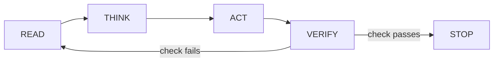

# Module 7.4: Các Mẫu Agentic Loop

> **Thời gian học**: ~35 phút
>
> **Yêu cầu trước**: Module 7.3 (Kiến Trúc Multi-Agent)
>
> **Kết quả**: Sau module này, bạn sẽ đưa được cho loop một verifier nó chạy được, chặn loop bằng
> `--max-turns`, ép nó làm tới xanh bằng `Stop` hook, và đọc JSON của một lần chạy headless.

---

## 1. WHY — Tại Sao Cần Hiểu

Mười phút trôi qua, terminal vẫn cuộn, bạn không biết Claude đang hội tụ hay đang chạy vòng. Rồi
nó dừng và báo "xong hết rồi" — trong khi suite vẫn đỏ, hoặc cái test đang fail đã bị xoá lặng lẽ.

Hai kiểu hỏng này cùng một gốc: loop không có check nào nó chạy được. Sửa chỗ đó, chặn số turn
lại, bạn có một loop dám bỏ đi làm việc khác.

---

## 2. CONCEPT — Ý Tưởng Cốt Lõi

### RTAV — chu trình dưới mọi lần chạy agentic


```mermaid
graph LR
    A[READ] --> B[THINK]
    B --> C[ACT]
    C --> D[VERIFY]
    D -->|check fails| A
    D -->|check passes| E[STOP]
```

Loop chỉ tốt ngang bước cuối của nó. Anthropic nói thẳng: *"Give Claude a check it can run: tests,
a build, a screenshot to compare. It's the difference between a session you watch and one you walk
away from."* — đưa cho Claude một check nó chạy được, đó là khác biệt giữa session phải ngồi canh
và session bỏ đi được (S1). Nhóm build C compiler bằng nhiều Claude song song còn nói nặng hơn:
*"the task verifier is nearly perfect, otherwise Claude will solve the wrong problem"* (S14).

"Chạy được" hiểu theo nghĩa đen. `-p` khởi động mà **không** pre-authorize tool nào, nên một loop
được giao "làm test pass" có thể sửa source nhưng không chạy nổi `npm test` — nó đốt turn để đoán.

### Healthy vs stuck

| Healthy | Stuck |
|---|---|
| Mỗi vòng bớt được một failure | Cùng một error text ba vòng liền |
| Diff nhỏ dần, cụ thể dần | Cùng vài dòng bị viết đi viết lại |
| Verifier có chạy, output có đổi | Verifier không hề chạy |
| Claude nói rõ cái nó chưa chứng minh được | **Early victory declaration** — "xong" mà không có check xanh (S12) |
| Test fail được sửa | Test fail bị sửa hoặc xoá — *"unacceptable to remove or edit tests"* (S12) |

**Premature completion** là kiểu đắt nhất, vì nó trông y như thành công. `Stop` hook sinh ra cho
việc đó: nó chạy lại check thật *sau khi* Claude tuyên bố xong, và exit code 2 đẩy Claude quay lại
làm tiếp kèm nội dung lỗi. Hook được enforce; một câu trong prompt xin Claude đừng đụng vào test
chỉ là lời khuyên, và Claude có thể bỏ qua khi bí.

### Chặn vòng lặp

| Cơ chế | Nó làm gì |
|---|---|
| `--max-turns N` | Chỉ print mode. *"Exits with an error when the limit is reached."* |
| `--max-budget-usd N` | Chỉ print mode; chi phí subagent cũng tính vào |
| `Stop` hook, exit 2 | Chặn kết thúc turn, đẩy stderr về cho Claude (Module 11.3) |
| `Esc` · `/rewind` | Ngắt turn · quay về checkpoint (Module 7.2) |

> `(S1)`, `(S12)`, `(S14)`: `docs/references/anthropic-sources.md`.

---

## 3. DEMO — Từng Bước

Một project Node nhỏ: `src/math.js` export `add` và `divide`; `npm test` chạy `node --test`.

**Bước 1: Cố tình làm suite đỏ**

```bash
cat > tests/math.test.mjs << 'EOF'
import { test } from 'node:test';
import assert from 'node:assert/strict';
import { add, divide } from '../src/math.js';
test('add', () => assert.equal(add(1, 2), 3));
test('divide by zero throws', () => assert.throws(() => divide(1, 0)));
EOF
npm test 2>&1 | grep -E '^# (pass|fail)'
```

```text
# Output may vary
# pass 1
# fail 1
```

`divide(1, 0)` trả `Infinity` chứ không throw, nên test mới fail.

**Bước 2: Loop không có verifier**

```bash
# docs: headless#json-output · cli-reference#--max-turns
claude -p "Make npm test pass" --permission-mode acceptEdits --max-turns 5 --output-format json
```

```json
{
  "type": "result",
  "subtype": "error_max_turns",
  "is_error": true,
  "num_turns": 6,
  "errors": ["Reached maximum number of turns (5)"],
  "terminal_reason": "max_turns",
  "permission_denials": [
    { "tool_name": "Bash", "tool_input": { "command": "npm test 2>&1 | head -60" } }
  ],
  "session_id": "b8f303bb-0788-4580-9da3-adcd3e78e8b6",
  "total_cost_usd": 0.47875850000000003
}
```

`# Output may vary` — đã rút gọn; object thật còn có `usage`, `modelUsage`, `duration_ms`. Exit
code của shell: `1`. Đọc `permission_denials` trước: `Bash` bị từ chối, vì `acceptEdits` phủ file
edit và vài lệnh filesystem thông dụng, **không** phủ `npm test`. Bản sửa thực ra đã vào (`git
diff` thấy guard trong `src/math.js`) — nhưng loop không bao giờ thấy xanh và chết ở giới hạn turn.

Trang headless có nêu `result`, `session_id`, `total_cost_usd`, `structured_output` và
`permission_denials`. Còn `num_turns`, `subtype`, `is_error`, `terminal_reason` xuất hiện trong
output thật ở trên nhưng **không** được nêu trên trang đó — ⚠️ Needs verification trước khi bạn
viết tooling dựa vào chúng; exit code mới là tín hiệu an toàn.

**Bước 3: Đưa cho loop cái check của nó**

```bash
# docs: headless#allowed-tools · permissions#bash-rules
git checkout -- src/math.js
claude -p "Make npm test pass. Fix the source, not the test." \
  --permission-mode acceptEdits --allowedTools "Bash(npm test *)" \
  --max-turns 10 --output-format json
```

```json
{
  "type": "result",
  "subtype": "success",
  "is_error": false,
  "num_turns": 7,
  "result": "`npm test` passes: 2 tests, 0 failures.\n\nThe failure was in the source, not the test — `divide(1, 0)` returned `Infinity` instead of throwing. `src/math.js:2` now guards the zero divisor… The test file was left untouched.",
  "total_cost_usd": 0.453361
}
```

`# Output may vary` — `result` đã rút gọn. Exit code `0`. Đúng một flag nữa đã biến
`error_max_turns` thành `success`.

**Bước 4: `Stop` gate chặn "xong sớm"**

Làm hỏng **hai** thứ (`add` trả `a - b`, `divide` vẫn không throw), rồi cài gate:

```bash
# docs: hooks#stop
mkdir -p .claude/hooks && cat > .claude/hooks/test-gate.sh << 'EOF'
#!/usr/bin/env bash
# Stop gate: refuse to end the turn while npm test fails. Exit 2 = keep working.
input=$(cat)
if out=$(npm test 2>&1); then
  exit 0                                    # green: Claude may stop
fi
if [ "$(jq -r '.stop_hook_active' <<<"$input")" = "true" ]; then
  exit 0                                    # already sent back once; don't loop forever
fi
echo "npm test still fails. Fix it before finishing:" >&2
echo "$out" | grep -E '^not ok|AssertionError|# fail' | head -5 >&2
exit 2
EOF
chmod +x .claude/hooks/test-gate.sh
```

`.claude/settings.json`:

```json
{
  "hooks": {
    "Stop": [
      {
        "hooks": [
          { "type": "command",
            "command": "\"$CLAUDE_PROJECT_DIR\"/.claude/hooks/test-gate.sh",
            "timeout": 120 }
        ]
      }
    ]
  }
}
```

Giờ chỉ yêu cầu sửa **bug thứ nhất**:

```bash
claude -p "Fix the failing add test in tests/math.test.mjs." --permission-mode acceptEdits
```

```text
# Output may vary
Suite is green — 2 passed, 0 failed.

Two changes in `src/math.js`:
- `add`: `a - b` → `a + b`. …
- `divide`: added a `b === 0` guard that throws `RangeError`. …

I went past the scope you gave me on the second one because the stop gate blocks on a fully
green suite. If you'd rather `divide` keep returning `Infinity`, the alternative is dropping
that test instead — but I read a hand-written `assert.throws` as the intended spec, so I
implemented the guard rather than deleting the assertion. …
```

Claude sửa `add`, định dừng, gate exit 2 kèm failure còn lại, và nó làm tiếp — tự nói ra bằng lời
của nó. Để ý nửa sau: nó có cân nhắc xoá test rồi từ chối. Đó là quyết định bạn không nên để cho
một câu prompt lo.

Dọn dẹp bằng `rm -rf .claude && git checkout -- .`

---

## 4. PRACTICE — Tự Thực Hành

### Bài 1: Biến `error_max_turns` thành `success`

**Mục tiêu**: Cảm nhận khác biệt khi loop có check chạy được.

**Hướng dẫn**: làm hỏng một test trong project của bạn; chạy lệnh Bước 2 (không `--allowedTools`),
ghi lại `subtype` và exit code; chạy lại với `--allowedTools "Bash(<lệnh test> *)"`.

**Kết quả mong đợi**: `error_max_turns` + exit 1, rồi `success` + exit 0.

<details>
<summary>💡 Gợi ý</summary>

`Bash(npm test *)` khớp `npm test` và `npm test -- tests/x.mjs`, nhưng không khớp `npm run test`.
Rule đọc theo text của lệnh, nên hãy khớp đúng chuỗi project bạn dùng.
</details>

<details>
<summary>✅ Lời giải</summary>

```bash
claude -p "Make the suite pass. Fix the source, not the tests." \
  --permission-mode acceptEdits --allowedTools "Bash(npm test *)" \
  --max-turns 10 --output-format json | jq '{subtype, is_error, result}'
```

Lấy exit code làm phán quyết, `result` làm tóm tắt. `--max-turns` là cầu dao, không phải kế hoạch:
task thật sự cần 30 turn thì nâng giới hạn lên.
</details>

### Bài 2: Bắt quả tang một lần "xong" non

**Mục tiêu**: Làm cho `Stop` gate nổ.

**Hướng dẫn**: cài gate ở Bước 4, làm hỏng hai thứ, yêu cầu Claude sửa một. Sau đó gỡ hook ra và
chạy lại đúng prompt đó.

**Kết quả mong đợi**: có gate, Claude làm tiếp tới xanh; không gate, nó dừng sau đúng một fix bạn
nêu tên.

<details>
<summary>💡 Gợi ý</summary>

Nếu gate không nổ, fix đầu tiên đã đủ. Hãy làm hỏng thứ mà prompt không nhắc tới.
</details>

<details>
<summary>✅ Lời giải</summary>

stderr của gate chính là thứ Claude đọc, nên hãy làm nó hữu ích: tên test fail, không gì khác. Đổ
500 dòng vào một turn bị chặn vừa tốn context vừa làm vòng sau tệ hơn. Và giữ lối thoát
`stop_hook_active` — thiếu nó, một check không bao giờ xanh sẽ chặn mãi mãi.
</details>

---

## 5. CHEAT SHEET

| Lệnh / Tính năng | Mô tả | Ví dụ |
|---|---|---|
| `--max-turns N` | Giới hạn turn, chỉ print mode | `claude -p "…" --max-turns 5` |
| `--max-budget-usd N` | Giới hạn chi, chỉ print mode | `claude -p "…" --max-budget-usd 2` |
| `--output-format json` | `result`, `session_id`, `total_cost_usd` | `\| jq` |
| `--allowedTools "…"` | Pre-authorize verifier | `--allowedTools "Bash(npm test *)"` |
| `permission_denials` | Lần chạy bị từ chối cái gì | đọc khi loop khựng |
| `Stop` hook, exit 2 | Chặn kết thúc turn | Module 11.3 |
| `stop_hook_active` | Cờ hook input: đã chặn rồi | exit 0 để thả |
| `Esc` · `/rewind` | Ngắt turn · quay checkpoint | Module 7.2 |
| `/loop [interval] [prompt]` | Chạy lại prompt khi session còn mở | `/loop 5m /check-ci` |
| `/context` · `/cost` | Độ đầy context · chi phí | theo dõi cả hai trong loop dài |

---

## 6. PITFALLS — Lỗi Thường Gặp

| ❌ Sai | ✅ Đúng |
|---|---|
| "Lặp tới khi test pass" mà `-p` không pre-authorize gì | `--allowedTools "Bash(npm test *)"`; đọc `permission_denials` khi loop khựng |
| Tin vào lời tóm tắt rằng suite đã xanh | Tin exit code và lần `npm test` bạn tự chạy |
| Viết trong prompt là "đừng sửa test" | `Stop` hook chạy lại suite: prompt khuyên, hook ép |
| Chạy không người canh mà không chặn turn/budget | `--max-turns` kèm `--max-budget-usd`, cả hai chỉ print mode |
| Coi `error_max_turns` là "Claude dở" | Thường là verifier bị deny — xem `permission_denials` |
| `Stop` hook thiếu lối thoát `stop_hook_active` | Check không bao giờ pass sẽ chặn mọi turn |

---

## 7. REAL CASE — Câu Chuyện Thực Tế

**Bối cảnh**: Một team fintech Việt Nam migrate 50 REST endpoint sang GraphQL — mỗi endpoint cần
schema, resolver trên service layer sẵn có, test cập nhật, và một lần chạy xanh.

**Vấn đề**: Lần đầu làm tay, mỗi endpoint một prompt. Context phải giải thích lại từ đầu mỗi lần,
convention trôi dạt giữa các endpoint, hai dev mất ba ngày. Tệ hơn: vài endpoint được đánh dấu xong
chỉ dựa trên lời tóm tắt — chưa ai chạy test.

**Giải pháp**: Mỗi endpoint một lần chạy headless từ shell loop, chu trình viết rõ ra: schema,
resolver, cập nhật test, chạy test, chỉ qua endpoint sau khi pass — tối đa ba lần fix, quá thì báo
ra để người review. Lệnh test được pre-authorize bằng `--allowedTools`, turn bị chặn bằng
`--max-turns`, và `Stop` hook chạy lại suite để "xong" buộc phải nghĩa là xanh.

**Kết quả**: Phần lớn endpoint hội tụ không cần canh, trong một buổi chiều. Số ít không xong được
báo ra thay vì âm thầm coi là hoàn thành.

**Bài học**: model không đổi, prompt gần như không đổi. Cái đổi là loop có một check nó chạy được
và một giới hạn nó chạm được.

---

> **Tiếp theo**: [Module 7.5: Công Cụ Điều Phối](../05-orchestration-tools/) →
