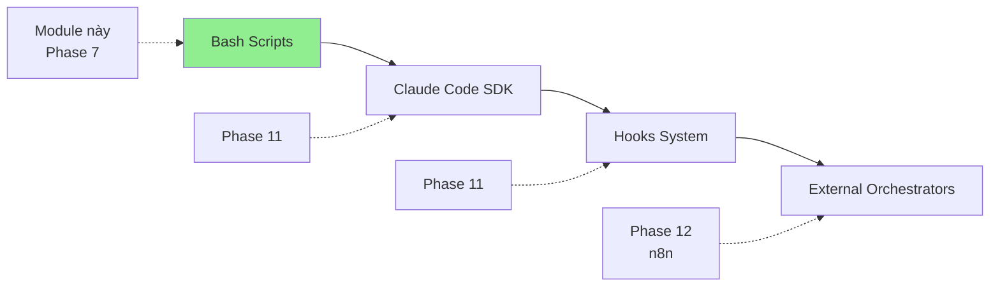
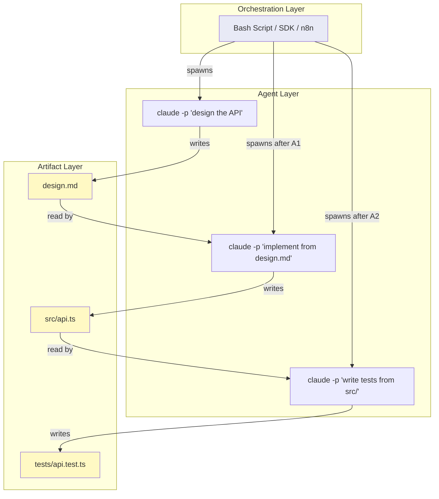

# Module 7.5: Công Cụ Điều Phối

> **Thời gian học**: ~35 phút
>
> **Yêu cầu trước**: Module 7.4 (Các Mẫu Agentic Loop)
>
> **Kết quả**: Sau module này, bạn sẽ hiểu orchestration tool landscape, viết bash script cho multi-agent coordination, và biết khi nào graduate lên tool advanced.

---

## 1. WHY — Tại Sao Cần Hiểu

Bạn đã học multi-agent và agentic loop, nhưng vẫn làm mọi thứ manual — mở 3-4 terminal, copy-paste output qua lại, cố coordinate handoff giữa các agent. Pipeline 3-agent đơn giản mất 10 phút chỉ để orchestrate.

Orchestration tool cho phép bạn automate coordination này. Nghĩ như nhạc trưởng chỉ huy dàn nhạc — mỗi nhạc công (agent) chơi phần của mình xuất sắc, nhưng cần ai đó điều phối để ra bản nhạc hoàn chỉnh. Module này dạy bạn cách làm "nhạc trưởng" cho Claude Code.

---

## 2. CONCEPT — Ý Tưởng Cốt Lõi

### Orchestration Spectrum

Từ simple đến complex:



### Level 1: Bash Scripts (Focus Module Này)

`claude -p` là foundation của scripted orchestration:
- **One-shot execution**: Chạy prompt, nhận result, exit
- **File-based communication**: Agent A viết file, Agent B đọc file
- **Combine với bash**: loop, variable, conditional, function

**Good for**: Simple pipeline, CI/CD integration, quick automation

### Level 2: Claude Code SDK (Preview — Phase 11)

Programmatic control từ Node.js/Python:
- Structured response
- Error handling sophisticated
- State management

**Good for**: Complex application, custom tool
⚠️ SDK details xác minh trong Phase 11

### Level 3: Hooks System (Preview — Phase 11)

Event-driven automation:
- Pre/post hooks cho file write, command
- Trigger script khi Claude action

**Good for**: Reactive workflow, guardrail
⚠️ Hooks details xác minh trong Phase 11

### Level 4: External Orchestrators (Preview — Phase 12)

Visual workflow engine (n8n, etc.):
- Multi-system integration
- Visual workflow design

**Good for**: Enterprise, complex multi-system workflow

### Chọn Đúng Level

| Nhu Cầu | Tool | Lý Do |
|---------|------|-------|
| Quick automation | Bash script | Đơn giản, zero dependency |
| CI/CD pipeline | Bash + `claude -p` | Integrate được mọi nơi |
| Complex application | SDK (Phase 11) | Programmatic control |
| Event-driven | Hooks (Phase 11) | React to action |
| Enterprise | n8n (Phase 12) | Visual, maintainable |

**Nguyên tắc**: Start simple. Graduate lên complex chỉ khi cần feature.

### Luồng Dữ Liệu Trong Orchestration

Hiểu cách dữ liệu di chuyển giữa ba tầng của một workflow orchestration:



**Ba tầng hoạt động**:

1. **Orchestration Layer**: Điều khiển thứ tự thực thi, song song hóa, và xử lý lỗi. Đây là bash script, SDK code, hoặc n8n workflow. Tầng này không bao giờ chạm vào code trực tiếp — chỉ spawn agents và kiểm tra kết quả.

2. **Agent Layer**: Mỗi lệnh `claude -p` chạy với context mới. Các agents không biết về nhau. Chúng nhận chỉ dẫn từ orchestrator và tạo ra artifacts.

3. **Artifact Layer**: Các file trên đĩa mang dữ liệu giữa agents. Agent 1 viết `design.md`, Agent 2 đọc nó làm input. Đây là kênh giao tiếp — agents nói chuyện qua files, không qua shared memory.

**Tại sao sự phân tách này quan trọng**: Orchestration layer dễ debug (chỉ là bash/code). Agent layer có thể thay thế được (đổi model, đổi prompt). Artifact layer có thể kiểm tra được (xem file trung gian). Khi có lỗi, bạn xác định chính xác tầng nào gây ra vấn đề.

---

## 3. DEMO — Từng Bước

**Task**: Build code review pipeline với 3 agent chuyên biệt.

### Step 1: Tạo Orchestration Script

```bash
#!/bin/bash
# code-review-pipeline.sh

FILE_TO_REVIEW=$1

if [ -z "$FILE_TO_REVIEW" ]; then
  echo "Usage: ./code-review-pipeline.sh <file>"
  exit 1
fi

echo "=== Code Review Pipeline ==="
echo "Target: $FILE_TO_REVIEW"

# Agent 1: Security Review
echo ""
echo "[1/3] Security review..."
claude -p "Review $FILE_TO_REVIEW for security issues.
Focus on: SQL injection, XSS, auth bypass, secrets exposure.
List issues with line numbers." > security-review.md

# Agent 2: Performance Review
echo "[2/3] Performance review..."
claude -p "Review $FILE_TO_REVIEW for performance issues.
Focus on: N+1 queries, memory leaks, blocking calls.
List issues with line numbers." > performance-review.md

# Agent 3: Style Review
echo "[3/3] Style review..."
claude -p "Review $FILE_TO_REVIEW for style issues.
Focus on: naming, function length, documentation.
List issues with line numbers." > style-review.md

# Aggregator
echo ""
echo "Aggregating results..."
claude -p "Read security-review.md, performance-review.md, style-review.md.
Create unified REVIEW.md with sections:
- Critical (security)
- Important (performance)
- Minor (style)
Prioritize by severity." > /dev/null

echo "✓ Review complete! See REVIEW.md"
```

### Step 2: Chạy Pipeline

```bash
$ chmod +x code-review-pipeline.sh
$ ./code-review-pipeline.sh src/services/userService.ts
```

Output:
```
=== Code Review Pipeline ===
Target: src/services/userService.ts

[1/3] Security review...
[2/3] Performance review...
[3/3] Style review...

Aggregating results...
✓ Review complete! See REVIEW.md
```

### Step 3: Xem Output

```bash
$ cat REVIEW.md
```

Output:
```markdown
# Code Review: src/services/userService.ts

## Critical (Security)
- **Line 45**: SQL query dùng string concatenation — potential injection
- **Line 78**: API key hardcode trong source

## Important (Performance)
- **Line 23**: N+1 query trong getUserOrders() loop

## Minor (Style)
- **Line 12**: Function fetchUser thiếu JSDoc
```

**Quan sát**: 4 agent, file-based communication, CI/CD ready.

---

## 4. PRACTICE — Tự Thực Hành

### Bài 1: Parallel Execution

**Goal**: Làm pipeline nhanh hơn với parallel agent.

**Instructions**:
1. Sửa script để 3 review agent chạy parallel
2. Dùng `&` để background mỗi agent
3. Dùng `wait` để đợi tất cả complete
4. Đo time difference

**Expected result**: ~3x nhanh hơn.

<details>
<summary>💡 Hint</summary>

```bash
claude -p "security..." > security.md &
claude -p "performance..." > perf.md &
claude -p "style..." > style.md &
wait
```
</details>

<details>
<summary>✅ Solution</summary>

```bash
#!/bin/bash
FILE=$1
echo "Running 3 agents in parallel..."
START=$(date +%s)

claude -p "Security review $FILE" > security.md &
claude -p "Performance review $FILE" > perf.md &
claude -p "Style review $FILE" > style.md &
wait

echo "Done in $(($(date +%s) - START)) seconds"
claude -p "Combine security.md, perf.md, style.md into REVIEW.md"
```

Timing: Sequential ~45s → Parallel ~18s (2.5x speedup)
</details>

### Bài 2: Error Handling

**Goal**: Pipeline robust với retry.

**Instructions**:
1. Check exit code sau mỗi `claude -p`
2. Nếu fail, retry 1 lần
3. Log error vào error.log

<details>
<summary>💡 Hint</summary>

```bash
claude -p "task" > output.md
if [ $? -ne 0 ]; then
  echo "Retrying..."
  claude -p "task" > output.md
fi
```
</details>

<details>
<summary>✅ Solution</summary>

```bash
run_agent() {
  local name=$1
  local prompt=$2
  local output=$3

  claude -p "$prompt" > "$output"
  if [ $? -ne 0 ]; then
    echo "[$name] Retrying..." >&2
    sleep 2
    claude -p "$prompt" > "$output"
    if [ $? -ne 0 ]; then
      echo "$(date): $name failed" >> error.log
      return 1
    fi
  fi
  return 0
}

run_agent "Security" "Review $1 for security" security.md || exit 1
run_agent "Performance" "Review $1 for performance" perf.md || exit 1
```
</details>

---

## 5. CHEAT SHEET

### Bash + Claude One-Liner

```bash
# Basic
claude -p "task" > output.md

# Với file content
claude -p "Review: $(cat file.ts)"

# Sequential
claude -p "design" > design.md && claude -p "implement design.md"

# Parallel
claude -p "task1" > out1.md &
claude -p "task2" > out2.md &
wait

# Loop
for f in src/*.ts; do
  claude -p "Review $f" > "reviews/$(basename $f).md"
done
```

### Error Handling

```bash
claude -p "task" > output.md
if [ $? -ne 0 ]; then
  echo "Failed!" >> error.log
  exit 1
fi
```

### Tool Selection

| Nhu Cầu | Tool |
|---------|------|
| Quick script | Bash |
| CI/CD | Bash + claude -p |
| Application | SDK (Phase 11) |
| Event-driven | Hooks (Phase 11) |
| Enterprise | n8n (Phase 12) |

---

## 6. PITFALLS — Lỗi Thường Gặp

| ❌ Sai Lầm | ✅ Đúng Cách |
|---|---|
| Jump thẳng SDK cho task đơn giản | Start với bash. Graduate khi cần programmatic control. 90% team không cần beyond bash. |
| Không error handling | Check `$?`. Add retry. Log error. Exit non-zero khi fail. |
| Sequential khi parallel được | Dùng `&` và `wait` cho agent độc lập. 3x nhanh hơn. |
| Unstructured output giữa agent | Request structured output (markdown section, JSON) để parse reliable. |
| Hardcode file path và prompt | Dùng variable: `$1`, `$FILE`. Làm script reusable. |
| Ignore token cost trong loop | Estimate trước: files × tokens × price. Set limit. |
| Build complex trước master basic | Module này = foundation. Advanced ở Phase 11-12. |

---

## 7. REAL CASE — Câu Chuyện Thực Tế

**Scenario**: Team fintech Việt Nam cần nightly code review cho 200-file codebase. Manual mất 2+ giờ/ngày.

**Solution**: Bash orchestration trong CI.

```bash
#!/bin/bash
# nightly-review.sh

mkdir -p reports

for dir in src/services/*/; do
  service=$(basename "$dir")
  claude -p "Review $dir for security, performance issues.
  Format: CRITICAL / WARNING / NOTE with file:line." \
    > "reports/${service}.md" &
done
wait

claude -p "Read reports/. Create summary.md with critical issues first."

if grep -q "CRITICAL" summary.md; then
  curl -X POST "$SLACK_WEBHOOK" \
    -d '{"text":"⚠️ Critical issues found in nightly review"}'
fi
```

**GitHub Actions**:

```yaml
name: Nightly Review
on:
  schedule:
    - cron: '0 14 * * *'  # 9 PM Vietnam

jobs:
  review:
    runs-on: ubuntu-latest
    steps:
      - uses: actions/checkout@v3
      - run: ./scripts/nightly-review.sh
        env:
          SLACK_WEBHOOK: ${{ secrets.SLACK_WEBHOOK }}
      - uses: actions/upload-artifact@v3
        with:
          name: reports
          path: |
            reports/
            summary.md
```

**Kết quả**:
- 2 giờ manual → 15 phút automated
- 100% file review mỗi ngày
- Critical issue → Slack alert → team thấy sáng
- Cost: ~$3/đêm

**Insight**: "Không cần fancy tool. Bash + claude -p là đủ. Key là làm nó chạy automatic."

---

> **Phase 7 Hoàn Thành!** Bạn đã hiểu multi-agent architecture, agentic loop, và orchestration cơ bản.
>
> **Phase Tiếp Theo**: [Phase 8: Meta-Debugging](../../phase-08-meta-debugging/01-hallucination-detection/) — Học cách debug chính Claude.
