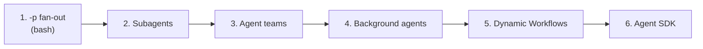

# Module 7.5: Công Cụ Điều Phối

> **Thời gian học**: ~35 phút
>
> **Yêu cầu trước**: Module 7.4 (Các Mẫu Agentic Loop)
>
> **Kết quả**: Sau module này, bạn sẽ fan-out một task qua nhiều file bằng `claude -p`, quản lý
> **background agent** (`--bg`, `claude agents`), và gọi tên được bậc thang của một công việc.

---

## 1. WHY — Tại Sao Cần Hiểu

Năm mươi file cần cùng một thay đổi máy móc. Bạn có thể dán năm mươi prompt vào một session rồi
nhìn context mục ruỗng, hoặc viết một dòng bash. Rồi công việc lớn lên — chạy cả tiếng, trên ba
repo, trong lúc bạn làm việc khác — và bash hết là câu trả lời.

Ở đây có một cái thang, và phần lớn người dùng không nhìn quá bậc họ học đầu tiên. Biết đủ sáu bậc
nghĩa là chọn được bậc rẻ nhất mà vẫn vừa.

---

## 2. CONCEPT — Ý Tưởng Cốt Lõi

### Cái thang


```mermaid
graph LR
    A["1. -p fan-out<br/>(bash)"] --> B["2. Subagents"]
    B --> C["3. Agent teams"]
    C --> D["4. Background agents"]
    D --> E["5. Dynamic Workflows"]
    E --> F["6. Agent SDK"]
```

1. **Headless fan-out** — `claude -p` trong shell loop: mỗi item một session nguội, không chia sẻ
   state, exit code kiểm tra được. Cho item độc lập, thay đổi máy móc.
2. **Subagent** — uỷ thác trong cùng một session; mỗi con trả về summary (Module 7.3).
3. **Agent team** — teammate có tên, task list chung, nhắn tin cho nhau (Module 7.3).
   ⚠️ Experimental, mặc định tắt. Cho research, review, module tách rời.
4. **Background agent** — session tách khỏi terminal, quản lý bằng `claude agents`. Cho việc dài
   mà bạn xem lại sau.
5. **Dynamic Workflows** — script JavaScript điều phối nhiều subagent cùng lúc, do một runtime
   chạy, khi job cần nhiều agent hơn mức một cuộc hội thoại điều phối nổi. Sẽ có module riêng.
6. **[Agent SDK](../../phase-11-automation-headless/02-claude-agent-sdk/)** — chương trình của bạn
   tự lái vòng lặp, khi việc điều phối *là* sản phẩm.

### Chọn bậc nào (S15)

| | Subagents | Agent teams | Workflows |
|---|---|---|---|
| Ai quyết định chạy gì tiếp | *"Claude, turn by turn"* | *"The lead agent, turn by turn"* | *"The script"* |
| Kết quả trung gian nằm đâu | *"Claude's context window"* | *"A shared task list"* | *"Script variables"* |
| Quy mô | *"A few delegated tasks per turn"* | *"A handful of long-running peers"* | *"Dozens to hundreds of agents per run"* |

Headless fan-out nằm dưới cả ba: shell quyết định, filesystem giữ kết quả, quy mô là số lần loop
chạy. Không gì miễn phí — mỗi `claude -p` trả tiền cho một context nguội, và một teammate là
nguyên một session nữa, mức mà trang costs ghi *"approximately 7x more tokens than standard
sessions when teammates run in plan mode"* (S15). Leo thang khi công việc cần, không phải vì bậc
đó mới hơn.

### Fan-out mặc định bị deny

`claude -p` khởi động mà không pre-authorize gì, nên thân vòng lặp phải nói rõ nó được làm gì:
`--allowedTools "Edit,Bash(git commit *)"` hoặc `--permission-mode acceptEdits`. Thiếu cái đó, mỗi
lần chạy không sửa gì, còn loop vẫn vui vẻ báo thành công trên năm mươi lần no-op.

> `(S1)`, `(S15)`: `docs/references/anthropic-sources.md`.

---

## 3. DEMO — Từng Bước

**Bước 1: Ba file cần cùng một thay đổi**

```bash
cat > src/strings.js << 'EOF'
export function slugify(s) { return s.toLowerCase().trim().replace(/\s+/g, '-'); }
EOF
# …và src/arrays.js (chunk), src/dates.js (isoDay)
git add src/*.js && git commit -q -m "add three helper modules"
```

**Bước 2: Fan-out bằng `-p` (S1)**

```bash
# docs: headless#allowed-tools · best-practices#parallel-sessions
for f in src/strings.js src/arrays.js src/dates.js; do
  echo "=== $f ==="
  claude -p "Add a one-line JSDoc comment above the exported function in $f, then commit just
that file with the message 'docs: jsdoc for $f'. Reply with OK or FAIL and nothing else." \
    --permission-mode default --allowedTools "Edit,Bash(git commit *)"
done
```

```text
# Output may vary
=== src/strings.js ===
OK

=== src/arrays.js ===
OK

=== src/dates.js ===
OK
```

```bash
git log --oneline -4
```

```text
# Output may vary
27c7597 docs: jsdoc for src/dates.js
f56e1ec docs: jsdoc for src/arrays.js
ec31a8e docs: jsdoc for src/strings.js
5c47bb5 add three helper modules
```

Ba session nguội, ba commit, không chia sẻ context. Hai chi tiết làm nó chạy được: prompt kết thúc
bằng một hợp đồng một từ (`OK`/`FAIL`), và `--allowedTools` nêu đúng những gì một lần chạy được
làm — sửa file đó, commit. `--permission-mode default` ép về hành vi gốc; máy mới cài cho kết quả
y hệt dù không có nó, trừ khi `settings.json` đặt `permissions.defaultMode`.

**Bước 3: Bắn một background agent**

```bash
# docs: cli-reference#bg · agent-view
claude --bg --name exports-audit --permission-mode default \
  "List every exported function in src/ as a Markdown table with columns file and function."
```

```text
# Output may vary
Starting background service…
backgrounded · 5db069a6 · exports-audit
  claude agents             list sessions
  claude attach 5db069a6    open in this terminal
  claude logs 5db069a6      show recent output
  claude stop 5db069a6      stop this session
```

Để ý cú pháp: `--bg` nhận prompt **positional**, từ chối `-p`, trả về ngay, in ra bốn lệnh bạn cần.

**Bước 4: Theo dõi rồi dừng nó**

```bash
claude agents --json
```

```json
[
  {
    "pid": 9102,
    "id": "5db069a6",
    "cwd": "/Users/luatnq/cc-lab",
    "kind": "background",
    "startedAt": 1790084514332,
    "sessionId": "5db069a6-905f-44ab-98a5-e17e7dcb6e19",
    "name": "exports-audit",
    "status": "idle",
    "state": "done"
  }
]
```

`# Output may vary` — chỉ hiện một entry; mảng này liệt kê mọi session trên máy, nên hãy lọc theo
`cwd`. Poll `state`: `working`, `blocked`, `done`, `failed`, `stopped`. `claude agents` trần mở
agent view tương tác và cần terminal thật; `claude logs <id>` in output gần nhất, `claude attach
<id>` mở session ngay tại đây.

```bash
claude stop 5db069a6
```

```text
# Output may vary
stopped 5db069a6
```

Đã bắn thì phải dừng — background agent sống lâu hơn shell sinh ra nó.

**Bước 5: Bậc 2 và 3 bạn đã có**

Nguyên tắc: ở trong một session (subagent, team — Module 7.3) khi công việc dùng chung context,
fan-out bằng `-p` khi các item độc lập, tách ra bằng `--bg` khi việc dài hơn sự chú ý của bạn. Với
CI, xem Module 11.4.

---

## 4. PRACTICE — Tự Thực Hành

### Bài 1: Thử ba file trước, rồi chạy cả bộ

**Mục tiêu**: Làm cho prompt fan-out an toàn trước khi nó đụng tới năm mươi file.

**Hướng dẫn**: chọn một thay đổi máy móc trải trên nhiều file. Chạy loop trên **ba** file, đọc
diff, sửa prompt, rồi chạy phần còn lại. Mỗi lần chạy trả lời `OK` hoặc `FAIL`.

**Kết quả mong đợi**: ba diff sạch — và một prompt tin được cho phần còn lại.

<details>
<summary>💡 Gợi ý</summary>

Anthropic nói về pattern này: *"Refine your prompt based on what goes wrong with the first 2-3
files, then run on the full set."* (S1)
</details>

<details>
<summary>✅ Lời giải</summary>

```bash
for f in $(cat files.txt); do
  claude -p "Migrate $f … Return OK or FAIL." --allowedTools "Edit,Bash(git commit *)" \
    || echo "$f" >> failed.txt
done
```

Commit từng file làm loop chạy lại được: file hỏng cách một lệnh `git revert`, `failed.txt` là
danh sách chạy lại.
</details>

### Bài 2: Bắn, poll, dừng

**Mục tiêu**: Chạy một job dài ở chế độ tách rời và quản lý nó từ CLI.

**Hướng dẫn**: bắn một audit read-only bằng `claude --bg --name <name>`, poll
`claude agents --json` tới khi `state` là `done`, đọc bằng `claude logs <id>`, rồi
`claude stop <id>`.

**Kết quả mong đợi**: `state` đi từ `working` → `done`; entry biến mất sau khi dừng.

<details>
<summary>💡 Gợi ý</summary>

Nhớ lọc mảng — nó liệt kê mọi session trên máy:
`claude agents --json | jq '[.[] | select(.cwd == "'"$PWD"'")]'`
</details>

<details>
<summary>✅ Lời giải</summary>

Background agent cần một quyền nó không có sẽ rơi vào `state: "blocked"` và **đợi**, chứ không
fail. Vì vậy job `--bg` nên read-only hoặc mang sẵn `--permission-mode` / `--allowedTools`: không
ai ngồi đó để bấm đồng ý.
</details>

---

## 5. CHEAT SHEET

| Lệnh / Tính năng | Mô tả | Ví dụ |
|---|---|---|
| `for f in …; do claude -p … done` | Fan-out, mỗi item một session | `--allowedTools "Edit,Bash(git commit *)"` |
| `--allowedTools` · `--permission-mode` | Pre-authorize thân vòng lặp | bắt buộc khi `-p` ghi |
| `--output-format json` | Kết quả máy đọc được | `\| jq` |
| `claude --bg "<prompt>"` | Bắn một background session | `--name` đặt nhãn; từ chối `-p` |
| `claude agents` | Agent view (tương tác) | `--json`, `--json --all`, `--cwd` |
| `claude attach <id>` · `claude logs <id>` | Mở tại đây · in output gần nhất | — |
| `claude stop <id>` | Dừng (alias `claude kill`) | nhớ dọn |
| `state` | `working`, `blocked`, `done`, `failed`, `stopped` | poll giá trị này |
| Subagent · agent team · Agent SDK | Bậc 2, 3 và 6 | Module 7.3, 11.2 |

---

## 6. PITFALLS — Lỗi Thường Gặp

| ❌ Sai | ✅ Đúng |
|---|---|
| "Bash là đủ cho mọi thứ" | Đủ cho item độc lập, máy móc; việc chung context cần subagent, việc dài tách rời cần `--bg` |
| `claude -p "fix $f"` không có permission flag | `-p` không pre-authorize gì: lần chạy không sửa gì mà vẫn tính tiền |
| Dùng agent team cho refactor cùng file | Team tốn hơn nhiều (S15) và ghi đè lên nhau; dùng một session |
| Output tự do rồi `grep` để parse | Kết thúc prompt bằng hợp đồng `OK`/`FAIL`, hoặc `--output-format json` |
| Chạy loop trên cả 50 file ngay từ đầu | Thử 2-3 file, đọc diff, rồi chạy cả bộ (S1) |
| `claude --bg -p "…"` | `--bg` nhận prompt positional và từ chối `-p` |
| Bỏ mặc background agent chạy | `claude agents --json`, `claude stop <id>` |

---

## 7. REAL CASE — Câu Chuyện Thực Tế

**Bối cảnh**: Một team fintech Việt Nam chạy pass kiểm tra chất lượng hằng đêm trên repo
microservices. Team offshore push lúc 18:00 giờ địa phương; một senior dev mất trọn tiếng đầu mỗi
sáng đọc tay đống diff đó, nên fix luôn trễ một ngày.

**Vấn đề**: Bản tự động đầu tiên là mỗi service một `claude -p` ghi ra file report — và report ra
rỗng. Không có gì được pre-authorize, nên mọi lần chạy bị deny trước khi ghi được dòng nào, còn
loop vẫn báo thành công vì `claude` thoát sạch.

**Giải pháp**: Hai thay đổi. Thân vòng lặp được thêm `--allowedTools` nêu đúng các tool một
reviewer cần, và mỗi lần chạy dùng `--output-format json` để wrapper kiểm tra kết quả thay vì tin
vào đường thoát. Các lần chạy theo service fan-out bằng `&` và `wait`; bước tổng hợp vẫn là một
session đọc các report, vì phần đó không độc lập. Tất cả chạy từ CI (Module 11.4).

**Kết quả**: Feedback giờ chờ sẵn team offshore lúc họ bắt đầu ngày làm việc. Pipeline vẫn là một
shell script — cái thang vốn đúng bậc, chỉ permission là sai.

**Bài học**: khi một fan-out "chạy được" mà không ra gì, hãy nghi permission chứ không phải prompt.

---

> **Hoàn thành Phase 7.** Bạn chọn được mức permission, chạy auto workflow có ranh giới, uỷ thác
> cho subagent và team, đóng vòng lặp bằng verifier, điều phối qua nhiều session.
>
> **Tiếp theo**:
> [Phase 8: Meta-Debugging](../../phase-08-meta-debugging/01-hallucination-detection/) →
