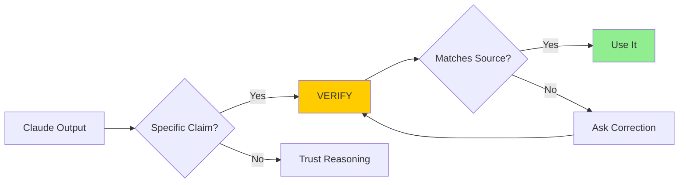

# Module 8.1: Phát hiện Hallucination

> **Thời gian học**: ~30 phút
>
> **Yêu cầu trước**: Module 7.5 (Công Cụ Điều Phối)
>
> **Kết quả**: Sau module này, bạn sẽ nhận ra hallucination pattern, biết verification technique, và build habit catch hallucination sớm.

---

## 1. WHY — Tại Sao Cần Hiểu

Claude tự tin bảo bạn: "Dùng `npm install super-validator` rồi gọi `superValidator.validateEmail()`". Bạn implement. Build fail. 30 phút debug. Kết quả? Package không tồn tại.

Hoặc tệ hơn: Claude suggest một Node.js API method nghe đúng lắm. Dev chạy okay. Production crash. Method đó không có thật.

Claude không signal uncertainty. Câu trả lời sai nghe equally confident như câu đúng. Hallucination detection là job của BẠN, không phải Claude.

---

## 2. CONCEPT — Ý Tưởng Cốt Lõi

### Hallucination Là Gì?

**Hallucination** = AI generate thông tin nghe hợp lý nhưng sai. Không phải Claude "nói dối" — nó thật sự "nghĩ" đúng. Xảy ra vì LLM predict likely token dựa trên pattern, không verify fact real-time.

Ví von: Claude như bạn học giỏi nhớ nhiều nhưng đôi khi nhớ nhầm. Nó tự tin nói "hàm này tên X" như đang nói đúng. Không cố ý sai — chỉ nhớ nhầm.

### Hallucination Categories

| Category | Example | Risk |
|----------|---------|------|
| Package names | `npm install validatorjs` (thật: `validator`) | High |
| API methods | `array.flatten()` (thật: `array.flat()`) | High |
| CLI flags | `claude --verbose` (có thể không tồn tại) | Medium |
| File paths | `src/utils/helpers.ts` (không tồn tại) | Medium |
| Version-specific | "Node 18 thêm feature X" (sai version) | High |
| Config syntax | tsconfig option không tồn tại | High |

### Tại Sao Claude Hallucinate?

Training data có nhiều thứ similar. Claude interpolate giữa các pattern. Nó không có internet để verify real-time. Kết quả: tên nghe đúng, nhưng sai.

### Trust But Verify

**Trust** reasoning và approach của Claude — nó excellent ở đây.
**Verify** specific fact: tên package, tên method, path, syntax, version.

Nguyên tắc: Càng specific claim → càng cần verify.

### Red Flags

Extra suspicious khi thấy:
- Package/method name nghe "perfect" cho use case của bạn
- Version number cụ thể ("added in v2.3.4")
- File path Claude chưa từng read
- CLI flag chưa run `--help` xác nhận



---

## 3. DEMO — Từng Bước

**Scenario**: Bạn cần validate số điện thoại Việt Nam. Hỏi Claude về library.

### Step 1: Nhận Suggestion

Prompt:
```
Recommend library validate số điện thoại VN
```

Claude trả lời:
```
Dùng package `vn-phone-validator`:
npm install vn-phone-validator

import { validateVNPhone } from 'vn-phone-validator';
validateVNPhone('0901234567');
```

**Red flag**: Tên package quá "perfect" cho use case.

### Step 2: Verify Package

```bash
$ npm info vn-phone-validator
```

Expected output:
```
npm ERR! code E404
npm ERR! 404 Not Found - GET https://registry.npmjs.org/vn-phone-validator
```

**Kết luận**: HALLUCINATION! Package không tồn tại.

### Step 3: Yêu Cầu Correction

Prompt Claude:
```
Package vn-phone-validator không tồn tại (404 từ npm).
Suggest real alternative. Tôi sẽ verify với npm info.
```

Claude correct:
```
Xin lỗi! Dùng `libphonenumber-js` — library thật:
npm install libphonenumber-js
```

### Step 4: Verify Lại

```bash
$ npm info libphonenumber-js
```

Output:
```
libphonenumber-js@1.10.x
Google's libphonenumber compiled to JavaScript...
```

**Kết luận**: EXISTS! Package thật.

### Step 5: Verify API Trước Khi Dùng

```bash
$ cat node_modules/libphonenumber-js/README.md | head -100
```

Hoặc yêu cầu Claude:
```
Read actual types/README của libphonenumber-js trước khi suggest API
```

**Workflow hoàn chỉnh**: Suspect → Verify → Correct → Re-verify → Use

---

## 4. PRACTICE — Tự Thực Hành

### Bài 1: Hallucination Hunting

**Goal**: Phát triển "mắt nghi ngờ" với AI suggestion.

**Instructions**:
1. Hỏi Claude suggest 3 packages cho một task (ví dụ: date formatting)
2. Chạy `npm info <package>` cho từng cái
3. Đếm bao nhiêu là hallucination

**Expected result**: Ít nhất 1 trong 3 có thể là hallucination.

<details>
<summary>💡 Hint</summary>

```bash
npm info moment        # Popular, likely real
npm info date-helper-pro  # Generic name, suspect
npm info dayjs         # Popular, likely real
```
</details>

<details>
<summary>✅ Solution</summary>

Verification process:
```bash
$ npm info moment
# ✓ Real - 20M weekly downloads

$ npm info dayjs
# ✓ Real - 16M weekly downloads

$ npm info date-fns
# ✓ Real - 23M weekly downloads
```

Nếu Claude suggest tên nghe "quá perfect" như `super-date-formatter` hoặc `vn-date-utils`, verify ngay — likely hallucination.
</details>

### Bài 2: API Verification

**Goal**: Verify API method trước khi implement.

**Instructions**:
1. Hỏi Claude về Node.js API bạn chưa quen (ví dụ: `fs.promises`)
2. Claude suggest method name
3. Check official docs tại nodejs.org
4. So sánh: Claude đúng hay sai?

### Bài 3: Path Verification

**Goal**: Verify file path Claude mention.

**Instructions**:
1. Hỏi Claude về structure của project bạn đang làm
2. Claude mention một file path
3. Run `ls <path>` hoặc `find . -name "filename"`
4. Có match không?

---

## 5. CHEAT SHEET

### Verification Commands

| Loại | Command | Ví dụ |
|------|---------|-------|
| npm package | `npm info <package>` | `npm info lodash` |
| Python package | `pip show <package>` | `pip show requests` |
| CLI flag | `<command> --help` | `git --help` |
| File path | `ls <path>` | `ls src/utils/` |
| File tìm | `find . -name "file"` | `find . -name "*.ts"` |
| Man page | `man <command>` | `man curl` |

### Red Flag Phrases

Khi Claude nói những câu này, VERIFY ngay:
- "You can use package X" → `npm info X`
- "Call X.method()" → Check official docs
- "File is at src/..." → `ls src/...`
- "Added in version X.Y.Z" → Check changelog
- "Flag --xyz does..." → `command --help`

### Verification Prompts

Yêu cầu Claude tự verify:
```
"Verify package exists trước khi suggest"
"Read actual types/README của package này"
"Run --help và show real flags"
"Check file exists trước khi reference"
```

---

## 6. PITFALLS — Lỗi Thường Gặp

| ❌ Sai Lầm | ✅ Đúng Cách |
|---|---|
| Trust package name không npm verify | LUÔN `npm info` trước `npm install` |
| Assume API method đúng | Check types hoặc official docs |
| Trust file path Claude mention | Verify với `ls` hoặc `find` |
| Không question confident claim | Confidence ≠ correctness |
| Blame Claude khi hallucinate | Known limitation, build verification vào workflow |
| Chỉ verify khi fail | Verify TRƯỚC implement, không phải sau |
| Dùng Claude verify Claude | Dùng external source: npm, docs, filesystem |

---

## 7. REAL CASE — Câu Chuyện Thực Tế

**Scenario**: Team startup Việt Nam integrate VNPay payment.

**Xảy ra**: Dev hỏi Claude về VNPay library. Claude suggest:
```javascript
npm install vnpay-nodejs
import VNPay from 'vnpay-nodejs';
const url = VNPay.createPaymentUrl(params);
```

Dev trust, implement 2 giờ. Build fail. Hóa ra:
- Package thật tên `vnpay` (không có `-nodejs`)
- Method thật là `buildPaymentUrl()` (không phải `createPaymentUrl`)

Thêm 2 giờ debug. Tổng mất: 4 giờ.

**Nên làm**:
```bash
$ npm info vnpay-nodejs
# npm ERR! 404 → HALLUCINATION!

$ npm search vnpay
# Found: vnpay

$ npm info vnpay
# ✓ Exists!

$ npm install vnpay
$ cat node_modules/vnpay/README.md
# Thấy actual API: buildPaymentUrl()
```

**Tiết kiệm**: 3+ giờ với 30 giây verification.

**Team rule sau đó**: "Package mới? `npm info` trước. API mới? Read types trước. Không ngoại lệ."

**Insight**: "5 giây `npm info` tiết kiệm hàng giờ debug hallucinated API. Verification là investment, không phải overhead."

---

> **Tiếp theo**: [Module 8.2: Phát hiện & Phá vòng lặp](../02-loop-detection/) →
