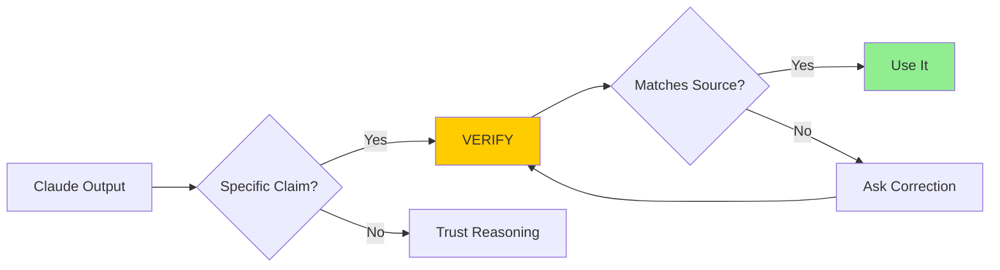

# Module 8.1: Phát hiện Hallucination

> **Thời gian học**: ~30 phút
>
> **Yêu cầu trước**: Module 7.5 (Công Cụ Điều Phối)
>
> **Kết quả**: Sau module này, bạn sẽ nhận ra hallucination pattern, biết verification command bắt
> được chúng, và build habit "check trước khi trust".

---

## 1. WHY — Tại Sao Cần Hiểu

Claude tự tin bảo bạn: "Dùng `npm install vnpay-nodejs`, rồi gọi `VNPay.createPaymentUrl(params)`".
Bạn implement. Build fail. 30 phút debug sau, package không tồn tại.

Hoặc tệ hơn: Claude suggest một method name nghe đúng lắm. Code compile được. Deploy production.
Crash — method đó chưa từng tồn tại.

Claude không signal uncertainty. Câu trả lời sai nghe equally confident như câu đúng. Hallucination
detection là job của BẠN, không phải Claude.

---

## 2. CONCEPT — Ý Tưởng Cốt Lõi

### Hallucination Là Gì?

**Hallucination** = AI generate thông tin nghe hợp lý nhưng sai. Không phải Claude "nói dối" — nó
thật sự predict token likely nhất dựa trên pattern trong training data, không tra cứu database
real-time. Vì vậy một tên package bịa có thể trông y hệt tên thật.

Ví von: Claude như bạn học giỏi nhớ nhiều nhưng đôi khi nhớ nhầm — và nói chi tiết sai với confidence
y hệt chi tiết đúng. Không cố ý sai, chỉ là giới hạn structural.

### Hallucination Categories

| Category | Example | Risk |
|----------|---------|------|
| Package names | `npm install vnpay-nodejs` (thật: `vnpay`) | High |
| API methods | `array.flattenDeep()` (native `Array` không có method này — đó là của lodash) | High |
| CLI flags | `git commit --auto-stage` (bịa) | Medium |
| File paths | `src/utils/helpers.ts` không tồn tại trong repo này | Medium |
| Version-specific | "Added in v2.3.4" (lịch sử bịa) | High |
| Config syntax | tsconfig option chưa từng tồn tại | High |

### Tại Sao Claude Hallucinate?

Training data có nhiều tên và pattern trông similar. Claude interpolate giữa các pattern đó. Nó
không có kết nối real-time tới registry của npm gắn sẵn trong weights — kể cả khi nó **có** tool
check được (xem dưới), nó vẫn phải thật sự dùng tool đó. Một cái tên "fit pattern" của hàng trăm
package thật trông valid y hệt với model như một cái nó đã thật sự thấy.

**Sửa lại so với bản course trước**: Claude Code không "mù" internet. Nó có tool `WebFetch`/
`WebSearch` và tự chạy được `npm view` hay `curl` khi được yêu cầu verify. Risk không nằm ở "Claude
không check được" — mà ở chỗ **nó thường không check trừ khi bạn yêu cầu verification rõ ràng**.
"Verify package này tồn tại trước khi suggest" là yêu cầu Claude thật sự làm được.

### Trust But Verify

**Trust** reasoning và approach của Claude — nó excellent ở đây.
**Verify** mọi claim cụ thể, check được: tên package, tên method, path, version.

Nguyên tắc: Claim càng cụ thể, càng check được → càng cần verify.

### Red Flags

Extra suspicious khi thấy:
- Tên package/method nghe "quá perfect" cho đúng use case của bạn
- Version number cụ thể ("added in v2.3.4")
- File path Claude chưa từng đọc
- CLI flag chưa chạy `--help` xác nhận


```mermaid
graph LR
    A[Claude Output] --> B{Specific Claim?}
    B -->|Yes| C[VERIFY]
    B -->|No| D[Trust Reasoning]
    C --> E{Matches Source?}
    E -->|Yes| F[Use It]
    E -->|No| G[Ask Correction]
    G --> C

    style C fill:#ffcc00
    style F fill:#90EE90
```

---

## 3. DEMO — Từng Bước

**Scenario**: Bạn integrate VNPay cho checkout e-commerce Việt Nam. Hỏi Claude về npm package đúng.

### Step 1: Nhận Suggestion

Claude trả lời:
```text
Dùng package `vnpay-nodejs`:
npm install vnpay-nodejs

import VNPay from 'vnpay-nodejs';
const url = VNPay.createPaymentUrl(params);
```

**Red flag**: tên nghe plausible (`<provider>-nodejs`), method name (`createPaymentUrl`) cũng là
guess "nghe hợp lý" cho một method như vậy.

### Step 2: Verify Package

```bash
$ npm view vnpay-nodejs
```

Output thật (chạy 2026-09-28):
```text
# Output may vary
npm error code E404
npm error 404 Not Found - GET https://registry.npmjs.org/vnpay-nodejs - Not found
npm error 404
npm error 404  'vnpay-nodejs@*' is not in this registry.
npm error 404
npm error 404 Note that you can also install from a
npm error 404 tarball, folder, http url, or git url.
npm error A complete log of this run can be found in: …
```

**Kết luận: HALLUCINATION.** Package không tồn tại. Bạn vừa tránh 30+ phút debug import lỗi.

### Step 3: Yêu Cầu Correction Có Verify

```text
`vnpay-nodejs` không tồn tại — npm view trả 404. Search npmjs.com tìm library
VNPay thật và cho tôi tên package chính xác để tự verify.
```

Claude correct:
```text
Xin lỗi, đúng rồi. Package thật là `vnpay`:
npm install vnpay
```

### Step 4: Verify Lại

```bash
$ npm view vnpay
```

Output:
```text
# Output may vary
vnpay@2.5.0 | MIT | deps: 1 | versions: 53
An open-source nodejs library support to payment with VNPay
https://vnpay.js.org

dependencies:
dayjs: ^1.11.13
```

**Kết luận: EXISTS.** Giờ check API thật trước khi dùng — đừng trust method name vội:

```bash
$ npm install vnpay
$ cat node_modules/vnpay/README.md | head -60
```

README cho thấy method thật là `buildPaymentUrl()`, không phải `createPaymentUrl()` Claude đoán
ban đầu.

### Step 5: Trust — Giờ Dùng Được

```bash
$ node -e "console.log(require('vnpay').VNPay ? 'export OK' : 'check README')"
```

**Workflow hoàn chỉnh**: Suspect → Verify → Correct → Re-verify → Trust. Hai phút `npm view` tiết
kiệm cả buổi debug, và ở case này còn tránh gọi nhầm một method chưa từng tồn tại.

---

## 4. PRACTICE — Tự Thực Hành

### Bài 1: Hallucination Hunting

**Goal**: Phát triển "mắt nghi ngờ" với AI suggestion.

**Instructions**:
1. Hỏi Claude suggest 3 npm package cho một task (ví dụ: date formatting)
2. Chạy `npm view <package>` cho từng cái, đếm bao nhiêu là hallucination

**Expected result**: Ít nhất 1 trong 3 fail verification.

<details>
<summary>✅ Solution</summary>

```bash
$ npm view moment    # ✓ Real — package lâu đời, phổ biến
$ npm view dayjs     # ✓ Real — dùng rộng rãi
$ npm view date-fns  # ✓ Real — dùng rộng rãi
```

Tên nghe "quá perfect" như `super-date-formatter` hoặc `vn-date-utils` — verify ngay, đó là pattern
hallucination phổ biến nhất.
</details>

### Bài 2: API Verification

**Goal**: Verify method tồn tại thật trước khi implement.

**Instructions**:
1. Hỏi Claude cách flatten sâu một nested array trong JavaScript, không dùng library
2. Claude có thể suggest `array.flattenDeep()` (native `Array` không có — đó là method của lodash,
   `_.flattenDeep`)
3. Check MDN `Array.prototype` reference cho method thật

<details>
<summary>✅ Solution</summary>

**Hallucinated**:
```javascript
// ❌ Không phải native Array method
const flat = nested.flattenDeep();
```

**Thật** (native, ES2019+):
```javascript
// ✅ Array.prototype.flat() với depth Infinity
const flat = nested.flat(Infinity);
```

**Verification source**: developer.mozilla.org/en-US/docs/Web/JavaScript/Reference/Global_Objects/Array/flat
</details>

### Bài 3: Path Verification

**Goal**: Verify file path trước khi trust.

**Instructions**: Hỏi Claude về structure của project, rồi tự chạy `ls <path>` hoặc
`find . -name "filename"` trên máy bạn và so sánh.

<details>
<summary>✅ Solution</summary>

```bash
# Claude nói: "Config nằm ở src/config/settings.ts"
$ ls src/config/settings.ts
ls: src/config/settings.ts: No such file or directory  # Output may vary

$ find . -name "settings.ts"
./src/lib/config.ts   # Output may vary — file thật ở path khác
```

Claude đoán theo convention phổ biến thay vì đọc structure thật của project.
**Lesson**: `ls`/`find` là ground truth — không bao giờ tin path chưa tự verify.
</details>

---

## 5. CHEAT SHEET

| Loại | Command | Ví dụ |
|------|---------|-------|
| npm package | `npm view <package>` | `npm view vnpay` |
| Python package | `pip show <package>` | `pip show requests` |
| Go module | `go list -m -versions <module>` | `go list -m -versions github.com/gin-gonic/gin` |
| CLI flag | `<command> --help` | `git --help` |
| File path | `ls <path>` | `ls src/utils/` |
| File tìm | `find . -name "file"` | `find . -name "*.ts"` |
| Man page | `man <command>` | `man curl` |

### Red Flag Phrases

Khi Claude nói những câu này, VERIFY ngay:
- "You can use package X" → `npm view X`
- "Call X.method()" → check official docs/source thật
- "File is at src/..." → `ls src/...`
- "Added in version X.Y.Z" → check changelog/release tags
- "Flag --xyz does..." → `command --help`

### Verification Prompts

Yêu cầu Claude tự verify:
```text
"Verify package này tồn tại trên npm trước khi suggest — tự chạy npm view."
"Read README/types thật của package này trước khi mô tả API."
"Run --help và show flag thật, đừng mô tả từ memory."
```

---

## 6. PITFALLS — Lỗi Thường Gặp

| ❌ Sai Lầm | ✅ Đúng Cách |
|---|---|
| Trust câu trả lời nghe confident | Confidence ≠ correctness. Claude nghe equally sure dù đúng hay sai. |
| Chỉ verify suggestion đầu tiên | Verify TẤT CẢ — hallucination có thể ẩn bất kỳ đâu trong list. |
| Dùng Claude verify Claude ("X có tồn tại không?") | Dùng external source: registry, docs, filesystem. |
| Assume "Claude không duyệt web được" nên khỏi verify | Claude có `WebFetch`/`WebSearch`, tự chạy được `npm view` — yêu cầu nó check thật. |
| Chấp nhận "chạy được một lần" là bằng chứng đúng | (S12) **Early victory declaration**: "chạy được" khác "đúng". Chạy lại và kiểm tra kỹ. |
| Trust một fix không có check độc lập | (S14) "Task verifier phải gần như hoàn hảo, nếu không Claude sẽ giải sai bài toán" — cho nó một check thật để chạy. |
| Batch-install nhiều package không check từng cái | List 3 package có thể có 2 thật, 1 hallucination. |

### Hallucination Nguy Hiểm Nhất: Security Config Giả

```yaml
# ❌ Docker security config hallucinated — parse OK, không làm gì cả
docker:
  security:
    safe_mode: true                 # không phải key thật
    auto_scan_vulnerabilities: true # không phải flag thật
```

Pass YAML validation, nhìn professional. Bảo vệ = 0. Luôn cross-check config key security với
official reference của tool trước khi deploy.

---

## 7. REAL CASE — Câu Chuyện Thực Tế

**Scenario**: Team startup Việt Nam integrate VNPay cho checkout mobile banking.

**Xảy ra**: Dev hỏi Claude npm package cho VNPay. Claude suggest:
```javascript
npm install vnpay-nodejs
import VNPay from 'vnpay-nodejs';
const url = VNPay.createPaymentUrl(params);
```

Dev trust — tên match convention của VNPay, Claude giải thích checkout flow rõ ràng (càng làm dev
tin tưởng sai). Sau 2 giờ implement, build vẫn không resolve được import.

**Root cause tìm ra**: `npm view vnpay-nodejs` trả 404. Package thật là `vnpay`, export thật là
`buildPaymentUrl()`, không phải `createPaymentUrl()`. Cả tên package lẫn tên method đều là
hallucination — guess hợp lý dựa theo style naming của VNPay, không phải fact đã verify.

**Chi phí**: khoảng 4 giờ tổng (2 giờ implement sai package, 2 giờ debug tại sao không resolve) so
với 30 giây một lệnh `npm view`.

**Fix team áp dụng** (thêm vào CLAUDE.md):
```markdown
## AI Output Verification Protocol
Trước khi implement bất kỳ package/API nào AI suggest:
1. `npm view <package>` — confirm package thật
2. Đọc README/types thật của package trước khi dùng method name được suggest
3. Với integration payment/tài chính: bắt buộc reviewer thứ hai trước khi merge
```

**Kết quả**: team giờ chạy `npm view` phản xạ cho mọi package AI suggest. Integration tiếp theo bắt
được 3 hallucinated config field ngay lúc verify — trước khi tốn dù chỉ một phút debug.

**Team rule sau đó**: "Package mới? `npm view` trước. API mới? Read types trước. Không ngoại lệ."

---

### Key Takeaways

1. **Hallucination là hành vi bình thường của model**, không phải bug — đó là cách pattern-completion hoạt động.
2. **Confidence không tương quan với accuracy.** Claude nghe equally sure dù đúng hay sai.
3. **Verification là non-negotiable** cho package, API, security config, và external integration.
4. **Claude tự check được** — WebFetch, WebSearch, shell command đều có. Yêu cầu nó verify thay vì assume nó không làm được.
5. **Cho nó (và chính bạn) một check thật để chạy.** Một test thật sự pass đáng tin hơn một lời tự thuật thành công (S12, S14).

Hai phút `npm view` đáng giá hơn hai giờ debug, luôn luôn.

---

> **Tiếp theo**: [Module 8.2: Phát hiện & Phá vòng lặp](../02-loop-detection/) →
