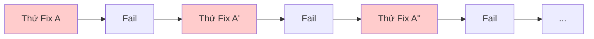

# Module 8.2: Phát hiện & Phá vòng lặp

> **Thời gian học**: ~30 phút
>
> **Yêu cầu trước**: Module 8.1 (Phát hiện Hallucination), Module 7.4 (Các mẫu Agentic Loop)
>
> **Kết quả**: Sau module này, bạn sẽ nhận ra stuck loop pattern, biết intervention strategy, và break loop hiệu quả mà không mất progress.

---

## 1. WHY — Tại Sao Cần Hiểu

Claude đã chạy 15 phút. Token counter leo dần. Bạn thấy cùng error message flash qua 3 lần. Claude cứ nói "Let me try a different approach" nhưng approach nào trông cũng giống nhau. Đã burn $5 token mà bug vẫn còn.

Stuck loop là trap tốn token và thời gian. Ai cũng gặp — beginner lẫn expert. Khác biệt? Expert detect và break NHANH. Họ không đợi 10 iteration hy vọng "lần sau được". Họ nhận ra pattern sau 3 lần và intervene.

Ví von: Claude như người đang cố mở cửa — cứ đẩy đẩy đẩy mà không nhận ra cửa phải kéo. Bạn phải là người nói "Dừng lại. Thử kéo xem."

---

## 2. CONCEPT — Ý Tưởng Cốt Lõi

### Stuck Loop Là Gì?

**Stuck loop** = Claude cứ thử similar solution mà không progress. KHÔNG giống healthy iteration (có converge toward solution). Stuck loop quay tại chỗ.

Đặc điểm:
- Same hoặc similar error lặp lại
- File bị edit nhiều lần với variation nhỏ
- Không có measurable progress
- Token tăng mà output không đổi

### Stuck Loop Pattern



Note: A' ≈ A ≈ A'' — variation nhỏ của cùng approach, đều fail cùng kiểu.

### Detection Signal

| Signal | Reliability | Example |
|--------|-------------|---------|
| Same error 3+ lần | Very High | "TypeError: X is not a function" lặp |
| Same file edit lặp | High | `userService.ts` modified 4 lần |
| "Try another approach" nhưng code giống | High | Variation nhỏ của cùng fix |
| Token spike | Medium | `/cost` tăng nhanh |
| Thời gian không progress | Medium | 5+ phút, cùng problem |
| Claude xin lỗi liên tục | Medium | "Sorry, let me try again" |

### Tại Sao Loop Bị Stuck?

1. **Hiểu sai problem**: Claude đang solve wrong problem
2. **Thiếu information**: File chưa read, error chưa thấy
3. **Task impossible**: Conflicting requirement không thể satisfy
4. **Context polluted**: Attempt cũ đang confuse attempt mới

### 3-Strike Rule

**Nếu cùng approach fail 3 lần với kết quả similar → intervene ngay.** Đừng đợi 5 hay 10. Ba là pattern — sau đó thêm attempt hiếm khi giúp.

### Loop Breaking Strategy (Escalation Ladder)

| Level | Strategy | Khi Nào Dùng |
|-------|----------|--------------|
| 1 | **Redirect** | "Stop. Thử approach hoàn toàn khác." |
| 2 | **Information inject** | "Context bạn có thể đang thiếu: ..." |
| 3 | **Decompose** | "Quá phức tạp. Giải quyết [phần nhỏ] trước." |
| 4 | **Context refresh** | `/compact` để clean up |
| 5 | **Nuclear reset** | `/clear` và bắt đầu lại với lesson learned |
| 6 | **Human takeover** | Một số thứ cần human debug |

---

## 3. DEMO — Từng Bước

**Scenario**: Claude đang fix TypeScript type error mà cứ lặp lại.

### Step 1: Observe Loop Hình Thành

```
Claude: Tôi sẽ fix type error trong userService.ts...
[Edit file]

Error: Type 'string' is not assignable to type 'User'

Claude: Để tôi adjust type annotation...
[Edit cùng file]

Error: Type 'string' is not assignable to type 'User'

Claude: Để tôi thử casting...
[Edit cùng file]

Error: Type 'string' is not assignable to type 'User'
```

### Step 2: Nhận Ra Stuck Loop Signal

Checklist:
- ✅ Same error 3 lần
- ✅ Same file bị edit lặp lại
- ✅ Approach đều là variation của type adjustment

**Verdict**: Đây là stuck loop. Cần intervene.

### Step 3: Intervene Với Redirect

Thay vì để Claude thử lần 4, bạn ngắt:

```
Stop. Bạn đã thử type adjustment 3 lần và đều cùng error.

Step back. Trước khi fix tiếp, giải thích:
1. Data thực sự flowing vào function này là gì?
2. Giá trị 'string' đến từ đâu?
3. Type definition đúng hay data sai?
```

**Tại sao hiệu quả**: Bạn yêu cầu ANALYSIS thay vì thêm ATTEMPT. Đổi từ "fix symptom" sang "understand cause."

### Step 4: Claude Reframe Problem

```
Claude: Đúng rồi. Để tôi trace data flow...

[Read calling code]

Tìm ra rồi! API response trả `user: string` (chỉ user ID),
nhưng function expect `user: User` (full object).

Fix không phải type casting — là fetch full user object
trước khi gọi function này.
```

### Step 5: Verify Escape Loop

```bash
$ npm run typecheck
```

Output:
```
No errors found.
```

**Key insight**: Loop break vì FRAMING đổi. Claude stuck trong "làm sao fix type" trong khi problem thật là data flow. Intervention redirect từ "type work thế nào?" sang "data thực sự là gì?"

---

## 4. PRACTICE — Tự Thực Hành

### Bài 1: Loop Simulation

**Goal**: Practice nhận ra stuck loop signal.

**Instructions**:
1. Đưa Claude problem tricky (conflicting requirement thường gây loop)
2. Watch for stuck loop signal
3. Đếm iteration trước khi intervene
4. Practice redirect: "Stop. Giải thích đã thử gì và tại sao không work."

**Expected result**: Nhận ra loop trong 3-4 iteration và intervene hiệu quả.

<details>
<summary>💡 Hint</summary>

Prompt "trap" thường gây loop:
- "Làm function này vừa sync vừa async"
- "Add feature X mà không change code hiện tại"
- "Fix bug" (không cung cấp error detail)

Watch signal: error lặp, same file edit, apologetic language.
</details>

### Bài 2: 3-Strike Drill

**Goal**: Practice 3-strike rule.

**Instructions**:
1. Chọn bug thật trong codebase
2. Để Claude thử fix — đếm attempt
3. Sau strike 3 (3 similar failure), intervene dùng escalation ladder
4. Note strategy nào work

<details>
<summary>✅ Solution</summary>

**Effective intervention pattern**:

Sau 3 type error:
```
Stop. Type error cứ lặp. Trước khi fix tiếp:
1. console.log actual runtime value
2. Compare với type expect
3. Nói tôi cái nào sai
```

Sau 3 test failure:
```
Stop. Check assumption:
1. Test actually assert gì?
2. Function actually return gì?
3. Cái nào cần change?
```

Key: Yêu cầu Claude ANALYZE trước khi attempt lại.
</details>

### Bài 3: Context Refresh

**Goal**: Practice dùng `/compact` để break loop.

**Instructions**:
1. Vào stuck loop intentionally
2. Run `/compact`
3. Reframe problem với wording mới
4. Compare behavior trước/sau refresh

**Expected result**: Sau `/compact`, Claude thường approach khác vì old failed attempt bị compress khỏi active context.

---

## 5. CHEAT SHEET

### Stuck Loop Signal

| Signal | Action |
|--------|--------|
| Same error 3+ lần | 🚨 Intervene NGAY |
| Same file edit 3+ lần | 🚨 Intervene NGAY |
| "Let me try again" với code giống | ⚠️ Watch closely |
| Token burn không progress | ⚠️ Check `/cost` |

### Intervention Escalation Ladder

1. **Redirect**: "Stop. Approach khác."
2. **Information**: "Bạn có thể đang thiếu: ..."
3. **Decompose**: "Giải quyết [phần nhỏ] trước."
4. **Refresh**: `/compact`
5. **Reset**: `/clear`
6. **Human**: Bạn take over

### Intervention Prompt

```
"Stop. Bạn đã thử X ba lần. Giải thích tại sao fail."

"Trước khi fix, analyze: data này actually từ đâu?"

"Step back. Problem có đúng như mình nghĩ không?"

"Forget attempt trước. Fresh approach: ..."
```

### Emergency Command

| Command | Effect |
|---------|--------|
| `Ctrl+C` | Emergency stop |
| `/cost` | Check token burn |
| `/compact` | Compress context, giữ decision |
| `/clear` | Nuclear reset (mất progress) |

---

## 6. PITFALLS — Lỗi Thường Gặp

| ❌ Sai Lầm | ✅ Đúng Cách |
|-----------|--------------|
| Để loop chạy hy vọng "lần sau được" | 3-strike rule. Intervene sau 3 similar failure. |
| Intervene quá sớm (sau 1 retry) | Iteration có healthy. Đợi pattern, không phải single failure. |
| "Try harder" intervention ("Fix đi!") | Đổi APPROACH, không phải intensity. Hỏi analysis. |
| `/clear` là phản ứng đầu tiên | Escalate: redirect → refresh → reset. `/clear` mất progress. |
| Không check `/cost` trong session dài | Monitor `/cost`. Stuck loop burn token nhanh. |
| Blame Claude ("Sao không fix được?") | Loop = misalignment. Provide info, change angle. |
| Ignore confusion của chính bạn | Bạn không hiểu tại sao fail → Claude cũng không. |

---

## 7. REAL CASE — Câu Chuyện Thực Tế

**Scenario**: Team Việt Nam debug authentication flow. Claude cứ cố fix "token expired" error bằng adjust token refresh logic. 7 attempt, 45 phút, $8 token.

**Xảy ra**: Mỗi "fix" là variation của token refresh timing — adjust expiry window, add buffer, refresh sớm hơn. Same error mỗi lần. Claude stuck trong "token refresh" mental model.

**Break**: Sau 7 attempt, dev finally nói:

```
Stop. Forget token refresh. Read ACTUAL error log, không chỉ
error message. Full context là gì?
```

**Phát hiện**: Error log show token không expired — nó INVALID. Staging environment đang dùng API key khác production. Token refresh không bao giờ fix invalid key được.

**Lesson**: Loop stuck vì FRAMING sai. "Expired" vs "Invalid" — problem hoàn toàn khác cần solution hoàn toàn khác. Break loop cần đổi frame, không phải try harder trong frame cũ.

**Team rule sau đó**: "Sau 3 similar failure, không try lại. Hỏi 'Assumption nào đang sai?'"

**Cost của waiting**: $8 và 45 phút vs intervene lúc attempt 3 (~$3, ~15 phút). Early detection matters.

---

> **Tiếp theo**: [Module 8.3: Context bị lẫn](../03-context-confusion/) →
