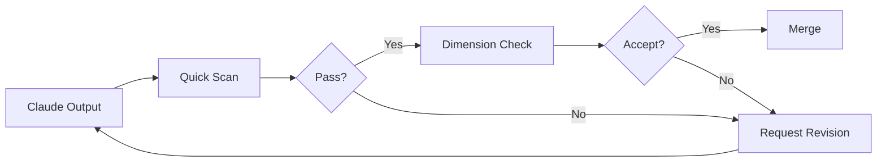

# Module 8.4: Đánh giá chất lượng

> **Thời gian học**: ~30 phút
>
> **Yêu cầu trước**: Module 8.3 (Context bị lẫn)
>
> **Kết quả**: Sau module này, bạn sẽ có systematic approach assess Claude output, personal checklist cho acceptance criteria, và biết khi nào push for better vs accept "good enough."

---

## 1. WHY — Tại Sao Cần Hiểu

Claude produce code. Chạy được. Test pass. Merge. Tuần sau, đồng nghiệp hỏi "Sao function này 200 dòng?" Bạn nhận ra đã accept output đầu tiên mà không thật sự EVALUATE nó.

Code worked nhưng không good. Quality assessment bridge gap giữa "it works" và "it's good." Không có nó, bạn đang đổi development speed lấy technical debt.

---

## 2. CONCEPT — Ý Tưởng Cốt Lõi

### Quality Dimension cho Claude Output

| Dimension | Câu hỏi | Red Flag |
|-----------|---------|----------|
| **Correctness** | Làm đúng yêu cầu? | Missing requirement, sai behavior |
| **Completeness** | Còn TODO không? | `// TODO`, incomplete handler, thiếu edge case |
| **Consistency** | Match codebase pattern? | Naming khác, pattern khác existing code |
| **Cleanliness** | Code maintainable? | 200-line function, no comment, duplication |
| **Appropriateness** | Solution phù hợp? | Over-engineered cho task đơn giản, under-engineered cho complex |

### Assessment Loop



### Quick Scan Checklist (30 giây)

Trước khi deep analysis, gut check 30 giây:

- [ ] Length reasonable? (không quá ngắn hay dài bất thường)
- [ ] Familiar pattern? (giống rest of codebase)
- [ ] Không TODO/placeholder?
- [ ] Không commented-out code?
- [ ] Make sense at first glance?

Quick Scan fail → request revision ngay. Đừng waste time deep assessment.

### Deep Assessment (khi Quick Scan pass)

Run automated check:
```bash
npm run lint      # Style issue
tsc --noEmit      # Type error
npm test          # Functionality
git diff          # Review actual change
```

Sau đó ask Claude self-review:
- "Senior dev sẽ criticize gì?"
- "Edge case nào có thể fail?"
- "Có cách đơn giản hơn không?"

### "Good Enough" Decision

Không phải code nào cũng cần perfect.

| Risk Level | Standard | Ví dụ |
|------------|----------|-------|
| **High** | Fix mọi issue | Payment, authentication, data handling |
| **Medium** | Fix critical issue | User-facing feature |
| **Low** | Works correctly, note tech debt | Internal tool, prototype |

Factor quyết định: Risk level, time pressure, permanent vs temporary.

---

## 3. DEMO — Từng Bước

**Scenario**: Claude implement user search feature. Assess systematically.

### Step 1: Quick Scan

Claude produce ~100 dòng search code. Quick scan:

- [x] Length: ~100 dòng — reasonable cho search
- [x] Pattern: Dùng async/await như codebase
- [x] TODO: Không thấy
- [x] First glance: Coherent

Quick Scan pass. Đi deeper.

### Step 2: Run Automated Check

```bash
$ npm run lint
```

Output:
```
No errors found.
```

```bash
$ tsc --noEmit
```

Output:
```
No errors.
```

```bash
$ npm test
```

Output:
```
PASS src/services/userService.test.ts
  ✓ should search users by name
  ✓ should return empty array for no matches
```

Automated pass. Nhưng đi deeper.

### Step 3: Review với git diff

```bash
$ git diff --stat
```

Output:
```
 src/services/userService.ts | 100 +++++++++++++++++++++++++++++
 src/routes/users.ts         |  20 ++++++
 2 files changed, 120 insertions(+)
```

Review code: Notice large function, no pagination, no rate limiting.

### Step 4: Ask Claude Self-Review

```
Bạn: Review search implementation vừa viết.
Senior dev sẽ criticize gì?

Claude: Feedback hữu ích:
1. No pagination — có thể return 10,000 result
2. No rate limiting — dễ bị abuse
3. Search query không sanitized — potential injection
4. No caching — same search hit DB mỗi lần
```

Self-review surface real issue mà test và linter miss.

### Step 5: Decide — Accept hay Revise?

Categorize issue:

| Issue | Priority | Action |
|-------|----------|--------|
| No pagination | HIGH | Fix now |
| No sanitization | HIGH | Fix now |
| No rate limiting | MEDIUM | Fix later |
| No caching | LOW | Premature optimization |

```
Bạn: Feedback tốt. Add:
1. Pagination (limit 50 per page)
2. Query sanitization

Rate limiting và caching để sau.
```

**Result**: Catch real issue trước merge qua systematic assessment.

---

## 4. PRACTICE — Tự Thực Hành

### Bài 1: Quick Scan Training

**Goal**: Build personal Quick Scan checklist.

**Instructions**:
1. Bảo Claude implement feature (ví dụ: "Add email validation to signup")
2. Time Quick Scan (target: <30 giây)
3. Note những gì bạn instinctively check
4. Viết ra personal Quick Scan checklist

**Expected result**: Personalized 5-7 item checklist dùng consistently.

<details>
<summary>💡 Hint</summary>

Good Quick Scan item:
- File length vs expected complexity
- Import (familiar package?)
- Function name (match convention?)
- Error handling (có try/catch?)
- Magic number hay hardcoded value
</details>

### Bài 2: Self-Review Prompt

**Goal**: Tìm self-review prompt work best.

**Instructions**:
1. Get code từ Claude
2. Ask Claude review với các prompt khác nhau:
   - "Code này có vấn đề gì?"
   - "Senior dev sẽ đổi gì?"
   - "Edge case nào fail?"
   - "Có cách đơn giản hơn?"
3. Note prompt nào produce actionable feedback nhất

<details>
<summary>✅ Solution</summary>

**Most effective prompt** (theo thứ tự):

1. **"Senior dev sẽ criticize gì?"** — Get architectural và style feedback
2. **"Edge case nào fail?"** — Surface missing error handling
3. **"Có cách đơn giản hơn?"** — Catch over-engineering

Kém hiệu quả:
- "Có gì sai?" — Quá vague, generic response
- "Review code này" — Không direction, unfocused
</details>

### Bài 3: Good Enough Decision

**Goal**: Practice categorize issue by priority.

**Instructions**:
1. Get code cho medium-complexity feature
2. List all issue tìm được
3. Categorize: Must Fix Now / Fix Later / Acceptable

**Expected result**: Prioritized list với clear reasoning.

---

## 5. CHEAT SHEET

### Quick Scan Checklist

- [ ] Length reasonable
- [ ] Familiar pattern
- [ ] Không TODO/placeholder
- [ ] Không commented-out code
- [ ] Make sense at first glance

### Automated Check

```bash
npm run lint      # Style issue
tsc --noEmit      # Type error
npm test          # Functionality
git diff          # Review change
```

### Self-Review Prompt

```
"Senior dev sẽ criticize gì?"
"Edge case nào fail?"
"Có cách đơn giản hơn?"
"Nếu input rất lớn thì sao?"
```

### Good Enough Matrix

| Risk Level | Standard | Action |
|------------|----------|--------|
| High (payment, auth) | Fix mọi issue | Thorough review required |
| Medium (user feature) | Fix critical | Quick Scan + automated |
| Low (internal/prototype) | Works correctly | Quick Scan, note tech debt |

---

## 6. PITFALLS — Lỗi Thường Gặp

| ❌ Sai Lầm | ✅ Đúng Cách |
|-----------|-------------|
| Accept output không review | At minimum: Quick Scan mỗi lần |
| Chỉ run automated check | Linter miss design issue. Human review required. |
| Perfectionism cho low-risk code | Good enough IS good enough cho prototype |
| Accept "works" cho high-risk | High-risk code cần thorough review |
| Không dùng Claude review code của Claude | Self-review prompt catch real issue |
| Check quality chỉ cuối cùng | Assess during development, không phải chỉ sau |
| Ignore gut feeling "this seems wrong" | Feel off → investigate trước khi accept |

---

## 7. REAL CASE — Câu Chuyện Thực Tế

**Scenario**: Team fintech Việt Nam build transaction history feature. Claude produce working code, test pass, nhìn ổn.

**Xảy ra**: Code lên production. User có 50,000+ transaction trigger endpoint. Không pagination. Không date range limit. Service cố load all transaction vào memory. Memory spike. Crash. 30 phút downtime.

**Bị miss**:
- No pagination (return ALL transaction)
- No date range validation (query 10 năm data được)
- No limit on response size

**Nên làm**:
1. Quick Scan flag "100 dòng seems short cho large data handling"
2. Self-review prompt: "Nếu có 50,000 transaction thì sao?"
3. Claude respond: "Load all vào memory. Cần pagination."

**Result**: Team add assessment workflow. Quick Scan + self-review prompt thành standard. PR checklist giờ có edge case review. Estimated $5,000 transaction không mất.

---

> **Tiếp theo**: [Module 8.5: Quy trình khẩn cấp](../05-emergency-procedures/) →
