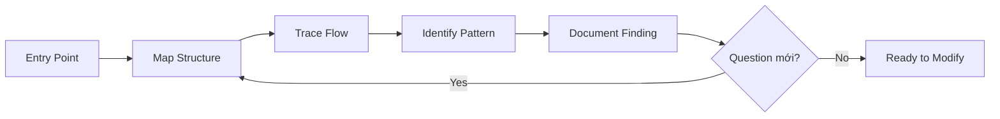

# Module 9.1: Khai quật code cũ

> **Thời gian học**: ~35 phút
>
> **Yêu cầu trước**: Phase 8 (Meta-Debugging)
>
> **Kết quả**: Sau module này, bạn sẽ có systematic approach hiểu legacy codebase, biết question nào ask, và build mental model từ code lạ.

---

## 1. WHY — Tại Sao Cần Hiểu

Job mới, codebase mới. 500,000 dòng code. Không documentation đáng đọc. Assigned bug trong `PaymentProcessor.java` — 2,000 dòng với method tên `process()`, `handle()`, `doIt()`. Không biết làm gì.

Bản năng là đọc line by line. Sẽ mất tuần.

Claude Code accelerate 10x — nếu biết cách direct. Archeology Mode là systematic approach để excavate understanding từ legacy code. Discovery trước modification.

---

## 2. CONCEPT — Ý Tưởng Cốt Lõi

### Archeology Mode Là Gì?

Archeology Mode là systematic exploration codebase lạ. Goal: build mental model TRƯỚC KHI change. Claude là exploration partner, không chỉ code writer. Discovery-oriented, không modification-oriented.

Như nhà khảo cổ đào di tích — không đào bừa mà có phương pháp: layer by layer, document finding, build picture toàn cảnh từ mảnh vỡ.

### Excavation Framework



### Excavation Layers

| Layer | Questions | Prompt |
|-------|-----------|--------|
| **Project** | Project làm gì? Tech stack? | "Read package.json, README. Summarize purpose." |
| **Module** | Major component? | "List directories in src/. Explain each." |
| **File** | File này làm gì? Key function? | "Read [file]. Explain purpose, main functions." |
| **Function** | Input, output, side effect? | "Explain [function]. Input, output, side effect?" |
| **Line** | Tại sao dòng này? | "Why line 45 doing X? What break if removed?" |

### Key Archeology Prompts

Copy-paste ready:
- "Explain codebase like I'm new developer joining team."
- "What are 5 most important files và why?"
- "Trace execution from [entry] to [output]."
- "What does [function] do? Side effects?"
- "Why might original developer written this way?"
- "What cần understand để safely modify [component]?"

### Git as Time Machine

```bash
git log --oneline -20 [file]   # Recent history
git blame [file]               # Ai viết dòng nào, khi nào
git show [commit]              # Commit đó change gì
```

Ask Claude: "Read git blame output này. History nói gì về evolution của file?"

---

## 3. DEMO — Từng Bước

**Scenario**: Inherited e-commerce backend. Cần hiểu order processing system.

### Step 1: Project Layer — Big Picture

```text
Bạn: Read package.json, README.md, và main entry point.
Cho tôi 2-paragraph summary project làm gì và tech stack.

Claude: Đây là e-commerce backend built với Express.js và PostgreSQL.
Handle product catalog, shopping cart, order processing, và payment
integration với Stripe và PayPal. Codebase khoảng 4-5 năm based on
dependency version...
```

### Step 2: Module Layer — Map Territory

```text
Bạn: List directories dưới src/. Explain each likely chứa gì.

Claude:
- src/routes/ — API endpoint definition
- src/services/ — Business logic (orderService, paymentService, etc.)
- src/models/ — Database model (Sequelize ORM)
- src/utils/ — Shared utility
- src/middleware/ — Express middleware (auth, logging, etc.)
```

### Step 3: File Layer — Zoom vào Target

```text
Bạn: Read src/services/orderService.js. Đây là cái cần modify.
Explain purpose, main function, và dependency.

Claude: File này handle order lifecycle:
- createOrder() — Tạo order mới từ cart
- processPayment() — Integrate với paymentService
- updateOrderStatus() — State machine cho order status
Dependencies: paymentService, inventoryService, emailService
Side effects: Send email, update inventory, log analytics
```

### Step 4: Function Layer — Understand Cụ Thể

```text
Bạn: Explain processPayment() detail. Input, output, side effect?
Có thể go wrong gì?

Claude:
Input: orderId, paymentMethod, amount
Process:
1. Validate order exist và ở 'pending' state
2. Call paymentService based on method (Stripe/PayPal)
3. Update order status theo payment result

Side effects:
- Write vào payment_transactions table
- Send confirmation email on success
- Log analytics

Potential issue:
- Không có retry logic nếu payment service timeout
- Race condition possible nếu call hai lần cùng order
```

### Step 5: Document Findings

```text
Bạn: Based on exploration, tạo brief architecture document
cho order processing system. Tôi sẽ add vào docs.
```

**Result**: Hiểu full order system trong một session, ready modify safely.

---

## 4. PRACTICE — Tự Thực Hành

### Bài 1: New Codebase Onboarding

**Goal**: Practice Excavation Framework trên code lạ.

**Instructions**:
1. Tìm open-source project chưa thấy bao giờ (GitHub trending work)
2. Clone nó
3. Dùng Excavation Framework: Project → Module → File → Function
4. Time yourself: explain được project trong 30 phút?

<details>
<summary>💡 Hint</summary>

Start với:
```text
"Read package.json (hoặc equivalent) và README.
Summarize: project làm gì, tech stack gì?"
```

Rồi map structure:
```text
"List main directories. Mỗi cái chứa gì?"
```
</details>

### Bài 2: Git Time Travel

**Goal**: Dùng git history hiểu code evolution.

**Instructions**:
1. Pick file phức tạp trong project nào đó
2. Run `git log --oneline -20 [file]`
3. Ask Claude: "Read git history này. Story nào về file evolution?"
4. Pick commit interesting, run `git show [commit]`, ask Claude explain

### Bài 3: Explain Like I'm New

**Goal**: Practice targeted archeology prompt.

**Instructions**:
1. Pick function không hiểu
2. Prompt: "Explain [function] like I'm new developer. Cần biết gì để modify safely?"
3. Follow up: "Question nào nên ask trước khi change code này?"

<details>
<summary>✅ Solution</summary>

Effective follow-up:
- "Function nào khác call cái này?"
- "Test nào cover function này?"
- "Nếu function fail thì sao?"
- "Có hidden assumption nào trong code?"
</details>

---

## 5. CHEAT SHEET

### Excavation Framework

1. **Project** → **Module** → **File** → **Function** → **Line**
2. Start broad, zoom in as needed
3. `/compact` sau mỗi layer exploration

### Key Archeology Prompts

```text
"Explain codebase like I'm new developer."
"What are 5 most important files?"
"Trace execution from [A] to [B]."
"What does [function] do? Side effects?"
"Why written this way?"
"Cần biết gì để safely modify [X]?"
```

### Git Time Machine

```bash
git log --oneline -20 [file]   # Recent history
git blame [file]               # Ai viết gì
git show [commit]              # Change gì
```

### Context Management

- `/compact` sau mỗi layer exploration
- Fresh session cho area mới của codebase
- Document finding as you go

---

## 6. PITFALLS — Lỗi Thường Gặp

| ❌ Sai Lầm | ✅ Đúng Cách |
|-----------|-------------|
| Modify trước khi understand | Archeology FIRST. Hiểu trước change. |
| Đọc code line-by-line | Claude summarize. Targeted question. |
| Ask "explain everything" | Layer by layer: Project → Module → File → Function |
| Ignore git history | Git blame và log kể chuyện. Include them. |
| Trust Claude hoàn toàn | Verify critical claim. Claude cũng có thể misinterpret. |
| Không document finding | Write down. Future you sẽ cảm ơn. |
| Explore mọi thứ cùng lúc | Focus cái cần modify. Targeted archeology. |

---

## 7. REAL CASE — Câu Chuyện Thực Tế

**Scenario**: Developer Việt Nam join fintech company. Assigned fix bug trong transaction reconciliation — 8-year-old codebase, original team đã đi, 50,000 dòng Java.

**Cách cũ (tuần 1)**: Đọc code manual, ghi note, confused bởi undocumented business rule. Progress: hiểu khoảng 20% sau 5 ngày.

**Archeology Mode (tuần 2)**:
- Ngày 1: Project layer — Claude summarize entire architecture trong 2 giờ
- Ngày 2: Module layer — Map tất cả service và interaction
- Ngày 3: File layer — Deep dive ReconciliationService.java
- Ngày 4: Function layer — Hiểu reconcile() và 15 helper method
- Ngày 5: Tìm bug — edge case trong currency conversion không handle

**Kết quả**: 5 ngày với Claude vs estimate 3 tuần manual. Developer document finding, tạo architecture diagram, và fix bug.

**Quote**: "Claude không viết dòng code nào tuần đó. Chỉ giúp tôi ĐỌC. Đó giá trị hơn mọi code generation."

---

> **Tiếp theo**: [Module 9.2: Refactoring từng phần](../02-incremental-refactoring/) →
