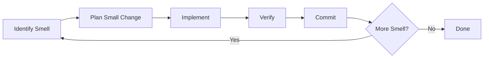

# Module 9.2: Refactoring từng phần

> **Thời gian học**: ~35 phút
>
> **Yêu cầu trước**: Module 9.1 (Khai quật code cũ)
>
> **Kết quả**: Sau module này, bạn sẽ có systematic approach refactor legacy code incremental, biết guide Claude toward safe change, và hiểu refactor-test-commit workflow.

---

## 1. WHY — Tại Sao Cần Hiểu

Đã hiểu legacy code (Module 9.1). Time to improve. Bạn bảo Claude "refactor 500-line function này." Claude produce beautiful rewrite — break 3 integration bạn không biết tồn tại. 2 ngày debug, cuối cùng revert hết.

Big refactor risky. Incremental refactoring là cách professional improve legacy code: small step, mỗi bước verify, always rollback-ready. Claude help được — nhưng cần guide toward incrementalism.

Như sửa nhà đang ở — không đập tường rồi mới xây. Dọn từng phòng, sửa từng phần, mỗi bước vẫn ở được.

---

## 2. CONCEPT — Ý Tưởng Cốt Lõi

### Incremental Principle

- One change at a time
- Verify sau mỗi change
- Commit sau mỗi verified change
- Rollback phải trivial

### Refactoring Loop



### Safe Refactoring Pattern

| Pattern | Risk Level | Example |
|---------|------------|---------|
| Rename variable/function | Very Low | `data` → `userData` |
| Extract method | Low | Pull 10 dòng vào function mới |
| Extract class | Medium | Move related method sang class mới |
| Change signature | Medium | Add/remove parameter |
| Restructure logic | High | Change conditional, loop |
| Change data structure | Very High | Array → Map, sync → async |

### Guide Claude Toward Incrementalism

Key prompt:
- "Suggest SMALLEST refactoring improve code này."
- "What's ONE thing rename để improve readability?"
- "Extract ONLY validation logic vào separate function."
- "DO NOT change public interface. Internal only."
- "Existing test MUST still pass."

### Strangler Fig Pattern

Không rewrite old code — wrap nó:
1. Create wrapper call old function
2. New code call wrapper
3. Gradually move logic từ old sang wrapper
4. Eventually old code empty → remove

Ask Claude: "Create wrapper cho [old function] để gradually migrate."

---

## 3. DEMO — Từng Bước

**Scenario**: Legacy function `saveUserData()` — 200 dòng, làm validation, processing, VÀ saving. Cần break apart.

### Step 1: Identify Smell

```text
Bạn: Read saveUserData() trong userService.js.
Code smell nào thấy? List theo độ dễ fix.

Claude:
1. Function làm 3 việc (validate, process, save) — extract method
2. Magic number (line 45: if (age > 18)) — extract constant
3. Deep nesting (4 level if) — flatten conditional
4. Unclear variable name (d, x, temp) — rename

Dễ đến khó: Rename → Constant → Extract method → Flatten
```

### Step 2: Plan Smallest Change

```text
Bạn: Start với dễ nhất. Suggest ONLY variable rename
improve readability. Không change logic.

Claude:
- Line 12: d → userData
- Line 34: x → validationResult
- Line 56: temp → processedData
```

### Step 3: Implement với Verification

```text
Bạn: Make only 3 rename đó. Nothing else.

Claude: [Rename đúng 3 variable]
```

```bash
$ npm test
```

Output:
```text
PASS  src/services/userService.test.js
All tests passed ✓
```

### Step 4: Commit Increment

```bash
$ git add userService.js
$ git commit -m "refactor: rename unclear variables in saveUserData"
```

### Step 5: Next Increment

```text
Bạn: Good. Next: extract validation logic (line 20-50) vào
separate function validateUserData(). Keep same behavior.

Claude: [Extract validation vào function mới]
```

```bash
$ npm test
```

Output:
```text
PASS  src/services/userService.test.js
All tests passed ✓
```

```bash
$ git commit -am "refactor: extract validateUserData from saveUserData"
```

### Step 6: Continue Until Clean

- Increment 3: Extract `processUserData()`
- Increment 4: Extract constant
- Increment 5: Flatten conditional

Mỗi cái: implement → test → commit

**Result**: 200-line function → 4 clean function + constant. 5 commit. Mỗi commit là safe rollback point. Zero breakage.

---

## 4. PRACTICE — Tự Thực Hành

### Bài 1: Rename Game

**Goal**: Practice lowest-risk refactoring.

**Instructions**:
1. Tìm file với unclear variable name
2. Ask Claude suggest ONLY rename (no logic change)
3. Implement, test, commit
4. Repeat until naming clean

<details>
<summary>💡 Hint</summary>

```text
"List all variable name trong function này có thể clearer.
Suggest better name. Do NOT change logic."
```
</details>

### Bài 2: Extract Method Drill

**Goal**: Practice incremental extraction.

**Instructions**:
1. Tìm long function (50+ dòng)
2. Ask Claude: "ONE section nào extract được vào helper function?"
3. Extract chỉ section đó
4. Test, commit
5. Repeat 3 lần

### Bài 3: Strangler Fig Practice

**Goal**: Learn wrap-and-migrate pattern.

**Instructions**:
1. Pick legacy function muốn replace
2. Ask Claude create wrapper call old function
3. Move ONE piece logic từ old sang wrapper
4. Test, commit
5. Repeat until old function empty

<details>
<summary>✅ Solution</summary>

```text
Step 1: "Create wrapper function newProcessOrder()
simply call old processOrder() và return result."

Step 2: "Move ONLY validation logic từ processOrder()
vào newProcessOrder(). Keep everything else call old function."

Step 3: Repeat cho mỗi piece logic until old function empty.
```
</details>

---

## 5. CHEAT SHEET

### Incremental Refactoring Loop

1. Identify smell
2. Plan smallest fix
3. Implement
4. Test
5. Commit
6. Repeat

### Safe Refactoring Prompt

```text
"What's SMALLEST change improve this?"
"Suggest ONLY rename, no logic change."
"Extract ONLY [specific section] vào new function."
"DO NOT change public interface."
"Existing test MUST still pass."
```

### Risk Level

- **Very Low**: Rename, reformat
- **Low**: Extract method, add comment
- **Medium**: Extract class, change signature
- **High**: Restructure logic
- **Very High**: Change data structure

### Git Rhythm

```bash
# After each increment:
npm test && git commit -am "refactor: [what you did]"
```

---

## 6. PITFALLS — Lỗi Thường Gặp

| ❌ Sai Lầm | ✅ Đúng Cách |
|-----------|-------------|
| "Refactor whole file" | "ONE smell fix first?" |
| Multiple change 1 commit | One logical change per commit |
| Refactor không có test | No test thì add test trước (Module 9.3) |
| Change logic while refactor | Refactor = same behavior, different structure |
| Không test sau mỗi step | Test EVERY increment. Non-negotiable. |
| Để Claude rewrite everything | Guide toward small, specific change |
| Refactor under deadline pressure | Don't refactor if can't do it right |

---

## 7. REAL CASE — Câu Chuyện Thực Tế

**Scenario**: E-commerce Việt Nam, legacy order processing — 800-line function, 5 năm patch, "works but don't touch" reputation.

**Failed attempt (big bang)**: Junior dev ask Claude "refactor function này." Claude produce elegant rewrite. Break payment integration, shipping calculation, và audit logging. 3 ngày revert và recover.

**Successful attempt (incremental)**:
- Tuần 1: Rename variable (15 commit, zero break)
- Tuần 2: Extract validation, processing, persistence (8 commit, 1 minor fix)
- Tuần 3: Extract shipping calculation vào service (4 commit)
- Tuần 4: Add proper error handling (6 commit)

**Result**: Same function, giờ 5 clean file, 33 commit, mỗi cái revertible. Zero production incident.

**Quote**: "Trick là bảo Claude 'one small thing at a time.' Nó muốn rewrite everything. Phải hold back."

---

> **Tiếp theo**: [Module 9.3: Sinh test Legacy](../03-legacy-test-generation/) →
