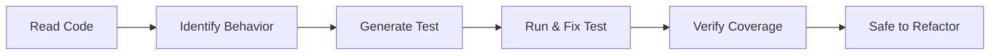

# Module 9.3: Sinh test Legacy

> **Thời gian học**: ~35 phút
>
> **Yêu cầu trước**: Module 9.2 (Refactoring từng phần)
>
> **Kết quả**: Sau module này, bạn sẽ biết dùng Claude Code generate characterization test cho legacy code, hiểu test gì skip gì, và có workflow add test trước khi refactor.

---

## 1. WHY — Tại Sao Cần Hiểu

Muốn refactor function 500 dòng. Không có test. "Refactor careful rồi manual test." Famous last words.

Refactor xong, seems work, deploy. Sáng hôm sau: production incident. Code path hiếm dùng bị break. Customer complain. Scramble fix.

Test là safety net cho refactoring. No test = no safety net = high risk. Claude Code generate test cho legacy code nhanh hơn bạn viết — cho bạn safety net trước khi bắt đầu change.

---

## 2. CONCEPT — Ý Tưởng Cốt Lõi

### Characterization Test vs Unit Test

| Loại | Câu Hỏi Nó Trả Lời |
|------|---------------------|
| Unit Test | Code làm cái nó SHOULD làm? |
| Characterization Test | Code HIỆN TẠI làm gì? |

Legacy code "correct" vì đang production. User depend on current behavior. Characterization test capture behavior đó — dù có vẻ sai. Goal là detect change, không phải verify correctness.

### Test Generation Workflow



Key insight: Khi test fail, fix TEST, không fix code. Code "đúng" — nó đang chạy production.

### Test Gì Trong Legacy Code

| Priority | What | Why |
|----------|------|-----|
| High | Public interface / API | Code khác dùng |
| High | Happy path flow | Usage phổ biến nhất |
| Medium | Edge case visible | Handling explicit |
| Medium | Error handling | Failure mode quan trọng |
| Low | Internal helper | Sẽ change khi refactor |

### Coverage Goal

Không cần 100%. Aim cho "đủ để refactor safe":
- 70-80% coverage của function cụ thể là đủ
- Focus code sắp change
- Test behavior, không test line

---

## 3. DEMO — Từng Bước

**Scenario**: Legacy function `calculateDiscount()` — no test, sắp refactor.

### Step 1: Read và Identify Behavior

```text
Bạn: Read calculateDiscount() trong pricingService.js.
List all behavior/path qua function này.

Claude:
1. Return 0 nếu user not logged in
2. Return 10% cho regular user
3. Return 15% cho premium user
4. Return 30% cho VIP user
5. Cap discount ở 50% bất kể user type
6. Throw error nếu amount negative
```

### Step 2: Generate Characterization Test

```text
Bạn: Generate Jest test cho calculateDiscount() capture TẤT CẢ behavior đó.
Đây là characterization test — capture nó LÀM GÌ, không phải nó SHOULD làm gì.

Claude: [Generate test file với 6 test case]
```

### Step 3: Run và Verify

```bash
$ npm test pricingService.test.js
```

Output:
```text
PASS  pricingService.test.js
  calculateDiscount
    ✓ return 0 cho non-logged-in user
    ✓ return 10% cho regular user
    ✓ return 15% cho premium user
    ✓ return 30% cho VIP user
    ✓ cap ở 50% max discount
    ✓ throw on negative amount

6 tests passed
```

### Step 4: Handle Test Failure

Giả sử test fail — Claude assume sai behavior:

```text
FAIL: expected 20% cho premium, got 15%
```

```text
Bạn: Test fail. CODE đúng — nó đang production.
Actual discount cho premium là 15%, không phải 20%.
Fix test để match actual behavior.

Claude: [Fix test assertion từ 20% thành 15%]
```

### Step 5: Check Coverage

```bash
$ npm run test:coverage -- --collectCoverageFrom="**/pricingService.js"
```

Output:
```text
pricingService.js | 85% coverage
```

Đủ để refactor safe.

### Step 6: Giờ Safe Để Refactor

```text
Bạn: Có test rồi. Refactor calculateDiscount() sang strategy pattern
thay vì if-else chain.

Bất kỳ refactoring nào change behavior sẽ bị test catch.
```

---

## 4. PRACTICE — Tự Thực Hành

### Bài 1: Test What Exists

**Goal**: Generate characterization test cho existing code.

**Instructions**:
1. Tìm function không có test trong project nào đó
2. Ask Claude list all behavior/path
3. Generate test cho mỗi behavior
4. Run test — all should pass (nếu không, fix test)
5. Check coverage

<details>
<summary>💡 Hint</summary>

```text
"Read [function]. What are all possible execution path?
Generate test case cho mỗi path."
```
</details>

### Bài 2: Golden Master

**Goal**: Capture complex output làm regression baseline.

**Instructions**:
1. Pick function với complex output (formatting, calculation)
2. Run với 10 different input, capture output
3. Ask Claude generate test assert exact output đó
4. Giờ có regression detection

### Bài 3: Test Before Refactor

**Goal**: Practice full workflow.

**Instructions**:
1. Pick function muốn refactor
2. Generate characterization test
3. Achieve 70%+ coverage
4. Do small refactor
5. Run test — catch được gì không?

<details>
<summary>✅ Solution</summary>

Workflow:
1. `"List all behavior trong [function]."`
2. `"Generate test cho mỗi behavior."`
3. Run test, fix nếu fail (fix TEST, không fix code)
4. Check coverage, add thêm test nếu cần
5. Refactor với confidence
</details>

---

## 5. CHEAT SHEET

### Test Generation Workflow

1. Read code, list behavior
2. Generate test cho mỗi behavior
3. Run test (expect all pass)
4. Nếu fail: fix TEST, không fix code
5. Check coverage
6. Giờ safe to refactor

### Key Prompt

```text
"List all behavior/path trong [function]."
"Generate characterization test capturing current behavior."
"Test fail nhưng CODE đúng. Fix test."
"Edge case nào code này handle?"
```

### Coverage Guideline

| Goal | Target |
|------|--------|
| Minimum | 70% của function-to-refactor |
| Good | 80% với edge case |
| Overkill | 100% (không đáng effort) |

### Characterization vs Unit Test

| Characterization | Unit |
|-----------------|------|
| Nó LÀM GÌ? | Nó SHOULD làm gì? |
| Fix test khi fail | Fix code khi fail |
| Trước refactoring | Khi development |

---

## 6. PITFALLS — Lỗi Thường Gặp

| ❌ Sai Lầm | ✅ Đúng Cách |
|-----------|-------------|
| Fix code khi test fail | Fix TEST. Code "đúng" vì đang production. |
| Aim 100% coverage | 70-80% của code-to-refactor là đủ. |
| Test internal helper | Focus public interface. Helper sẽ change. |
| Verify "correct" behavior | Verify CURRENT behavior, dù có vẻ bug. |
| Generate test không run | ALWAYS run. Claude có thể misunderstand. |
| Skip test "I'll be careful" | Test là safety net. Always add trước refactor. |
| Complex mocking cho legacy | Start với integration-level test. Mock ít hơn. |

---

## 7. REAL CASE — Câu Chuyện Thực Tế

**Scenario**: Fintech Việt Nam, legacy loan calculation module. 2,000 dòng, zero test, 8 năm tuổi. Business muốn thêm loan type mới. Team sợ touch.

**Cách cũ**: "Careful thôi" → Thêm loan type → Break edge case calculation → ₫500M miscalculation phát hiện sau 2 tuần → Painful fix và customer complaint.

**Cách mới với Claude**:
1. Claude analyze code, identify 15 calculation path khác nhau
2. Generate 45 characterization test trong 3 giờ
3. Test reveal 3 undocumented behavior (feature không ai nhớ)
4. Achieve 78% coverage core calculation
5. Thêm loan type, test catch 2 regression trong khi dev
6. Zero production issue

**Investment**: 3 giờ generate test
**Saved**: Tuần debug, potential ₫ triệu miscalculation

**Quote**: "Test không để prove correctness. Để prove không break cái đang work 8 năm."

---

> **Tiếp theo**: [Module 9.4: Phân tích Tech Debt](../04-tech-debt-analysis/) →
