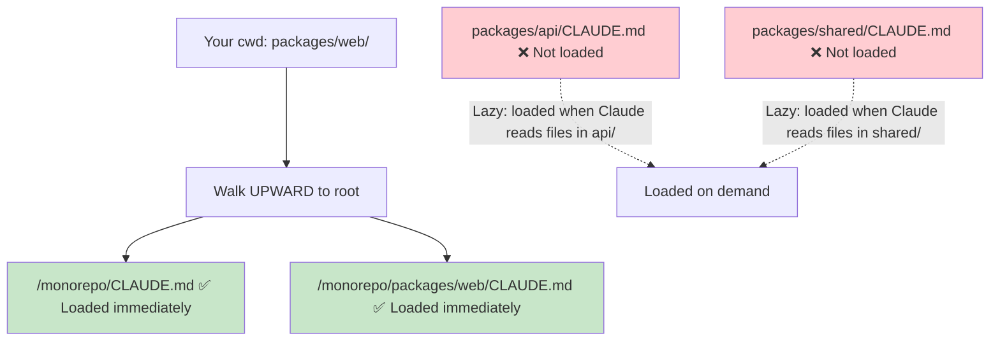

# Module 10.1: CLAUDE.md cho Team

> **Thời gian học**: ~30 phút
>
> **Yêu cầu trước**: Module 4.2 (CLAUDE.md — Bộ nhớ dự án), Phase 9 (Legacy Code)
>
> **Kết quả**: Sau module này, bạn sẽ biết create và maintain shared CLAUDE.md cho team, thiết lập contribution workflow, và ensure consistent Claude behavior across tất cả team member.

---

## 1. WHY — Tại Sao Cần Hiểu

Team 5 developer đều dùng Claude Code. Dev A's Claude dùng camelCase. Dev B dùng snake_case. Dev C import lodash cho mọi thứ. Dev D đã train Claude avoid lodash. Mỗi PR có style conflict. Claude supposed to help nhưng tạo inconsistency.

Team CLAUDE.md giải quyết: MỘT shared file cho TẤT CẢ team member's Claude đọc. Same rule, same pattern, same knowledge. Consistency at scale.

---

## 2. CONCEPT — Ý Tưởng Cốt Lõi

### Individual vs Team CLAUDE.md

| Aspect | Individual | Team |
|--------|-----------|------|
| Location | Personal project | Repo root (committed) |
| Scope | Personal preference | Team standard |
| Updates | Bạn decide | Team consensus |
| Versioned | Optional | Required (git) |

### Team CLAUDE.md Structure

```markdown
# Project: [Name]

## Team Conventions
- Coding style, naming, file organization

## Architecture Decisions
- Tại sao chọn X thay vì Y
- Pattern nên follow

## Forbidden Patterns
- Cái gì KHÔNG làm và tại sao

## Dependencies Policy
- Library được approve
- Library bị ban và lý do

## Testing Requirements
- Coverage expectation
- Test pattern

## Claude-Specific Instructions
- Claude nên behave thế nào cho project này
```

### Contribution Workflow

1. CLAUDE.md sống trong repo root
2. Change qua PR như code bình thường
3. Team review CLAUDE.md change
4. Merge = team consensus

### Layered CLAUDE.md

Cho complex project:
- `/CLAUDE.md` — Global team rule
- `/backend/CLAUDE.md` — Backend-specific rule
- `/frontend/CLAUDE.md` — Frontend-specific rule

Claude đọc tất cả applicable file khi work trong directory.

### Phân Cấp CLAUDE.md Trong Monorepo

Trong các monorepo lớn (Turborepo, Nx, Lerna), cách tiếp cận phân tầng trở nên đặc biệt quan trọng. Cơ chế loading CLAUDE.md của Claude Code giúp điều này hoạt động hiệu quả:

#### Cách Claude Load CLAUDE.md



**Hành vi quan trọng**:
- Khi khởi động, Claude đi **ngược lên** từ thư mục hiện tại đến root
- Load tất cả CLAUDE.md trên đường đi **ngay lập tức**
- Các CLAUDE.md ở thư mục ngang hàng hoặc con **KHÔNG** được load khi khởi động
- Chúng chỉ được **lazy-load** khi Claude đọc file trong những thư mục đó

#### Cấu Trúc Monorepo Mẫu

```text
monorepo/
├── CLAUDE.md                    # Chung: TypeScript strict, commit format, PR template
├── packages/
│   ├── web/
│   │   └── CLAUDE.md            # Quy tắc Next.js, component patterns
│   ├── api/
│   │   └── CLAUDE.md            # Express patterns, quy tắc truy cập DB
│   ├── shared/
│   │   └── CLAUDE.md            # Shared types, không có side effects
│   └── mobile/
│       └── CLAUDE.md            # React Native patterns, platform specifics
└── .claude/
    └── rules/                   # File rule modular (tự động load)
        ├── testing.md           # Quy tắc test cho tất cả packages
        └── security.md          # Quy tắc bảo mật cho toàn repo
```

#### Đặt Gì Ở Đâu

| Cấp độ | Nội dung | Ví dụ |
|--------|----------|-------|
| **Root CLAUDE.md** | Quy tắc chung toàn repo | TypeScript strict, no `any`, commit format |
| **Package CLAUDE.md** | Quy tắc riêng framework | "Server Components by default" |
| **`.claude/rules/*.md`** | Quy tắc xuyên suốt | Tiêu chuẩn testing, quy tắc security |
| **CLAUDE.local.md** | Tùy chọn cá nhân (thêm vào `.gitignore`) | Debug shortcuts, editor config |

> **Mẹo**: Thêm `CLAUDE.local.md` vào `.gitignore`. Dùng nó cho các hướng dẫn cá nhân không cần chia sẻ với team — alias riêng, debug workflow, format output ưa thích.

### Living Document Principle

- CLAUDE.md evolve với project
- Sau mỗi "Claude làm sai" → update CLAUDE.md
- Sau mỗi architectural decision → document vào CLAUDE.md
- Regular review (monthly/quarterly)

---

## 3. DEMO — Từng Bước

**Scenario**: Setup Team CLAUDE.md cho team 5 người.

### Step 1: Initialize với Team Context

```bash
$ claude
```

```text
Bạn: Setup CLAUDE.md cho team. Read codebase và generate starting
CLAUDE.md capture:
- Coding convention đang dùng
- Tech stack
- Pattern bạn observe

Claude: [Đọc codebase, generate initial CLAUDE.md]
```

### Step 2: Thêm Team-Specific Rule

```markdown
# Project: E-commerce Platform

## Team Conventions
- TypeScript strict mode, không `any`
- React functional component only, không class
- File naming: kebab-case cho file, PascalCase cho component
- Import: absolute path từ `@/` alias

## Architecture Decisions
- State management: Zustand (KHÔNG Redux — quá nhiều boilerplate)
- API layer: React Query cho server state
- Styling: Tailwind CSS, không inline style

## Forbidden Patterns
- ❌ `any` type — luôn define proper type
- ❌ `console.log` trong production code — dùng logger service
- ❌ Direct DOM manipulation — dùng React ref
- ❌ lodash — dùng native JS method (bundle size)

## Dependencies Policy
- New dependency cần team discussion
- Check bundle size trước khi add (bundlephobia.com)
- Security: không package có known CVE

## Testing Requirements
- Unit test cho all util
- Integration test cho API route
- E2E test cho critical user flow
- Minimum 70% coverage cho new code

## Claude-Specific Instructions
- Luôn run `npm run lint` sau code change
- Suggest test cho mọi new function
- Khi không chắc về architecture, hỏi thay vì assume
```

### Step 3: Commit và Establish Workflow

```bash
$ git add CLAUDE.md && git commit -m "docs: add team CLAUDE.md for AI assistant context"
```

Output:
```text
[main abc1234] docs: add team CLAUDE.md for AI assistant context
 1 file changed, 45 insertions(+)
 create mode 100644 CLAUDE.md
```

### Step 4: Verify Nó Work

```text
Bạn: Rule của team về lodash là gì?

Claude: Theo CLAUDE.md, lodash bị forbidden. Dùng native JS method
thay vì vì lý do bundle size.
```

---

## 4. PRACTICE — Tự Thực Hành

### Bài 1: Audit Current State

**Goal**: Tạo initial Team CLAUDE.md từ existing standard.

**Instructions**:
1. Nếu team có coding standard doc, convert sang CLAUDE.md format
2. Nếu không, ask Claude analyze codebase và generate initial convention
3. Review và refine với team input

<details>
<summary>💡 Hint</summary>

```text
"Read codebase. Generate CLAUDE.md capture:
- Coding convention bạn observe
- Tech stack và pattern
- Anti-pattern nên avoid"
```
</details>

### Bài 2: Forbidden Patterns Section

**Goal**: Prevent common mistake với explicit rule.

**Instructions**:
1. Nghĩ 5 thứ developer trong team hay làm sai
2. Add vào "Forbidden Patterns" với clear explanation
3. Test: ask Claude làm một trong những thứ đó, verify nó refuse

### Bài 3: Layered CLAUDE.md

**Goal**: Setup directory-specific rule.

**Instructions**:
1. Tạo root CLAUDE.md với global rule
2. Tạo subdirectory CLAUDE.md cho một area cụ thể (e.g., `/api/CLAUDE.md`)
3. Verify Claude đọc cả hai khi work trong area đó

<details>
<summary>✅ Solution</summary>

Structure:
```text
/CLAUDE.md           # "All code must be TypeScript"
/api/CLAUDE.md       # "API route dùng Express middleware pattern"
```

Test bằng cách ask Claude về API convention khi ở `/api/` directory — nó should biết cả global và API-specific rule.
</details>

---

## 5. CHEAT SHEET

### Team CLAUDE.md Template

```markdown
# Project: [Name]

## Team Conventions
- [Coding style rule]

## Architecture Decisions
- [Tại sao chọn X]

## Forbidden Patterns
- ❌ [Thứ cần avoid] — [lý do]

## Dependencies Policy
- [Cái gì allowed/banned]

## Testing Requirements
- [Coverage, pattern]

## Claude-Specific Instructions
- [Claude nên behave thế nào]
```

### Workflow

1. CLAUDE.md trong repo root (committed)
2. Change qua PR
3. Team review
4. Update sau mỗi "Claude mistake"

### Layered Structure

```text
/CLAUDE.md           # Global rule
/backend/CLAUDE.md   # Backend-specific
/frontend/CLAUDE.md  # Frontend-specific
```

---

## 6. PITFALLS — Lỗi Thường Gặp

| ❌ Sai Lầm | ✅ Đúng Cách |
|-----------|-------------|
| Individual CLAUDE.md không git | Team CLAUDE.md MUST committed và shared |
| Một người maintain CLAUDE.md | Team ownership. PR for change. Everyone contribute. |
| Write once, never update | Living document. Update sau mỗi issue. |
| Quá vague ("viết code tốt") | Specific, actionable ("dùng camelCase, không snake_case") |
| Quá dài (không ai đọc) | Concise. Important rule first. |
| Chỉ coding style | Include architecture, dependency, testing, Claude behavior |
| Không test Claude đọc không | Verify bằng cách ask Claude về rule |

---

## 7. REAL CASE — Câu Chuyện Thực Tế

**Scenario**: Startup fintech Việt Nam, 8 developer, đều dùng Claude Code. Trước Team CLAUDE.md: mỗi PR có style conflict, different error handling pattern, inconsistent API response.

**Implementation**:
1. Tech lead draft initial CLAUDE.md từ existing (informal) standard
2. Team review trong 1 giờ meeting, thêm forbidden pattern từ past incident
3. Commit vào repo, announce trong Slack
4. Rule: "Nếu Claude làm sai, fix AND update CLAUDE.md"

**CLAUDE.md highlight**:
- VND currency: luôn dùng integer (không decimal)
- Error response: dùng standard ApiError class
- Forbidden: direct database query trong controller

**Result sau 1 tháng**:
- Style conflict trong PR: giảm 80%
- "Tại sao Claude làm thế này?" question: giảm 90%
- New developer onboarding: từ 2 tuần xuống 3 ngày (Claude biết hết rule)

**Quote**: "CLAUDE.md là best onboarding document. Nó teach Claude VÀ new developer cùng lúc."

---

> **Tiếp theo**: [Module 10.2: Quy ước Git](../02-git-conventions/) →
