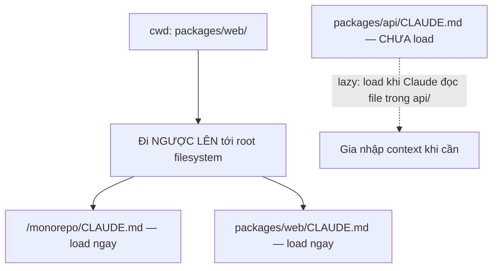

# Module 10.1: CLAUDE.md cho Team

> **Thời gian học**: ~30 phút
>
> **Yêu cầu trước**: Module 4.2 (CLAUDE.md — Bộ Nhớ Dự Án), Phase 9 (Legacy Code)
>
> **Kết quả**: Sau module này, bạn biết chọn đúng cơ chế cho instruction dùng chung cả team —
> `CLAUDE.md` của repo, `.claude/rules/` scoped theo path, hay managed policy toàn org — và biết
> xác nhận thứ gì thật sự load cho một file cụ thể.

---

## 1. WHY — Tại Sao Cần Quan Tâm

Năm developer, năm thói quen Claude khác nhau: người này viết camelCase, người kia snake_case,
người thứ ba import lodash khắp nơi. Một `CLAUDE.md` chung giải quyết vấn đề "cùng repo, khác
rule" — nhưng không giải quyết chuyện "rule frontend lại load khi Claude đang sửa backend" hay
"không ai chứng minh được file nào thật sự đã đọc." Module 4.2 dạy viết `CLAUDE.md` gọn nhẹ; module
này dạy phân phối instruction cho cả team và nhiều app, và chứng minh chúng đã load.

---

## 2. CONCEPT — Ý Tưởng Cốt Lõi

### Individual vs. team CLAUDE.md

| Khía cạnh | Cá nhân (`CLAUDE.local.md`) | Team (`CLAUDE.md`) |
|--------|-----------|------|
| Vị trí | Root repo, gitignored | Root repo, committed |
| Phạm vi | Sở thích cá nhân | Chuẩn của team |
| Cập nhật | Bạn tự quyết | PR + review |
| Load cho mọi người | Không | Có |

### Hierarchy trong monorepo (nối chuỗi, không ghi đè)

Claude Code đi **ngược lên** từ thư mục làm việc lúc khởi động, load ngay mọi `CLAUDE.md` nằm
trên đường đi đó. File ở package anh em hoặc con **không** load lúc khởi động — chúng load lười
(lazy), chỉ khi Claude đọc một file bên trong package đó (cơ chế đầy đủ, gồm cả `@imports` và thứ
tự precedence, nằm ở Module 4.2):


```mermaid
graph TD
    CWD["cwd: packages/web/"] --> Walk[Đi NGƯỢC LÊN tới root filesystem]
    Walk --> Root["/monorepo/CLAUDE.md — load ngay"]
    Walk --> Pkg["packages/web/CLAUDE.md — load ngay"]
    Other["packages/api/CLAUDE.md — CHƯA load"] -.->|"lazy: load khi Claude đọc file trong api/"| Later[Gia nhập context khi cần]
```

### Hai cách scope một rule cho team

| Cơ chế | Load khi nào | Ai exclude được |
|---|---|---|
| `CLAUDE.md` (root hoặc package) | Lúc khởi động, nếu nằm trên đường đi ngược lên | `claudeMdExcludes` (không áp dụng cho managed policy) |
| `.claude/rules/*.md` có `paths:` | "Khi Claude đọc file khớp pattern, không phải mỗi lần gọi tool" | Như trên |
| `.claude/rules/*.md` **không có** `paths:` | Lúc khởi động, priority ngang `.claude/CLAUDE.md` | Như trên |

`paths:` là field duy nhất trong frontmatter Claude Code đọc ở rule file (budget: 1.000 glob đã
expand / 4 MiB). Đây là cách team giữ cho convention chỉ áp dụng `apps/web/**` không
bao giờ vào context khi ai đó đang làm `apps/api/`.

### Cấp org: managed policy CLAUDE.md

Với rule bắt buộc áp dụng cho mọi developer bất kể repo có gì, admin deploy một **managed policy
CLAUDE.md**, load trước cả user và project file, và không thể exclude bằng `claudeMdExcludes`:

| OS | Đường dẫn |
|---|---|
| macOS | `/Library/Application Support/ClaudeCode/CLAUDE.md` |
| Linux / WSL | `/etc/claude-code/CLAUDE.md` |
| Windows | `C:\Program Files\ClaudeCode\CLAUDE.md` |

Hoặc bỏ qua file riêng, inline nội dung bằng key `claudeMd` trong `managed-settings.json` (Module
10.5 dạy cách deploy file đó). `CLAUDE.md` committed vẫn là công cụ đúng cho convention team tự sở
hữu và tự review; managed policy dành cho số ít rule org bắt buộc phải giữ dù repo có hợp tác hay
không.

### Xác nhận thứ gì đã load

`/memory` liệt kê mọi file thuộc họ CLAUDE.md đang trong scope, cho biết auto-memory bật hay tắt,
và cho mở thư mục auto-memory. Nó **không** liệt kê `.claude/rules/` — những file đó chỉ xuất hiện
khi có file khớp được đọc (xem DEMO). `/init` phân tích repo và viết `CLAUDE.md` khởi đầu, hoặc đề
xuất sửa nếu đã có sẵn (Module 4.2, Exercise 1, có đầy đủ quy trình prune một file quá dài).

---

## 3. DEMO — Từng Bước

**Kịch bản**: monorepo 2 app (`apps/web` Next.js, `apps/api` Express) với một `CLAUDE.md` ở root
và một rule scoped chỉ cho frontend.

**Bước 1: Root CLAUDE.md + một rule scoped**

```bash
mkdir -p apps/web/src apps/api/src .claude/rules
cat > CLAUDE.md <<'EOF'
# Storefront Monorepo
- Hai app: apps/web (Next.js) và apps/api (Express).
- TypeScript strict mode ở mọi nơi. Không dùng `any`.
EOF
cat > .claude/rules/frontend-testing.md <<'EOF'
---
paths: apps/web/**
---
# Frontend testing rule
- Mỗi component trong apps/web cần một *.test.tsx nằm cùng thư mục.
- Dùng React Testing Library, không dùng Enzyme.
EOF
git add -A && git commit -q -m "init monorepo demo"
```

**Bước 2: Xác nhận họ CLAUDE.md bằng `/memory`**

```text
> /memory
```
```text
# Output may vary
Memory
❯ Auto-memory  true
❯ User instructions   Saved in ~/.claude/CLAUDE.md
  Project instructions   Checked in at ./CLAUDE.md
  Open auto-memory folder
```

`.claude/rules/frontend-testing.md` chưa xuất hiện ở đây — nó chưa được trigger.

**Bước 3: Mở một file trong `apps/web` — rule load**

```text
> Read apps/web/src/Button.tsx, then tell me what our testing rule for this file requires.
```
```text
# Output may vary
Opening Button.tsx loaded the project rule .claude/rules/frontend-testing.md, which covers
everything in apps/web. It requires: a test file next to the component (apps/web/src/Button.test.tsx)
and React Testing Library, not Enzyme.
```

**Bước 4: Cùng câu hỏi cho `apps/api` — rule vẫn im lặng**

```text
> Read apps/api/src/index.ts. Does the frontend testing rule apply to this file?
```
```text
# Output may vary
No, it doesn't apply. .claude/rules/frontend-testing.md is scoped to paths: apps/web/**, and
apps/api/src/index.ts is in the Express API app.
```

Sự bất đối xứng đó — load cho `apps/web`, im lặng với `apps/api` — chính là mục đích của `paths:`.

---

## 4. PRACTICE — Tự Thực Hành

### Exercise 1: Tách một rule ra khỏi CLAUDE.md

**Goal**: Chuyển một convention scoped theo thư mục ra khỏi file root.

**Instructions**:
1. Chọn một rule trong `CLAUDE.md` chỉ áp dụng cho một package hoặc thư mục.
2. Chuyển nó vào `.claude/rules/<name>.md` với `paths:` glob cho thư mục đó.
3. Commit cả hai file, mở PR như mọi thay đổi code khác.
4. Xác nhận theo pattern ở Bước 3 của DEMO: đọc một file khớp, rồi một file không khớp.

<details>
<summary>💡 Hint</summary>

`paths:` nhận YAML list hoặc chuỗi phân tách bằng dấu phẩy — cả `apps/web/**` và
`["apps/web/**", "packages/ui/**"]` đều hoạt động.
</details>

### Exercise 2: Managed hay committed — chọn đúng lớp

**Goal**: Quyết định 3 rule dưới đây thuộc `CLAUDE.md`, `.claude/rules/`, hay managed policy.

**Instructions**: Với mỗi rule sau, nêu tên cơ chế và lý do:
1. "Dùng Zustand, không dùng Redux, cho state management."
2. "File trong `payments/**` cần security review trước khi merge."
3. "Không bao giờ tắt permission-bypass mode trên máy công ty."

<details>
<summary>✅ Solution</summary>

1. `CLAUDE.md` — convention team tự quyết và có thể đổi bằng PR.
2. `.claude/rules/payments.md` với `paths: payments/**` — cross-cutting nhưng chỉ liên quan trong
   thư mục đó.
3. Managed policy (`disableBypassPermissionsMode`, Module 10.5) — phải giữ nguyên dù developer có
   sửa hay xoá `CLAUDE.md` của repo.
</details>

### Exercise 3: Contribution workflow

**Goal**: Biến việc maintain CLAUDE.md thành thói quen của cả team, không phải việc của một người.

**Instructions**: Soạn một checkbox trong PR template: "Đã update `CLAUDE.md` hoặc một rule sau
thay đổi này chưa?" Thêm vào repo và dùng thử trong một tuần.

---

## 5. CHEAT SHEET

| Cơ chế | Load khi nào | Phạm vi |
|---|---|---|
| `./CLAUDE.md` | Lúc khởi động, nếu trên đường đi ngược lên | Cả repo (hoặc subtree nếu nested) |
| `.claude/rules/*.md` (không `paths:`) | Lúc khởi động | Cả repo |
| `.claude/rules/*.md` (`paths:`) | Khi có file khớp được đọc | Chỉ path glob đó |
| `CLAUDE.local.md` | Lúc khởi động, gitignored | Cá nhân |
| Managed policy CLAUDE.md | Trước user/project file, mỗi session | Toàn org, không exclude được |
| `claudeMd` (trong `managed-settings.json`) | Như trên, inline thay vì file | Toàn org |
| `/memory` | — | Liệt kê họ CLAUDE.md, toggle auto-memory |
| `/init` | — | Sinh/update `CLAUDE.md` (chỉ interactive) |

---

## 6. PITFALLS — Sai Lầm Thường Gặp

| ❌ Sai | ✅ Đúng |
|-----------|---------------------|
| Một `CLAUDE.md` 600 dòng không ai đọc | Chạy S1 prune test cho từng phần — "Bỏ dòng này Claude có mắc lỗi không?" (Module 4.2) — rồi chuyển phần còn lại vào `.claude/rules/` scoped |
| Chỉ một người sửa `CLAUDE.md` | Team sở hữu chung, PR + review như code |
| Tưởng rule không có `paths:` sẽ lazy-load | Nó load lúc khởi động, priority ngang `.claude/CLAUDE.md` — chỉ `paths:` mới làm nó lazy |
| Tưởng `CLAUDE.md`/rules chặn được hành động nguy hiểm | Chỉ mang tính advisory — dùng `permissions.deny` hoặc hook (Module 2.2, 11.3) cho thứ tuyệt đối không được xảy ra |
| Commit sở thích cá nhân vào `CLAUDE.md` | Dùng `CLAUDE.local.md`, gitignored |
| Viết managed CLAUDE.md cho lựa chọn style của team | Dành managed policy cho rule phải giữ dù repo không hợp tác; style của team vẫn nằm trong file committed |

---

## 7. REAL CASE — Câu Chuyện Thực Tế

Một team fintech ở TP.HCM chạy một `CLAUDE.md` gốc cho ba service trong monorepo:
payments, ledger, và một public API. Mỗi session load convention của cả ba service, kể cả rule
riêng của payments ("luôn dùng value type `Money`, không dùng raw float") dù ai đó chỉ đang đụng
public API. Sau khi tách rule từng service vào
`.claude/rules/payments/**.md`, `.claude/rules/ledger/**.md`, chỉ giữ convention cross-cutting
(commit format, TypeScript strict mode) ở file root, team xác nhận bằng `/context`
session public API không còn mang token rule payments nữa — quan trọng hơn, reviewer chỉ thẳng
được file rule chịu trách nhiệm khi Claude sai convention riêng của service, thay vì debug một
document lớn.

---

> **Tiếp theo**: [Module 10.2: Quy ước Git](../02-git-conventions/) →
