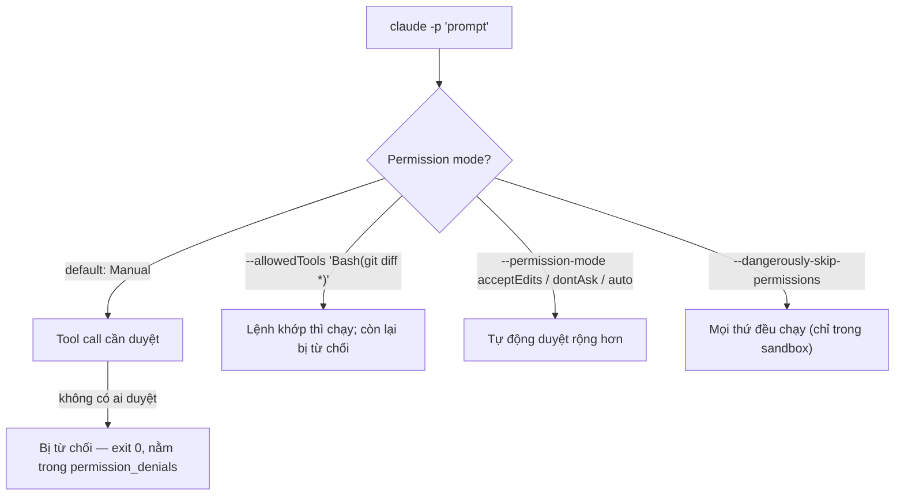

# Module 11.1: Headless Mode

> **Thời gian học**: ~35 phút
>
> **Yêu cầu trước**: Module 2.2 (Permission System Deep Dive)
>
> **Kết quả**: Sau module này, bạn chạy được `claude -p` trong script với permission tường minh,
> lấy kết quả máy đọc được bằng `--output-format json` và `--json-schema`, stream event, và xác
> thực CI bằng `claude setup-token` hoặc API key.

---

## 1. WHY — Tại Sao Điều Này Quan Trọng

Job CI của bạn chạy `claude -p "fix the lint errors"` ở mỗi lần push. Nó chạy xong trong vài giây,
exit `0`, pipeline xanh — nhưng `git diff` trống trơn, không có gì được sửa cả. Ở terminal tương
tác, Claude sẽ hiện permission prompt và chờ bạn bấm "Yes"; trong script thì chẳng có ai để bấm.
Phiên `-p` từ chối việc sửa file nhưng vẫn báo thành công, và CI thì tin vào đó. Headless mode
không phải "interactive mode bỏ giao diện" — nó là một hợp đồng khác hẳn: bạn phải pre-authorize
(cấp quyền trước) những gì mình muốn Claude làm, trước khi chạy.

---

## 2. CONCEPT — Không Tương Tác = Pre-Authorize Hoặc Bị Từ Chối

**Non-interactive = pre-authorize or denied.** Với `-p`, permission mode khởi đầu luôn là Manual
trên mọi plan, nên bạn phải tự truyền mode mình muốn — không ai ngồi bàn phím để duyệt, nên thứ gì
cần duyệt sẽ bị từ chối, run vẫn exit `0` bình thường. Với `--output-format stream-json`, một call
bị từ chối hiện thành `permission_denied`, và `result` cuối liệt kê chúng trong `permission_denials`
(đã xác nhận bằng cách chạy lại Bước 1 với `stream-json`, không cần flag thêm) — cách phân biệt "đã
duyệt" với "âm thầm bị bỏ qua". Docs dạy điều này cạnh `--permission-prompts none`, giúp Claude
không chờ permission host (callback `canUseTool` của SDK, hoặc `--permission-prompt-tool`) trong
run không người trông; riêng flag đó cần Claude Code v2.1.259 trở lên.



Cấp quyền trước theo một cái thang, hẹp nhất trước: `--allowedTools` với pattern có phạm vi, ví dụ
`"Bash(git diff *)"` (thiếu dấu cách trước `*` sẽ khớp luôn cả `git diff-index`);
`--permission-mode acceptEdits|dontAsk|auto` để duyệt rộng hơn; rồi mới đến
`--dangerously-skip-permissions`, chỉ dùng trong sandbox/container có thể vứt bỏ.

Output có ba dạng. `text` (mặc định) in câu trả lời cuối. `--output-format json` bọc nó trong một
payload có `result`, `session_id`, `total_cost_usd`, và breakdown chi phí theo model, nên script
`jq` thẳng một field thay vì parse văn xuôi. Thêm `--json-schema '<schema>'` thì payload có thêm
`structured_output` đã validate; schema sai fail ngay với
`Error: --json-schema is not a valid JSON Schema`. `--output-format stream-json` (kèm `--verbose`,
tùy chọn `--include-partial-messages`) in mỗi dòng một JSON object — `system` (`init` trước tiên),
`assistant`, `user`, `stream_event`, kết bằng `result` — dùng cho pipeline real-time.

`--bare` bỏ qua hooks, skills, custom commands, subagents, plugins, MCP servers, auto memory và
CLAUDE.md — "chế độ khuyến nghị cho lệnh gọi scripted và SDK", sẽ thành mặc định của `-p` trong một
bản tương lai. Nó không bao giờ đọc `CLAUDE_CODE_OAUTH_TOKEN`, nên script `--bare` cần
`ANTHROPIC_API_KEY` hoặc `apiKeyHelper`. Giới hạn run bằng `--max-turns`, `--max-budget-usd` (cần
Claude Code v2.1.217 trở lên), hoặc `--no-session-persistence`; mở lại phiên `-p` trước đó bằng
`--continue`/`--resume`. Stdin qua pipe giới hạn 10MB.

Về xác thực CI: `claude setup-token` tạo OAuth token dùng một năm, gắn với subscription
Pro/Max/Team/Enterprise của người tạo — ổn cho script cá nhân, nhưng mong manh cho pipeline dùng
chung (người nghỉ việc là pipeline hỏng). `ANTHROPIC_API_KEY` từ Console thuộc về tổ chức chứ không
phải cá nhân, nên đây là lựa chọn an toàn hơn cho CI của team.

---

## 3. DEMO — Từng Bước

**Bước 1: Manual mode âm thầm từ chối**
```bash
# docs: headless
claude -p "Add a subtract function to src/math.js"
git diff
```
Output:
```text
# Output may vary
I didn't add `subtract`. Permission to write to `src/math.js` and `tests/math.test.mjs` was
declined, so neither file was changed.

These are the changes I would make:
...
If you grant write access, I'll make these edits and run `npm test` to check them.
```
`git diff` không in ra gì cả — run exit `0` nhưng không đổi file nào.

**Bước 2: Cấp quyền trước bằng `--allowedTools`**
```bash
# docs: headless
claude -p "Add a subtract function to src/math.js" --allowedTools "Read,Edit"
git diff --stat
```
Output:
```text
# Output may vary
I added `subtract(a, b)` to `src/math.js:2` ... both tests pass when I run `npm test`.

 src/math.js         | 1 +
 tests/math.test.mjs | 1 +
 2 files changed, 2 insertions(+)
```
Reset (`git checkout -- .`) trước khi qua bước sau.

**Bước 3: Output `json` có cấu trúc**
```bash
# docs: headless
claude -p "List exported functions in src/math.js" --output-format json | \
  jq '{result, session_id, total_cost_usd}'
```
Output:
```text
# Output may vary
{
  "result": "`src/math.js` exports two functions:\n\n- `add(a, b)` ...",
  "session_id": "fc02c4ee-1247-42da-aaa8-32f46f6fc81f",
  "total_cost_usd": 0.2626594
}
```

**Bước 4: Output được validate với `--json-schema`**
```bash
# docs: headless
claude -p "List exported functions in src/math.js" --output-format json \
  --json-schema '{"type":"object","properties":{"functions":{"type":"array","items":{"type":"string"}}},"required":["functions"]}' | \
  jq .structured_output
```
Output:
```text
# Output may vary
{
  "functions": ["add", "divide"]
}
```

**Bước 5: Event của `stream-json`**
```bash
# docs: headless
claude -p "List exported functions in src/math.js" --output-format stream-json --verbose | \
  jq -c 'select(.type) | {type, subtype}' | head
```
Output:
```text
# Output may vary
…                                    # đã lược bỏ: hook SessionStart/Setup của bạn (nếu có) và một
                                      # rate_limit_event chưa được document, stream trước init
{"type":"system","subtype":"init"}
{"type":"assistant","subtype":null}
{"type":"user","subtype":null}
{"type":"assistant","subtype":null}
{"type":"result","subtype":"success"}
```

**Bước 6: Fan-out, 2 file trước**

`"Read,Edit"` ở Bước 2 bị từ chối ở đây: với "add JSDoc", model chọn `Write` (viết lại cả file)
thay vì `Edit` — quyền rộng hơn, vì `Write` tạo/ghi đè được bất kỳ file nào. Kiểm tra task dùng tool
nào (`tool_use` trong `stream-json`, như Bước 5) trước khi mở rộng `--allowedTools`.
```bash
# docs: headless
for f in src/*.js; do
  claude -p "Add JSDoc to $f" --allowedTools "Read,Edit,Write" --max-turns 5
done
git diff --stat
```
Output:
```text
# Output may vary
I added JSDoc comments to both functions in `src/math.js` ...
I added a JSDoc block to `capitalize` in `src/string.js` ...

 src/math.js   | 14 ++++++++++++++
 src/string.js |  9 +++++++++
 2 files changed, 23 insertions(+)
```
"Refine your prompt based on what goes wrong with the first 2-3 files, then run on the full set"
(S1). Reset lab sau bước này.

**Bước 7: `--bare` không bao giờ đọc OAuth token**
```bash
# docs: headless, authentication
ANTHROPIC_API_KEY="sk-ant-FAKE-DO-NOT-USE" claude -p "List exported functions in src/math.js" --bare
```
Output:
```text
# Output may vary
Failed to authenticate. API Error: 401 API key is invalid.
```
`CLAUDE_CODE_OAUTH_TOKEN` lấy từ `claude setup-token` cũng đang được set trong shell, và `--bare`
vẫn phớt lờ nó, cố dùng API key (giả) thay vào — chứng minh đúng tuyên bố "bare mode không đọc
OAuth token".

`Tested with:` Claude Code v2.1.283, macOS, 2026-09-27, trong `~/cc-lab`.

---

## 4. PRACTICE — Thực Hành

### Bài Tập 1: Review pre-commit chỉ đọc, không ghi

**Mục tiêu**: Chặn commit khi review có cấu trúc của Claude gắn cờ vấn đề, mà không cho review đó
đụng vào file nào.

**Hướng dẫn**:
1. Viết script chạy `claude -p` trên `git diff --cached` chỉ với `--allowedTools "Bash(git diff *)"`.
2. Yêu cầu `--json-schema '{"type":"object","properties":{"blocking":{"type":"boolean"},"summary":{"type":"string"}},"required":["blocking","summary"]}'`.
3. `exit 1` khi `jq -e '.structured_output.blocking' file.json` là `true`.

**Kết quả mong đợi**: staged change có bug rõ ràng thì script exit khác 0; change sạch thì exit
`0`.

<details>
<summary>💡 Gợi Ý</summary>
`--allowedTools "Bash(git diff *)"` chỉ cho Claude đọc diff — không thể sửa gì cả, nên chạy trên
mọi commit là an toàn.
</details>

<details>
<summary>✅ Giải Pháp</summary>

```bash
#!/bin/bash
out=$(claude -p "Review the staged diff (git diff --cached) for bugs or security issues" \
  --allowedTools "Bash(git diff *)" \
  --output-format json \
  --json-schema '{"type":"object","properties":{"blocking":{"type":"boolean"},"summary":{"type":"string"}},"required":["blocking","summary"]}')
blocking=$(echo "$out" | jq -r '.structured_output.blocking')
if [ "$blocking" = "true" ]; then
  echo "$out" | jq -r '.structured_output.summary'
  exit 1
fi
exit 0
```
</details>

### Bài Tập 2: Tiếp tục session theo ID

**Mục tiêu**: Hỏi tiếp một câu trong cùng conversation mà một script đã chạy trước đó.

**Hướng dẫn**:
1. Chạy một lệnh `-p` với `--output-format json` và lấy `session_id` từ result.
2. Truyền nó lại bằng `--resume "$session_id"` ở lệnh `-p` thứ hai.

**Kết quả mong đợi**: lệnh thứ hai trả lời dựa trên context của lệnh đầu.

<details>
<summary>✅ Giải Pháp</summary>

```bash
sid=$(claude -p "Remember the number 42" --output-format json | jq -r '.session_id')
claude -p "What number did I ask you to remember?" --resume "$sid" --output-format json | jq -r '.result'
# Output: You asked me to remember 42.
```
</details>

### Bài Tập 3: Giới hạn chi phí và số turn

**Mục tiêu**: Chạy một prompt refactor mở mà không lo bị "chạy trốn" tốn tiền.

**Hướng dẫn**:
1. Thêm `--max-budget-usd 0.50` (cần Claude Code v2.1.217 trở lên) và `--max-turns 3` vào một lệnh
   `-p` có sửa file.
2. Quan sát run dừng lại với lỗi khi chạm một trong hai giới hạn.

<details>
<summary>✅ Giải Pháp</summary>

```bash
claude -p "Refactor src/math.js for readability" \
  --allowedTools "Read,Edit" --max-budget-usd 0.50 --max-turns 3
```
</details>

---

## 5. CHEAT SHEET

| Flag | Mục Đích | Cần permission? |
|---|---|---|
| `-p "prompt"` | Chạy non-interactive | mặc định vào Manual mode |
| `--allowedTools "Bash(git diff *)"` | Cấp quyền trước cho tool call có phạm vi | thu hẹp phần còn phải hỏi |
| `--permission-mode acceptEdits\|dontAsk\|auto` | Tự động duyệt rộng hơn | thay Manual cho cả run |
| `--dangerously-skip-permissions` | Bỏ qua toàn bộ prompt | chỉ sandbox/container |
| `--output-format text\|json\|stream-json` | Chọn dạng kết quả | không |
| `--json-schema '<schema>'` | Validate output vào `structured_output` | không |
| `--verbose --include-partial-messages` | Event `stream-json` theo từng token | không |
| `--bare` | Bỏ hooks/skills/MCP/CLAUDE.md; cần `ANTHROPIC_API_KEY` | không (mất OAuth token) |
| `--max-turns N` / `--max-budget-usd N` | Giới hạn một run (`--max-budget-usd` cần v2.1.217+) | không |
| `--no-session-persistence` | Không lưu session | không |
| `--continue` / `--resume "$id"` | Mở lại phiên `-p` trước đó | không |
| `--system-prompt` / `--append-system-prompt` | Thay / nối thêm system prompt | không |
| `--tools "Bash,Edit,Read"` | Giới hạn tool nào tồn tại | không |
| `--strict-mcp-config` | Chỉ dùng server từ `--mcp-config` | không |
| `--setting-sources user,project,local` | Chọn settings file nào được load | không |

**Field của `--output-format json`**: `result` (text), `session_id`, `total_cost_usd`,
`structured_output` (với `--json-schema`), `permission_denials` (mảng tool call bị từ chối; flag
liên quan `--permission-prompts` cần v2.1.259+).

**Loại event của `stream-json`**: `system` (`init` đầu tiên), `assistant`, `user`, `stream_event`
(delta từng phần), `result` (dòng cuối: text cuối, cost, session metadata).

**Xác thực CI**: `claude setup-token` → OAuth token 1 năm, gắn với subscription của người tạo
(Pro/Max/Team/Enterprise) → env var `CLAUDE_CODE_OAUTH_TOKEN`. `ANTHROPIC_API_KEY` (Console) →
không gắn với cá nhân, dùng được với `--bare`, khuyến nghị cho CI của tổ chức.

---

## 6. PITFALLS — Lỗi Thường Gặp

| ❌ Sai Lầm | ✅ Cách Đúng |
|---|---|
| `claude -p "fix lint"` trên CI, không permission flag | Thêm `--allowedTools` hoặc `--permission-mode` — Manual âm thầm từ chối, vẫn exit `0` |
| `Bash(git diff*)` để cho phép `git diff` | Viết `Bash(git diff *)` — thiếu dấu cách sẽ khớp cả `git diff-index` |
| Parse text `result` bằng regex | Dùng `--json-schema`, đọc `structured_output` |
| Kết hợp `--bare` với `CLAUDE_CODE_OAUTH_TOKEN` | Bare mode không đọc token này — set `ANTHROPIC_API_KEY` thay vào |
| Chạy `-p` trong repo chưa review | `-p` chạy hooks trong `.claude/settings.json` và server trong `.mcp.json` của repo, không trust dialog — dùng `--bare` hoặc đọc `.claude/` trước |
| Dùng `claude setup-token` của một người làm secret CI chung | Dùng `ANTHROPIC_API_KEY` từ Console — không gắn với subscription cá nhân |

---

## 7. REAL CASE — Câu Chuyện Thực Tế

Một team platform người Việt tạo changelog hàng đêm từ `git log` bằng `claude -p --json-schema`,
chạy trong GitHub Actions. Xác thực dùng `ANTHROPIC_API_KEY` cấp workspace, không phải
`claude setup-token` của riêng một kỹ sư, nên job sống sót qua mọi thay đổi nhân sự.
`--max-budget-usd 1` giới hạn chi phí mỗi run, và schema ép ra đúng shape `{version, sections}` cho
script release đọc thẳng — không parse văn xuôi, không diff bất ngờ, không ai phải hỏi "OAuth token
này của ai".

---

> **Tiếp theo**: [Module 11.2: Claude Agent SDK](../02-claude-agent-sdk/) →
