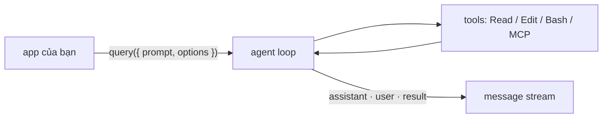

# Module 11.2: Claude Agent SDK

> **Thời gian học**: ~40 phút
>
> **Yêu cầu trước**: Module 11.1 (Headless Mode)
>
> **Kết quả**: Sau module này, bạn chạy được agent từ TypeScript hoặc Python bằng `query()`,
> giới hạn tool/permission, thêm một in-process MCP tool, và fallback sang
> `claude -p --output-format json` một cách an toàn.

---

## 1. WHY — Tại Sao Điều Này Quan Trọng

`claude -p` trong shell script đủ tốt cho việc chạy một phát là xong (Module 11.1). Nó hết đủ tốt
khi bạn cần loop nhiều turn bên trong một service, một tool do bạn viết để Claude gọi, hook chạy
*trong code của bạn* thay vì trong shell, hay message có type thay vì parse stdout. Đó là việc của
**Claude Agent SDK**: cùng engine với Claude Code, nhúng thẳng vào process của bạn.

Hai bẫy tên gọi. Tháng 9/2025, "Claude Code SDK" đổi tên thành **Claude Agent SDK**; package
`@anthropic-ai/claude-code` (npm) và `claude-code-sdk` (pip) đã ngừng. Và nó không phải
**Managed Agents**: với SDK, *bạn* chạy process; Managed Agents chạy agent loop trong sandbox do
Anthropic host, cấu hình qua Claude API.

---

## 2. CONCEPT — Ý Tưởng Cốt Lõi

Một agent chỉ chạy một vòng lặp: **gather context → take action → verify work → repeat** (S7).
`query()` khởi động vòng lặp đó cho một prompt và stream mọi message về cho bạn. SDK khởi chạy
binary Claude Code đi kèm, nên bạn có đủ tool, permission rule, CLAUDE.md và settings (qua
`settingSources`), hooks và subagent của Claude Code — không có shell ở giữa.



Option dùng ở đây (tên TypeScript; Python dùng `snake_case`):

| Option | Kiểu | Tác dụng |
|---|---|---|
| `allowedTools` | `string[]` | Tự duyệt tool được liệt kê; tool khác vẫn hiện diện và rơi xuống `permissionMode`. Rule có scope như `Bash(git diff *)` dùng được. |
| `permissionMode` | `'default' \| 'acceptEdits' \| 'plan' \| 'dontAsk' \| 'bypassPermissions' \| 'auto'` | Mức nền cho call chưa được rule nào quyết. `dontAsk` từ chối; `bypassPermissions` duyệt phần còn lại (`rm` đường dẫn critical và ask rule vẫn hỏi). |
| `systemPrompt` | `string \| { type: 'preset', preset: 'claude_code', append?: string }` | Mặc định là prompt tối giản, *không* phải prompt của Claude Code; dùng preset để lấy lại. |
| `mcpServers` | `Record<string, McpServerConfig>` | Server ngoài hoặc in-process; key → `mcp__<key>__<tool>`. |
| `hooks` | `Partial<Record<HookEvent, HookCallbackMatcher[]>>` | `PreToolUse`, `PostToolUse`, `Stop`… (Module 11.3). |
| `agents` | `Record<string, AgentDefinition>` | Subagent định nghĩa trong code. |
| `settingSources` | `('user' \| 'project' \| 'local')[]` | File settings nào được nạp. Bỏ trống = tất cả (như CLI); `[]` = không file nào (policy, `~/.claude.json`, auto memory vẫn nạp). |
| `maxTurns` | `number` | Trần số vòng gọi tool. Không có mặc định. |
| `outputFormat` | `{ type: 'json_schema', schema }` | JSON đã validate trong `result.structured_output`. |

Thứ tự xét permission cố định: hooks → deny rule → ask rule → mode → allow rule → `canUseTool`.
Call chỉ đọc (đọc file trong `cwd`, Bash read-only) không cần rule nào cả.

---

## 3. DEMO — Từng Bước

Lab: `~/cc-lab` của Module 11.1. Script nằm trong `~/cc-lab/sdk-demo/`, chạy từ `~/cc-lab` để
`cwd` là repo. Phiên bản: `@anthropic-ai/claude-agent-sdk@0.3.278`, `claude-agent-sdk==0.2.157`,
Node 22.

**Bước 1: Cài SDK**

```bash
# docs: agent-sdk/quickstart
mkdir -p ~/cc-lab/sdk-demo && cd ~/cc-lab/sdk-demo
npm init -y && npm pkg set type=module
npm install @anthropic-ai/claude-agent-sdk zod
```

```text
# Output may vary
added 103 packages, and audited 104 packages in 3s
found 0 vulnerabilities
```

Package đi kèm binary Claude Code. Đặt `ANTHROPIC_API_KEY` trong environment của process — SDK
không tự đọc file `.env`.

**Bước 2: `query()` tối thiểu, chỉ đọc**

```javascript
// sdk-demo/list-exports.mjs   docs: agent-sdk/typescript
import { query } from '@anthropic-ai/claude-agent-sdk';

for await (const message of query({
  prompt: 'List the exported functions in src/math.js',
  options: {
    allowedTools: ['Read', 'Glob'],   // tự duyệt tool chỉ đọc
    permissionMode: 'default',        // mọi thứ khác phải xin phép
    maxTurns: 3,                      // chặn cứng: không bao giờ loop vô hạn
  },
})) {
  if (message.type === 'assistant') {
    for (const block of message.message.content) {
      if (block.type === 'tool_use') console.log(`[tool] ${block.name}`, block.input);
    }
  } else if (message.type === 'result' && message.subtype === 'success') {
    console.log(`[${message.subtype}] turns=${message.num_turns} cost=$${message.total_cost_usd.toFixed(4)}`);
    console.log(message.result);          // chỉ subtype success mới có result
  }
}
```

```text
# Output may vary
$ cd ~/cc-lab && node sdk-demo/list-exports.mjs
[tool] Grep { pattern: '^(export|module\\.exports|exports\\.)', path: '/Users/luatnq/cc-lab/src/math.js', output_mode: 'content' }
[success] turns=2 cost=$0.0965
`src/math.js` exports two functions:

- `add(a, b)` — returns `a + b`
- `divide(a, b)` — returns `a / b`
```

Claude dùng `Grep`, không nằm trong `allowedTools` — call chỉ đọc không cần duyệt. Và $0.10 cho
một file hai dòng? Không có `settingSources`, SDK nạp cả `~/.claude` của máy này (user
settings, CLAUDE.md, skill). Cùng script đó với `settingSources: []` chỉ tốn `$0.0567`; số tuyệt
đối đổi theo caching, khoảng cách thì không. Mọi script bên dưới đều đặt nó.

**Bước 3: Cho phép sửa file — `acceptEdits`**

```javascript
// sdk-demo/add-function.mjs   docs: agent-sdk/permissions
import { query } from '@anthropic-ai/claude-agent-sdk';

for await (const message of query({
  prompt: 'Add an exported multiply(a, b) function to src/math.js. Do not touch other files.',
  options: {
    allowedTools: ['Read', 'Edit'],
    permissionMode: 'acceptEdits',    // Edit/Write trong cwd được tự duyệt
    maxTurns: 5,
    settingSources: [],               // bỏ qua ~/.claude và .claude/ của máy này
  },
})) {
  if (message.type === 'assistant') {
    for (const block of message.message.content) {
      if (block.type === 'tool_use') console.log(`[tool] ${block.name}`, block.input.file_path ?? '');
    }
  } else if (message.type === 'result' && message.subtype === 'success') {
    console.log(`[${message.subtype}] turns=${message.num_turns} cost=$${message.total_cost_usd.toFixed(4)}`);
    console.log(message.result);          // chỉ subtype success mới có result
  }
}
```

```text
# Output may vary
$ node sdk-demo/add-function.mjs && git diff src/math.js
[tool] Read /Users/luatnq/cc-lab/src/math.js
[tool] Edit /Users/luatnq/cc-lab/src/math.js
[success] turns=3 cost=$0.0347
Added `export function multiply(a, b) { return a * b; }` to `src/math.js`, matching the existing one-line style of `add` and `divide`. No other files were changed.
diff --git a/src/math.js b/src/math.js
@@ -1,2 +1,3 @@
 export function add(a, b) { return a + b; }
 export function divide(a, b) { return a / b; }
+export function multiply(a, b) { return a * b; }
```

Hoàn tác: `git checkout src/math.js`.

**Bước 4: In-process tool với `tool()` + `createSdkMcpServer()`**

```javascript
// sdk-demo/build-status.mjs   docs: agent-sdk/custom-tools
import { query, tool, createSdkMcpServer } from '@anthropic-ai/claude-agent-sdk';
import { z } from 'zod';

// Mô tả tool như đang brief cho new hire: trả về gì, khi nào dùng.
const getBuildStatus = tool(
  'get_build_status',
  'Return the latest CI build status for a git branch of this repo. Use it before answering any question about whether a branch is green.',
  { branch: z.string().describe('Branch name, e.g. main') },
  async ({ branch }) => ({
    content: [{ type: 'text', text: JSON.stringify({ branch, status: 'failed', failing_job: 'unit-tests', build: 1842 }) }],
  }),
  { annotations: { readOnlyHint: true } },
);

const ci = createSdkMcpServer({ name: 'ci', version: '1.0.0', tools: [getBuildStatus] });

for await (const message of query({
  prompt: 'Is the main branch build green? Answer in one sentence.',
  options: {
    mcpServers: { ci },                            // key "ci" → tên tool mcp__ci__get_build_status
    allowedTools: ['mcp__ci__get_build_status'],
    permissionMode: 'default',
    maxTurns: 3,
    settingSources: [],
  },
})) {
  if (message.type === 'assistant') {
    for (const block of message.message.content) {
      if (block.type === 'tool_use') console.log(`[tool] ${block.name}`, block.input);
    }
  } else if (message.type === 'result' && message.subtype === 'success') {
    console.log(message.result);
  }
}
```

```text
# Output may vary
[tool] ToolSearch { query: 'select:mcp__ci__get_build_status', max_results: 1 }
[tool] mcp__ci__get_build_status { branch: 'main' }
No — the latest main build (#1842) is failing on the `unit-tests` job.
```

Handler chạy ngay trong process Node của bạn. `ToolSearch` là tool search (bật mặc định) đang
nạp schema bị hoãn.

**Bước 5: Bản Python tương đương**

```bash
# docs: agent-sdk/python
cd ~/cc-lab/sdk-demo && python3 -m venv .venv && .venv/bin/pip install claude-agent-sdk
```

```python
# sdk-demo/list_exports.py
import asyncio
from claude_agent_sdk import query, ClaudeAgentOptions, AssistantMessage, ResultMessage, ToolUseBlock


async def main():
    options = ClaudeAgentOptions(
        allowed_tools=["Read", "Glob"],
        permission_mode="default",
        max_turns=3,
        setting_sources=[],
    )
    async for message in query(prompt="List the exported functions in src/math.js", options=options):
        if isinstance(message, AssistantMessage):
            for block in message.content:
                if isinstance(block, ToolUseBlock):
                    print(f"[tool] {block.name} {block.input}")
        elif isinstance(message, ResultMessage) and message.subtype == "success":
            print(f"[{message.subtype}] turns={message.num_turns} cost=${message.total_cost_usd or 0:.4f}")
            print(message.result)


asyncio.run(main())
```

```text
# Output may vary
$ cd ~/cc-lab && sdk-demo/.venv/bin/python sdk-demo/list_exports.py
[tool] Grep {'pattern': '^(export|module\\.exports|exports\\.)', 'path': '/Users/luatnq/cc-lab/src/math.js', 'output_mode': 'content'}
[success] turns=2 cost=$0.0533
`src/math.js` exports two functions:

- `add(a, b)` — returns `a + b`
- `divide(a, b)` — returns `a / b`
```

**Bước 6: Fallback subprocess an toàn**

Ngôn ngữ khác thì chạy CLI như subprocess. Hai luật: tham số truyền dạng **mảng** (không bao giờ
ghép chuỗi shell), và `--output-format json` cộng `--json-schema`.

```javascript
// sdk-demo/subprocess-fallback.mjs   docs: headless, cli-reference
import { execFileSync } from 'node:child_process';

const prompt = process.argv[2] ?? 'List the exported functions in src/math.js';
const schema = JSON.stringify({
  type: 'object',
  properties: { functions: { type: 'array', items: { type: 'string' } } },
  required: ['functions'],
});

// Tham số đi trong mảng: prompt không bao giờ bị nội suy vào chuỗi shell.
const stdout = execFileSync('claude', [
  '-p', prompt,
  '--output-format', 'json',
  '--json-schema', schema,
  '--allowedTools', 'Read',
  '--permission-mode', 'default',
  '--max-turns', '3',
], { encoding: 'utf8', timeout: 120_000, maxBuffer: 10 * 1024 * 1024 });

const data = JSON.parse(stdout);             // an toàn: --output-format json luôn là JSON
console.log(data.structured_output);          // đã validate theo schema
console.log(`cost=$${data.total_cost_usd.toFixed(4)} session=${data.session_id}`);
```

```text
# Output may vary
$ node sdk-demo/subprocess-fallback.mjs 'List the exported functions in src/math.js; the file has "quotes" and $(dollar) in this prompt on purpose'
{ functions: [ 'add', 'divide' ] }
cost=$0.4687 session=324de8c2-c77b-4446-86f7-cf4746d2a0aa
```

Dấu nháy và `$(dollar)` tới Claude dưới dạng text; nếu ghép vào chuỗi lệnh shell, chúng đã chạy
trong shell của bạn. `--permission-mode default` ép về hành vi gốc; trên máy mới cài bạn
nhận cùng kết quả mà không cần nó, trừ khi `settings.json` đặt `permissions.defaultMode`.

---

## 4. PRACTICE — Thực Hành

### Bài 1: Review diff với Bash rule có scope

**Mục tiêu**: Review `git diff main` từ SDK mà không cấp quyền shell chung.

**Hướng dẫn**:
1. Trong `~/cc-lab`, tạo branch, thêm `average(xs)` có bug vào `src/math.js`; commit.
2. Viết `sdk-demo/review-diff.mjs` với `allowedTools: ['Read', 'Bash(git diff *)']` và
   `permissionMode: 'dontAsk'`.
3. In từng tool call và `result.permission_denials.length`.

**Kết quả mong đợi**: một call `Bash git diff …`, `denied=0`, danh sách bắt được `average([])` →
`NaN`.

<details>
<summary>💡 Gợi ý</summary>

Khoảng trắng trước `*` trong `Bash(git diff *)` rất quan trọng. `dontAsk` biến mọi call lẽ ra phải
hỏi thành một denial nằm trong `permission_denials`, thay vì treo ở prompt không ai trả lời.

</details>

<details>
<summary>✅ Lời giải</summary>

```javascript
// sdk-demo/review-diff.mjs   docs: agent-sdk/permissions
import { query } from '@anthropic-ai/claude-agent-sdk';

const base = process.argv[2] ?? 'main';

for await (const message of query({
  prompt: `Run "git diff ${base}" and review the changes. Report bugs and edge cases as a bullet list. Do not edit files.`,
  options: {
    allowedTools: ['Read', 'Bash(git diff *)'],   // git diff thì được; Bash khác rơi xuống mode
    permissionMode: 'dontAsk',                     // ...và "rơi xuống" nghĩa là bị từ chối
    maxTurns: 5,
    settingSources: [],
  },
})) {
  if (message.type === 'assistant') {
    for (const block of message.message.content) {
      if (block.type === 'tool_use') console.log(`[tool] ${block.name}`, block.input.command ?? block.input.file_path ?? '');
    }
  } else if (message.type === 'result') {
    console.log(`[${message.subtype}] denied=${message.permission_denials.length}`);
    if (message.subtype === 'success') console.log(message.result);
  }
}
```

```text
# Output may vary
[tool] Bash git diff main --stat && git diff main
[success] denied=0
Reviewed the diff against `main` — two new functions in `src/math.js`:

**`average(xs)`**
- **Empty array returns `NaN`**: `[].reduce(..., 0) / 0` → `0 / 0` → `NaN`. Callers likely expect a thrown error or a defined sentinel, not a silent `NaN` that propagates.
- **No input validation**: `average(null)` / `average(undefined)` throws `TypeError` on `.reduce`; …
- **Sparse arrays**: `reduce` skips holes but `.length` counts them, so `average([1, , 3])` → `4 / 3`, not `2`.
…
```

</details>

### Bài 2: Retry + giới hạn concurrency trên `query()`

**Mục tiêu**: Xử lý N file, 2 session cùng lúc, 3 lần thử có backoff.

**Hướng dẫn**:
1. `runOnce(prompt)` chạy một `query()` và throw nếu `result.subtype !== 'success'`.
2. `withRetry(prompt, retries = 3)` với backoff 1s, rồi 2s.
3. Chia prompt thành chunk với `Promise.all`; in tổng kết.

**Kết quả mong đợi**: `Summary: 3 succeeded, 0 failed`.

<details>
<summary>💡 Gợi ý</summary>

`chunk.map(withRetry)` truyền index của mảng vào `retries`. Bọc lại:
`chunk.map((p) => withRetry(p))`.

</details>

<details>
<summary>✅ Lời giải</summary>

```javascript
// sdk-demo/batch.mjs   docs: agent-sdk/typescript
import { query } from '@anthropic-ai/claude-agent-sdk';

const sleep = (ms) => new Promise((r) => setTimeout(r, ms));

async function runOnce(prompt) {
  let result;
  for await (const m of query({
    prompt,
    options: { allowedTools: ['Read', 'Glob'], permissionMode: 'dontAsk', maxTurns: 3, settingSources: [] },
  })) {
    if (m.type === 'result') result = m;
  }
  if (!result || result.subtype !== 'success') throw new Error(result?.subtype ?? 'no result');
  return result.result;
}

async function withRetry(prompt, retries = 3) {
  for (let attempt = 1; attempt <= retries; attempt++) {
    try {
      return { ok: true, attempts: attempt, output: await runOnce(prompt) };
    } catch (err) {
      console.error(`attempt ${attempt}/${retries} failed: ${err.message}`);
      if (attempt === retries) return { ok: false, attempts: attempt, error: err.message };
      await sleep(2 ** (attempt - 1) * 1000);   // 1s, then 2s
    }
  }
}

async function batch(prompts, concurrency = 2) {
  const results = [];
  for (let i = 0; i < prompts.length; i += concurrency) {
    const chunk = prompts.slice(i, i + concurrency);
    results.push(...(await Promise.all(chunk.map((p) => withRetry(p)))));
  }
  return results;
}

const files = process.argv.slice(2);
const results = await batch(files.map((f) => `In one sentence, what does ${f} do?`));
results.forEach((r, i) => console.log(r.ok ? `✅ ${files[i]} (${r.attempts} attempt) ${r.output}` : `❌ ${files[i]} ${r.error}`));
console.log(`Summary: ${results.filter((r) => r.ok).length} succeeded, ${results.filter((r) => !r.ok).length} failed`);
```

```text
# Output may vary
$ node sdk-demo/batch.mjs src/math.js tests/math.test.mjs package.json
✅ src/math.js (1 attempt) `src/math.js` exports four small arithmetic helpers — `add`, `subtract`, `divide`, and `average` …
✅ tests/math.test.mjs (1 attempt) It defines a single Node.js test … asserts that `add(1, 2)` equals `3`.
✅ package.json (1 attempt) `package.json` is the Node.js project manifest for `cc-lab` …
Summary: 3 succeeded, 0 failed
```

</details>

### Bài 3: Structured output qua subprocess

**Mục tiêu**: Hàm nào trong `src/math.js` có thể trả `NaN`/`Infinity`? Lấy về danh sách có type.

**Hướng dẫn**: copy Bước 6, đổi schema thành `{ risky: [{ name, reason }] }`, và fail ngay nếu
`is_error` hoặc thiếu `structured_output`.

<details>
<summary>✅ Lời giải</summary>

```javascript
// sdk-demo/risky-functions.mjs   docs: headless
import { execFileSync } from 'node:child_process';

const schema = JSON.stringify({
  type: 'object',
  properties: {
    risky: {
      type: 'array',
      items: {
        type: 'object',
        properties: { name: { type: 'string' }, reason: { type: 'string' } },
        required: ['name', 'reason'],
      },
    },
  },
  required: ['risky'],
});

const stdout = execFileSync('claude', [
  '-p', 'Which functions in src/math.js can return NaN or Infinity for some input? Explain each in one short sentence.',
  '--output-format', 'json',
  '--json-schema', schema,
  '--allowedTools', 'Read',
  '--permission-mode', 'default',
  '--max-turns', '3',
], { encoding: 'utf8', timeout: 120_000 });

const { structured_output, is_error, num_turns } = JSON.parse(stdout);
if (is_error || !structured_output) throw new Error('no structured output');
console.log(`turns=${num_turns}`);
for (const f of structured_output.risky) console.log(`- ${f.name}: ${f.reason}`);
```

```text
# Output may vary
turns=3
- divide: Dividing by 0 returns Infinity/-Infinity, and 0/0 returns NaN.
- average: An empty array computes 0 / 0, which is NaN.
- add: Only on overflow (MAX_VALUE + MAX_VALUE → Infinity) or non-finite inputs …
- subtract: Only on overflow (-MAX_VALUE - MAX_VALUE → -Infinity) or non-finite inputs …
```

</details>

---

## 5. CHEAT SHEET

| TypeScript | Python | Ghi chú |
|---|---|---|
| `npm install @anthropic-ai/claude-agent-sdk` | `pip install claude-agent-sdk` | `@anthropic-ai/claude-code` / `claude-code-sdk` cũ đã ngừng |
| `import { query } from '@anthropic-ai/claude-agent-sdk'` | `from claude_agent_sdk import query, ClaudeAgentOptions` | |
| `for await (const m of query({ prompt, options }))` | `async for m in query(prompt=…, options=…)` | |
| `m.type === 'assistant'` → `m.message.content` | `isinstance(m, AssistantMessage)` → `m.content` | `tool_use` / `ToolUseBlock` |
| `m.type === 'result'` → `subtype`, `result`, `num_turns`, `total_cost_usd`, `structured_output`, `permission_denials` | `isinstance(m, ResultMessage)` → cùng field | `subtype`: `success`, `error_max_turns`, … |
| `tool(name, desc, zodShape, handler, { annotations })` | `@tool(name, desc, {"arg": type})` | Trả `{ content: [{ type: 'text', text }] }` |
| `createSdkMcpServer({ name, version, tools })` | `create_sdk_mcp_server(name=, version=, tools=)` | `mcpServers: { name: server }`; allow `mcp__name__tool` |
| `outputFormat: { type: 'json_schema', schema }` | `output_format={"type": "json_schema", "schema": …}` | Đọc `structured_output` |

Flag subprocess (`claude -p`): `--output-format json` (`result`, `session_id`, `total_cost_usd`,
`is_error`, `num_turns`), `--json-schema '<schema>'` → `structured_output`,
`--allowedTools "Read,Bash(git diff *)"`, `--permission-mode default|acceptEdits|dontAsk`,
`--max-turns N`, `--max-budget-usd N`. `--bare` bỏ qua hooks/plugin/CLAUDE.md nhưng cần
`ANTHROPIC_API_KEY`. Bảng option: §2.

---

## 6. PITFALLS — Lỗi Thường Gặp

| ❌ Sai lầm | ✅ Cách đúng |
|---|---|
| ``execSync(`claude -p "${prompt}"`)`` — prompt chứa `"; rm -rf ~` sẽ chạy trong shell của bạn | `execFileSync('claude', ['-p', prompt, …])` — mảng argv, không qua shell |
| `JSON.parse` trên `--output-format text` | `--output-format json`, thêm `--json-schema` khi cần đúng shape |
| `permissionMode: 'bypassPermissions'` trong server — `allowedTools` không ràng buộc được nó | `allowedTools` hẹp + `dontAsk` (hoặc `acceptEdits`), chạy trong sandbox |
| Không đặt `maxTurns` — agent lú là loop tới khi hết tiền | `maxTurns` cho mọi `query()`; `maxBudgetUsd` cho tiền |
| Model ID có ngày tháng cứng | Alias: `'sonnet'`, `'opus'`, `'haiku'` |
| Tưởng mặc định có system prompt của Claude Code — hay còn CLAUDE.md sau khi đặt `settingSources: []` | `systemPrompt: { type: 'preset', preset: 'claude_code' }`; thêm lại `'project'` vào `settingSources` |
| Lẫn Agent SDK với Client SDK / Messages API (Module 12.3) | Client SDK: bạn tự viết tool loop. Agent SDK: loop, tool, permission có sẵn |

---

## 7. REAL CASE — Câu Chuyện Thực Tế

**Bối cảnh**: Một team fintech ở TP.HCM vận hành service review PR nội bộ: mọi pull request trên
backend Kotlin được máy review vòng đầu trước khi tới reviewer người.

**Vấn đề**: Bản đầu là script Node ghép prompt vào chuỗi lệnh shell rồi `JSON.parse` trên
stdout. Tiêu đề PR có dấu nháy làm vỡ lệnh; một câu trả lời sai format đánh sập pipeline. Reviewer
thôi tin nó.

**Giải pháp**: Viết lại trên Agent SDK: `query()` cho mỗi PR, `allowedTools: ['Read', 'Grep',
'Bash(git diff *)']`, `permissionMode: 'dontAsk'`, `maxTurns: 8`, `settingSources: ['project']` để
CLAUDE.md và `.claude/` của repo được nạp còn settings trong `~/.claude` của runner thì không
(`~/.claude.json` và auto memory vẫn nạp; không phải ranh giới cô lập multi-tenant). Kết quả
trả về qua `outputFormat` dạng JSON để bot GitHub đăng. Hai in-process tool, `get_ci_status` và
`get_ticket`, thay cho prompt text; team giữ ít tool và mô tả từng tool như đang onboard new hire
(S9). Như bài viết C compiler của Anthropic, tool ghi toàn bộ CI log ra file và
chỉ trả vài dòng lỗi vào context (S14).

**Kết quả**: Không còn bề mặt shell injection, output đã validate theo schema, chi phí mỗi PR nằm
ở `total_cost_usd`. Không công bố con số độ chính xác; reviewer đọc lại comment của bot.

---

> **Tiếp theo**: [Module 11.3: Hooks System](../03-hooks-system/) →
