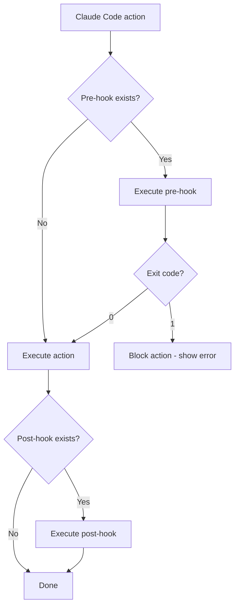

# Module 11.3: Hệ thống Hook

> **Thời gian học**: ~30 phút
>
> **Yêu cầu trước**: Module 11.2 (SDK Integration)
>
> **Kết quả**: Sau module này, bạn sẽ hiểu hook concept, biết common pattern, và implement custom hook cho workflow của mình.

---

## 1. WHY — Tại sao cần Hook?

Claude Code write file → bạn muốn intercept thêm logic: lint check, audit log, Slack notify, block sensitive files. Hook cho phép tự động intercept code tại moment cần thiết. **Ví von**: Pre-hook = kiểm tra trước vào. Post-hook = ghi log sau. Không hook = phải manual post-process.

---

## 2. CONCEPT — Khái niệm Hook System

**Hook** là custom code chạy tại specific event trong Claude Code lifecycle. Giống Git hooks, middleware, hoặc lifecycle methods.

### Hook Types

| Hook Type | Thời điểm chạy | Có block được? | Use Case |
|-----------|-----------------|----------------|----------|
| **Pre-hook** | Trước action | ✅ Exit 1 = block | Validation, lint, backup |
| **Post-hook** | Sau action | ❌ Không undo | Logging, notification, cleanup |

### Hook Events ⚠️ Cần xác minh

Các event có thể có trong hook system:

| Event | Khi nào trigger | Typical Use Case |
|-------|-----------------|------------------|
| `pre-file-write` | Trước khi write file | Lint check, format validation |
| `post-file-write` | Sau khi write file | Audit log, git add, notify |
| `pre-command` | Trước execute command | Security check, approval gate |
| `post-command` | Sau command xong | Log result, metrics |
| `post-session` | Session end | Summary report, cleanup, Slack |

### Hook Script Interface

Hook nhận context via env vars: `CLAUDE_EVENT`, `CLAUDE_FILE_PATH`, `CLAUDE_SESSION_ID`, `CLAUDE_USER`. Exit code: `0`=allow, `1`=block (pre-hook only).

### Hook Flow



### Hook Configuration

Hook config trong JSON file `hooks.json`: `{ "hooks": { "event": "./path/script.sh" } }`

---

## 3. DEMO — Setup Hook Workflow

**Scenario**: Team setup hook cho workflow gồm lint check, audit log, và Slack notification.

### Step 1-2: Setup & Logging hook

```bash
mkdir -p ~/claude-projects/my-app/.claude/hooks
cd ~/claude-projects/my-app/.claude/hooks
```

Tạo `audit-log.sh` — log mọi file change:

```bash
cat > audit-log.sh << 'EOF'
#!/bin/bash
# Post-hook: Audit log for file changes

TIMESTAMP=$(date -u +"%Y-%m-%dT%H:%M:%SZ")
LOG_FILE=".claude/audit.log"

# Create JSON log entry
echo "{
  \"timestamp\": \"$TIMESTAMP\",
  \"event\": \"$CLAUDE_EVENT\",
  \"file\": \"$CLAUDE_FILE_PATH\",
  \"session\": \"$CLAUDE_SESSION_ID\",
  \"user\": \"$CLAUDE_USER\"
}" >> "$LOG_FILE"

echo "✓ Logged change to $LOG_FILE"
exit 0
EOF

chmod +x audit-log.sh
```

### Step 3: Lint check hook (pre-file-write)

```bash
cat > lint-check.sh << 'EOF'
#!/bin/bash
FILE="$CLAUDE_FILE_PATH"
if [[ "$FILE" =~ \.(ts|js)$ ]]; then
  npx eslint "$FILE" --quiet && exit 0
  echo "❌ Lint check failed - blocking write"
  exit 1
fi
exit 0
EOF
chmod +x lint-check.sh
```

### Step 4: Notification hook (post-session)

Tạo `notify-slack.sh` — gửi summary khi session end:

```bash
cat > notify-slack.sh << 'EOF'
#!/bin/bash
# Post-hook: Slack notification
AUDIT_COUNT=$(wc -l < .claude/audit.log 2>/dev/null || echo 0)
curl -X POST "$SLACK_WEBHOOK_URL" \
  -H 'Content-Type: application/json' \
  -d "{\"text\": \"Claude session done. Files: $AUDIT_COUNT\"}" \
  --silent
exit 0
EOF
chmod +x notify-slack.sh
```

Expected output:
```
# File created and made executable
```

### Step 5: Configure & Test

Tạo `hooks.json`:

```bash
cat > ../hooks.json << 'EOF'
{
  "hooks": {
    "pre-file-write": ".claude/hooks/lint-check.sh",
    "post-file-write": ".claude/hooks/audit-log.sh",
    "post-session": ".claude/hooks/notify-slack.sh"
  }
}
EOF
```

Test the hooks:

Write file qua Claude Code & verify hooks trigger:

```bash
claude -p "Add error handling to src/utils.ts"
# Expected: lint check runs, then audit log created, Slack sent

cat .claude/audit.log  # Verify log entries exist
```

---

## 4. PRACTICE — Tự làm

### Exercise 1: Audit Log Hook

**Goal**: Tạo post-file-write hook log change với format CSV cho Excel import

**Instructions**:
1. Tạo `audit-csv.sh` trong `.claude/hooks/`
2. Format: `timestamp,file,user`
3. Append vào `.claude/audit.csv`
4. Test bằng cách cho Claude write file

**Expected result**: File `.claude/audit.csv` có entry mới mỗi lần write

<details>
<summary>💡 Hint</summary>

Dùng `date`, `echo` với `>>`, CSV format đơn giản.

</details>

<details>
<summary>✅ Solution</summary>

```bash
#!/bin/bash
# audit-csv.sh

TIMESTAMP=$(date -u +"%Y-%m-%dT%H:%M:%SZ")
CSV_FILE=".claude/audit.csv"

# Create header if file doesn't exist
if [[ ! -f "$CSV_FILE" ]]; then
  echo "timestamp,file,user" > "$CSV_FILE"
fi

# Append entry
echo "$TIMESTAMP,$CLAUDE_FILE_PATH,$CLAUDE_USER" >> "$CSV_FILE"

echo "✓ Logged to CSV"
exit 0
```

Đừng quên `chmod +x` và add vào `hooks.json`.

</details>

---

### Exercise 2: Protection Hook

**Goal**: Tạo pre-file-write hook block write vào sensitive files

**Instructions**:
1. Tạo `protect-sensitive.sh`
2. Block write vào `.env`, `*.key`, `config/production.json`
3. Show error message khi block
4. Test bằng cách try write vào `.env`

**Expected result**: Write vào `.env` bị block với clear error message

<details>
<summary>💡 Hint</summary>

Pattern matching `[[ "$FILE" =~ pattern ]]`, exit 1 để block.

</details>

<details>
<summary>✅ Solution</summary>

```bash
#!/bin/bash
# protect-sensitive.sh

FILE="$CLAUDE_FILE_PATH"

# Check sensitive patterns
if [[ "$FILE" == ".env" ]] || \
   [[ "$FILE" =~ \.key$ ]] || \
   [[ "$FILE" == "config/production.json" ]]; then

  echo "❌ BLOCKED: Cannot modify sensitive file"
  echo "File: $FILE"
  echo "Manual review required for production changes"
  exit 1
fi

# Allow all other files
exit 0
```

Add vào hooks.json:
```json
{
  "hooks": {
    "pre-file-write": ".claude/hooks/protect-sensitive.sh"
  }
}
```

</details>

---

### Exercise 3: Notification Pipeline

**Goal**: Tạo post-session hook gửi summary qua Discord webhook

**Instructions**:
1. Tạo `notify-discord.sh`
2. Count files changed từ audit log
3. Send Discord webhook với embed format
4. Test sau khi end session

**Expected result**: Discord message với summary sau session

<details>
<summary>💡 Hint</summary>

Discord dùng `embeds` array khác Slack `text` format.

</details>

<details>
<summary>✅ Solution</summary>

```bash
#!/bin/bash
# notify-discord.sh
AUDIT_COUNT=$(wc -l < .claude/audit.log 2>/dev/null || echo 0)
PAYLOAD="{\"content\": \"Claude session done - Files: $AUDIT_COUNT, User: $CLAUDE_USER\"}"
curl -X POST "$DISCORD_WEBHOOK_URL" \
  -H 'Content-Type: application/json' \
  -d "$PAYLOAD" \
  --silent
exit 0
```

Set environment variable:
```bash
export DISCORD_WEBHOOK_URL="https://discord.com/api/webhooks/..."
```

</details>

---

## 5. CHEAT SHEET

### Hook Types

| Type | Timing | Can Block? | Common Use |
|------|--------|------------|------------|
| Pre-hook | Before action | ✅ Yes (exit 1) | Validation, lint, approval |
| Post-hook | After action | ❌ No | Logging, notification, metrics |

### Hook Script Template

```bash
#!/bin/bash
# Hook: [event-name]

# Available env vars:
# - CLAUDE_EVENT
# - CLAUDE_FILE_PATH (file hooks)
# - CLAUDE_SESSION_ID
# - CLAUDE_USER

# Your logic here

# Pre-hook exit codes:
exit 0  # Allow action
exit 1  # Block action

# Post-hook:
exit 0  # Success
```

### Hook Configuration ⚠️ Cần xác minh

```json
{
  "hooks": {
    "event-name": "path/to/script.sh"
  },
  "hookTimeout": 30000
}
```

**Config location**: `.claude/hooks.json` (⚠️ Cần xác minh)

### Quick Commands

```bash
# Make hook executable
chmod +x .claude/hooks/my-hook.sh

# Test hook manually
CLAUDE_EVENT=post-file-write \
CLAUDE_FILE_PATH=test.ts \
.claude/hooks/my-hook.sh

# Check hook exit code
echo $?  # 0 = success, 1 = blocked/failed

# Debug hook
bash -x .claude/hooks/my-hook.sh  # Show execution trace
```

---

## 6. PITFALLS — Lỗi thường gặp

| ❌ Mistake | ✅ Correct Approach |
|-----------|---------------------|
| Quên `chmod +x` | Always `chmod +x` sau tạo script |
| Dùng exit 1 trong post-hook | Post-hook chạy sau — không undo. Dùng pre-hook block. |
| Hook chạy slow | Keep <500ms, dùng async cho slow ops |
| Hardcode path | Dùng env variables, portable |
| Hook fail silent | Check exit code, add debug echo |
| Không test standalone | Test manual với mock env vars trước |

---

## 7. REAL CASE — Production Audit Trail

**Scenario**: Fintech company Việt Nam cần audit trail cho mọi code change bởi AI. Compliance regulation mandate log WHO changed WHAT WHEN và WHY.

**Problem**:
- Dev dùng Claude Code viết code
- Compliance team cần audit log export mỗi tháng
- Manual logging không practical — dev quên hoặc bỏ qua

**Solution**: Hook-based audit system

**Implementation**:

```bash
#!/bin/bash
# .claude/hooks/audit-log.sh — Key parts only
TIMESTAMP=$(date -u +"%Y-%m-%dT%H:%M:%SZ")
LOG_ENTRY="{\"timestamp\": \"$TIMESTAMP\", \"file\": \"$CLAUDE_FILE_PATH\", \"user\": \"$CLAUDE_USER\"}"
echo "$LOG_ENTRY" >> /var/log/claude-audit/audit.jsonl
# Async send to central service
(curl -X POST https://logs.company.internal/audit -d "$LOG_ENTRY" --silent &) &
exit 0
```

Hook config:

```json
{
  "hooks": {
    "post-file-write": ".claude/hooks/audit-log.sh",
    "post-command": ".claude/hooks/audit-log.sh"
  }
}
```

**Result**: 100% audit coverage, zero manual logging, compliance export automated, dev workflow unaffected.

---

> **Tiếp theo**: [Module 11.4: GitHub Actions Integration](../04-github-actions/) →
