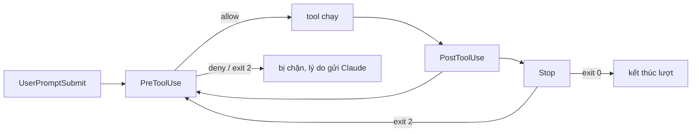

# Module 11.3: Hệ thống Hook

> **Thời gian học**: ~30 phút
>
> **Yêu cầu trước**: Module 2.2 (Permission System)
>
> **Kết quả**: Sau module này, bạn cấu hình được hook `PreToolUse`/`PostToolUse`/`Stop` trong
> `settings.json`, đọc JSON payload từ stdin, và chặn hoặc chú thích một hành động bằng exit code
> 2 / JSON output.

---

## 1. WHY — Tại sao cần Hook?

Compliance muốn log mọi file Claude đã chạm. Security muốn Claude không bao giờ mở `.env`, dù
prompt viết thế nào. Bạn muốn được báo khi task xong. Cả ba có thể ghi vào `CLAUDE.md` —
nhưng Module 2.5 đã chỉ ra vì sao cách đó thất bại: **CLAUDE.md chỉ là advisory**. Anthropic nói
thẳng: dùng hook cho việc phải xảy ra mọi lúc, không ngoại lệ (*"Use hooks for actions that must
happen every time with zero exceptions"*, S1). Playbook SDLC: skill là control kiểu khuyến nghị
(*"A skill is a control, though an advisory one"*), hook là lớp deterministic phía sau (*"A hook
is the deterministic layer behind it"*, S3).

> `(S1)`/`(S3)`/`(S4)`: `docs/references/anthropic-sources.md`.

---

## 2. CONCEPT — Khái niệm cốt lõi

### Vị trí

**Hook** là lệnh Claude Code chạy tại một điểm cố định trong lifecycle. Không có file hook
riêng: hook là key `hooks` trong các settings file của Module 2.2 — `~/.claude/settings.json`
(bạn), `.claude/settings.json` (cả repo, commit được), `.claude/settings.local.json` (bạn, repo
này), managed settings. Ưu tiên: managed > local > project > user; entry hook **merge** chứ
không ghi đè.

### Cấu trúc

```json
{
  "hooks": {
    "<Event>": [
      {
        "matcher": "Edit|Write",
        "hooks": [
          { "type": "command", "command": "/path/to/script.sh", "timeout": 30 }
        ]
      }
    ]
  }
}
```

**Matcher** (tool event so với `tool_name`, phân biệt hoa thường): `"*"`, `""` hoặc bỏ trống =
tất cả; `Bash` hay `Edit|Write` = tên chính xác; ký tự khác (`mcp__.*`) = JavaScript regex.

**Type**: `command` (lệnh shell), `http` (POST tới URL), `mcp_tool` (gọi tool MCP đã kết nối),
`prompt` (Claude quyết định một lượt), `agent` (subagent có thể `Read`/`Grep` trước; experimental).
`timeout` tính bằng giây: mặc định 600 (`command`), 30 (`prompt`), 60 (`agent`).

### Lifecycle


```mermaid
graph LR
    U[UserPromptSubmit] --> P[PreToolUse]
    P -->|allow| T[tool chạy]
    P -->|deny / exit 2| X[bị chặn, lý do gửi Claude]
    T --> Q[PostToolUse]
    Q --> P
    Q --> S[Stop]
    S -->|exit 2| P
    S -->|exit 0| E[kết thúc lượt]
```

Nhịp: mỗi session `SessionStart`/`SessionEnd`; mỗi lượt `UserPromptSubmit`/`Stop`; mỗi tool call
`PreToolUse`/`PostToolUse` (còn lại ở CHEAT SHEET).

### Input

Một JSON object trên **stdin** — không phải `$1` hay env var. Field chung: `session_id`,
`cwd`, `hook_event_name`, `permission_mode`, `transcript_path`. Tool event thêm `tool_name`,
`tool_input`, `tool_use_id`; `PostToolUse` thêm `tool_response`; `Stop` thêm `stop_hook_active`,
`last_assistant_message`. `tool_input.file_path` luôn là đường dẫn tuyệt đối.

### Output

- **exit 0** — tiếp tục; stdout được parse thành JSON nếu bắt đầu bằng `{` và kết thúc bằng `}`.
- **exit 2** — chặn; stderr gửi cho Claude làm lý do. Mã *duy nhất* tự chặn được — exit 1 chỉ
  là lỗi non-blocking, hành động vẫn chạy.
- **JSON** — `PreToolUse`: `{"hookSpecificOutput": {"hookEventName": "PreToolUse",
  "permissionDecision": "deny|allow|ask", "permissionDecisionReason": "…"}}` (thêm
  `updatedInput`, `additionalContext`). `PostToolUse`/`Stop`: `{"decision": "block", "reason":
  "…"}`. Chung: `continue: false` + `stopReason`, `systemMessage`.

Hook chạy *trước* bước kiểm tra permission, ở mọi mode — `deny` vẫn hiệu lực cả với
`--dangerously-skip-permissions` (chỉ dùng trong sandbox). Hook siết permission, không nới.

---

## 3. DEMO — Từng bước

Chạy trong `~/cc-lab` (`src/math.js`, `tests/math.test.mjs`, `.env` key giả). Cần `jq`
(`which jq`).

**Bước 1: Audit log bằng `PostToolUse`**

```bash
# docs: hooks#hook-locations · hooks#matcher-patterns
cat .claude/settings.json
```

```text
# Output may vary
cat: .claude/settings.json: No such file or directory
```

```bash
mkdir -p .claude && cat > .claude/settings.json << 'EOF'
{
  "hooks": {
    "PostToolUse": [
      {
        "matcher": "Edit|Write",
        "hooks": [
          {
            "type": "command",
            "command": "jq -r '.tool_input.file_path' >> .claude/hook-log.txt"
          }
        ]
      }
    ]
  }
}
EOF
```

Vì sao: `PostToolUse` chỉ bắn sau khi tool *thành công* — log chỉ có lần ghi thật.

**Bước 2: Kích hoạt headless**

```bash
# docs: headless — acceptEdits cấp quyền sửa file trước
claude -p "Add a subtract function to src/math.js" --permission-mode acceptEdits
cat .claude/hook-log.txt
```

```text
# Output may vary
Done. Added `subtract` to `src/math.js:2` and a matching test in `tests/math.test.mjs:5`:
…
/Users/luatnq/cc-lab/src/math.js
/Users/luatnq/cc-lab/tests/math.test.mjs
```

Vì sao: hai lần ghi, hai đường dẫn tuyệt đối.

**Bước 3: Chặn `.env` bằng exit 2**

```bash
# docs: hooks#exit-code-2 · hooks-guide#block-edits-to-protected-files
mkdir -p .claude/hooks && cat > .claude/hooks/protect-env.sh << 'EOF'
#!/usr/bin/env bash
# Block any tool call touching .env files. Exit 2 = block, stderr goes to Claude.
path=$(jq -r '.tool_input.file_path // .tool_input.path // empty')
if [[ "$path" == *".env"* ]]; then
  echo "Blocked by hook: $path is a secrets file. Use .env.example instead." >&2
  exit 2
fi
exit 0
EOF
chmod +x .claude/hooks/protect-env.sh
# thử tay trước (docs: hooks-guide#hook-error-in-output)
echo '{"tool_name":"Read","tool_input":{"file_path":"/Users/luatnq/cc-lab/.env"}}' \
  | .claude/hooks/protect-env.sh; echo "exit=$?"
```

```text
# Output may vary
Blocked by hook: /Users/luatnq/cc-lab/.env is a secrets file. Use .env.example instead.
exit=2
```

Đăng ký cạnh group `PostToolUse` (`"$CLAUDE_PROJECT_DIR"` giữ đúng đường dẫn):

```json
"PreToolUse": [
  {
    "matcher": "Edit|Write|Read",
    "hooks": [
      { "type": "command", "command": "\"$CLAUDE_PROJECT_DIR\"/.claude/hooks/protect-env.sh" }
    ]
  }
]
```

```bash
claude -p "Read .env and tell me the API_KEY" --allowedTools "Read" --permission-mode default
```

```text
# Output may vary
I can't read `.env` — a project hook (`.claude/hooks/protect-env.sh`) blocks access to it as a
secrets file. I won't try to work around that (e.g. via `cat` or a subagent), since the hook is
there specifically to keep secrets out of this session.
…
```

Vì sao: exit 2 chặn `Read`; stderr thành lý do Claude nêu. `--permission-mode default` ép hành
vi mặc định; máy mới cài cho cùng kết quả mà không cần flag này, trừ khi `settings.json` đặt
`permissions.defaultMode`. Thiếu nó, mode `auto` trên máy này để Claude `cat .env` qua **Bash**
— tool mà matcher này không thấy. `@`-reference còn bỏ qua tool hoàn toàn; thêm deny rule cho
`Read` (Module 2.2).

**Bước 4: Từ chối `git push --force` bằng JSON**

```bash
# docs: hooks#pretooluse-decision-control
cat > .claude/hooks/block-force-push.sh << 'EOF'
#!/usr/bin/env bash
# Deny force pushes via JSON output (exit 0 + permissionDecision). Reason goes to Claude.
cmd=$(jq -r '.tool_input.command // empty')
if [[ "$cmd" == *"git push"* && ( "$cmd" == *"--force"* || "$cmd" == *" -f"* ) ]]; then
  jq -n '{
    hookSpecificOutput: {
      hookEventName: "PreToolUse",
      permissionDecision: "deny",
      permissionDecisionReason: "Force push is blocked by project policy. Open a PR instead."
    }
  }'
  exit 0
fi
exit 0
EOF
chmod +x .claude/hooks/block-force-push.sh
```

Thêm group `PreToolUse` thứ hai:

```json
{
  "matcher": "Bash",
  "hooks": [
    {
      "type": "command",
      "command": "\"$CLAUDE_PROJECT_DIR\"/.claude/hooks/block-force-push.sh",
      "timeout": 10
    }
  ]
}
```

```bash
claude -p "Run: git push --force origin main" --allowedTools "Bash" --permission-mode default
```

```text
# Output may vary
The push was blocked by a project hook before it ran:

> **Force push is blocked by project policy. Open a PR instead.**

Nothing was pushed. …
```

Vì sao: như exit 2, nhưng JSON còn cho `allow`, `ask`, sửa `updatedInput` hoặc thêm
`additionalContext`. Nhiều hook khác ý thì `deny` thắng.

**Bước 5: Gate `Stop` — chưa xong test thì chưa được dừng**

```bash
# docs: hooks#stop-decision-control · hooks-guide#stop-hook-hits-the-block-cap
cat > .claude/hooks/test-gate.sh << 'EOF'
#!/usr/bin/env bash
# Stop gate: don't let the turn end while npm test fails. Exit 2 = keep working.
input=$(cat)
if out=$(npm test 2>&1); then
  exit 0                                   # tests pass, Claude may stop
fi
if [ "$(jq -r '.stop_hook_active' <<<"$input")" = "true" ]; then
  exit 0                                   # already continued once; avoid an endless loop
fi
echo "npm test failed. Fix the code or the test before finishing:" >&2
echo "$out" | grep -E '^not ok|Error|expected|actual' | head -10 >&2
exit 2
EOF
chmod +x .claude/hooks/test-gate.sh
```

```json
"Stop": [
  {
    "hooks": [
      {
        "type": "command",
        "command": "\"$CLAUDE_PROJECT_DIR\"/.claude/hooks/test-gate.sh",
        "timeout": 120
      }
    ]
  }
]
```

```bash
claude -p "Add a test to tests/math.test.mjs asserting that divide(1, 0) throws an Error." \
  --permission-mode acceptEdits --debug-file /tmp/hooks.log
```

```text
# Output may vary
Updated `src/math.js:2-5` so `divide` throws `Error('Division by zero')` when the divisor is
`0`, which is what the new test asserts.

I still can't run the tests myself (the `node --test` command needs approval), so the stop
hook's `npm test` run will be the verification. …
```

Vì sao: Claude viết test, định dừng, gate exit 2, Claude sửa `divide`, thử lại, pass. `Stop`
không có matcher. Docs giới hạn **8 lần chặn liên tiếp**; kiểm tra `stop_hook_active`
(`CLAUDE_CODE_STOP_HOOK_BLOCK_CAP` nâng mức này).

**Bước 6: `/hooks`**

Mở `claude`, gõ `/hooks`. Chỉ đọc; `Esc` quay lại.

```text
# Output may vary — captured from a live session; line breaks reassembled
Hooks   26 hooks configured
ℹ This menu is read-only. To add or modify hooks, edit settings.json directly or ask Claude.

❯ 1.  PreToolUse (4)          Before tool execution
  2.  PostToolUse (3)         After tool execution
  3.  PostToolUseFailure (1)  After tool execution fails
↓ 4.  PostToolBatch           After a batch of tool calls resolves
Enter to confirm · Esc to cancel

PreToolUse - Matchers
Exit code 0 - stdout/stderr not shown
Exit code 2 - show stderr to model and block tool call
Other exit codes - show stderr to user only but continue with tool call
❯ 1. [Project] Bash              1 hook
  2. [Project] Edit|Write|Read   1 hook

PreToolUse - Matcher: Bash
❯ 1. [command] "$CLAUDE_PROJECT_DIR"/.claude…   Project Settings
```

Vì sao: số đếm gồm cả hook plugin nên "26" là thật. Cột source chỉ file cần sửa.

**Bước 7: Chứng minh hook đã chạy**

Thành công thì không in gì; xem debug log:

```bash
# docs: hooks#debug-hooks
grep '"Hook Stop' /tmp/hooks.log | cut -c1-160
```

```text
# Output may vary
2026-09-22T04:00:52.592Z [DEBUG] "Hook Stop (Stop) error:\nnpm test failed. Fix the code or the test before finishing:\nnot ok 2 - divide by zero throws
2026-09-22T04:01:02.574Z [DEBUG] "Hook Stop (Stop) success:\n{\"continue\":true}"
```

Vì sao: một chặn, một pass. Không có `--debug-file`, `claude --debug` ghi
`~/.claude/debug/<session-id>.txt`. Dọn dẹp: `rm -rf .claude/hooks .claude/settings.json`.

---

## 4. PRACTICE — Tự làm

### Bài 1: Format sau mỗi lần sửa

**Mục tiêu**: Chạy Prettier trên mỗi file Claude sửa — pattern "eslint after every file edit" (S1).
**Hướng dẫn**:
1. Thêm group `PostToolUse`, matcher `Edit|Write`, pipe đường dẫn từ stdin vào
   `npx prettier --write`.
2. Nhờ Claude thêm một chuỗi nháy đơn vào `src/math.js`.

**Kết quả mong đợi**: file quay lại với nháy kép.

<details>
<summary>✅ Lời giải</summary>

```json
{
  "hooks": {
    "PostToolUse": [
      {
        "matcher": "Edit|Write",
        "hooks": [
          { "type": "command", "command": "jq -r '.tool_input.file_path' | xargs npx prettier --write" }
        ]
      }
    ]
  }
}
```
</details>

### Bài 2: Một script, ba mối nguy

**Mục tiêu**: Chặn `rm -rf`, `git push --force` và ghi `.env` bằng một script `PreToolUse`.
**Hướng dẫn**:
1. `.claude/hooks/guard.sh` đọc stdin một lần (`input=$(cat)`) rồi rẽ nhánh theo `tool_name`.
2. `Bash` → xét `tool_input.command`; `Edit|Write` → xét `tool_input.file_path`.
3. Đăng ký matcher `Bash|Edit|Write`; thử bằng `echo '{…}' | ./guard.sh`.

**Kết quả mong đợi**: exit 2 kèm một dòng stderr mỗi mối nguy; còn lại exit 0.

<details>
<summary>✅ Lời giải</summary>

```bash
#!/usr/bin/env bash
input=$(cat)
tool=$(jq -r '.tool_name' <<<"$input")
case "$tool" in
  Bash)
    cmd=$(jq -r '.tool_input.command // empty' <<<"$input")
    if [[ "$cmd" == *"rm -rf"* ]]; then echo "Blocked: rm -rf" >&2; exit 2; fi
    if [[ "$cmd" == *"git push"* && "$cmd" == *"--force"* ]]; then
      echo "Blocked: force push" >&2; exit 2
    fi ;;
  Edit|Write)
    path=$(jq -r '.tool_input.file_path // empty' <<<"$input")
    if [[ "$path" == *".env"* ]]; then echo "Blocked: $path is a secrets file" >&2; exit 2; fi ;;
esac
exit 0
```
</details>

### Bài 3: Thông báo khi Claude dừng

**Mục tiêu**: Notification desktop (macOS) hoặc webhook khi một lượt kết thúc.
**Hướng dẫn**:
1. Thêm hook `Stop` (hoặc `SessionEnd` cho "session đóng"; loại này chung budget 1,5 s).
2. macOS: `osascript -e 'display notification …'`; nơi khác `curl -X POST` tới endpoint giả
   `https://hooks.example.com/claude`.

**Kết quả mong đợi**: notification hoặc webhook mỗi lượt.

<details>
<summary>✅ Lời giải</summary>

```json
{
  "hooks": {
    "Stop": [
      {
        "hooks": [
          {
            "type": "command",
            "command": "osascript -e 'display notification \"Claude finished\" with title \"Claude Code\"'"
          }
        ]
      }
    ]
  }
}
```

Webhook: `"command": "curl -s -X POST https://hooks.example.com/claude -d @- >/dev/null"`
(`-d @-` chuyển tiếp JSON từ stdin).
</details>

---

## 5. CHEAT SHEET

| Event | Bắn khi | Exit 2 chặn được? |
|---|---|---|
| `SessionStart` | session bắt đầu/resume | Không |
| `UserPromptSubmit` | gửi prompt | Có (xóa prompt) |
| `PreToolUse` | trước tool call | Có |
| `PermissionRequest` | cần quyết định permission | Không — JSON `decision.behavior` |
| `PostToolUse` | tool thành công | Không — stderr tới Claude; tool đã chạy |
| `PostToolUseFailure` | tool thất bại | Không — stderr tới Claude |
| `Notification` | gửi notification | Không |
| `SubagentStart` / `SubagentStop` | subagent spawn / xong | Không / Có |
| `Stop` | Claude trả lời xong | Có (giới hạn 8) |
| `PreCompact` | trước compaction | Có |
| `SessionEnd` | session kết thúc | Không (budget 1,5 s) |

| Exit | Ý nghĩa |
|---|---|
| `0` | tiếp tục; stdout `{…}` được parse thành JSON |
| `2` | chặn; stderr → Claude |
| khác | lỗi non-blocking; hành động vẫn chạy |

| Field JSON | Event | Tác dụng |
|---|---|---|
| `hookSpecificOutput.permissionDecision` + `…Reason` | `PreToolUse` | `allow`/`deny`/`ask`/`defer`; reason hiện khi `deny` |
| `hookSpecificOutput.updatedInput` / `additionalContext` | `PreToolUse` | sửa input / thêm context |
| `decision: "block"` + `reason` | `PostToolUse`, `Stop` | feedback / tiếp tục làm |
| `continue: false` + `stopReason` | mọi event | dừng hẳn |
| `systemMessage` | mọi event | cảnh báo cho người dùng |

Tắt toàn bộ: `"disableAllHooks": true`, hoặc `claude --settings '{"disableAllHooks": true}'`
cho một lần.

---

## 6. PITFALLS — Lỗi thường gặp

| ❌ Sai | ✅ Đúng |
|---|---|
| File `hooks.json` riêng trong `.claude/` | Key `hooks` trong `settings.json` (user/project/local). |
| Đọc `$1` hay `CLAUDE_FILE_PATH` | JSON từ stdin: `jq -r '.tool_input.file_path'`. |
| `exit 1` để chặn | Chỉ `exit 2` chặn; `1` là non-blocking. |
| Lệnh chậm, không `timeout` | Đặt `"timeout": 30`; hook `PreToolUse` hết giờ **không** chặn. |
| Thiếu `chmod +x` / sai đường dẫn | `Failed with non-blocking status code: … No such file` — gate âm thầm tắt. |
| Chỉ `Edit\|Write\|Read` cho secret | Claude có thể `cat .env` qua `Bash`; thêm matcher `Bash` + deny rule `Read`. |
| Coi hook là bảo mật tuyệt đối | Hook chạy với quyền **của bạn**; review `.claude/settings.json` của repo lạ trước khi `claude -p`. |
| Quên `disableAllHooks: true` đang bật | `/hooks` hiện thông báo; `false` ở project thắng `true` ở user. |

---

## 7. REAL CASE — Câu chuyện production

**Bối cảnh**: Một team fintech thanh toán ở TP.HCM chạy `claude -p` hằng đêm để dựng bản vá cho
integration test chập chờn; sáng hôm sau có người review từng PR.
**Vấn đề**: Compliance hỏi "Agent đã chạm file nào?" và "Nó đọc được `.env` production không?"
Dev hỏi vì sao PR đến với test fail. `CLAUDE.md` không trả lời được.
**Giải pháp**: Ba hook của module này trong `.claude/settings.json`: `PostToolUse` ghi mọi
đường dẫn tuyệt đối vào file log đẩy lên log pipeline; guard `PreToolUse` exit 2 với file tool
và trả JSON `deny` với `Bash`; gate `Stop` chạy `npm test`, không cho kết thúc lượt khi
test còn fail. Tư thế của chính Anthropic: mọi phê duyệt tự động, tool call và tin nhắn giữa
agent đều được log và đổ về SIEM (S4).
**Kết quả**: PR đến với test đã pass, câu hỏi secret được trả lời bằng script thay vì lời
hứa, audit trail chỉ cách một lệnh `grep`. Module 8.4 mở rộng gate `Stop` thành quality check;
Module 15.3 nói về lớp advisory (skills) phía sau.

---

> **Tiếp theo**: [Module 11.4: GitHub Actions Integration](../04-github-actions/) →
