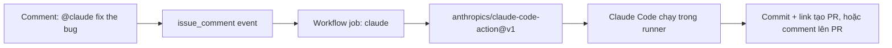

# Module 11.4: Tích hợp GitHub Actions

> **Thời gian học**: ~30 phút
>
> **Yêu cầu trước**: Module 11.1 (Headless Mode)
>
> **Kết quả**: Sau module này, bạn sẽ cài được Claude GitHub App bằng `/install-github-app`, chạy
> `anthropics/claude-code-action@v1` khi có mention `@claude` hoặc theo lịch, và giữ secret cùng
> input không tin cậy tránh xa các bước shell.

---

## 1. WHY — Tại sao cần học

Bạn đã chạy Claude headless từ terminal. Giờ team muốn nó tự chạy — review mọi PR, triage issue
mỗi tuần — mà không ai phải gõ lệnh. Lối tắt hấp dẫn: tự dựng workflow với `npm install -g
@anthropic-ai/claude-code`, một step `claude -p` tự viết, title PR nhét thẳng vào shell script.
Cách đó gãy mỗi lần CLI ra bản mới, không kiểm tra ai có quyền chạy, và một title ác ý có thể chạy
lệnh trên runner của bạn. Action chính thức giải quyết cả ba.

---

## 2. CONCEPT — Ý tưởng cốt lõi

`anthropics/claude-code-action@v1` chạy đúng binary Claude Code bạn dùng ở local, bên trong một
GitHub Actions runner, nối vào hệ event của GitHub. Nó có hai mode:

- **Interactive mode** — workflow không truyền input `prompt`. Claude chờ trigger phrase (mặc định
  `@claude`) trong comment hoặc review.
- **Automation mode** — workflow set input `prompt`. Claude chạy ngay khi job bắt đầu — dùng cho
  `schedule` và `workflow_dispatch`.



Input chính (đầy đủ ở CHEAT SHEET): `prompt`, `claude_args`, `anthropic_api_key` hoặc
`claude_code_oauth_token`, `github_token`, `trigger_phrase`, `settings`, `allowed_bots`, và
`use_bedrock` / `use_vertex` / `use_foundry` để xác thực qua OIDC với cloud provider.

Khối `permissions:` quyết định token của action — và Claude — chạm được gì. Bộ tối thiểu:
`contents: write`, `pull-requests: write`, `issues: write`, cộng `id-token: write` (App auth lẫn
OIDC federation đều cần, kể cả khi tự truyền `github_token`) và `actions: read` (đọc kết quả CI).

Ai trigger được: actor cần quyền write trên repo cho issue/PR/comment/review; bot bị từ chối trừ
khi nằm trong `allowed_bots`. GitHub cũng không trigger lại workflow từ commit dùng `GITHUB_TOKEN`
mặc định, nên commit của Claude không thể lặp vô hạn job.

Bảo mật được xây sẵn: action tự strip markdown ẩn khỏi comment không tin cậy, và giá trị context
của GitHub không bao giờ chạm thẳng vào một step shell (DEMO Step 5).

---

## 3. DEMO — Từng bước thực hành

**Scenario**: nối một repo để mention `@claude` được phản hồi, cộng thêm job triage hàng tuần.

**Step 1: Cài Claude GitHub App**

Trong một session Claude Code, ở repo có git remote trỏ về `github.com`, chạy:

```text
/install-github-app
```

Lệnh cài [Claude GitHub App](https://github.com/apps/claude) và viết workflow khởi động — sau khi
kiểm tra `gh` CLI auth. Một lần chạy thật, lab repo, `gh` login thiếu scope:

```text
# Output may vary — actual run in a lab repo, no GitHub remote / full gh auth scope
❯ /install-github-app

✳ Burrowing…
────────────────────────────────────────────────────────────
──Install GitHub App──────────────────────────────────────────

  Error: GitHub CLI is missing required permissions: workflow.

  Reason: Missing required scopes

  How to fix:
    ● Your GitHub CLI authentication is missing the "workflow" scope needed to manage GitHub Actions and secrets.
    ●
    ● To fix this, run:
    ●   gh auth refresh -h github.com -s repo,workflow
    ●
    ● This will add the necessary permissions to manage workflows and secrets.

  For manual setup instructions, see: https://github.com/anthropics/claude-code-action/blob/main/docs/setup.md

  Press any key to exit
```

Sửa scope xong, lệnh chuyển sang xác thực trên trình duyệt. Trên remote `gitlab.com`/
`bitbucket.org`, lệnh in thông báo rồi thoát — xem Step 6.

Làm thủ công: cài App (Contents/Issues/Pull requests read-write), thêm secret `ANTHROPIC_API_KEY`,
copy workflow dưới đây.

**Step 2: Workflow tối thiểu**

```yaml
# .github/workflows/claude.yml — docs: github-actions (verbatim starter)
name: Claude Code
on:
  issue_comment:
    types: [created]
  pull_request_review_comment:
    types: [created]
jobs:
  claude:
    if: contains(github.event.comment.body, '@claude')
    runs-on: ubuntu-latest
    permissions:
      contents: write
      pull-requests: write
      issues: write
      id-token: write
      actions: read
    steps:
      - uses: actions/checkout@v6
        with:
          fetch-depth: 1
      - uses: anthropics/claude-code-action@v1
        with:
          anthropic_api_key: ${{ secrets.ANTHROPIC_API_KEY }}
```

Không có input `prompt` — interactive mode, Claude chờ `@claude`.

**Step 3: Kích hoạt nó**

Comment `@claude add a README section about tests` trên một issue hoặc PR. Mặc định Claude không
tự mở PR cho bạn — nó "commits code changes to a new branch [and] provides a link to the GitHub PR
creation page... the user must click the link" (`claude-code-action/docs/security.md`).

**Step 4: Automation mode — chạy theo lịch, không cần mention**

```yaml
# .github/workflows/claude-weekly-triage.yml
name: Claude Weekly Triage
on:
  schedule:
    - cron: '0 9 * * 1'
permissions:
  contents: read
  issues: write
  id-token: write
jobs:
  triage:
    runs-on: ubuntu-latest
    steps:
      - uses: actions/checkout@v6
      - uses: anthropics/claude-code-action@v1
        with:
          anthropic_api_key: ${{ secrets.ANTHROPIC_API_KEY }}
          prompt: "Summarize open issues labelled bug"
          claude_args: "--max-turns 5"
```

`prompt:` chuyển sang automation mode — chạy ngay khi job bắt đầu. `permissions:` hẹp hơn Step 2:
không có `contents: write` hay `pull-requests`, vì job này chỉ đọc issue.

**Step 5: Không bao giờ để context GitHub chưa tin cậy chạm shell**

```yaml
# ❌ đừng ship cái này — comment body ác ý biến thành lệnh shell
- name: Echo comment (VULNERABLE)
  run: echo "${{ github.event.comment.body }}"
```

```yaml
# ✅ đưa context không tin cậy qua env: trước (docs.github.com — Secure use reference)
- name: Echo comment safely
  env:
    COMMENT_BODY: ${{ github.event.comment.body }}
  run: echo "$COMMENT_BODY"
```

Vì sao: một title PR dạng `a"; ls $GITHUB_WORKSPACE"` nhét vào `run:` sẽ chạy `ls` trên runner —
`${{ }}` được thay thế vào shell script *trước khi* nó chạy. `env:` lưu giá trị vào bộ nhớ thay vì
vậy. Cách sửa này áp dụng cho mọi field `${{ github.event.* }}` mà step của bạn chạm tới, không chỉ
riêng action này.

**Step 6: Không dùng GitHub? GitLab CI/CD có bản tương đương (beta, do GitLab duy trì)**

```yaml
# docs: gitlab-ci-cd — verbatim minimal example
stages:
  - ai

claude:
  stage: ai
  image: node:24-alpine3.21
  # Adjust rules to fit how you want to trigger the job:
  # - manual runs
  # - merge request events
  # - web/API triggers when a comment contains '@claude'
  rules:
    - if: '$CI_PIPELINE_SOURCE == "web"'
    - if: '$CI_PIPELINE_SOURCE == "merge_request_event"'
  variables:
    GIT_STRATEGY: fetch
  before_script:
    - apk update
    - apk add --no-cache git curl bash
    - curl -fsSL https://claude.ai/install.sh | bash
    # The installer places claude in ~/.local/bin, which isn't on PATH in this image
    - export PATH="$HOME/.local/bin:$PATH"
  script:
    # Optional: start a GitLab MCP server if your setup provides one
    - /bin/gitlab-mcp-server || true
    # Use AI_FLOW_* variables when invoking via web/API triggers with context payloads
    - echo "$AI_FLOW_INPUT for $AI_FLOW_CONTEXT on $AI_FLOW_EVENT"
    - >
      claude
      -p "${AI_FLOW_INPUT:-'Review this MR and implement the requested changes'}"
      --permission-mode acceptEdits
      --allowedTools "Bash Read Edit Write mcp__gitlab"
      --debug
```

"Currently in beta... maintained by GitLab." Lưu API key dưới dạng CI/CD variable đã masked — không
bao giờ để trong `.gitlab-ci.yml`.

---

## 4. PRACTICE — Luyện tập

### Exercise 1: Auto-review mọi PR
**Goal**: Cho Claude tự review PR, không ai phải gõ `@claude`.

**Instructions**:
1. Trigger trên `pull_request: [opened, synchronize]`.
2. Set `prompt:` review, giới hạn bằng `claude_args: "--max-turns 5"`.
3. Giới hạn `permissions:` đúng nhu cầu của một reviewer.

**Expected result**: mọi PR chạy một lượt review giới hạn; kết quả mặc định nằm trong run log (xem
Solution để post ra PR).

<details>
<summary>💡 Hint</summary>
Automation mode cần `prompt:` — event `pull_request` không mang theo comment nào để khớp `@claude`.
</details>

<details>
<summary>✅ Solution</summary>

```yaml
name: Claude PR Review
on:
  pull_request:
    types: [opened, synchronize]
permissions:
  contents: read
  pull-requests: read
  id-token: write
jobs:
  review:
    runs-on: ubuntu-latest
    steps:
      - uses: actions/checkout@v6
      - uses: anthropics/claude-code-action@v1
        with:
          anthropic_api_key: ${{ secrets.ANTHROPIC_API_KEY }}
          prompt: "Review this pull request for bugs, security issues, and missing tests."
          claude_args: "--max-turns 5"
```
Không có posting tool, kết quả chỉ tới run log. Để post inline comment, thêm
`--allowedTools "mcp__github_inline_comment__create_inline_comment"` vào `claude_args` và bảo
Claude comment trong `prompt` — giống ví dụ "Run a skill" của docs.
</details>

### Exercise 2: Sửa cặp filter xung đột
**Goal**: Workflow `pull_request` của đồng nghiệp set hai path filter GitHub không cho dùng chung.

**Instructions**:
1. Tìm hai filter key không thể cùng áp dụng trên một event.
2. Viết lại trigger, chỉ dùng một trong hai.
3. Xác nhận tập file mong muốn vẫn được cover.

**Expected result**: chỉ một filter key quyết định thay đổi nào kích hoạt workflow.

<details>
<summary>💡 Hint</summary>
Xem bảng PITFALLS để biết đúng cặp filter và nên giữ cái nào.
</details>

<details>
<summary>✅ Solution</summary>

```yaml
on:
  pull_request:
    types: [opened, synchronize]
    paths:
      - 'src/**'
      - 'lib/**'
```
Gộp phần muốn loại trừ vào hình dạng của include list, thay vì thêm một filter key thứ hai cạnh
tranh với nó.
</details>

### Exercise 3: Migrate workflow khỏi `@beta`
**Goal**: Một workflow cũ pin `@beta` với `mode`, `direct_prompt`, `custom_instructions`.

**Instructions**:
1. Nâng ref lên `@v1`.
2. Bỏ `mode` — không còn tồn tại.
3. Đổi tên `direct_prompt` thành `prompt`.
4. Thay `custom_instructions` bằng `--append-system-prompt` trong `claude_args`.

**Expected result**: workflow chạy trên `@v1` với hành vi tương đương.

<details>
<summary>💡 Hint</summary>
`custom_instructions` không có input cùng tên ở `@v1` — nó trở thành một CLI flag.
</details>

<details>
<summary>✅ Solution</summary>

```yaml
# before (@beta)
- uses: anthropics/claude-code-action@beta
  with:
    mode: tag
    direct_prompt: "Review this PR"
    custom_instructions: "Always check for SQL injection"

# after (@v1)
- uses: anthropics/claude-code-action@v1
  with:
    prompt: "Review this PR"
    claude_args: "--append-system-prompt 'Always check for SQL injection'"
```
</details>

---

## 5. CHEAT SHEET

### Input chính

| Input | Chức năng |
|---|---|
| `prompt` | Chuyển sang automation mode |
| `claude_args` | CLI flags, vd `--max-turns 5 --model claude-sonnet-5` |
| `anthropic_api_key` | API key từ Console, lấy từ secret |
| `claude_code_oauth_token` | Token từ `claude setup-token` |
| `github_token` | Token tùy chỉnh; bỏ trống để auth như App |
| `trigger_phrase` | Mention phrase (mặc định `@claude`) |
| `settings` | Claude Code settings JSON nhúng trực tiếp |
| `allowed_bots` | Allow-list bot được trigger (mặc định không bot nào được) |
| `use_bedrock` / `use_vertex` / `use_foundry` | Cloud provider qua OIDC |

### `permissions:` tối thiểu

```yaml
permissions:
  contents: write
  pull-requests: write
  issues: write
  id-token: write   # xác thực GitHub App của action / OIDC federation
  actions: read      # cho Claude đọc kết quả CI trên PR
```

### Ma trận trigger

| Mode | Input | Chạy khi |
|---|---|---|
| Interactive | không có `prompt` | `@claude ...` trong comment/review |
| Automation | có `prompt` | job bắt đầu — `schedule`, `workflow_dispatch`, ... |
| GitLab (beta) | `AI_FLOW_INPUT` | một `rules:` của pipeline khớp |

### Các cách auth

| Option | Secret / variable | Phù hợp cho |
|---|---|---|
| API key | `ANTHROPIC_API_KEY` | CI dùng chung/org |
| OAuth token | `CLAUDE_CODE_OAUTH_TOKEN` | repo cá nhân, plan Pro/Max/Team/Enterprise |
| OIDC federation | `anthropic_federation_rule_id` | không cần secret tĩnh nào |

---

## 6. PITFALLS — Lỗi thường gặp

| ❌ Sai | ✅ Đúng |
|---|---|
| Tự dựng `npm install -g @anthropic-ai/claude-code` + step `claude -p` viết tay | Dùng `anthropics/claude-code-action@v1` — đã lo sẵn install, App auth, kiểm tra actor |
| Nhét `${{ github.event.comment.body }}` (hay bất kỳ context không tin cậy nào) thẳng vào `run:` | Đưa qua `env:` trước — cách GitHub sửa script injection |
| Set cả `paths` và `paths-ignore` trên cùng một trigger `pull_request` | [GitHub](https://docs.github.com/en/actions/writing-workflows/workflow-syntax-for-github-actions): "cannot use both... for the same event" — chỉ giữ một |
| Commit API key hoặc OAuth token vào file workflow | Lưu làm GitHub Secret (`ANTHROPIC_API_KEY` / `CLAUDE_CODE_OAUTH_TOKEN`) |
| Quên `id-token: write` | Cần cho App auth và OIDC federation, kể cả khi tự truyền `github_token` |
| Chạy `/install-github-app` trên remote GitLab hoặc Bitbucket | Lệnh in thông báo rồi thoát — dùng tích hợp GitLab CI/CD thay thế |
| Dùng chung một token OAuth cá nhân (`claude setup-token`) làm secret CI cho cả org | Dùng API key từ Console — OAuth token gắn với subscription của người tạo nó |

---

## 7. REAL CASE — Câu chuyện thực tế

**Scenario**: Một thư viện mã nguồn mở nhận PR từ contributor rải khắp múi giờ. Maintainer chỉ muốn
review khi họ chủ động yêu cầu, không phải mỗi lần push.

**Problem**: Workflow tự dựng cũ review mọi commit trên mọi lần update, chạy lại cả khi chỉ sửa lỗi
chính tả, xếp hàng runs nhanh hơn tốc độ maintainer đọc kịp.

**Solution**: Dựng lại trên `anthropics/claude-code-action@v1` với bốn cơ chế: chỉ trigger khi
maintainer gắn label `needs-review`, dùng automation mode với `prompt:` review (event label không
mang theo mention `@claude` nào để chờ), giới hạn chạy bằng `--max-turns 5`, và hủy review đang
chạy dở khi có push mới thay thế nó.

```yaml
on:
  pull_request:
    types: [labeled, synchronize]
concurrency:
  group: claude-review-${{ github.ref }}
  cancel-in-progress: true
jobs:
  review:
    if: contains(github.event.pull_request.labels.*.name, 'needs-review')
    runs-on: ubuntu-latest
    permissions:
      contents: read
      pull-requests: read
      id-token: write
    steps:
      - uses: actions/checkout@v6
      - uses: anthropics/claude-code-action@v1
        with:
          anthropic_api_key: ${{ secrets.ANTHROPIC_API_KEY }}
          prompt: "Review this pull request for bugs, security issues, and missing tests."
          claude_args: "--max-turns 5"
```

**Result**: review chỉ trigger qua label; kết quả nằm trong run log (thêm posting tool, như Exercise
1, để comment thay vì vậy); mỗi lần chạy có giới hạn turn cứng, và các lần chạy bị thay thế tự hủy.

---

> **Tiếp theo**: [Module 11.5: MCP — Model Context Protocol](../05-mcp/) →
