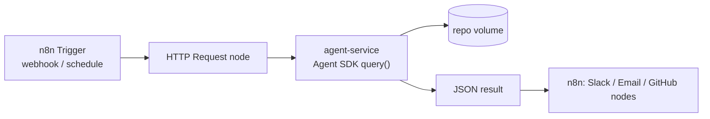

# Module 12.1: Claude Code + n8n

> **Thời gian học**: ~35 phút
>
> **Yêu cầu trước**: Module 11.2 (Claude Agent SDK)
>
> **Kết quả**: Sau module này, bạn sẽ gọi được một agent-service nhỏ chạy Agent SDK từ workflow
> n8n qua HTTP thuần, và biết khi nào Execute Command tự host là lựa chọn đúng (và duy nhất).

---

## 1. WHY — Tại sao cần học

Bạn muốn n8n trigger một task Claude Code hiểu repo, từ webhook hoặc schedule. Cách "hiển nhiên"
là node **Execute Command** chạy `claude -p` — hầu hết tutorial vẫn dạy vậy. Vấn đề: cách đó không
chạy được trên n8n mà đa số team đang dùng. Execute Command bị disable mặc định từ n8n 2.0, và
hoàn toàn không có trên n8n Cloud (docs: "This node isn't available on n8n Cloud."). Bạn cần cách
chạy được trên n8n team bạn thực sự có.

---

## 2. CONCEPT — Ý tưởng cốt lõi

Có hai cách thật sự để nối n8n với Claude Code, đánh đổi khác nhau.

**(A) Khuyên dùng — HTTP Request → một agent-service nhỏ chạy Agent SDK.** Bạn chạy một process
Node.js (hoặc Python) nhỏ bọc `query()` của Agent SDK, expose thành `POST /run`. Node **HTTP
Request** của n8n gọi endpoint đó như gọi API bất kỳ. Cách này chạy mọi nơi — kể cả n8n Cloud —
vì phía n8n chỉ thấy một cuộc gọi HTTP đi ra. Bạn kiểm soát chính xác agent được dùng tool nào
(`allowedTools`) và thấy directory nào (`cwd`), không phụ thuộc n8n tự nó reach được gì.

**(B) Chỉ dành cho self-host — Execute Command chạy `claude -p`.** Nếu bạn self-host n8n, bạn có
thể enable lại Execute Command và chạy CLI `claude` trực tiếp trong container đó. Nghĩa là phải
cài `claude` CLI vào image n8n, đưa credential vào, và chấp nhận node này giờ chạy shell command
tùy ý với quyền của chính process n8n — blast radius lớn hơn hẳn một HTTP call tới service bạn tự
viết.



| Node | Cách | Chạy trên n8n Cloud? | Chạy gì |
|---|---|---|---|
| **HTTP Request** | (A) khuyên dùng | Có | Gọi `agent-service` qua HTTP |
| **Execute Command** | (B) chỉ self-host | Không — "isn't available on n8n Cloud" | `claude -p …` như shell command, trong process |
| **Code** | cả hai | Có | Glue JavaScript/Python giữa các node |

Để enable lại Execute Command trên instance self-host, set biến môi trường `NODES_EXCLUDE` thành
một JSON array không có nó. Đúng theo docs, viết trong compose/YAML (dấu ngoặc kép bên trong bị
escape vì cả array là một string):
```yaml
NODES_EXCLUDE: "[\"n8n-nodes-base.readWriteFile\"]"
```
Đó là ví dụ mặc định trong docs, ghép Execute Command với Read/Write Files from Disk; bỏ cái bạn
muốn bật lại ra khỏi array. Docs: "Some nodes, like Execute Command, are blocked by default.
Remove them from the exclude list to enable them."

---

## 3. DEMO — Từng bước thực hành

**Setup lab**: n8n chạy trong Docker; `agent-service` chạy trên **host** bằng `node`, để Agent SDK
dùng lại login `claude` có sẵn của máy — không mint token, không bake key vào container. n8n reach
service trên host qua `http://host.docker.internal:8787`.

**Bước 1: Viết service** (`agent-service/server.mjs`, ~40 dòng)

```javascript
// docs: https://code.claude.com/docs/en/agent-sdk/typescript
import http from 'node:http';
import { query } from '@anthropic-ai/claude-agent-sdk';

const PORT = process.env.PORT || 8787;
const REPO_DIR = process.env.REPO_DIR || '/repo';

const server = http.createServer(async (req, res) => {
  if (req.method !== 'POST' || req.url !== '/run') {
    res.writeHead(404).end('not found');
    return;
  }
  let body = '';
  for await (const chunk of req) body += chunk;
  const { prompt, session_id } = JSON.parse(body);

  let result = null;
  for await (const message of query({
    prompt,
    options: {
      cwd: REPO_DIR,
      allowedTools: ['Read', 'Grep', 'Glob'], // read-only — không Bash, không Edit
      permissionMode: 'dontAsk',              // từ chối bất cứ gì ngoài allowedTools
      maxTurns: 6,
      resume: session_id,                     // nối tiếp session cũ nếu caller gửi kèm
      settingSources: [],                     // cô lập khỏi user/project/.claude settings của host
    },
  })) {
    if (message.type === 'result') result = message;
  }

  res.writeHead(200, { 'content-type': 'application/json' });
  res.end(JSON.stringify({
    result: result?.result ?? null,
    session_id: result?.session_id ?? null,
    total_cost_usd: result?.total_cost_usd ?? null,
  }));
});

server.listen(PORT, () => console.log(`agent-service listening on :${PORT}`));
```

`npm install @anthropic-ai/claude-agent-sdk` cài bản `0.1.77` cho lab này. (Output bên dưới chạy
trước khi thêm `settingSources: []` vào đây; `~/cc-lab` không có `CLAUDE.md` nên không đổi gì —
nếu không có nó, `query()` load user/project/local settings của host giống hệt CLI.)

**Bước 2: Chạy trên host**

```bash
REPO_DIR=$HOME/cc-lab PORT=8787 node server.mjs
```

**Bước 3: Test service trực tiếp**

```bash
curl -s localhost:8787/run -H 'content-type: application/json' \
  -d '{"prompt":"List exported functions in src/math.js"}'
```
Expected output:
```text
# Output may vary
{"result":"The exported functions in `src/math.js` are:\n\n1. **`add(a, b)`** - Returns the sum of two numbers\n2. **`divide(a, b)`** - Returns the division of two numbers","session_id":"6f86887b-d23c-4f63-bb19-40dd8404cbad","total_cost_usd":0.0558}
```

**Bước 4: Start n8n trong Docker**

```bash
# compose.yaml — chỉ dùng cho lab: n8n trong container, agent-service trên host
services:
  n8n:
    image: docker.n8n.io/n8nio/n8n
    ports: ['5678:5678']
    extra_hosts: ['host.docker.internal:host-gateway']
    volumes: ['n8n_data:/home/node/.n8n']
volumes:
  n8n_data:
```
```bash
docker compose up -d
```
`docker run --rm docker.n8n.io/n8nio/n8n --version` in ra `2.40.7` cho lab này.

**Bước 5: Build workflow**

1. Node **Webhook** — Method `POST`, Path `agent`, Respond: **Using 'Respond to Webhook' Node**.
2. Node **HTTP Request** — Method `POST`, URL `http://host.docker.internal:8787/run`, bật Send
   Body, Specify Body: **Using JSON**, body: `{"prompt": "{{ $json.body.prompt }}"}`.
3. Node **Respond to Webhook** — mặc định (**First Incoming Item**, tức response của HTTP Request
   node).

**Bước 6: Publish và gọi production webhook**

```bash
curl -s -X POST http://localhost:5678/webhook/agent \
  -H 'content-type: application/json' \
  -d '{"prompt":"List exported functions in src/math.js"}'
```
Expected output:
```text
# Output may vary
{"result":"The exported functions in `src/math.js` are:\n\n1. **`add(a, b)`** - Returns the sum of two numbers\n2. **`divide(a, b)`** - Returns the division of two numbers","session_id":"c11a4f3e-29e0-44d4-915a-9630befa3cc3","total_cost_usd":0.2176}
```

**Workflow export rút gọn** (`n8n export:workflow`, đúng type/version node mà bản n8n này ghi ra):
```json
{
  "name": "agent-service-demo",
  "nodes": [
    { "type": "n8n-nodes-base.webhook", "typeVersion": 2.1, "name": "Webhook",
      "parameters": { "httpMethod": "POST", "path": "agent", "responseMode": "responseNode" } },
    { "type": "n8n-nodes-base.httpRequest", "typeVersion": 4.5, "name": "HTTP Request",
      "parameters": { "method": "POST", "url": "http://host.docker.internal:8787/run",
        "sendBody": true, "specifyBody": "json",
        "jsonBody": "={\"prompt\": \"{{ $json.body.prompt }}\"}" } },
    { "type": "n8n-nodes-base.respondToWebhook", "typeVersion": 1.5, "name": "Respond to Webhook" }
  ],
  "connections": {
    "Webhook": { "main": [[{ "node": "HTTP Request", "type": "main", "index": 0 }]] },
    "HTTP Request": { "main": [[{ "node": "Respond to Webhook", "type": "main", "index": 0 }]] }
  }
}
```

---

## 4. PRACTICE — Luyện tập

### Bài 1: Mở rộng phạm vi của service

**Mục tiêu**: Cho agent đọc file nhưng không chạy shell command, vẫn không edit gì.

**Hướng dẫn**:
1. Trong `server.mjs`, đổi `allowedTools` thành `['Read', 'Grep', 'Glob', 'WebSearch']`.
2. Restart service, chạy lại curl ở Bước 3 với prompt cần web search.

**Kết quả mong đợi**: Response có câu trả lời tổng hợp; `total_cost_usd` vẫn trả về. `Bash` và
`Edit` vẫn không dùng được dù prompt yêu cầu gì.

<details>
<summary>💡 Hint</summary>
`allowedTools` chỉ *thêm* tool agent được dùng mà không cần hỏi — không cần liệt kê `Bash` hay
`Edit` để loại chúng ra; chúng vốn đã không có mặt.
</details>

<details>
<summary>✅ Solution</summary>
Sửa array, restart bằng `node server.mjs`, rồi:
```bash
curl -s localhost:8787/run -H 'content-type: application/json' \
  -d '{"prompt":"What does this project'\''s package.json say the entry point is?"}'
```
</details>

### Bài 2: Enable Execute Command an toàn (chỉ self-host)

**Mục tiêu**: Hiểu chính xác bạn đang đánh đổi gì trước khi bật công tắc này.

**Hướng dẫn**:
1. Trên n8n self-host, set giá trị compose/YAML
   `NODES_EXCLUDE: "[\"n8n-nodes-base.readWriteFile\"]"` (bỏ Execute Command ra khỏi exclude
   list = enable lại nó).
2. Liệt kê, bằng lời của bạn, attacker có thể làm gì thêm nếu edit được workflow này, so với cách
   HTTP Request.

<details>
<summary>💡 Hint</summary>
Execute Command chạy shell thật bên trong container process của n8n, với bất kỳ credential nào
container đó có — không chỉ những gì bạn định cho Claude dùng.
</details>

<details>
<summary>✅ Solution</summary>
Attacker có thể chạy bất kỳ lệnh nào user của container được phép chạy — đọc credential của
workflow khác trên disk, reach tới host nội bộ, hoặc cài backdoor — không cái nào lộ ra qua cách
`agent-service`, vì service đó chỉ nhận field `prompt` qua HTTP.
</details>

---

## 5. CHEAT SHEET

| Việc cần làm | Command / Config |
|---|---|
| Cài SDK | `npm install @anthropic-ai/claude-agent-sdk` |
| Chạy service trên host | `REPO_DIR=~/cc-lab PORT=8787 node server.mjs` |
| Pull image n8n | `docker pull docker.n8n.io/n8nio/n8n` |
| URL n8n → service trên host | `http://host.docker.internal:8787/run` |
| Enable lại Execute Command (giá trị compose/YAML) | `NODES_EXCLUDE: "[\"n8n-nodes-base.readWriteFile\"]"` |
| Body Webhook → HTTP Request | `{"prompt": "{{ $json.body.prompt }}"}` |

| Node | Mục đích |
|---|---|
| Webhook | Trigger, respond qua node "Respond to Webhook" |
| HTTP Request | Gọi `agent-service` (cách A) |
| Execute Command | Chạy `claude -p` trực tiếp (cách B, chỉ self-host) |
| Respond to Webhook | Trả JSON của HTTP Request node |

---

## 6. PITFALLS — Lỗi thường gặp

| ❌ Sai | ✅ Đúng |
|---|---|
| Execute Command → `claude -p` trên n8n Cloud | Hoàn toàn không có ở đó; dùng HTTP Request → service |
| Nghĩ Execute Command tự chạy được trên self-host | Bị block mặc định từ n8n 2.0; cần `NODES_EXCLUDE` |
| Hardcode đường dẫn cài CLI kiểu system-wide cũ | Native installer đặt ở `~/.local/bin/claude`; dùng `which claude` |
| `claude -p` không có permission flag trong node | Luôn kèm `--permission-mode` hoặc `--allowedTools`; `-p` trần mặc định Manual |
| Bake `ANTHROPIC_API_KEY` vào image n8n | Truyền từ environment lúc start container; không bao giờ để giá trị thật trong `compose.yaml` |
| Coi câu từ chối bằng ngôn ngữ tự nhiên là lỗi ném ra | Agent SDK vẫn trả `result: "success"` khi Claude từ chối bằng lời — check nội dung text, đừng chỉ tin HTTP status |
| Ship demo `/run` này y nguyên vào production | Nó không có auth, không validate input; đặt sau auth check và cô lập network, validate `prompt`/`session_id` trước khi đưa vào `query()` |

---

## 7. REAL CASE — Câu chuyện thực tế

**Scenario**: Một agency marketing Việt Nam nhận brief khách hàng qua inbox chung. Có người đọc
từng cái, log vào spreadsheet, ping đúng kênh Slack — tốn khoảng hai tiếng triage thủ công mỗi
sáng.

**Problem**: Lần đầu team dùng node Execute Command gọi thẳng `claude -p` bên trong n8n Cloud. Nó
fail âm thầm — Execute Command không có trên đó — và team mất một ngày debug một node vốn không
bao giờ chạy được.

**Solution**: Họ chuyển sang kiến trúc trong module này: một `agent-service` nhỏ (chạy như một app
Fly.io nhẹ cho production, với `ANTHROPIC_API_KEY` lấy từ secret store của platform, không bao
giờ nằm trong Dockerfile) mà workflow n8n Cloud trigger bằng webhook gọi qua HTTP. Service đọc
từng brief, extract tên client/deadline/requirement với `allowedTools: ['Read']` giới hạn vào một
bản export mailbox chỉ đọc, và trả JSON có cấu trúc để Code node biến thành dòng spreadsheet và
tin nhắn Slack.

**Result**: Triage buổi sáng giờ chỉ tốn thời gian một người lướt qua summary đã extract và
approve — phần extract tự chạy không cần canh. Team chạy hoàn toàn trên n8n Cloud, điều cách
Execute Command không bao giờ hỗ trợ được.

---

> **Tiếp theo**: [Module 12.2: Các mẫu Workflow](../02-workflow-patterns/) →
