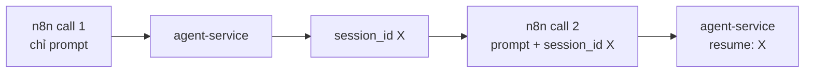

# Module 12.3: Điều phối n8n + SDK

> **Thời gian học**: ~40 phút
>
> **Yêu cầu trước**: Module 12.2 (Các mẫu Workflow), Module 11.2 (Claude Agent SDK)
>
> **Kết quả**: Sau module này, bạn sẽ nối được một conversation Claude Code qua nhiều call n8n
> bằng `resume`, và biết khi nào dùng node AI Agent gốc của n8n thay vì Claude Code hoàn toàn.

---

## 1. WHY — Tại sao cần học

Mọi call ở Module 12.1 và 12.2 đều bắt đầu một session Claude Code mới toanh — không nhớ gì call
trước. Một workflow ticket hỗ trợ cần hỏi thêm câu follow-up, hoặc một vòng review cần sửa draft
theo feedback, đòi hỏi call thứ hai phải nhớ call đầu. Và không phải workflow AI nào trong n8n
cũng cần Claude Code — nhiều automation chat/tool-calling hợp với node AI Agent gốc của n8n hơn.
Chọn sai công cụ khiến bạn hoặc rước thêm phức tạp không cần thiết, hoặc thiếu quyền truy cập
filesystem.

---

## 2. CONCEPT — Ý tưởng cốt lõi

### Resume session qua nhiều call

`query()` của Agent SDK có option `resume`: `resume` | `string` | "Session ID to resume". Truyền
`session_id` mà call đầu trả về, call thứ hai sẽ nối tiếp cùng conversation thay vì bắt đầu lạnh —
không quét lại repo, và Claude nhớ nó vừa nói gì.



### Claude Code vs node AI gốc của n8n

n8n có sẵn node **AI Agent** ("Connect a chat model and one or more tools, and the agent decides
which tools to call") kết hợp với node **Anthropic Chat Model** ("Use Anthropic's Claude family of
chat models with conversational agents"). Cả hai chạy hoàn toàn bên trong n8n — không cần service
riêng, không cần checkout repo.

| Cần gì | Dùng gì |
|---|---|
| Chat/tool-calling qua tool tự định nghĩa trong n8n (gọi API, tra database) | n8n **AI Agent** + **Anthropic Chat Model** |
| Cần đọc/search một repository thật | Claude Code qua `agent-service` (Module 12.1) |
| Cần `Bash`, `Edit`, hay tool built-in khác của Claude Code | Claude Code qua `agent-service` |
| Cần đúng permission model (`allowedTools`, hooks) giống hệt mọi call | Claude Code qua `agent-service` |
| Một câu classify hay chat reply nhanh, không đụng filesystem | n8n **AI Agent** + **Anthropic Chat Model** — ít một moving part hơn |

Docs của node Anthropic Chat Model có liệt kê tên model, nhưng list đó cũ (vẫn ghi tên một model
"Claude Instant" đã ngừng từ lâu) — không phải nguồn để copy vào prompt hay config production.
Dùng bất kỳ model Claude hiện tại nào dropdown của chính credential bạn hiện ra trong node, giống
cách bạn truyền một *alias* model (không phải ID có ngày tháng) vào option `model` của Agent SDK.

---

## 3. DEMO — Từng bước thực hành

**Bước 1: Call đầu tiên — chưa có `session_id`**

```bash
curl -s localhost:8787/run -H 'content-type: application/json' \
  -d '{"prompt":"In one sentence, what does tests/math.test.mjs test?"}'
```
Expected output:
```text
# Output may vary
{"result":"This test file verifies that the `add` function from `../src/math.js` correctly returns 3 when given the inputs 1 and 2.","session_id":"ca3ccf44-3294-4806-b3b8-12f48cdaa336","total_cost_usd":0.0551}
```

**Bước 2: Call thứ hai — gửi lại `session_id` đó**

```bash
curl -s localhost:8787/run -H 'content-type: application/json' \
  -d '{"prompt":"Which function from that file did I just ask about? Answer in 5 words or fewer.","session_id":"ca3ccf44-3294-4806-b3b8-12f48cdaa336"}'
```
Expected output:
```text
# Output may vary
{"result":"The `add` function.","session_id":"ca3ccf44-3294-4806-b3b8-12f48cdaa336","total_cost_usd":0.0085}
```

Chú ý: `session_id` trong response không đổi, và call thứ hai trả lời đúng "hàm nào," điều nó chỉ
có thể biết từ context của call đầu — resume đã hoạt động. Trong n8n, nối dây bằng cách lưu
`session_id` từ response của HTTP Request node đầu tiên (node Set, hoặc biến scope workflow) và
reference nó trong body của HTTP Request node thứ hai:
`{"prompt": "{{ $json.followup }}", "session_id": "{{ $('HTTP Request').item.json.session_id }}"}`.

**Bước 3: Khi nào bỏ qua Claude Code hoàn toàn**

Với một workflow chỉ classify tin nhắn Slack đến theo intent — không cần đụng file — thêm node
**AI Agent** gốc của n8n với sub-node **Anthropic Chat Model** đính kèm, thay vì gọi
`agent-service`. Node AI Agent đó có thể tự chứa sub-node **Tool** của n8n (một tool HTTP Request,
một tool database) nếu việc classify cần tra cứu gì đó — nhưng không cái nào đụng filesystem theo
cách tool `Read`/`Grep`/`Bash` của Claude Code làm.

**Bước 4: Thêm hooks trong code `agent-service`**

```javascript
// docs: https://code.claude.com/docs/en/agent-sdk/typescript — options.hooks
options: {
  cwd: REPO_DIR,
  allowedTools: ['Read', 'Grep', 'Glob'],
  permissionMode: 'dontAsk',
  resume: session_id,
  settingSources: [], // xem ghi chú bên dưới — thiếu nó, query() sẽ load settings của host
  hooks: {
    PreToolUse: [{
      hooks: [async (input) => {
        console.log(`[audit] about to run ${input.tool_name}`);
        return { continue: true };
      }],
    }],
  },
}
```
Mặc định `query()` load settings từ filesystem nơi nó chạy — user, project, *và* local, đúng ba
nguồn CLI đọc, kể cả CLAUDE.md — dù service này đã tự truyền `hooks` và tool list bằng code. Nghĩa
là một `agent-service` deploy lên host có sẵn `~/.claude/settings.json` hay một `CLAUDE.md` cấp
project sẽ âm thầm kế thừa chúng. Truyền `settingSources: []` (như `server.mjs` ở Module 12.1 giờ
đã làm) để opt-out và đảm bảo hành vi service này chỉ đến từ code bạn thấy ở đây.

---

## 4. PRACTICE — Luyện tập

### Bài 1: Build workflow follow-up hai lượt

**Mục tiêu**: Hỏi agent một câu, rồi một câu follow-up phụ thuộc câu đầu, trong một workflow n8n.

**Hướng dẫn**:
1. Webhook nhận `{"question": "...", "followup": "..."}`.
2. HTTP Request #1 gọi `agent-service` chỉ với `question`.
3. HTTP Request #2 gọi `agent-service` với `followup` và `session_id` từ response #1.
4. Respond to Webhook trả cả hai kết quả.

**Kết quả mong đợi**: Câu trả lời thứ hai rõ ràng phụ thuộc context chỉ call đầu thiết lập — test
giống cách Bước 1–2 của DEMO đã làm.

<details>
<summary>💡 Hint</summary>
Reference output của node đầu từ body node thứ hai bằng
`{{ $('HTTP Request').item.json.session_id }}`, không phải `$json.session_id` (cái này trỏ tới
node ngay trước — ổn ở đây, nhưng reference node rõ ràng sẽ dễ hiểu hơn khi có branch).
</details>

<details>
<summary>✅ Solution</summary>
Đây chính là cách nối dây ở đoạn cuối Bước 2 của DEMO — hai node HTTP Request chia sẻ một
`session_id`.
</details>

### Bài 2: Chọn đúng công cụ

**Mục tiêu**: Với ba scenario, quyết định dùng `agent-service` (Claude Code) hay node AI Agent +
Anthropic Chat Model của n8n.

**Hướng dẫn**: Với mỗi cái, nêu cách đúng và một câu lý do:
1. Tóm tắt một thread Slack và đề xuất ba câu reply.
2. Tìm mọi file trong repo import một function đã deprecated và liệt kê ra.
3. Trả lời "chính sách hoàn tiền của tụi mình là gì?" từ một đoạn FAQ dán sẵn.

<details>
<summary>✅ Solution</summary>
1. n8n AI Agent + Anthropic Chat Model — không đụng filesystem, chỉ text vào text ra.
2. `agent-service` (Claude Code) — cần `Grep`/`Glob` trên repository thật.
3. n8n AI Agent + Anthropic Chat Model — đoạn FAQ đưa thẳng vào prompt được; không cần đụng repo.
</details>

---

## 5. CHEAT SHEET

| Cần gì | Cách làm |
|---|---|
| Nối tiếp conversation trước | `query({ prompt, options: { resume: session_id } })` |
| Bỏ qua mọi filesystem setting cho service | `settingSources: []` |
| Audit log theo từng tool | `options.hooks.PreToolUse` |
| Chat/classify, không cần repo | Node n8n **AI Agent** + **Anthropic Chat Model** |
| Task cần repo (`Read`, `Grep`, `Bash`, `Edit`) | `agent-service` (Claude Code) |
| Chọn model | Một alias từ dropdown động của credential, không bao giờ hardcode ID có ngày tháng |

---

## 6. PITFALLS — Lỗi thường gặp

| ❌ Sai | ✅ Đúng |
|---|---|
| Gọi thẳng Messages API bằng `require('@anthropic-ai/sdk')` trong node Code | Dùng `query()` của Agent SDK trong `agent-service`; nó đã cho sẵn tool, permission, và session |
| Nghĩ call nào cũng cần repo | Nếu không đụng filesystem, node AI Agent gốc của n8n đơn giản hơn và ít một service phải chạy |
| Hardcode một model ID có ngày tháng, có version cụ thể | Dùng alias model dropdown của credential đang hiện, hoặc option alias `model` của Agent SDK |
| Quên truyền `resume` ở call follow-up | Không có nó, mỗi call là một session hoàn toàn mới, không nhớ gì call trước |
| Để `agent-service` vô tình đọc `.claude/settings.json` của host | Truyền `settingSources: []` nếu bạn cần hành vi service chỉ phụ thuộc code của chính nó |

---

## 7. REAL CASE — Câu chuyện thực tế

**Scenario**: Một team support SaaS Việt Nam muốn workflow draft một reply, để agent trả lời một
câu hỏi làm rõ từ người review, rồi hoàn thiện reply — tất cả như một conversation logic.

**Problem**: Bản đầu tiên gọi `agent-service` mới toanh ở mỗi bước, nên bước "câu hỏi làm rõ"
không biết ticket gốc nói gì — mỗi call phải dán lại toàn bộ history ticket, chậm và dễ lệch nhau
giữa các node.

**Solution**: `session_id` từ response của HTTP Request node đầu được lưu vào node Set và xâu chuỗi
qua mọi call sau trong workflow bằng `resume`. Bước classify đơn giản (route ticket mới vào đúng
queue) chuyển sang node **AI Agent** + **Anthropic Chat Model** gốc của n8n, vì không cần đụng
repo và chạy nhẹ hơn một service round-trip.

**Result**: Workflow reply nhiều bước đọc như một conversation duy nhất thay vì ba call rời rạc, và
bước route đơn giản không còn phụ thuộc `agent-service` phải đang chạy.

---

> **Hoàn thành Phase 12!** Bạn đã đi từ một call HTTP đơn lẻ tới một service nhỏ, qua các pattern
> fan-out và error-recovery, tới điều phối có nhớ session và biết khi nào dùng node AI gốc của n8n
> thay vì Claude Code.
>
> **Phase Tiếp Theo**: [Phase 13: Data & Analysis](../../phase-13-data-analysis/01-data-analysis/) →
