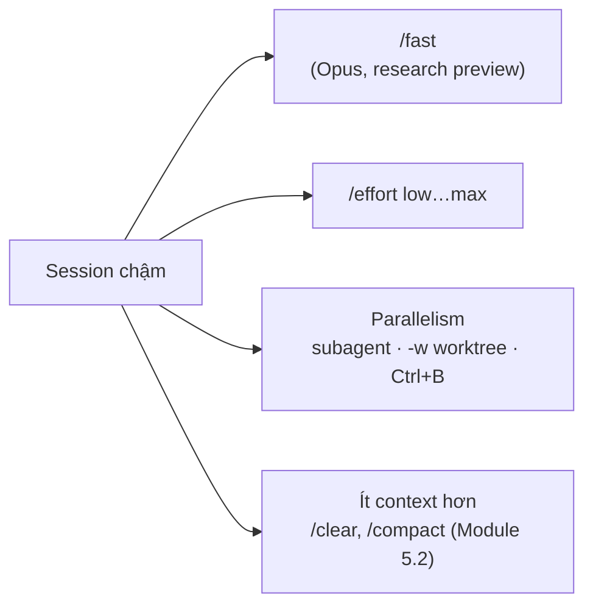

# Module 14.2: Tối ưu Tốc độ

> **Thời gian ước tính**: ~30 phút
>
> **Yêu cầu trước**: Module 14.1 (Tối ưu Task)
>
> **Kết quả**: Sau module này, bạn dùng `/fast`, `/effort`, subagent, worktree, và backgrounded
> command — những thứ thực sự đổi wall-clock time — thay vì tin vào truyền miệng "Opus chậm, đổi
> model nhanh hơn".

---

## 1. WHY — Tại sao cần học

Bạn hỏi một câu về một file và ngồi chờ model "thinking" mười giây cho việc tầm thường. Hoặc bạn
chạy ba migration không liên quan lần lượt trong cùng session, dù chẳng có gì ngăn chúng chạy song
song. Cả hai đều không phải vấn đề "model nào nhanh nhất" — Opus đã có chế độ nhanh hơn 2.5x được
document, và phần lớn thời gian chờ thực tế đến từ việc serialize việc vốn không cần tuần tự.

---

## 2. CONCEPT — Khái niệm cốt lõi

Bốn đòn bẩy thực sự thay đổi wall-clock time. Mọi thứ khác — "Haiku là model tốc độ," bảng
Speed/Quality/Cost với điểm số bịa ra — không có trong docs.



**`/fast`** là research preview: "a high-speed configuration for Claude Opus, making the model up
to 2.5x faster at a higher cost per token." Chỉ tồn tại cho **Opus 5.5, Opus 5, và Opus 4.8** —
Sonnet, Haiku, và Opus 4.7 không support. Toggle bằng `/fast` (Space để đổi, Enter để confirm)
hoặc `Option+O` / `Alt+O`. Lần đầu bật trong một conversation, bạn trả full uncached input price
cho toàn bộ context tính tới lúc đó — bật sớm là rẻ nhất. Cái giá đó chỉ tính một lần mỗi
conversation; tắt rồi bật lại sau đó không lặp lại giá này. `CLAUDE_CODE_DISABLE_FAST_MODE=1` tắt
hẳn cho máy dùng chung hoặc script.

**`/effort`** đánh đổi độ sâu reasoning lấy tốc độ trên mọi model: `low`, `medium`, `high`,
`xhigh`, `max` (thêm `auto` để clear, `ultracode` cho `xhigh` kèm ultracode). Opus 5.5/5/4.8 và
Sonnet 5 support cả năm mức; Opus 4.6 và Sonnet 4.6 không có `xhigh`. Thấp hơn = nhanh hơn;
default khác nhau theo model — Opus 5.5 mặc định `medium` ("một bậc dưới model khác"), hầu hết
model khác mặc định `high`. `--effort` chỉ áp dụng một session, không lưu lại.

**Parallelism thật** đánh bại mọi cách tăng tốc trong một session: một subagent (natural
language — "use a subagent to…") chạy context window riêng song song với bạn, tối đa 20 cái
(`CLAUDE_CODE_MAX_CONCURRENT_SUBAGENTS`); `claude -w <name>` (`--worktree`) mở Claude thứ hai
trong git worktree riêng tại `<repo>/.claude/worktrees/<name>` — repo cần ít nhất một commit
trước; và `Ctrl+B` đẩy lệnh Bash đang chặn session ra chạy nền (tmux: bấm hai lần), dùng `/tasks`
để kiểm tra hoặc dừng.

**Ít context hơn** thuộc Module 5.2 (`/clear`, `/compact`) — prompt nhỏ hơn xử lý nhanh hơn bất
kể model hay effort level.

---

## 3. DEMO — Từng bước cụ thể

**Bước 1: Mở `/fast` mà không bật nó**

```text
# docs: en/fast-mode
/fast
```

```text
# Output may vary — chụp từ TUI, chưa confirm (Space/Enter chưa bấm)
  ↯ Fast mode (research preview)
  High-speed mode for Opus 5.5. Draws from usage credits at a higher rate. Separate rate limits
  apply.

    Fast mode  OFF  $8/$40 per Mtok

  Learn more: https://code.claude.com/docs/en/fast-mode

  Space to toggle · Enter to confirm · Esc to cancel
```

`$8/$40` là rate fast-mode của Opus 5.5; Opus 5 và Opus 4.8 là `$10/$50`. Bấm `Esc` ở đây không
tốn gì — chỉ khi thực sự confirm bật thì mới trả giá reset cache một lần.

**Bước 2: So sánh `/effort low` và `/effort high` trên cùng một prompt**

```bash
# docs: en/model-config — --effort chỉ override một session, không lưu lại
time claude -p "Read src/math.js and describe what it exports in one sentence." \
  --effort low --allowedTools Read --output-format json
```

```text
# Output may vary
duration_api_ms: 5629   (wall: 9.2s total)
```

```bash
time claude -p "Read src/math.js and describe what it exports in one sentence." \
  --effort high --allowedTools Read --output-format json
```

```text
# Output may vary
duration_api_ms: 3647   (wall: 7.2s total)
```

Ở đây `high` lại nhanh hơn `low` — nhiễu, không phải mâu thuẫn. Đọc một file quá đơn giản để
effort level tạo khác biệt; đòn bẩy này phát huy trên tải reasoning thật, không phải một câu tóm
tắt.

**Bước 3: Chạy hai session Claude trong hai worktree khác nhau cùng lúc**

```bash
# docs: en/worktrees, en/cli-reference — -w / --worktree
claude -w speed-a -p "Read src/math.js and reply with just the word done." \
  --allowedTools Read --output-format json &
claude -w speed-b -p "Read tests/math.test.mjs and reply with just the word done." \
  --allowedTools Read --output-format json &
wait
git worktree list
```

```text
# Output may vary
/Users/you/cc-lab                            90c242f [main]
/Users/you/cc-lab/.claude/worktrees/speed-a  90c242f [worktree-speed-a] locked
/Users/you/cc-lab/.claude/worktrees/speed-b  90c242f [worktree-speed-b] locked
```

Cả hai xong mà không chờ nhau, cũng không đụng chung working directory — điều ba lệnh
`claude -p … &` trong *cùng* checkout không đảm bảo được (xem Pitfall bên dưới).

**Bước 4: Đẩy một lệnh ra chạy nền thay vì để nó chặn session**

Ở chế độ interactive, yêu cầu Claude chạy `npm test -- --watch` (lệnh không tự thoát). Claude
nhận ra điều đó và tự đẩy nó ra background, cùng cơ chế `Ctrl+B` dùng khi bạn tự quyết định đẩy
nền:

```text
# Output may vary
⏺ Bash(npm test -- --watch)
  ⎿  Running in the background (↓ to manage)
```

`/tasks` hiện nó đang chạy và cho bạn xem output mới nhất hoặc dừng nó:

```text
# Output may vary
  Shell details

  Status:   running
  Runtime:  5s
  Command:  npm test -- --watch

  Output:
  ╭──────────────────────────────────╮
  │ # tests 1                        │
  │ # pass 1                         │
  │ # fail 0                         │
  ╰──────────────────────────────────╯
  ← to go back · Esc/Enter/Space to close · x to stop
```

Với `--permission-mode default`, đúng lệnh này bình thường sẽ dừng lại hỏi yes/no trước — trả
lời câu đó trước khi lệnh bắt đầu chạy.

---

## 4. PRACTICE — Luyện tập

### Bài 1: Đo thời gian `/fast` trên một edit thật

**Mục tiêu**: Tự thấy tradeoff của fast mode, mà không phải trả tiền để giữ nó bật.

**Hướng dẫn**:
1. Chọn một task mà Opus bình thường mất kha khá thời gian (refactor nhiều file).
2. Đo thời gian một lần khi fast mode tắt.
3. Mở `/fast`, confirm bật, chạy cùng loại task, đo lại.
4. So sánh wall time và check `/usage` xem chênh lệch cost.

<details>
<summary>💡 Gợi ý</summary>

Turn đầu tiên sau khi confirm `/fast` tính lại giá toàn bộ context ở rate fast-mode — đo turn
fast-mode *thứ hai* nếu muốn so sánh sạch theo từng turn.

</details>

<details>
<summary>✅ Giải pháp</summary>

Fast mode chỉ có trên Opus và là research preview: kỳ vọng chênh lệch tốc độ thật, và chênh lệch
cost thật (`$8/$40` so với `$4/$20` per MTok trên Opus 5.5). Có đáng hay không tùy thời gian của
bạn đáng giá bao nhiêu mỗi turn.

</details>

### Bài 2: Chia một task tuần tự thành nhiều worktree

**Mục tiêu**: Biến ba lệnh `claude -p` tuần tự thành ba lệnh thực sự chạy song song.

**Hướng dẫn**:
1. Tìm ba task nhỏ độc lập trong repo có ít nhất một commit.
2. Chạy chúng bằng `claude -w a`, `claude -w b`, `claude -w c` chạy nền, rồi `wait`.
3. Xác nhận bằng `git worktree list` rằng mỗi cái chạy trong checkout riêng.

<details>
<summary>💡 Gợi ý</summary>

`-w` cần một commit có sẵn; repo hoàn toàn mới sẽ fail với
`Failed to resolve base branch "HEAD": git rev-parse failed`.

</details>

<details>
<summary>✅ Giải pháp</summary>

Ba worktree xong trong khoảng thời gian của cái chậm nhất, không phải tổng cả ba — cái lợi là
chạy song song, không phải một session nào đó nhanh hơn.

</details>

### Bài 3: Tìm ngưỡng background của riêng bạn

**Mục tiêu**: Nhận ra khi nào Claude Code tự đẩy một lệnh ra chạy nền cho bạn.

**Hướng dẫn**:
1. Yêu cầu Claude chạy thứ gì đó xong nhanh (`ls`).
2. Yêu cầu Claude chạy thứ gì đó không tự thoát (`npm test -- --watch` hoặc dev server).
3. So sánh: cái nào xuất hiện trong `/tasks`?

<details>
<summary>💡 Gợi ý</summary>

Một lệnh chạm timeout (mặc định 120s) mà chưa xong cũng tự động bị đẩy ra nền — không cần bạn
bấm `Ctrl+B` cho trường hợp đó.

</details>

<details>
<summary>✅ Giải pháp</summary>

Lệnh nhanh không bao giờ xuất hiện trong `/tasks`. Bất cứ thứ gì có thể chặn session — watch
mode, dev server, timeout dài — đều bị đẩy ra nền, dù do bạn `Ctrl+B` hay do timeout.

</details>

---

## 5. CHEAT SHEET

| Lệnh / Phím | Tác dụng |
|---|---|
| `/fast` | ⚠️ Research preview. Chỉ Opus 5.5/5/4.8, nhanh tới 2.5x, $/token cao hơn |
| `Option+O` / `Alt+O` | Toggle fast mode không cần mở menu |
| `/effort low\|medium\|high\|xhigh\|max` | Thấp hơn = nhanh hơn, ít reasoning hơn |
| `--effort <level>` | Tương tự, chỉ một session, không lưu lại |
| `claude -w <name>` / `--worktree` | Claude thứ hai, git worktree riêng, cần commit có sẵn |
| `Ctrl+B` | Đẩy lệnh Bash đang chạy ra nền (tmux: bấm hai lần) |
| `/tasks` | List, xem, hoặc dừng lệnh chạy nền |
| `CLAUDE_CODE_DISABLE_FAST_MODE=1` | Tắt hẳn fast mode |
| `CLAUDE_CODE_MAX_CONCURRENT_SUBAGENTS` | Giới hạn subagent chạy đồng thời (default 20) |

---

## 6. PITFALLS — Sai lầm thường gặp

| ❌ Sai | ✅ Đúng |
|---|---|
| `claude -p "task 1" & claude -p "task 2" &` trong cùng checkout | Cùng working directory, cùng git index — race và bị deny write. Dùng `claude -w a`, `claude -w b` |
| Coi `/cost` là thước đo tốc độ | `/cost` là alias của `/usage` — hiện spend, không phải latency. Đo wall-clock time thay vào đó |
| Để fast mode bật cả ngày làm việc | Chỉ dành cho Opus, research preview, giá per-token cao hơn; tắt nó giữa các task đáng dùng fast mode |
| Bật `/fast` lần đầu khi đã đi sâu vào session dài | Giá re-price càng vào sâu càng tốn — bật ngay từ đầu nếu biết sẽ cần |
| Cho rằng effort thấp hơn luôn xong nhanh hơn | Trên task tầm thường chênh lệch chỉ là nhiễu; effort phát huy trên task có tải reasoning thật |

---

## 7. REAL CASE — Câu chuyện thực tế

**Scenario**: Một team ở Đà Nẵng chạy ba migration Sonnet không liên quan lần lượt trong một
session — xong migration này tới migration kia, tuần tự trong một conversation với context tích
lũy dần.

**Vấn đề**: Không migration nào riêng lẻ chậm cả. Thời gian chờ đến từ việc làm việc độc lập theo
kiểu tuần tự trong một session ngày càng phình to.

**Giải pháp**: Cùng ba migration đó, ba worktree `claude -w` khởi động cùng lúc, mỗi cái với
context sạch và checkout riêng của repo. Không `/fast`, không chỉnh effort — cách sửa chỉ đơn
giản là chạy việc độc lập một cách độc lập.

**Kết quả**: Team giờ mặc định dùng worktree cho việc không phụ thuộc output bước trước, và chỉ
dùng `/effort` với `/fast` cho task thực sự nặng reasoning thay vì coi đó là lựa chọn đầu tiên.

---

> **Tiếp theo**: [Module 14.3: Tối ưu Chất lượng](../03-quality-optimization/) →
