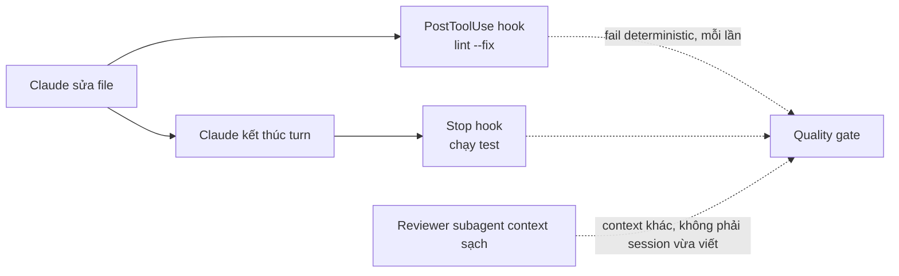

# Module 14.3: Tối ưu Chất lượng

> **Thời gian ước tính**: ~35 phút
>
> **Yêu cầu trước**: Module 14.2 (Tối ưu Tốc độ)
>
> **Kết quả**: Sau module này, bạn nối được một quality gate deterministic — hook `PostToolUse`
> lint, hook `Stop` chạy test, và reviewer subagent context sạch — thay vì bảo Claude "reason step
> by step" rồi hy vọng.

---

## 1. WHY — Tại sao cần học

Claude viết code nhanh. Nhưng chưa hoàn toàn đúng: thiếu một edge case, vi phạm lint, một quyết
định thiết kế không qua nổi review. Bạn phát hiện ở code review — sau khi việc đã xong, bằng tay,
mỗi lần. Đó không phải chiến lược quality, đó là thuế bạn trả trên mỗi pull request.

Một gate chạy giống nhau mỗi lần, không cần bạn nhớ để yêu cầu, đáng giá hơn mọi cách diễn đạt
prompt.

---

## 2. CONCEPT — Khái niệm cốt lõi

> "Give Claude a check it can run: tests, a build, a screenshot to compare." (S1)

Verify có một trong ba dạng: rules-based, visual, hoặc LLM-as-judge (S7). Một rule lint là
rules-based; một screenshot diff là visual; một subagent đọc diff là LLM-as-judge — và nó chỉ hoạt
động với context sạch, vì "the agent that wrote the code has no way to approve it" (S3), và
self-review trong cùng session có xu hướng "confident praising" thay vì phê bình thật (S12).



Ba đòn bẩy thật, xếp theo độ khó bỏ qua:

- **Hook** — `PostToolUse` sau mỗi lần sửa, `Stop` trước khi Claude được kết thúc turn.
  Deterministic: "Unlike CLAUDE.md instructions which are advisory, hooks are deterministic and
  guarantee the action happens" (S1). Module 11.3 phủ cơ chế; module này chỉ dùng lại cặp nhỏ
  nhất, hữu ích nhất.
- **Reviewer subagent** — một `.claude/agents/reviewer.md` riêng, tool chỉ đọc, gọi trên diff. Nó
  bắt đầu không có ký ức viết ra code đó, nên nó review thay vì bảo vệ nó.
- **`.claude/rules/` và output style** — `.claude/rules/` giữ coding standard Claude đọc như file
  project bình thường (Module 4.2 dạy cách viết); `/output-style
  Explanatory|Learning|Concise|Proactive` đổi mức Claude tường thuật lý do của chính nó khi làm
  việc, một đòn bẩy khác với correctness nhưng ảnh hưởng độ dễ review của một thay đổi.

Không gì trong số này thay việc bạn đọc diff. Nó thay việc bạn phải nhớ yêu cầu một lượt lint và
một ý kiến thứ hai trên mỗi thay đổi.

Cái không hiệu quả: bảo Claude reason qua từng bước trong prompt. Extended thinking đã bật mặc
định trên model hiện tại (Module 6.1) — câu đó không thêm ngân sách reasoning; nó là thói quen sót
lại từ model cần được nhắc.

Qua khỏi "trông có vẻ ổn," một mini-eval hơn hẳn cảm tính: chạy cùng 20-50 task thật qua một thay
đổi, đọc transcript, xem cái gì thực sự hỏng (S11) — nó bắt được regression mà một lượt review tay
bỏ lỡ.

---

## 3. DEMO — Từng bước cụ thể

**Bước 1: Gate lint deterministic — `PostToolUse`**

```json
// docs: en/hooks — .claude/settings.json
{
  "hooks": {
    "PostToolUse": [
      {
        "matcher": "Edit|Write",
        "hooks": [
          { "type": "command", "command": "jq -r '.tool_input.file_path' | xargs npx eslint --fix" }
        ]
      }
    ]
  }
}
```

Test trực tiếp bằng input của chính hook, đúng cách docs khuyên test hook trước khi tin nó
(`hooks-guide`):

```bash
echo "{\"tool_input\":{\"file_path\":\"$(pwd)/src/messy.js\"}}" \
  | jq -r '.tool_input.file_path' | xargs npx eslint --fix
```

```text
# Output may vary
/Users/you/cc-lab/src/messy.js
  2:9  error  'unused' is assigned a value but never used  no-unused-vars

✖ 1 problem (1 error, 0 warnings)
```

Dấu chấm phẩy thiếu được fix âm thầm; `no-unused-vars` không auto-fixable nên vẫn hiện —
`PostToolUse` không thể block (edit đã xảy ra rồi), nhưng stderr của nó nằm cạnh tool result nên
Claude thấy vấn đề thật ngay lập tức, không phải lúc review.

**Bước 2: Gate Claude không thể bỏ qua — `Stop`**

```json
// docs: en/hooks
{
  "hooks": {
    "Stop": [
      { "matcher": "*", "hooks": [{ "type": "command", "command": "npm test" }] }
    ]
  }
}
```

```bash
npm test
```

```text
# Output may vary
> cc-lab@1.0.0 test
> node --test
# tests 1
# pass 1
# fail 0
```

Hook `Stop` thất bại thì exit-2, Claude tiếp tục làm việc thay vì kết thúc turn — tối đa 8 lần
block liên tiếp trước khi Claude Code override, nên một test suite hỏng thật không lặp vô tận.

**Bước 3: Reviewer subagent context sạch**

```markdown
---
# docs: en/sub-agents — .claude/agents/reviewer.md
name: reviewer
description: Reviews a diff for correctness, style, and missed edge cases. Fresh context — never the session that wrote the code.
tools: Read, Grep, Glob
model: sonnet
---
You are a code reviewer. Read the diff you are given, check it against the
surrounding code, and report concrete, actionable issues. Do not praise; list
problems or state there are none.
```

Gọi đích danh nó — không phải một helper chung chung — để nó chạy review:

```text
Use the reviewer subagent on the diff of src/messy.js against HEAD
```

{/* AUTHOR-CAPTURE: chạy
  claude -p "Use the reviewer subagent on the diff of src/messy.js against HEAD
  (git diff HEAD -- src/messy.js)." --allowedTools "Read,Grep,Glob,Bash(git diff*)"
  trong một checkout ~/cc-lab sạch, không cài plugin bên thứ ba nào. Trong môi trường của tác
  giả, một hook SubagentStop từ plugin đã cài thay thế message cuối của reviewer bằng "Task
  complete" chung chung, nên transcript chụp được không đại diện cho hành vi mặc định — chạy
  lại trên bản cài trơn để có transcript reviewer thật. */}

Subagent nhận diff và câu lệnh gọi nó, cộng `CLAUDE.md` và git status — không phải lịch sử
conversation của bạn. Nó flag gì thì flag mà không có lợi ích gì từ việc đã viết ra code đó.

**Bước 4: Kiểm tra output style**

```text
/output-style
```

```text
# Output may vary
  Output style: default

     Available styles:
     - default (current)
     - Proactive: Claude executes immediately, minimizes interruptions, and prefers action over
       planning
     - Concise: Claude responds tersely, leading with results and skipping preamble and narration
     - Explanatory: Claude explains its implementation choices and codebase patterns
     - Learning: Claude pauses and asks you to write small pieces of code for hands-on practice
```

`Explanatory` đáng dùng thêm chữ trong tuần nặng review — Claude tường thuật *vì sao*, đúng thứ
reviewer cần mà chế độ "code only" bỏ qua.

---

## 4. PRACTICE — Luyện tập

### Bài 1: Nối gate hai-hook

**Mục tiêu**: Một lượt fix lint và chạy test xảy ra mà không cần bạn yêu cầu.

**Hướng dẫn**:
1. Thêm hook `PostToolUse` và `Stop` ở Bước 1–2 vào `.claude/settings.local.json`.
2. Yêu cầu Claude sửa gì đó làm hỏng một test.
3. Xác nhận turn không kết thúc gọn cho tới khi test pass.

<details>
<summary>💡 Gợi ý</summary>

Check `stop_hook_active` nếu bạn viết nhiều hơn một `Stop` hook — Claude Code override một hook
block 8 lần liên tiếp không tiến triển.

</details>

<details>
<summary>✅ Giải pháp</summary>

Test hỏng giữ hook `Stop` exit 2 và turn mở; Claude thấy fail và fix trước khi bạn phải hỏi —
hoặc cap 8-lần-block kích hoạt và trả quyền lại cho bạn.

</details>

### Bài 2: Viết reviewer của riêng bạn

**Mục tiêu**: Một subagent review đúng lỗi hay lặp lại nhất của project bạn.

**Hướng dẫn**:
1. Chọn một comment review lặp lại từ vài PR gần nhất.
2. Viết `.claude/agents/reviewer.md` bảo nó check đúng thứ đó.
3. Chạy trên một diff thật và xem nó có bắt được cái human reviewer bắt được không.

<details>
<summary>💡 Gợi ý</summary>

`tools: Read, Grep, Glob` là đủ cho reviewer — nó không bao giờ cần sửa gì cả.

</details>

<details>
<summary>✅ Giải pháp</summary>

Brief của reviewer càng hẹp càng hữu ích. "Review mọi thứ" ra output mơ hồ; "check mọi
database call mới thiếu index" ra một finding thật hoặc một tờ giấy sạch.

</details>

### Bài 3: Xây mini-eval 20 task

**Mục tiêu**: Vượt qua "trông ổn với tôi" cho một loại task hay lặp lại.

**Hướng dẫn**:
1. Gom 20 ví dụ thật của một task bạn hay giao cho Claude (ví dụ: "thêm endpoint").
2. Chạy mỗi cái qua cùng một prompt template.
3. Đọc mọi transcript, không chỉ diff. Ghi lại pattern trong cái hỏng.

<details>
<summary>💡 Gợi ý</summary>

20-50 task thật là khoảng S11 dùng — ít hơn thì một outlier làm lệch kết quả.

</details>

<details>
<summary>✅ Giải pháp</summary>

Hầu hết team thấy một hoặc hai failure mode lặp lại, không phải hai mươi cái khác nhau. Sửa
prompt hoặc thêm hook cho những cái đó, rồi chạy lại cùng 20 task để xác nhận đã sửa.

</details>

---

## 5. CHEAT SHEET

| Đòn bẩy | Đảm bảo gì |
|---|---|
| Hook `PostToolUse` (lint `--fix`) | Chạy sau mỗi lần sửa, mỗi lần — prompt text advisory thì không |
| Hook `Stop` (`npm test`) | Chặn turn kết thúc tới khi pass (cap: 8 lần block liên tiếp) |
| `.claude/agents/reviewer.md` | Review context sạch — không thiên vị code vừa viết |
| `.claude/rules/` | Coding standard Claude đọc như file project (Module 4.2) |
| `/output-style Explanatory` | Claude tường thuật *vì sao*, hữu ích tuần nặng review |
| Mini-eval 20-50 task (S11) | Thay "trông đúng" bằng "đã verify trên case thật" |

---

## 6. PITFALLS — Sai lầm thường gặp

| ❌ Sai | ✅ Đúng |
|---|---|
| Bảo Claude reason qua từng bước để tăng quality | Extended thinking đã bật mặc định (Module 6.1); câu đó không làm gì trên model hiện tại |
| Để cùng session tự review diff của chính nó | Spawn reviewer subagent context sạch (S3, S12) |
| Coding standard chỉ trong prompt hoặc CLAUDE.md | Advisory, không enforced — backing bằng hook `PostToolUse` cho gì không thể thương lượng |
| Chấp nhận output đầu tiên, không check nào cả | Cho Claude một test hoặc lượt lint nó tự chạy được (S1) |
| Liếc qua diff một lần là cả quy trình quality | Mini-eval 20-50 task bắt được pattern một lượt review đơn lẻ bỏ lỡ (S11) |

---

## 7. REAL CASE — Câu chuyện thực tế

**Scenario**: Một team ở Hà Nội review mọi pull request do Claude viết giống hệt cách review PR
của người — một lượt tay đầy đủ, mỗi lần, vì không có gì chạy tự động ở giữa.

**Vấn đề**: Cùng ba vấn đề cứ đến được review: một case null chưa handle, một call log lỗi không
nhất quán, thiếu test cho nhánh mới. Không cái nào cần con người bắt.

**Giải pháp**: Một hook `PostToolUse` lint cho convention logging, một hook `Stop` fail turn nếu
`npm test` không pass trên file mới, và một `.claude/agents/reviewer.md` chỉ tập trung
null-safety và test coverage, chạy trên mọi diff trước khi tới tay người.

**Kết quả**: Reviewer ngừng tìm lại cùng ba vấn đề và bắt đầu review thiết kế với naming — những
thứ một hook và một subagent hẹp không phán đoán được thay họ.

---

> **Tiếp theo**: [Module 14.4: Tối ưu Chi phí](../04-cost-optimization/) →
