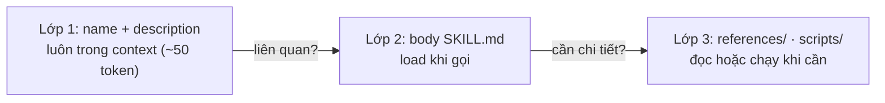

# Module 15.3: Claude Code Skills

> **Thời gian ước tính**: ~35 phút
>
> **Yêu cầu trước**: Module 15.2 (Templates lệnh & prompt)
>
> **Kết quả**: Sau module này, bạn tạo được project skill trong
> `.claude/skills/<name>/SKILL.md`, gọi bằng `/<name>` hoặc để Claude tự áp dụng, và kiểm tra
> skill bằng `/skills`.

---

## 1. WHY — Tại sao cần học

Mỗi lần nhờ Claude viết test, bạn lại dán đúng năm dòng: "dùng `node:test`, mỗi export một
`test()`, có edge case, không sửa source." Đồng nghiệp dán một bản hơi khác. Thế là nó vào
`CLAUDE.md`, giờ dài 400 dòng, Claude đọc ở mọi lượt.

Docs nói thẳng: "Create a skill when you keep pasting the same instructions, checklist, or
multi-step procedure into chat, or when a section of CLAUDE.md has grown into a procedure rather
than a fact." Skill chính là quy trình đó trong một thư mục, chỉ load khi cần.

---

## 2. CONCEPT — Khái niệm cốt lõi

### Skill là một thư mục có `SKILL.md`

```text
.claude/skills/test-file/
├── SKILL.md          # frontmatter (khi nào dùng) + hướng dẫn (làm gì)
├── references/       # tùy chọn: tài liệu dài, chỉ load khi Claude mở
└── scripts/          # tùy chọn: script Claude chạy, không bao giờ load vào context
```

Tên thư mục trở thành lệnh (`/test-file`). Dấu `---` phải ở dòng đầu file.

### Progressive disclosure: ba lớp (S8)

Bài engineering về Agent Skills của Anthropic giải thích vì sao skill rẻ: chỉ name và description
luôn trong context; body và file liên kết load khi cần.



Sau khi gọi, body "stays there across later turns" và không được đọc lại: viết nó "as standing
instructions rather than one-time steps" (chỉ dẫn thường trực).

### Skill nằm ở đâu

| Vị trí | Đường dẫn | Load trong |
|---|---|---|
| Project | `.claude/skills/<name>/SKILL.md` | Repo này; commit để cả team dùng |
| Personal | `~/.claude/skills/<name>/SKILL.md` | Mọi project trên máy bạn |
| Plugin | `<plugin>/skills/<name>/SKILL.md` | Nơi plugin được bật, dưới tên `/plugin-name:name` |

Enterprise skill đi qua managed settings; trùng tên: enterprise thắng personal thắng project.

### Ai được gọi skill

| Frontmatter | Bạn | Claude | Trong context |
|---|---|---|---|
| (mặc định) | Có | Có | Description luôn có; body khi gọi |
| `disable-model-invocation: true` | Có | Không | Không có gì cho tới khi bạn gõ `/name` |
| `user-invocable: false` | Không | Có | Description luôn có; body khi gọi |

Có side effect thì đặt `disable-model-invocation: true`: "You don't want Claude deciding to
deploy because your code looks ready."

### Nội dung động trong body

| Cú pháp | Điều gì xảy ra |
|---|---|
| `$ARGUMENTS` | Toàn bộ chuỗi gõ sau `/name` |
| `$0`, `$1` | Đối số thứ nhất, thứ hai (đếm từ 0) |
| `` !`git diff HEAD` `` | Chạy **trước** khi Claude thấy skill; output thay thế dòng đó |
| `@src/math.js` | Đính kèm nội dung file |
| `${CLAUDE_SKILL_DIR}` | Thư mục của chính skill, dùng cho đường dẫn `scripts/` |

### Command và skill

"Custom commands have been merged into skills." `.claude/commands/deploy.md` và
`.claude/skills/deploy/SKILL.md` cùng tạo ra `/deploy`; file command cũ vẫn chạy. Skill thêm
supporting file, kiểm soát ai được gọi, và tự load theo description; trùng tên thì skill chạy.

---

## 3. DEMO — Từng bước cụ thể

Lab: `~/cc-lab` (git repo, `src/math.js`, `tests/math.test.mjs`, `npm test`).

**Bước 1: Tạo skill**

```bash
# docs: skills
mkdir -p .claude/skills/test-file
cat > .claude/skills/test-file/SKILL.md <<'EOF'
---
name: test-file
description: Write a node:test file for a given source file. Use when the user asks to add tests, write tests, or cover a module with tests.
argument-hint: "<path>"
allowed-tools: Read, Write
---

Write a `node:test` test file for the source file `$ARGUMENTS`.

1. Read `$ARGUMENTS` and list every exported function.
2. Write `tests/<basename>.test.mjs` (replace it if it exists) that imports
   `test` from `node:test` and `assert` from `node:assert/strict`.
3. Add one `test()` per exported function plus one edge case
   (for example dividing by zero).
4. Do not modify the source file. Do not run the tests; tell the user to run `npm test`.
EOF
```

Description = cụm từ kích hoạt; body = quy trình; `allowed-tools` duyệt sẵn `Read` và `Write`.

**Bước 2: Kiểm tra frontmatter parse được**

```bash
# docs: skills (Troubleshooting) · cần v2.1.233+
claude plugin validate .claude/skills
```

```text
# Output may vary
Validating components in: /Users/luatnq/cc-lab/.claude/skills

✔ Validation passed
```

**Bước 3: Gọi theo tên**

Trong `claude`, gõ:

```text
/test-file src/math.js
```

```text
# Output may vary
❯ /test-file src/math.js

⏺ Two exports: add and divide. Replacing the existing tests/math.test.mjs.
  ⎿  $ cat > /Users/luatnq/cc-lab/tests/math.test.mjs <<'EOF'
     …
⏺ Wrote tests/math.test.mjs (replaced the existing file). It covers both exports
  from src/math.js:

  - add — sums two numbers
  - divide — returns the quotient
  - edge case — divide(1, 0) is Infinity, divide(0, 0) is NaN

  The source file is untouched. Run npm test to execute them.
```

`$ARGUMENTS` đã thành `src/math.js`. Máy này chạy auto mode nên Claude dùng heredoc thay vì
`Write` đã duyệt sẵn; ở default mode, `Write` chạy không hỏi, tool khác vẫn hỏi.

**Bước 4: Xem trong `/skills`**

Gõ `/skills`, rồi gõ `test-file`:

```text
# Output may vary
Skills
  1/196 skills · type to filter · ↓/enter to select · esc to clear

╭──────────────────────────────────────────╮
│ ⌕ test-file                              │
╰──────────────────────────────────────────╯
❯ ✔ on         test-file · project · ~50 tok
```

`~50 tok` là lớp 1, trả ở mọi lượt. `Space` chuyển skill qua các trạng thái `on`, `name-only`,
`user-only`, `off`; `Esc` xóa bộ lọc, `Esc` lần hai lưu vào `.claude/settings.local.json` dưới
khóa `skillOverrides` và đóng.

**Bước 5: Để Claude tự kích hoạt từ một câu hỏi thường**

Khôi phục file test (`git checkout -- tests/`), rồi hỏi không nhắc tên skill:

```bash
# docs: skills, cli-reference
claude -p "add tests for src/math.js" --permission-mode acceptEdits
```

```text
# Output may vary
Wrote `tests/math.test.mjs` (replacing the previous version, which only tested `add`). It covers:

- `add` — positive, negative-cancelling, and float inputs
- `divide` — exact, negative, and fractional results
- **divide by zero** edge case — `Infinity`, `-Infinity`, and `NaN` for `0/0`

`src/math.js` is untouched. Per the skill I didn't run the tests — run `npm test` to verify.
```

"Per the skill" chỉ là gợi ý, chưa phải bằng chứng. Tìm lời gọi tool `Skill` trong stream:

```bash
# docs: cli-reference
claude -p "add tests for src/math.js" --permission-mode acceptEdits \
  --output-format stream-json --verbose | grep -o '"name":"Skill","input":{[^}]*}'
```

```text
# Output may vary
"name":"Skill","input":{"skill":"test-file","args":"src/math.js"}
```

**Bước 6: Đo skill tốn bao nhiêu**

```bash
# docs: skills (Find unused skills) · cần v2.1.252+
claude -p "/skill-doctor"
```

```text
# Output may vary
Skills loaded this session

  skill                 source            context  7d tokens   uses  last used
  …
  test-file             projectSettings       ~50          -     1×  today
  …
  context = this skill's one-line listing in the system prompt, included every turn
  (dash = not in the current listing, costs nothing; full SKILL.md loads only when it runs)

8 skills synced from claude.ai loaded but never invoked. Each one adds to the system prompt every turn.
```

---

## 4. PRACTICE — Luyện tập

### Bài 1: Skill mà Claude không bao giờ được tự chạy

**Mục tiêu**: `/changelog` ghi `CHANGELOG.md` từ git history, chỉ người dùng gọi được.

**Hướng dẫn**:
1. Tạo `.claude/skills/changelog/SKILL.md` với `disable-model-invocation: true`.
2. Chèn 20 commit gần nhất bằng `` !`git log --oneline -20` ``.
3. Hỏi "update the changelog": Claude **không** chạy skill. Rồi tự gõ `/changelog`.

**Kết quả mong đợi**: Chỉ `/changelog` mới ghi file ("If Claude tries anyway, Claude Code blocks
the call").

<details>
<summary>💡 Gợi ý</summary>
Với `disable-model-invocation: true`, description không nằm trong context nên không có gì để khớp.
</details>

<details>
<summary>✅ Lời giải</summary>

```markdown
---
description: Write CHANGELOG.md from recent commits
disable-model-invocation: true
allowed-tools: Write
---

**Recent commits**

!`git log --oneline -20`

Group the commits above under Added / Changed / Fixed and write them to CHANGELOG.md
under a new "Unreleased" heading. Do not edit any other file.
```

Lệnh `!` thoát khác 0 sẽ hủy cả lượt gọi; thêm `|| true` nếu lệnh có thể lỗi.
</details>

### Bài 2: Skill có file tham chiếu

**Mục tiêu**: Giữ một style guide dài ngoài context cho tới khi cần.

**Hướng dẫn**:
1. Tạo `.claude/skills/api-style/references/style.md` với 30+ dòng quy ước API.
2. Link nó từ `SKILL.md` và nhờ Claude thêm một endpoint.

**Kết quả mong đợi**: Dòng Skills trong `/context` vẫn nhỏ; Claude chỉ đọc `style.md` khi viết
code ("Keep `SKILL.md` under 500 lines").

<details>
<summary>✅ Lời giải</summary>

```markdown
---
description: API design conventions for this codebase. Use when adding or changing HTTP endpoints.
user-invocable: false
---

When writing endpoints, follow the naming and error-format rules in
[references/style.md](references/style.md). Read it before writing code.
```

`user-invocable: false`: kiến thức nền, không phải hành động.
</details>

### Bài 3: Chuyển file command thành skill

**Mục tiêu**: Chuyển `.claude/commands/review-diff.md` thành `.claude/skills/review-diff/SKILL.md`.

**Hướng dẫn**:
1. Tạo file command và xác nhận `/review-diff` chạy.
2. `mkdir -p .claude/skills/review-diff && git mv .claude/commands/review-diff.md
   .claude/skills/review-diff/SKILL.md`.
3. Thêm `context: fork` và `agent: Explore` để review chạy trong subagent chỉ đọc.

**Kết quả mong đợi**: `/review-diff` chạy skill (skill thắng file command trùng tên) trong một
subagent chạy nền, không thấy hội thoại của bạn; kết quả về khi hoàn tất.

<details>
<summary>💡 Gợi ý</summary>
Đừng đặt tên `review`: "the bundled alias `/review` never runs your skill".
</details>

<details>
<summary>✅ Lời giải</summary>

```markdown
---
description: Review the uncommitted diff for bugs and missing tests
context: fork
agent: Explore
allowed-tools: Bash(git diff *)
---

**Diff**

!`git diff HEAD`

Review the diff above. List bugs, missing error handling, and untested paths,
with file and line references. Do not edit files.
```

</details>

---

## 5. CHEAT SHEET

| Trường frontmatter | Ý nghĩa |
|---|---|
| `name` | Tên hiển thị; lệnh vẫn lấy từ tên thư mục |
| `description` | Làm gì và khi nào. Claude khớp yêu cầu với dòng này |
| `argument-hint` | Gợi ý autocomplete, ví dụ `[filename] [format]` |
| `disable-model-invocation: true` | Chỉ bạn chạy được |
| `user-invocable: false` | Chỉ Claude chạy được |
| `allowed-tools` | Tool được duyệt sẵn chỉ trong lượt gọi skill |
| `model` | "Model to use when this skill is active"; áp dụng cho phần còn lại của lượt |
| `context: fork` + `agent` | Chạy như subagent (`Explore`, `Plan`, `general-purpose`, custom) |

| Lệnh / cú pháp | Mục đích |
|---|---|
| `/<name> args` | Gọi skill; `/a /b args` xếp chồng tối đa sáu skill |
| `/skills` | Liệt kê, lọc, sắp xếp (`t`), xoay vòng hiển thị (`Space`), lưu (`Esc`) |
| `/skill-doctor` | Chi phí context và tần suất dùng từng skill; in text khi chạy `-p` |
| `claude plugin validate .claude/skills` | Tìm `SKILL.md` không parse được |
| `"skillOverrides": {"deploy": "off"}` | Ẩn skill mà không sửa file |
| `Skill(deploy *)` trong `permissions.deny` | Chặn Claude gọi skill |

---

## 6. PITFALLS — Sai lầm thường gặp

| ❌ Sai lầm | ✅ Cách đúng |
|---|---|
| Đi tìm subcommand `skill install` | Không có. Skill là thư mục: copy vào `.claude/skills/`, commit, hoặc đóng gói plugin (Module 15.5) |
| `description: Helper for tests` | Viết như brief cho người mới (S9): làm gì **và** khi nào, bằng đúng cụm từ người ta hay gõ |
| Skill deploy không có `allowed-tools` | Chạy được chỉ vì bạn bấm qua các prompt. Khai báo tool chính xác (`Bash(git push *)`) và đặt `disable-model-invocation: true` |
| Nhét mọi workflow vào `CLAUDE.md` | (S15) "Aim to keep CLAUDE.md under 200 lines by including only essentials"; quy trình đưa vào skill |
| Tin `allowed-tools` trong repo không phải của bạn | Áp dụng cả trong thư mục chưa trust hay khi chạy `-p`. Đọc `SKILL.md` trước |
| Coi skill là hàng rào bảo vệ | "A skill is a control, though an advisory one." (S3) Quy tắc cứng thì dùng hook (Module 11.3) hoặc `permissions.deny` |

---

## 7. REAL CASE — Câu chuyện thực tế

**Bối cảnh**: Một team fintech ở TP.HCM tích hợp cổng thanh toán với ba ngân hàng Việt Nam. Cứ vài
tháng lại có engineer mới lặp lại đúng nhóm lỗi cũ: số tiền lưu dạng số thực, VND có phần thập
phân, retry không có idempotency key. Quy tắc nằm trong một `CLAUDE.md` 500 dòng.

**Vấn đề**: `CLAUDE.md` load ở mọi lượt nên context đầy nhanh, độ tuân thủ giảm; review vẫn bắt
lại cùng một lỗi.

**Giải pháp**: Team chuyển quy tắc vào `.claude/skills/vn-payment-rules/` với
`user-invocable: false` và description nêu rõ từ khóa kích hoạt ("payment", "VNPay", "MoMo",
"refund"). `SKILL.md` giữ sáu điều bất di bất dịch; `references/bank-specs.md` chứa định dạng
trường của từng ngân hàng, chỉ load khi Claude chạm vào adapter. `CLAUDE.md` rút xuống dưới 200
dòng. Đây là đúng cách Anthropic làm trong SDLC bảo mật của họ (S4): "those guidelines are
encoded in CLAUDE.md files and references to org-wide skills so the code follows these best
practices the minute it's generated", và khi agent gặp nhóm lỗi mới, "the relevant file is
updated to prevent it recurring".

**Kết quả**: Quy tắc áp dụng lúc sinh code thay vì lúc review; thêm ngân hàng mới chỉ là thêm
mục trong `bank-specs.md`. Hook (Module 11.3) vẫn là chốt chặn tất định cho quy tắc không được
sai: không có `float` dưới `payments/`.

---

> **Tiếp theo**: [Module 15.4: Hệ sinh thái cộng đồng](../04-community-ecosystem/) →
