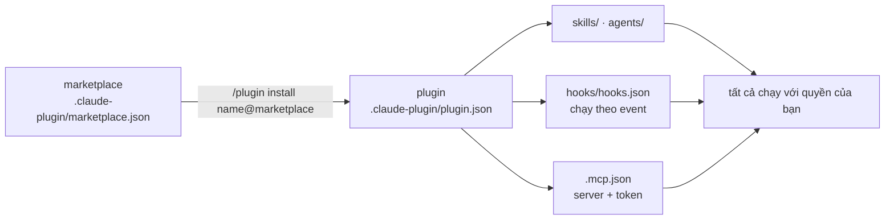

# Module 15.4: Hệ sinh thái cộng đồng

> **Thời gian ước tính**: ~30 phút
>
> **Yêu cầu trước**: Module 15.3 (Claude Code Skills)
>
> **Kết quả**: Sau module này, bạn sẽ thêm được một plugin marketplace, đọc hooks và MCP config
> của plugin trước khi cài, cài nó ở project scope để cả team cùng có, và giới hạn marketplace
> lẫn MCP server mà team được phép dùng.

---

## 1. WHY — Tại sao cần học

Ai đó trong team dán link GitHub kèm câu "cài plugin này đi, hay lắm". Nó mang theo một hook
`SessionStart`, một hook `Stop` và một MCP server đòi token. Cả team cài vì nó phổ biến; không ai
đọc. Sáu tuần sau, hook đó vẫn chạy ở mỗi prompt trong một repo chứa credential ngân hàng.

Docs nói thẳng: "Plugins and marketplaces are highly trusted components that can execute
arbitrary code on your machine with your user privileges." Module này nói về việc đọc trước khi
cài, và biến nó thành luật của team.

---

## 2. CONCEPT — Ý tưởng cốt lõi

### Hai bước: marketplace, rồi plugin

**Marketplace** là một git repo (hoặc thư mục, hoặc URL) có `.claude-plugin/marketplace.json`
liệt kê plugin. Thêm nó một lần, rồi cài plugin từ đó dưới dạng `name@marketplace`.



### Plugin đến từ đâu

| Nguồn | Thêm / cài | Có gì trong đó |
|---|---|---|
| `claude-plugins-official` | Tự đăng ký; xem trong `/plugin` → **Discover** hoặc claude.com/plugins | Catalogue do Anthropic duy trì, ví dụ `/plugin install github@claude-plugins-official` |
| `anthropics/claude-plugins-community` | `/plugin marketplace add anthropics/claude-plugins-community` → `name@claude-community` | Plugin cộng đồng |
| `anthropics/claude-code` | `/plugin marketplace add anthropics/claude-code` → `claude-code-plugins` | Repo của chính Anthropic: `commit-commands`, `security-guidance`, `plugin-dev`, `hookify`, … |
| `anthropics/skills` | `/plugin marketplace add anthropics/skills` → `anthropic-agent-skills` | `document-skills` (docx/pdf/pptx/xlsx), `example-skills`, `claude-api`, … phần lớn Apache 2.0 |
| Repo của bạn | `/plugin marketplace add your-org/claude-plugins` | Skill, hook, MCP config nội bộ |
| Danh sách tuyển chọn | ví dụ [awesome-claude-code](https://github.com/hesreallyhim/awesome-claude-code) | Là danh sách, không phải review. Checklist vẫn áp dụng |

Official hay không, cảnh báo trong docs vẫn như nhau: "Anthropic doesn't control what MCP
servers, files, or other software are included in plugins and can't verify that they work as
intended."

### Scope: ai nhận được plugin

| Scope | Ghi vào | Dùng cho |
|---|---|---|
| `user` (mặc định của CLI) | `~/.claude/settings.json` | Chỉ máy bạn |
| `project` | `.claude/settings.json`: `extraKnownMarketplaces` + `enabledPlugins` | Commit lên; đồng đội nhận sau khi trust thư mục |
| `local` | `.claude/settings.local.json` | Chỉ checkout này |
| `managed` | Managed settings | Toàn tổ chức, không override được |

### Checklist trước khi cài

Trước `/plugin install`, mở source và trả lời năm câu:

1. **Ai publish?** Tổ chức, lịch sử commit, marketplace bạn đã tin.
2. **`hooks/hooks.json`**: những event nào (`SessionStart`, `UserPromptSubmit`, `Stop` chạy mỗi
   lượt) và script làm gì.
3. **`.mcp.json`**: endpoint nào, token nào đi vào `headers` hoặc `env`.
4. **Skill**: `allowed-tools`, `` !`lệnh` ``, `disable-model-invocation` cho việc có side effect.
5. **Nó có cần tất cả những thứ đó không?** Một helper commit không cần hook `Stop`.

### Kiểm soát cho team (enforced, không phải khuyến nghị)

| Setting | Scope | Tác dụng |
|---|---|---|
| `enabledPlugins` | mọi scope; managed `false` chặn ở mọi scope | Bật/tắt từng plugin; project đè user |
| `extraKnownMarketplaces` | mọi scope; settings trong repo có hiệu lực sau khi trust | Tự thêm marketplace cho project |
| `strictKnownMarketplaces` | **chỉ managed** | Allowlist nguồn; `[]` khóa tất cả, kể cả official |
| `blockedMarketplaces` | managed | Denylist |
| `allowedMcpServers` | mọi scope; "Deploy it in managed settings to enforce it" | Allowlist theo `serverName`, `serverCommand`, `serverUrl`; áp cả server của plugin |

---

## 3. DEMO — Từng bước

Chạy trong `~/cc-lab`. Các bước dùng dạng shell `claude plugin …` để output tái lập được;
`/plugin …` trong session làm điều tương tự.

**Bước 1: Xem bạn đã có marketplace nào**

```bash
# docs: plugin-marketplaces
claude plugin marketplace list
```

```text
# Output may vary
Configured marketplaces:

  ❯ claude-plugins-official
    Source: GitHub (anthropics/claude-plugins-official)
  …
```

**Bước 2: Thêm marketplace repo của Anthropic ở project scope**

```bash
# docs: plugin-marketplaces, discover-plugins
claude plugin marketplace add anthropics/claude-code --scope project
cat .claude/settings.json
```

```text
# Output may vary
Adding marketplace…Cloning via SSH: git@github.com:anthropics/claude-code.git
Refreshing marketplace cache (timeout: 120s)…
Clone complete, validating marketplace…
✔ Successfully added marketplace: claude-code-plugins (declared in project settings)
{
  "extraKnownMarketplaces": {
    "claude-code-plugins": {
      "source": {
        "source": "github",
        "repo": "anthropics/claude-code"
      }
    }
  }
}
```

Tên marketplace lấy từ `marketplace.json` của nó, không phải tên repo. Commit
`.claude/settings.json`; đồng đội nhận được sau khi trust thư mục.

**Bước 3: Đọc trước khi cài**

Marketplace là repo public, nên hãy đọc thứ nó sẽ chạy. So sánh một plugin nặng hook với một
plugin đơn giản:

```bash
# docs: plugins-reference (hooks/hooks.json, .mcp.json layout)
curl -s https://raw.githubusercontent.com/anthropics/claude-code/main/plugins/security-guidance/hooks/hooks.json \
  | jq -c '.hooks | keys'
curl -s https://raw.githubusercontent.com/anthropics/claude-code/main/plugins/commit-commands/commands/commit.md \
  | head -4
curl -s https://raw.githubusercontent.com/anthropics/claude-plugins-official/main/external_plugins/github/.mcp.json
```

```text
# Output may vary
["PostToolUse","SessionStart","Stop","UserPromptSubmit"]
---
allowed-tools: Bash(git add:*), Bash(git status:*), Bash(git commit:*)
description: Create a git commit
---
{
  "github": {
    "type": "http",
    "url": "https://api.githubcopilot.com/mcp/",
    "headers": {
      "Authorization": "Bearer ${GITHUB_PERSONAL_ACCESS_TOKEN}"
    }
  }
}
```

`security-guidance` gắn hook vào bốn event, gồm mỗi prompt và mỗi lần stop: đó là việc của nó,
nhưng bạn cần biết trước khi nó chạy trên repo có secret. `commit-commands` là ba file command
chỉ được `git add/status/commit`. Plugin `github` official là một MCP server HTTP gửi
`GITHUB_PERSONAL_ACCESS_TOKEN` của bạn tới `api.githubcopilot.com`. Không có gì bị giấu; chỉ là
chưa ai đọc.

**Bước 4: Cài ở project scope**

```bash
# docs: discover-plugins, plugins-reference
claude plugin install commit-commands@claude-code-plugins --scope project
cat .claude/settings.json
```

```text
# Output may vary
Installing plugin "commit-commands@claude-code-plugins"...✔ Successfully installed plugin: commit-commands@claude-code-plugins (scope: project)
{
  "extraKnownMarketplaces": { "claude-code-plugins": { … } },
  "enabledPlugins": {
    "commit-commands@claude-code-plugins": true
  }
}
```

Trong session, `/plugin install commit-commands@claude-code-plugins` sẽ hỏi scope thay vì cần
flag.

**Bước 5: Liệt kê từ trong session**

Mở `claude` và gõ `/plugin list`:

```text
# Output may vary
❯ /plugin list
  ⎿  Installed plugins:
       • commit-commands@claude-code-plugins (v1.0.0, project) ✔ enabled
       …
```

`/plugin` → **Installed** hiện `commit-commands Plugin · claude-code-plugins · ✔ enabled · 3
skills`, gọi bằng `/commit-commands:commit`.

**Bước 6: Gỡ sạch**

```bash
# docs: plugins-reference, plugin-marketplaces
claude plugin uninstall commit-commands@claude-code-plugins --scope project
claude plugin marketplace remove claude-code-plugins
```

```text
# Output may vary
✔ Successfully uninstalled plugin: commit-commands (scope: project)
✔ Successfully removed marketplace: claude-code-plugins
```

Gỡ marketplace thì "also uninstalls any plugins you installed from it".

---

## 4. PRACTICE — Tự thực hành

### Bài 1: Audit một plugin bạn không viết

**Mục tiêu**: Áp checklist lên `anthropics/skills`.

**Hướng dẫn**:
1. `claude plugin marketplace add anthropics/skills --scope local`.
2. Đọc `.claude-plugin/marketplace.json` của repo và liệt kê tên các plugin.
3. Với `document-skills`, ghi lại tool mà mỗi `SKILL.md` cần và xem có hook hay `.mcp.json`
   nào không. Rồi `claude plugin marketplace remove anthropic-agent-skills`.

**Kết quả mong đợi**: Một câu nói rõ plugin chạy gì và với tool nào.

### Bài 2: Khóa team lại

**Mục tiêu**: Managed settings chỉ cho phép marketplace official, repo của tổ chức bạn, và một
MCP server.

<details>
<summary>✅ Lời giải</summary>

```json
{
  "strictKnownMarketplaces": [
    { "source": "github", "repo": "anthropics/claude-plugins-official" },
    { "source": "github", "repo": "your-org/claude-plugins" }
  ],
  "allowedMcpServers": [
    { "serverUrl": "https://mcp.internal.example.com/*" }
  ]
}
```

`strictKnownMarketplaces` chỉ có tác dụng trong managed settings; `allowedMcpServers` cũng chỉ
là luật ở đó. Cả hai áp lên cả server do plugin cung cấp.
</details>

### Bài 3: Publish plugin ở Module 15.5 trong nội bộ

**Mục tiêu**: Một marketplace riêng mà team thêm bằng một lệnh.

<details>
<summary>✅ Lời giải</summary>

```json
{
  "name": "acme-tools",
  "owner": { "name": "ACME Platform Team" },
  "plugins": [
    {
      "name": "cc-lab-plugin",
      "source": "./plugins/cc-lab-plugin",
      "description": "Test-writing skill plus post-write test hook"
    }
  ]
}
```

Lưu thành `.claude-plugin/marketplace.json` cạnh `plugins/cc-lab-plugin/`, chạy
`claude plugin validate .` (`✔ Validation passed with warnings` cho tới khi bạn thêm
`description`), push, rồi `/plugin marketplace add your-org/acme-tools` và
`/plugin install cc-lab-plugin@acme-tools`.
</details>

---

## 5. CHEAT SHEET

| Lệnh / setting | Mục đích |
|---|---|
| `/plugin` | Menu: Discover · Installed · Marketplaces · Errors · Stats |
| `/plugin marketplace add owner/repo` (`./dir`, git URL, `owner/repo@ref`) | Đăng ký marketplace |
| `/plugin marketplace list` · `update <name>` · `remove <name>` | Quản lý marketplace |
| `/plugin install name@marketplace` | Cài; hỏi scope |
| `/plugin install name --marketplace owner/repo` | Thêm + cài trong một bước (v2.1.275+) |
| `/plugin uninstall name@marketplace` · `enable` · `disable` · `list` | Quản lý plugin |
| `claude plugin install name@marketplace -s project` | Dạng shell; user scope nếu thiếu `-s` |
| `claude plugin validate .` | Kiểm tra `marketplace.json` hoặc `plugin.json` |
| `/reload-plugins` | Kích hoạt không cần restart |
| `"enabledPlugins": {"name@market": true}` | Bật/tắt theo scope; managed `false` chặn mọi nơi |
| `"extraKnownMarketplaces"` | Tự thêm cho project (sau khi trust thư mục) |
| `"strictKnownMarketplaces": []` | Managed lockdown; liệt kê nguồn để cho phép |
| `"allowedMcpServers"` | Allowlist MCP; enforce từ managed settings |

---

## 6. PITFALLS — Lỗi thường gặp

| ❌ Sai lầm | ✅ Cách đúng |
|---|---|
| Lấy số lượt cài, số star hay awesome-list làm thẩm định | Chúng chỉ nói thứ đó tồn tại và phổ biến. Tự chạy checklist năm câu |
| Cài ở user scope cho tool của team | `--scope project` ghi `enabledPlugins` vào `.claude/settings.json`; commit nó |
| "Plugin official nên an toàn" | Plugin official mang cùng cảnh báo. `github@claude-plugins-official` gửi token tới một HTTP server: ổn nếu bạn chủ ý |
| Đặt `strictKnownMarketplaces` trong `.claude/settings.json` | Key này chỉ dành cho managed. Project settings dùng `enabledPlugins` / `extraKnownMarketplaces` |
| Coi hook của plugin là vô hại vì "chỉ nhắc nhở" | Hook chạy script với quyền của bạn ở mỗi event; đọc script, đừng đọc description |

---

## 7. REAL CASE — Câu chuyện thực tế

**Bối cảnh**: Một công ty outsourcing ở Hà Nội dùng Claude Code trên hơn chục repo của khách, vài
repo có credential ngân hàng trong CI. Dev tự do thêm marketplace; không ai liệt kê được hook
nào đang chạy ở đâu.

**Vấn đề**: Đợt security review của khách hỏi "code bên thứ ba nào chạy khi kỹ sư của các bạn mở
repo của chúng tôi?" Câu trả lời thật thà là "chúng tôi không biết".

**Giải pháp**: Plugin trở thành artefact được review. Mỗi đề xuất là một PR vào
`your-org/claude-plugins`, copy plugin vào kèm checklist đã điền: event trong `hooks/hooks.json`,
endpoint và token trong `.mcp.json`, `allowed-tools` của từng skill. Managed settings đặt
`strictKnownMarketplaces` gồm marketplace official và repo đó, `allowedMcpServers` gồm hai server
nội bộ. `.claude/settings.json` của từng project mang `extraKnownMarketplaces` và
`enabledPlugins`, nên mỗi checkout tự khai báo thứ chạy trong nó. Đúng luật Anthropic áp cho
agent của họ (S4): "Give every agent a single-purpose identity with the minimum permissions for
its job".

**Kết quả**: Câu hỏi của khách giờ có một file làm câu trả lời, và hook mới không thể vào repo
nếu chưa qua PR review. Thêm một plugin mất một ngày thay vì một phút; đó chính là mục đích.

---

> **Tiếp theo**: [Module 15.5: Phát triển Skill tùy chỉnh](../05-custom-skill-development/) →
