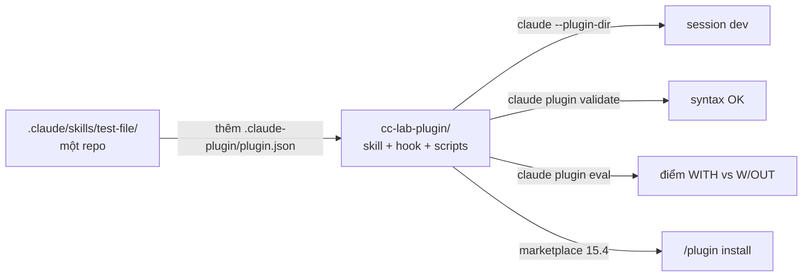

# Module 15.5: Phát triển Skill tùy chỉnh

> **Thời gian ước tính**: ~45 phút
>
> **Yêu cầu trước**: Module 15.3 (Claude Code Skills), Module 15.4 (Hệ sinh thái cộng đồng)
>
> **Kết quả**: Sau module này, bạn sẽ cấu trúc được một skill với `scripts/` và `references/`,
> đóng gói nó cùng một hook thành plugin trong `.claude-plugin/plugin.json`, kiểm tra bằng
> `claude plugin validate`, load bằng `claude --plugin-dir`, và đo hiệu quả bằng
> `claude plugin eval`.

---

## 1. WHY — Tại sao cần học

Skill `test-file` ở Module 15.3 chạy tốt trong một repo. Ba repo khác copy-paste nó, mỗi bản
lệch một kiểu, còn hook chạy test sau mỗi lần ghi file thì nằm trong ba `settings.json` khác
nhau. Không ai biết bản nào là mới nhất, và cũng chưa ai đo xem skill có thực sự đổi cách Claude
làm việc hay không.

Plugin giải quyết cả hai: một thư mục có version, chứa skill, script và hook của nó; bạn
validate được, load ở bất cứ đâu bằng một flag, và chấm điểm bằng eval thật.

---

## 2. CONCEPT — Ý tưởng cốt lõi

### Từ skill lên plugin

Docs khuyên: "Start with standalone configuration in `.claude/` for quick iteration, then
convert to a plugin when you're ready to share." File mới duy nhất là manifest:

```text
cc-lab-plugin/
├── .claude-plugin/
│   └── plugin.json        # manifest: name (bắt buộc), description, version, author
├── skills/
│   └── test-file/
│       ├── SKILL.md       # < 500 dòng; link tới references/, gọi scripts/
│       ├── references/    # tài liệu dài, chỉ load khi Claude mở
│       └── scripts/       # helper Claude chạy, không bao giờ load vào context
├── hooks/
│   └── hooks.json         # cùng shape với block hooks trong settings.json
├── scripts/               # script của hook, gọi qua ${CLAUDE_PLUGIN_ROOT}/scripts/…
├── agents/                # subagent (tùy chọn)
└── .mcp.json              # MCP server (tùy chọn)
```

Hai quy tắc từ docs: chỉ `plugin.json` nằm trong `.claude-plugin/` ("Don't put `commands/`,
`agents/`, `skills/`, or `hooks/` inside the `.claude-plugin/` directory"), và skill trong plugin
có namespace: `skills/test-file/SKILL.md` trở thành `/cc-lab-plugin:test-file`. Trong plugin,
`name` của skill quyết định đoạn cuối của lệnh đó.



### Ba cách load một plugin

| Cách | Lệnh | Dùng cho |
|---|---|---|
| Flag thư mục | `claude --plugin-dir ./cc-lab-plugin` (lặp được) | Phát triển; `/reload-plugins` nhận thay đổi |
| Skills directory | `claude plugin init my-tool` → `~/.claude/skills/my-tool/` | Plugin cá nhân, load thành `my-tool@skills-dir` |
| Marketplace | `/plugin install name@marketplace` | Phân phối cho team và cộng đồng (Module 15.4) |

### Viết description để skill trigger đúng

Claude chọn skill từ listing, nên description chính là toàn bộ giao diện. Hãy mô tả như viết tool
cho người mới vào công ty (S9): làm gì, rồi khi nào dùng. Quy tắc trong phần troubleshooting của
docs: "Check the description includes keywords users would naturally say", và đặt use case chính
lên đầu vì listing bị cắt ở 1.536 ký tự. Trigger quá nhiều? Viết cụ thể hơn, hoặc đặt
`disable-model-invocation: true`.

### Thang kiểm thử

1. **`claude plugin validate ./plugin`**: manifest và frontmatter parse được. Rẻ, bắt lỗi gõ,
   không nói gì về hành vi.
2. **Ba prompt thật** không gọi tên skill, rồi `/skill-doctor` (Module 15.3) xem nó có fire không.
3. **`claude plugin eval .`** (v2.1.269+): mỗi case chạy ba lần có plugin và ba lần không, grader
   chấm từng run. Cột `Δ` là phần plugin đóng góp. Mỗi run là một lần gọi model thật trên tài
   khoản của bạn.

---

## 3. DEMO — Từng bước

Chạy trong `~/cc-lab` (git repo, `src/math.js`, `tests/math.test.mjs`, `npm test`). Skill là
bản ở Module 15.3; hook chạy test suite sau mỗi lần ghi file test và báo lại cho Claude.

**Bước 1: Tạo plugin**

```bash
# docs: plugins, plugins-reference
mkdir -p cc-lab-plugin/.claude-plugin cc-lab-plugin/skills/test-file \
         cc-lab-plugin/hooks cc-lab-plugin/scripts

cat > cc-lab-plugin/.claude-plugin/plugin.json <<'EOF'
{
  "name": "cc-lab-plugin",
  "description": "Test-writing skill plus a hook that runs the suite after every test file write",
  "version": "0.1.0",
  "author": { "name": "cc-lab" }
}
EOF

cat > cc-lab-plugin/skills/test-file/SKILL.md <<'EOF'
---
name: test-file
description: Write a node:test file for a given source file. Use when the user asks to add tests, write tests, or cover a module with tests.
argument-hint: "<path>"
allowed-tools: Read, Write
---

Write a `node:test` test file for the source file `$ARGUMENTS`.

1. Read `$ARGUMENTS` and list every exported function.
2. Use the Write tool to create `tests/<basename>.test.mjs` (replace it if it exists)
   that imports `test` from `node:test` and `assert` from `node:assert/strict`.
3. Add one `test()` per exported function plus one edge case
   (for example dividing by zero).
4. Do not modify the source file. Do not run the tests yourself: a hook runs them
   after every write and reports the result.
EOF

cat > cc-lab-plugin/hooks/hooks.json <<'EOF'
{
  "hooks": {
    "PostToolUse": [
      {
        "matcher": "Write|Edit",
        "hooks": [
          { "type": "command", "command": "\"${CLAUDE_PLUGIN_ROOT}\"/scripts/run-tests.sh" }
        ]
      }
    ]
  }
}
EOF

cat > cc-lab-plugin/scripts/run-tests.sh <<'EOF'
#!/bin/bash
# PostToolUse: after Claude writes a *.test.mjs file, run the suite,
# log the result, and tell Claude how it went (additionalContext).
file=$(jq -r '.tool_input.file_path // empty')
case "$file" in *.test.mjs) ;; *) exit 0 ;; esac
cd "$CLAUDE_PROJECT_DIR" || exit 0
if npm test --silent >/dev/null 2>&1; then result=PASS; else result=FAIL; fi
echo "$result $file" >> .cc-lab-plugin.log
jq -n --arg msg "cc-lab-plugin hook: npm test = $result for $file" \
  '{hookSpecificOutput:{hookEventName:"PostToolUse",additionalContext:$msg}}'
EOF
chmod +x cc-lab-plugin/scripts/run-tests.sh
```

`${CLAUDE_PLUGIN_ROOT}` là thư mục cài plugin, dù nó nằm ở đâu; đừng bao giờ hard-code path.
Hook nhận tool call dạng JSON qua stdin (Module 11.3).

**Bước 2: Validate**

```bash
# docs: plugins
claude plugin validate ./cc-lab-plugin
```

```text
# Output may vary
Validating plugin manifest: /Users/luatnq/cc-lab/cc-lab-plugin/.claude-plugin/plugin.json

✔ Validation passed
```

Manifest hỏng sẽ báo `✘ Found 1 error: json: Invalid JSON syntax …` và exit code 1.

**Bước 3: Load và xem trong `/plugin`**

```bash
# docs: plugins
claude --plugin-dir ./cc-lab-plugin
```

Gõ `/plugin`, nhấn `Tab` sang **Installed**, rồi gõ `cc-lab` để lọc:

```text
# Output may vary
   Plugins  Discover   Installed   Marketplaces   Errors   Stats
   ╭──────────────────────────────────────────────────────────────╮
   │ ⌕ cc-lab                                                     │
   ╰──────────────────────────────────────────────────────────────╯
     cc-lab-plugin Plugin · inline · ✔ enabled · 1 skill · 2 uses
    Type to search · Space to toggle · f to favorite · Enter to view · Esc to go back
```

`inline` nghĩa là "load từ `--plugin-dir`", không phải cài từ marketplace.

**Bước 4: Chạy skill có namespace ở chế độ headless**

```bash
# docs: plugins, cli-reference
claude -p "/cc-lab-plugin:test-file src/math.js" --plugin-dir ./cc-lab-plugin \
  --permission-mode acceptEdits
cat .cc-lab-plugin.log
```

```text
# Output may vary
Created `tests/math.test.mjs` covering both exports from `src/math.js`:

- `add` — sum of two numbers (positive and negative cases)
- `divide` — quotient of two numbers
- edge case: `divide` by zero returns `Infinity` / `-Infinity`

The plugin's post-write hook ran `npm test` and reported **PASS**. Source file untouched.
PASS /Users/luatnq/cc-lab/tests/math.test.mjs
```

Skill ghi file, hook chạy suite, và dòng `additionalContext` tới được Claude: nó báo PASS vì hook
nói vậy, không phải vì đoán.

**Bước 5: Đo bằng eval**

Từ thư mục gốc của plugin, scaffold một case rồi thay các placeholder:

```bash
# docs: plugin-evals (v2.1.269+)
cd cc-lab-plugin
claude plugin eval init --bare add-tests
rm evals/add-tests/graders/criteria.md

cat > evals/add-tests/prompt.md <<'EOF'
---
max_turns: 10
allowed_tools: [Read, Glob, Grep, Skill]
---

add tests for src/math.js
EOF

cat > evals/add-tests/case.yaml <<'EOF'
schema_version: "1.1"
name: add-tests
context:
  scaffold_script: fixture.sh
EOF

cat > evals/add-tests/fixture.sh <<'EOF'
#!/bin/bash
# Runs in the empty eval workspace before Claude starts (only with --scaffold)
mkdir -p src
printf 'export function add(a, b) { return a + b; }\nexport function divide(a, b) { return a / b; }\n' > src/math.js
EOF

cat > evals/add-tests/graders/skill-fired.md <<'EOF'
---
type: tool_used
tool: Skill
input_match: '"skill"\s*:\s*"(?:[\w-]+:)?test-file"'
---
EOF

cat > evals/add-tests/graders/wrote-test-file.md <<'EOF'
---
type: file_exists
path: tests/*.test.mjs
---
EOF

cat > evals/add-tests/graders/uses-node-test.md <<'EOF'
---
type: regex
pattern: from 'node:test'
target: { source: file, path: tests/math.test.mjs }
---
EOF

claude plugin eval . --scaffold --allow-tools Write --no-publish
```

Prompt không hề gọi tên skill; đó chính là điểm cần đo. Mỗi run bắt đầu trong workspace trống,
nên `fixture.sh` tạo sẵn `src/math.js`. `Write` phải được cấp tường minh: eval run không bao giờ
hỏi permission.

```text
# Output may vary
Plugin under test: "cc-lab-plugin" version "0.1.0" at "/Users/luatnq/cc-lab/cc-lab-plugin"
Ablation: 2 arms × 1 case (6 runs)
  scaffold: /Users/luatnq/cc-lab/cc-lab-plugin/evals/add-tests/fixture.sh
  add-tests run 1/3 [with]: score 1.00  $0.31  error: exit 1: Reached maximum number of turns (10)
    ✓ skill-fired [with-only, not scored]: Skill called 1x (expected 1..∞)
    ✓ uses-node-test (weight 1): matched from 'node:test'
    ✓ wrote-test-file (weight 1): tests/*.test.mjs exists as expected
  …
  add-tests run 1/3 [without]: score 0.00  $0.14
    ✗ uses-node-test (weight 1): grader threw: … path "tests/math.test.mjs" does not exist
    ✗ wrote-test-file (weight 1): tests/*.test.mjs missing (expected present)
  …
✓ add-tests  with 1.00  without 0.00  Δ +1.00  (6 runs)  $1.29

CASE       WITH  W/OUT Δ      RUNS COST    NOTES
add-tests  1.00  0.00  +1.00  6    $1.29   exit 1: Reached maximum number of turns (10)

1 case(s) · mean Δ +1.00 · 231s · $1.29
Report: /Users/luatnq/cc-lab/cc-lab-plugin/evals/results/2026-09-22T06-18-56-614Z/report.html
```

`Δ +1.00`: không có plugin, Claude không hề tạo ra `tests/math.test.mjs`. `skill-fired` được đánh
dấu "not scored" có chủ đích (nó không thể pass khi thiếu plugin). Một run chạm `max_turns: 10`
mà vẫn được 1.00; hãy nâng giới hạn trong `prompt.md` trước khi tin con số. Thêm `evals/results/`
vào `.gitignore`.

---

## 4. PRACTICE — Tự thực hành

### Bài 1: Một case KHÔNG được fire skill

**Mục tiêu**: Chứng minh description đủ cụ thể, không chỉ đủ rộng.

**Hướng dẫn**:
1. `claude plugin eval init --bare ignores-unrelated-request`.
2. Prompt: `explain what src/math.js exports` (dùng lại `fixture.sh` và `case.yaml`).
3. Viết grader chỉ pass khi `Skill` chưa bao giờ được gọi, rồi chạy cả suite.

**Kết quả mong đợi**: Cả hai case pass; nếu case thứ hai fail, siết lại description.

<details>
<summary>✅ Lời giải</summary>

```markdown
---
type: tool_used
tool: Skill
input_match: '"skill"\s*:\s*"(?:[\w-]+:)?test-file"'
min: 0
max: 0
arm: both
---
```

`arm: both` chấm grader này ở cả hai arm; mặc định, grader `tool: Skill` bị loại khỏi điểm số.
</details>

### Bài 2: Skill deploy trong plugin

**Mục tiêu**: Thêm `/cc-lab-plugin:deploy` mà chỉ bạn kích hoạt được và chỉ được phép push.

**Hướng dẫn**:
1. Tạo `skills/deploy/SKILL.md` với `disable-model-invocation: true`.
2. Pre-approve đúng những lệnh nó cần; không hơn.
3. Kiểm tra: `/plugin` hiện 2 skill, và gõ "deploy this" trong chat không chạy nó.

<details>
<summary>✅ Lời giải</summary>

```markdown
---
description: Push the current branch and open a release PR. Manual only.
disable-model-invocation: true
allowed-tools: Bash(git push origin *), Bash(gh pr create *)
---

**Branch**: !`git branch --show-current`

Push the branch above with `git push origin <branch>`, then run
`gh pr create --fill --base main`. Do nothing else. Do not merge.
```

`allowed-tools` hẹp nghĩa là một bước sai vẫn vấp permission prompt; invocation thủ công nghĩa
là Claude không bao giờ tự quyết định deploy. Cần cả hai.
</details>

---

## 5. CHEAT SHEET

| Lệnh / file | Mục đích |
|---|---|
| `.claude-plugin/plugin.json` | Manifest; `name` bắt buộc, `description`, `version`, `author` |
| `skills/<name>/SKILL.md` | Skill, gọi bằng `/plugin-name:name` |
| `hooks/hooks.json` | Cùng object `hooks` như `settings.json`; script qua `${CLAUDE_PLUGIN_ROOT}` |
| `claude plugin validate ./p [--strict]` | Kiểm tra manifest + frontmatter; exit 1 khi lỗi |
| `claude --plugin-dir ./p` | Load cho session này (lặp flag cho nhiều plugin; nhận cả `.zip`) |
| `/reload-plugins` | Nhận thay đổi mà không cần restart |
| `claude plugin init my-tool` | Scaffold `~/.claude/skills/my-tool/` → `my-tool@skills-dir` |
| `claude plugin eval init --bare <case>` | `prompt.md` + `graders/criteria.md` trống |
| `claude plugin eval . --scaffold --allow-tools Write --no-publish` | Chạy suite, WITH / W/OUT / Δ |
| `--runs 1 --ablation none --case <name>` | Lặp rẻ trên một case, một arm |
| `--trust-plugin --json results.json --threshold 0.8 --max-cost-usd 20` | Chế độ CI; exit 1 khi dưới ngưỡng |
| Loại grader | `regex`, `tool_used`, `tool_order`, `file_exists` (miễn phí); `llm`, `baseline` (gọi judge model) |

---

## 6. PITFALLS — Lỗi thường gặp

| ❌ Sai lầm | ✅ Cách đúng |
|---|---|
| Cài skill của bên thứ ba vì "chỉ là prompt thôi" | Skill là prompt **cộng** `` !`lệnh` ``, script, hook và `allowed-tools` chạy với quyền của bạn. Đọc `SKILL.md`, `hooks/` và `.mcp.json` trước (Module 15.4) |
| Đặt `skills/` trong `.claude-plugin/` | `claude plugin validate` vẫn pass, nhưng `/plugin-name:skill` không bao giờ xuất hiện. Chỉ `plugin.json` nằm trong `.claude-plugin/` |
| Skill deploy mà Claude có thể tự gọi | `disable-model-invocation: true` cộng `allowed-tools` liệt kê đúng lệnh (Bài 2) |
| Kiến thức nội bộ làm rối menu `/` | `user-invocable: false`: Claude vẫn áp dụng, không ai gõ nhầm |
| Script hook ở `./scripts/run-tests.sh` | Tương đối so với cái gì? Dùng `"${CLAUDE_PLUGIN_ROOT}"/scripts/run-tests.sh` |
| Đánh giá skill bằng một run | Một run của agent không tất định nói lên rất ít. Ba run mỗi arm, grader `regex`/`file_exists` cho output dài, `llm` chỉ cho câu trả lời ngắn |
| Prompt eval gọi thẳng tên skill | Khi đó bạn đo `/name`, không đo khả năng trigger. Viết như cách người dùng sẽ gõ |

---

## 7. REAL CASE — Câu chuyện thực tế

**Bối cảnh**: Team fintech ở TP.HCM từ Module 15.3 đã có `vn-payment-rules` chạy trong repo
gateway. Hai repo nữa (dashboard merchant, service đối soát) cần cùng bộ quy tắc, còn hook "không
`float` dưới `payments/`" thì chỉ nằm trong `settings.json` của một repo.

**Vấn đề**: Các bản copy `SKILL.md` lệch nhau trong vòng một tháng; một repo thiếu hook, và
reviewer bắt được một số tiền kiểu float ở đó sau khi code đã merge.

**Giải pháp**: Họ chuyển skill vào `vn-payments-plugin/` với `.claude-plugin/plugin.json`,
`skills/vn-payment-rules/` (`user-invocable: false`, `references/bank-specs.md`), và
`hooks/hooks.json` với một script `PreToolUse` dưới `${CLAUDE_PLUGIN_ROOT}/scripts/` chặn số tiền
float bằng exit 2. Đúng cách chia của playbook (S3): "A skill is a control, though an advisory
one" và "A hook is the deterministic layer behind it", giờ ship chung một gói. Một suite `evals/`
với hai case (một phải fire, một không được fire) chạy trong CI bằng `--trust-plugin --json`, và
plugin được cài từ marketplace nội bộ (Module 15.4) ở cả ba repo.

**Kết quả**: Một phiên bản quy tắc duy nhất; hook không thể bị quên vì nó đi cùng skill; một thay
đổi description khiến skill ngừng trigger sẽ fail eval trước khi được merge.

---

> **Tiếp theo**: [Phase 16: Real-World Mastery](../../phase-16-real-world-mastery/01-case-studies/)
