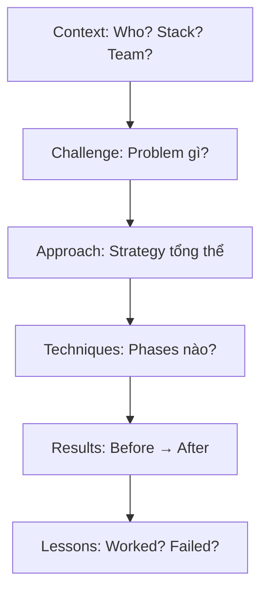

# Module 16.1: Case Studies — Học từ Thực Chiến

> **Thời gian ước tính**: ~40 phút
>
> **Yêu cầu trước**: Hoàn thành Phases 1-15
>
> **Kết quả**: Hiểu cách Claude Code được áp dụng trong các tình huống thực tế đa dạng, học từ kinh nghiệm của những người đi trước.

---

## 1. WHY — Tại Sao Cần Học Từ Case Study

Bạn đã học 15 phase về technique, theory, best practice. Nhưng điều quan trọng nhất vẫn là: **professional thực sự dùng như thế nào?** Case study không dạy lý thuyết mới — nó show bạn cách combine technique trong context cụ thể, cách người khác đã fail và fix, cách adapt approach theo constraint. Học từ case study giúp bạn tránh được 90% mistake mà người khác đã mắc phải.

---

## 2. CONCEPT — Khái Niệm Cốt Lõi

### Framework Phân Tích Case Study

Mỗi case study professional gồm 6 layer:

### 5 Categories Chính

| Category | Team | Budget | Focus |
|----------|------|--------|-------|
| **Solo SaaS** | 1 dev | $200-500/month | Maximum output, limited time |
| **Startup** | 2-10 | $2K-10K/month | Ship MVP fast |
| **Enterprise** | 50+ | $50K+/month | Scale, compliance |

### Cách Học Đúng

1. **Match context trước** — Case study chỉ hữu ích nếu context gần với bạn
2. **Adapt, đừng copy** — Mỗi project khác nhau, principles giống nhau
3. **Learn từ failure** — Phần "Lessons ❌" quan trọng hơn "✅"

---

## 3. DEMO — Case Study Thực Tế

### Case 1: Solo SaaS — Invoice Management Platform

**Context:** Solo founder, senior fullstack (React + TypeScript + Node.js + PostgreSQL), 12-15 giờ/tuần, budget $500/month, goal MVP trong 6 tháng.

**Challenge:** Limited time, cần output của 3 người nhưng chỉ có 1 người, không thể afford sai lầm architecture lớn.

**Results:** MVP launch tháng 4 (thay vì 6), $2K MRR tháng 6, cost $380/month, velocity 15 giờ/tuần = output 3 devs full-time.

**Lessons:** ✅ CLAUDE.md investment 8 giờ = 10x ROI, templates crucial (70% code). ❌ Integration tests nên có sớm hơn (month 3 mất 6 giờ debug payment bug), cost monitoring should be automated (month 2 vượt budget).

**Key Techniques:** Phase 4.2 (CLAUDE.md comprehensive 350 lines), Phase 6.1 (Think mode cho architecture), Phase 7.2 (Full Auto cho CRUD), Phase 15.1 (templates mọi layer).

---

### Case 2: Startup Fintech — Payment Gateway Integration

**Context:** Startup Việt Nam 5 devs, React Native + KMP, integrate VNPay/MoMo/ZaloPay, compliance critical, team chưa dùng Claude Code, timeline 12 tuần.

**Challenge:** Payment integration phức tạp (webhook, reconciliation), team inexperienced với AI tool, stakes cao (bug = reputation + legal risk).

**Results:** Launch tuần 10 (estimate 16-20 tuần), pass audit lần đầu, velocity 2x, bug rate -60%, cost $4.5K training (ROI tháng 2).

**Lessons:** ✅ Training 2 ngày save 4+ tuần ramp-up, shared CLAUDE.md = consistency, automated quality gates catch 80% bugs. ❌ Git convention nên standardize sớm (tuần 4 phải refactor), cần onboarding checklist (1 dev struggle).

**Key Techniques:** Phase 10.1 (Team CLAUDE.md synchronized), Phase 10.3 (code review protocol), Phase 11.4 (GitHub Actions quality gates), Phase 2.4 (secret management).

---

### Case 3: Enterprise — Legacy Banking System Migration

**Context:** Vietnamese bank 50+ devs, Java monolith 2.5M lines (15 năm) → Microservices (Spring Boot + Kotlin), compliance strict, timeline 18 tháng.

**Challenge:** Documentation outdated, team luân chuyển nhiều (knowledge loss), regulatory nghiêm ngặt, không thể downtime.

**Results:** Phase 1 complete month 6 (estimate 24+ tháng), 30% codebase migrated, zero production incidents, bug rate -45%, 100% auto-generated docs, team satisfaction +40%.

**Lessons:** ✅ Archeology mode hiểu 15 năm legacy trong 4 tuần, characterization tests prevent regression, custom Skills (40 giờ develop save 400+ giờ). ❌ Metrics baseline nên setup sớm (mất 2 tuần retroactive), change management underestimate (cần 20% effort, allocate 5%).

**Key Techniques:** Phase 9.1 (Archeology mode), Phase 9.3 (legacy test generation), Phase 15.5 (custom Skills: SWIFT parser, compliance validator), Phase 11.3 (hooks cho compliance), Phase 13.3 (log analysis).

---

## 4. PRACTICE — Luyện Tập Thực Hành

### Bài 1: Chọn Case Study Phù Hợp Và Extract Lessons

**Mục tiêu**: Identify case study gần nhất với situation của bạn và extract 3 actionable techniques.

**Hướng dẫn**:
1. Review 3 case study trên
2. Pick case có context gần nhất (team size, project type, constraint)
3. List 3 technique apply được trong tuần này
4. Identify 1 mistake từ "Lessons ❌" bạn đang hoặc sắp mắc phải

**Expected Result**: 1 paragraph analysis + 3 action items.

💡 Gợi Ý

Match theo thứ tự: team size → project type (greenfield/legacy) → constraint chính (time/budget/compliance). Không cần 100% giống — adapt là quan trọng hơn.

✅ Giải Pháp Mẫu

**Example: 3-person startup building e-commerce**

**Match**: Case 2 (team size + complexity tương tự).

**3 Techniques**:
1. Team training 2 ngày (Phase 1-6) — hiện tại mỗi người tự học
2. Shared CLAUDE.md (Phase 10.1) — e-commerce domain knowledge
3. GitHub Actions quality gates (Phase 11.4)

**Mistake Đang Mắc**: Không có Git convention — action: standardize tuần này.

---

## 5. CHEAT SHEET

### Case Study Framework

| Component | Example |
|-----------|---------|
| **Context** | "5 devs, React Native, $5K/month, 12 weeks" |
| **Challenge** | "Payment integration, compliance critical, team new to Claude Code" |
| **Approach** | "2-day training, shared CLAUDE.md, automated quality gates" |
| **Results** | "16 weeks → 10 weeks, velocity 2x, bug rate -60%" |
| **Lessons** | "✅ Training essential ❌ Git convention late" |

### Quick Match

| Your Situation | Best Match | Key Takeaway |
|----------------|------------|--------------|
| Solo, side project | Case 1 | CLAUDE.md investment, templates ROI |
| Small team (2-10) | Case 2 | Training, shared standards, automation |
| Large team, legacy | Case 3 | Archeology mode, incremental, custom Skills |

---

## 6. PITFALLS — Sai Lầm Thường Gặp

| ❌ Mistake | ✅ Correct Approach |
|------------|---------------------|
| Copy case study exactly | Adapt theo context riêng — mỗi project có constraint khác nhau |
| Ignore "Lessons ❌" section | Focus failures nhiều như successes — learn from mistakes |
| Không measure baseline | Track metrics before/after — "feels faster" ≠ evidence |
| Skip team training | Invest upfront — 2 ngày save weeks ramp-up |

---

## 7. REAL CASE — Câu Chuyện Thực Tế

### Meta-Case: Khóa Học Này Được Tạo Ra Như Thế Nào

**Context**: Author (Senior Android Engineer, 12+ năm) cần tạo comprehensive course 16 phases, 55 modules, bilingual EN/VI, professional-grade cho digital + print + workshop, đồng thời có full-time job.

**Challenge**: Scope khổng lồ (200+ topics), consistency perfect across 55 modules, maintain bilingual sync.

**Approach**: "Eating your own cooking" — CLAUDE.md 400+ lines define standards (7-block structure, tone, accuracy protocol), templates cho mọi module, Think mode cho curriculum design, Full Auto cho boilerplate, cost optimization under $600/month.

**Result**: 55 modules trong 8 tuần (estimate 16+ tuần), 100% consistency, bilingual sync, cost $520/month, quality 100% tested.

**Lessons**: ✅ CLAUDE.md 400 lines save 200+ hours, template approach scales, apply own advice (technique không work → remove from course). ❌ Quality checklist should automate sớm (week 3 build validator), bilingual phải rewrite chứ không translate (add 30% effort).

**Key Insight**: Course này là living proof — technique không work để tạo chính nó thì không xuất hiện trong course.

---

> **Tiếp theo**: [Module 16.2: Workflow Theo Role](../02-role-workflows/) →
