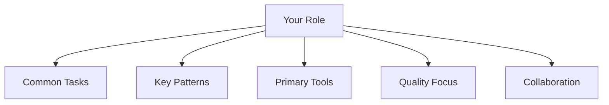

# Module 16.2: Workflow theo Role

> **Thời gian ước tính**: ~35 phút
>
> **Yêu cầu trước**: Module 16.1 (Case Studies)
>
> **Kết quả**: Customized Claude Code workflow optimized cho role của bạn.

---

## 1. WHY — Tại sao cần học

Frontend developer và DevOps engineer dùng Claude Code rất khác. Frontend generate React component và CSS. DevOps viết Terraform và GitHub Actions.

Generic workflow lãng phí thời gian. Role-specific workflow maximize impact — focus vào task BẠN làm hàng ngày, pattern của DOMAIN bạn, tool BẠN dùng. Customize Claude Code cho JOB của bạn.

---

## 2. CONCEPT — Khái niệm cốt lõi

### Role-Based Workflow Design



### Role Matrix

| Role | Task chính | Technique | Priority Phase |
|------|------------|-----------|----------------|
| **Frontend** | Component, UI | Template, image | 5, 15 |
| **Backend** | API, database | Think mode, test | 6, 9 |
| **Fullstack** | End-to-end | Task breakdown | 7, 14 |
| **Tech Lead** | Review, arch | Quality, team | 10, 14 |
| **DevOps** | CI/CD, infra | Automation | 11, 12 |
| **Data** | Pipeline, analysis | Data analysis | 13 |

### Xây Dựng Workflow

1. List 10 task hàng ngày
2. Map mỗi task → technique
3. Tạo template cho task lặp lại
4. Define quality criteria
5. Build CLAUDE.md section

---

## 3. DEMO — Từng bước cụ thể

### Workflow 1: Frontend Developer

**Daily Tasks**: Component, design từ Figma, styling, state

**Key Techniques**:
- Phase 5: Image context cho design
- Phase 15: Component template
- Phase 3: Read existing pattern

**CLAUDE.md Section**:
```markdown
## Frontend Standards
- Components: Functional TypeScript
- Styling: Tailwind CSS
- State: Zustand global, useState local
```

**Templates**: `/component`, `/style`, `/a11y`

---

### Workflow 2: Backend Developer

**Daily Tasks**: API, database schema, auth, performance

**Key Techniques**:
- Phase 6: Think mode cho API design
- Phase 9: Legacy refactoring
- Phase 13: Log analysis

**CLAUDE.md Section**:
```markdown
## Backend Standards
- API: REST + OpenAPI
- Database: PostgreSQL, migration
- Auth: JWT token
```

**Templates**: `/api`, `/schema`, `/query`

---

### Workflow 3: Tech Lead

**Daily Tasks**: Code review, architecture, mentoring

**Key Techniques**:
- Phase 10: Team CLAUDE.md
- Phase 14: Quality optimization
- Phase 6: Think mode architecture

**CLAUDE.md Section**:
```markdown
## Tech Lead Focus
- Review: Security, performance
- Architecture: ADR document
- Mentor: Explain WHY not WHAT
```

**Templates**: `/review`, `/arch`, `/mentor`

---

### Workflow 4: DevOps Engineer

**Daily Tasks**: CI/CD, infrastructure, monitoring, incident

**Key Techniques**:
- Phase 11: GitHub Actions, hooks
- Phase 12: n8n automation
- Phase 13: Log analysis

**CLAUDE.md Section**:
```markdown
## DevOps Standards
- CI/CD: GitHub Actions
- Infra: Terraform modules
- Monitor: Prometheus + Grafana
```

**Templates**: `/pipeline`, `/terraform`, `/incident`

---

## 4. PRACTICE — Luyện tập

### Bài 1: Define Your Role Workflow

**Mục tiêu**: Tạo workflow customized cho role bạn.

**Hướng dẫn**:
1. List 5 task hàng ngày của bạn
2. Map mỗi task → technique từ course
3. Identify 3 template cần tạo
4. Draft CLAUDE.md section cho role

<details>
<summary>💡 Gợi ý</summary>
Bắt đầu với task làm NHIỀU NHẤT. Map đến phase trực tiếp address task đó.
</details>

<details>
<summary>✅ Giải pháp</summary>

**Ví dụ: Mobile Developer**

5 task:
1. Build UI screen → Phase 15 template
2. API integration → Phase 6 Think mode
3. Debug crash → Phase 13 log
4. Code review → Phase 10 team
5. Performance → Phase 14

Templates: `/screen`, `/api-call`, `/debug`

CLAUDE.md:
```markdown
## Mobile Standards
- UI: SwiftUI/Compose
- Network: async/await
- State: MVVM
```
</details>

---

## 5. CHEAT SHEET

### Role Workflow Template

```markdown
## [Role] Workflow

### Daily Tasks
1. [Task thường xuyên nhất]
2. [Task thứ 2]

### Key Techniques
- Phase X: [Technique]

### Templates
/template — [Description]

### Quality Criteria
- [What "done" means]
```

### Role → Priority Phase

| Role | Focus Phase |
|------|-------------|
| Frontend | 5, 15 |
| Backend | 6, 9 |
| Fullstack | 7, 14 |
| Tech Lead | 10, 14 |
| DevOps | 11, 12 |
| Data | 13 |

---

## 6. PITFALLS — Sai lầm thường gặp

| ❌ Sai | ✅ Đúng |
|--------|---------|
| Generic workflow cho all role | Customize cho task CỤ THỂ |
| Quá nhiều template (10+) | Focus top 5 task |
| Ignore team context | Align với team CLAUDE.md |
| Không đo impact | Track time saved |
| Static workflow mãi | Evolve khi role thay đổi |

---

## 7. REAL CASE — Câu chuyện thực tế

**Scenario**: Tech company Việt Nam, 20 developer, 4 role. Mọi người dùng Claude Code generic — có người thích, có người thấy không helpful.

**Role Workflow Initiative**:
- Tuần 1: Survey top task mỗi role
- Tuần 2: Build role-specific workflow + template
- Tuần 3: Training theo role
- Tuần 4: Đo và iterate

**Kết quả (1 tháng)**:
- Frontend: 40% nhanh hơn component
- Backend: 50% nhanh hơn API
- DevOps: 60% nhanh hơn pipeline
- Tech Lead: 30% nhanh hơn review

**Quote**: "Generic training was okay. Role-specific workflow made Claude Code essential cho JOB của tôi."

---

> **Tiếp theo**: [Module 16.3: Thiết kế Workshop](../03-teaching-workshop/) →
